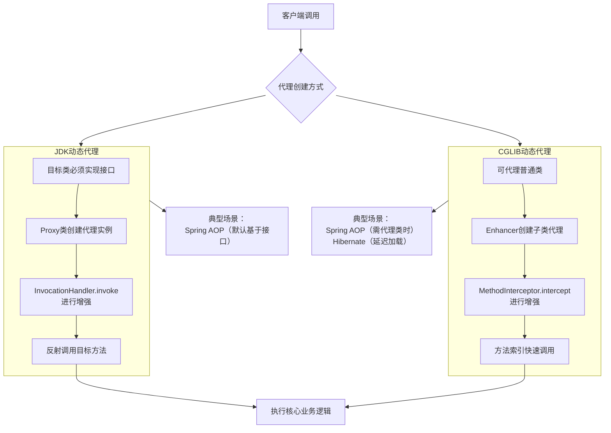

# JDK 动态代理和 CGLIB 动态代理有什么区别？⁠​

## 一句话说明（白话）

这是一个 Java关键概念/特性，用于解释语言规则或运行机制。

## 它解决什么问题 / 为什么重要

帮助理解规范与最佳实践，避免常见错误。

## 核心原理（一步步讲清楚）

说明语法/机制，再解释运行时表现与影响。

##典型使用场景

面试常问点、日常开发高频使用。

## 简单例子 /伪代码

给出最小示例说明用法。

## 常见坑与误区

列出1-2个易错点。

##题库要点（原始材料）
JDK动态代理和CGLIB动态代理是Java中实现动态代理的两种主要技术，它们在工作原理和应用场景上有显著区别，下图直观展示了它们各自的工作流程及典型应用场景。

复制



JDK动态代理和CGLIB动态代理是Java中实现动态代理的两种主要技术，它们在工作原理和应用场景上有显著区别。
**JDK 动态代理**​ 基于Java反射机制，要求被代理的类**必须至少实现一个接口**。其核心是`java.lang.reflect.Proxy`类和`java.lang.reflect.InvocationHandler`接口。代理对象是在运行时动态生成的，实现了目标接口。由于JDK代理在方法调用时使用了反射机制，在早期版本中其性能开销相对较大，但新版本JDK的性能已有显著提升。
**CGLIB (Code Generation Library) 动态代理**​ 是一个第三方库，它通过**继承**目标类并生成其子类的方式来实现代理。因为它是通过继承实现的，所以**不需要**目标类实现任何接口。CGLIB在运行时动态生成一个子类，并重写父类的方法。在调用方法时，它通常通过方法索引直接调用，避免了反射开销，因此通常比JDK动态代理的反射调用性能更高。
```java
//JDK动态代理demo
// 1. 接口（同上）
public interface UserService {
    void saveUser();
}

// 2. 原始类（同上）
public class UserServiceImpl implements UserService {
    @Override
    public void saveUser() {
        System.out.println("核心业务：用户数据已保存至数据库");
    }
}

// 3. 调用处理器（定义增强逻辑）
import java.lang.reflect.InvocationHandler;
import java.lang.reflect.Method;

public class UserServiceInvocationHandler implements InvocationHandler {
    private Object target; // 目标对象

    public UserServiceInvocationHandler(Object target) {
        this.target = target;
    }

    @Override
    public Object invoke(Object proxy, Method method, Object[] args) throws Throwable {
        // 在目标方法执行前添加逻辑
        System.out.println("动态代理-前置操作：权限检查...");

        // 通过反射调用目标对象的方法
        Object returnValue = method.invoke(target, args);

        // 在目标方法执行后添加逻辑
        System.out.println("动态代理-后置操作：记录日志...");
        return returnValue;
    }
}

// 4. 测试类：使用Proxy类动态生成代理对象
import java.lang.reflect.Proxy;

public class Test {
    public static void main(String[] args) {
        UserService target = new UserServiceImpl(); // 目标对象

        // 创建动态代理实例
        UserService proxy = (UserService) Proxy.newProxyInstance(
                target.getClass().getClassLoader(), // 1. 目标类的类加载器
                target.getClass().getInterfaces(),  // 2. 目标类实现的所有接口
                new UserServiceInvocationHandler(target) // 3. 调用处理器实例
        );

        proxy.saveUser(); // 调用代理对象的方法
        System.out.println("代理对象的实际类型：" + proxy.getClass().getName());
    }
}
```
首先，需要在项目中引入CGLIB依赖。如果使用Maven，可以在`pom.xml`中添加：
```xml
<dependency>
    <groupId>cglib</groupId>
    <artifactId>cglib</artifactId>
    <version>3.3.0</version> <!-- 请使用最新版本 -->
</dependency>
```
```java
//CGLib动态代理demo
// 1. 目标类（这次没有实现接口！）
public class UserService {
    public void saveUser() {
        System.out.println("核心业务（CGLIB代理）：用户数据已保存至数据库");
    }
}

// 2. 方法拦截器
import net.sf.cglib.proxy.MethodInterceptor;
import net.sf.cglib.proxy.MethodProxy;
import java.lang.reflect.Method;

public class UserServiceMethodInterceptor implements MethodInterceptor {
    @Override
    public Object intercept(Object obj, Method method, Object[] args, MethodProxy proxy) throws Throwable {
        // 在目标方法执行前添加逻辑
        System.out.println("CGLIB代理-前置操作：性能监控开始...");

        // 调用目标类（父类）的方法
        Object returnValue = proxy.invokeSuper(obj, args);

        // 在目标方法执行后添加逻辑
        System.out.println("CGLIB代理-后置操作：性能监控结束...");
        return returnValue;
    }
}

// 3. 测试类：使用Enhancer创建代理对象
import net.sf.cglib.proxy.Enhancer;

public class Test {
    public static void main(String[] args) {
        Enhancer enhancer = new Enhancer();
        enhancer.setSuperclass(UserService.class); // 设置目标类为父类
        enhancer.setCallback(new UserServiceMethodInterceptor()); // 设置回调（拦截器）

        UserService proxy = (UserService) enhancer.create(); // 创建代理对象
        proxy.saveUser();
        System.out.println("CGLIB代理对象的实际类型：" + proxy.getClass().getSuperclass());
    }
}
```

##关联知识
- 

## 延伸阅读（后续补充）
- 
