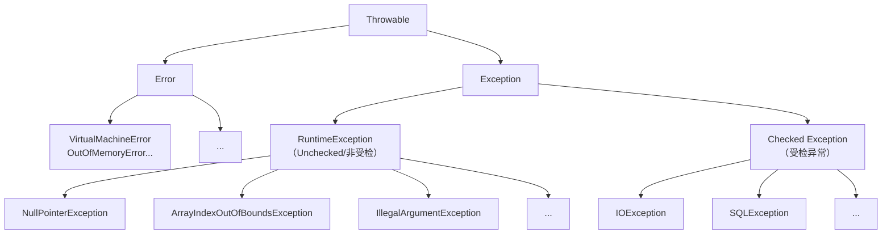

# Java中的异常体系是怎样的？⁠⁠​

## 一句话说明（白话）

这是一个 Java关键概念/特性，用于解释语言规则或运行机制。

## 它解决什么问题 / 为什么重要

帮助理解规范与最佳实践，避免常见错误。

## 核心原理（一步步讲清楚）

说明语法/机制，再解释运行时表现与影响。

##典型使用场景

面试常问点、日常开发高频使用。

## 简单例子 /伪代码

给出最小示例说明用法。

## 常见坑与误区

列出1-2个易错点。

##题库要点（原始材料）
Java的异常体系结构清晰地区分了不同类型的错误和异常。下图描绘了其核心框架：

- **`Throwable`**：所有错误和异常的顶级父类。
- **`Error`​ (错误)：指程序**无法处理**的严重系统级问题，通常与代码逻辑无关，而是运行时环境（如JVM）出现问题。例如 `OutOfMemoryError`（内存溢出）或 `StackOverflowError`（栈溢出）。应用通常无法处理或恢复，只能尽量安全地终止。
- **`Exception` (异常)：指程序**可以且应该处理**的各种意外情况，是异常处理的核心。它主要分为两类：
    - **`RuntimeException`及其子类 (运行时异常/非受检异常)**：如空指针、数组越界等。通常是编程逻辑错误，编译器不强制要求处理，应由代码质量保证。
    - **其他`Exception`子类 (受检异常)**：如`IOException`、`SQLException`。编译器要求必须处理（捕获或声明抛出），否则编译不通过。

##关联知识
- 

## 延伸阅读（后续补充）
- 
