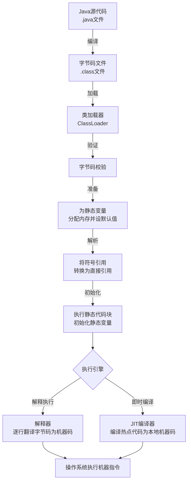

# 简单说说你写的 java 程序是如何执行的?⁠​

## 一句话说明（白话）

这是一个 Java关键概念/特性，用于解释语言规则或运行机制。

## 它解决什么问题 / 为什么重要

帮助理解规范与最佳实践，避免常见错误。

## 核心原理（一步步讲清楚）

说明语法/机制，再解释运行时表现与影响。

##典型使用场景

面试常问点、日常开发高频使用。

## 简单例子 /伪代码

给出最小示例说明用法。

## 常见坑与误区

列出1-2个易错点。

##题库要点（原始材料）
一个Java程序从源代码到最终执行，主要经历编译和运行两大阶段。

①编译阶段：从 `.java`到 `.class`
用 `javac`命令编译 `.java`源文件时，会经历词法分析、语法分析（生成抽象语法树）、语义分析等步骤，最终生成平台无关的 `.class`字节码文件。字节码是JVM的机器语言。
②运行阶段：
1. **类加载（Loading & Linking）**
    JVM的类加载器（ClassLoader）会去寻找并加载所需的 `.class`文件。加载后，会进行**链接（Linking）**，包括：
    - **验证**：确保字节码是安全合法的。
    - **准备**：为类变量（静态变量）分配内存并设置默认初始值（如int为0）。
    - **解析**：将常量池中的符号引用转换为直接引用。
    - **初始化**：执行类中的静态变量赋值语句和静态代码块。
2. **执行引擎（Execution Engine）如何工作**
    加载和初始化完成后，JVM的**执行引擎**负责执行字节码。
    - **解释执行**：执行引擎中的解释器（Interpreter）会逐行读取字节码，并快速地将其翻译成本地机器码并执行。优点是启动快，立即执行；缺点是逐行解释效率相对较低。
    - **即时编译（JIT Compilation）**：为了提升性能，JVM会监控代码的执行频率。对于那些被频繁调用的“**热点代码**”（如循环、常用方法），**JIT（Just-In-Time）编译器**会将其整个方法或代码块编译成本地机器码。这样，下次再执行这段代码时，就可以直接运行高效的本地机器码，无需再次解释，大大提高了长期运行的性能。这是一种在程序运行时进行的编译。
3. **内存管理（自动垃圾回收）**
    程序运行中创建的对象都存放在堆（Heap）内存中。JVM内置了**垃圾回收器（GC， Garbage Collector）**，它会自动回收不再使用的对象所占用的内存，从而避免了像C/C++那样需要手动管理内存可能带来的内存泄漏问题。

##关联知识
- 

## 延伸阅读（后续补充）
- 
