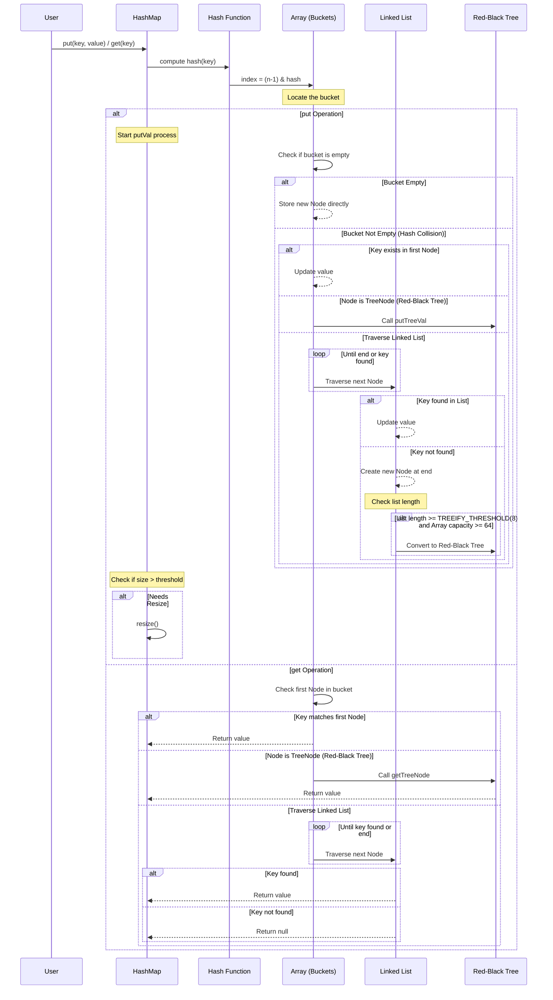

# HashMap 的实现原理是什么？

## 一句话说明（白话）

hashCode 是对象散列标识，用于加速查找。

## 它解决什么问题 / 为什么重要

HashMap/HashSet先用 hashCode 定位桶，再用 equals 判断。

## 核心原理（一步步讲清楚）

equals 相等必须 hashCode 相等。

##典型使用场景

Map key、Set 去重。

## 简单例子 /伪代码

equals 基于 id，hashCode也应基于 id。

## 常见坑与误区

hashCode 相同不代表 equals 相同。

##题库要点（原始材料）
HashMap 的底层实现是“数组 + 链表 + 红黑树”的组合。您可以将其理解为一个“桶数组”，每个桶（数组元素）可以用来存放键值对。
- **数组（桶）**：主干，用于快速定位，默认初始大小为 16。
- **链表**：解决哈希冲突。当不同的键通过哈希计算落到同一个桶时，会以链表形式存储（拉链法）。
- **红黑树**：优化长链表查询。当链表长度超过阈值（默认为8）且数组容量达到一定值（默认为64）时，链表会转为红黑树，将查询效率从 O(n) 提升到 O(log n)。
为了更直观地理解其核心操作流程，我们可以参考下面的序列图，它描绘了 `put`和 `get`方法的关键步骤：

##关联知识
- 

## 延伸阅读（后续补充）
- 
