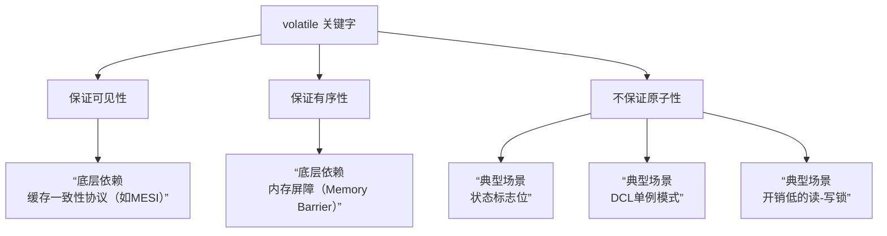

# 说说 volatile 关键字的理解？

## 一句话说明（白话）

这是一个 Java关键概念/特性，用于解释语言规则或运行机制。

## 它解决什么问题 / 为什么重要

帮助理解规范与最佳实践，避免常见错误。

## 核心原理（一步步讲清楚）

说明语法/机制，再解释运行时表现与影响。

##典型使用场景

面试常问点、日常开发高频使用。

## 简单例子 /伪代码

给出最小示例说明用法。

## 常见坑与误区

列出1-2个易错点。

##题库要点（原始材料）
`volatile`是 Java 提供的一种**轻量级的同步机制**，主要用于确保**变量修改的可见性**和**防止指令重排序**。
当一个变量被声明为 `volatile`时，意味着所有线程在访问这个变量时，都会直接从主内存中读取它的值，并且对它的修改都会立即写回主内存。这解决了因线程将变量副本保存在各自的工作内存（如CPU缓存）中而可能导致的**数据不一致**问题。

##关联知识
- 

## 延伸阅读（后续补充）
- 
