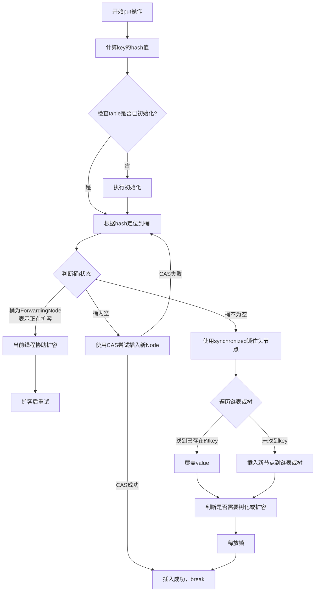

# ConcurrentHashMap 的 put 操作流程是怎样的？

## 一句话说明（白话）

hashCode 是对象散列标识，用于加速查找。

## 它解决什么问题 / 为什么重要

HashMap/HashSet先用 hashCode 定位桶，再用 equals 判断。

## 核心原理（一步步讲清楚）

equals 相等必须 hashCode 相等。

##典型使用场景

Map key、Set 去重。

## 简单例子 /伪代码

equals 基于 id，hashCode也应基于 id。

## 常见坑与误区

hashCode 相同不代表 equals 相同。

##题库要点（原始材料）
JDK 1.8 中的 `put`方法流程精巧地融合了多种并发技术，其核心步骤可参考下图：

##关联知识
- 

## 延伸阅读（后续补充）
- 
