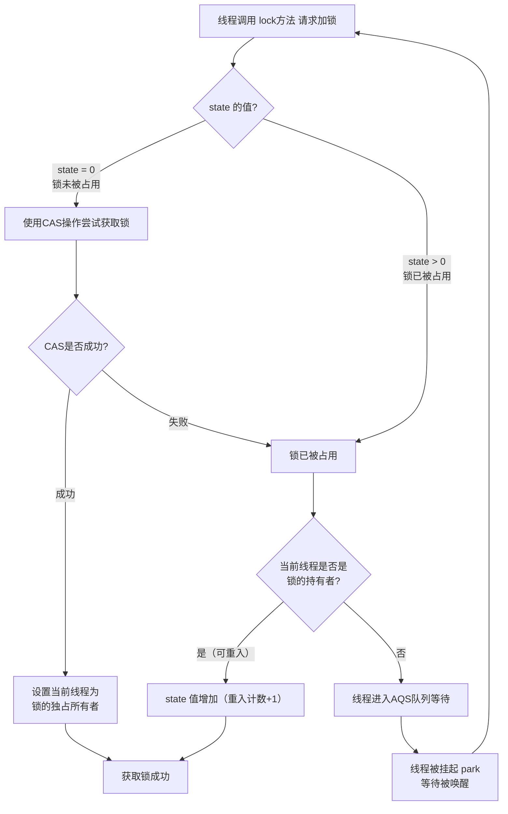

# ReentrantLock 的实现原理是什么？

## 一句话说明（白话）

这是一个 Java关键概念/特性，用于解释语言规则或运行机制。

## 它解决什么问题 / 为什么重要

帮助理解规范与最佳实践，避免常见错误。

## 核心原理（一步步讲清楚）

说明语法/机制，再解释运行时表现与影响。

##典型使用场景

面试常问点、日常开发高频使用。

## 简单例子 /伪代码

给出最小示例说明用法。

## 常见坑与误区

列出1-2个易错点。

##题库要点（原始材料）
`ReentrantLock`的核心实现依赖于 **AQS（AbstractQueuedSynchronizer）**，这是一个用于构建锁和同步器的框架。其核心原理可以通过下图展示的加锁流程来理解：

AQS 内部维护一个 volatile 的整型变量 `state`和一个 FIFO 线程等待队列。
- **获取锁**：当 `state`为 0 时，表示锁空闲，线程通过 CAS（Compare-And-Swap） 操作尝试将 `state`设为 1 来获取锁。若成功，则记录当前线程为锁的持有者。若 `state`不为 0 且当前线程已是持有者，则 `state`加 1（重入）。
- **释放锁**：线程调用 `unlock()`时，将 `state`减 1。只有当 `state`减为 0 时，才彻底释放锁，并唤醒等待队列中的下一个线程。

##关联知识
- 

## 延伸阅读（后续补充）
- 
