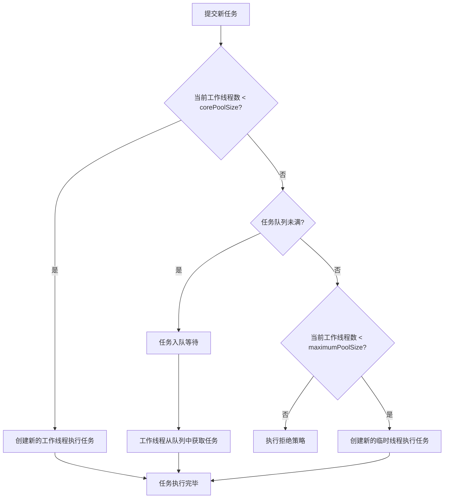

# 线程池的工作流程是怎样的？

## 一句话说明（白话）

这是一个 Java关键概念/特性，用于解释语言规则或运行机制。

## 它解决什么问题 / 为什么重要

帮助理解规范与最佳实践，避免常见错误。

## 核心原理（一步步讲清楚）

说明语法/机制，再解释运行时表现与影响。

##典型使用场景

面试常问点、日常开发高频使用。

## 简单例子 /伪代码

给出最小示例说明用法。

## 常见坑与误区

列出1-2个易错点。

##题库要点（原始材料）
线程池处理任务的核心流程遵循一套清晰的规则，下图直观展示了从任务提交到执行的完整路径，以及各核心参数在其中发挥的作用：

##关联知识
- 

## 延伸阅读（后续补充）
- 
