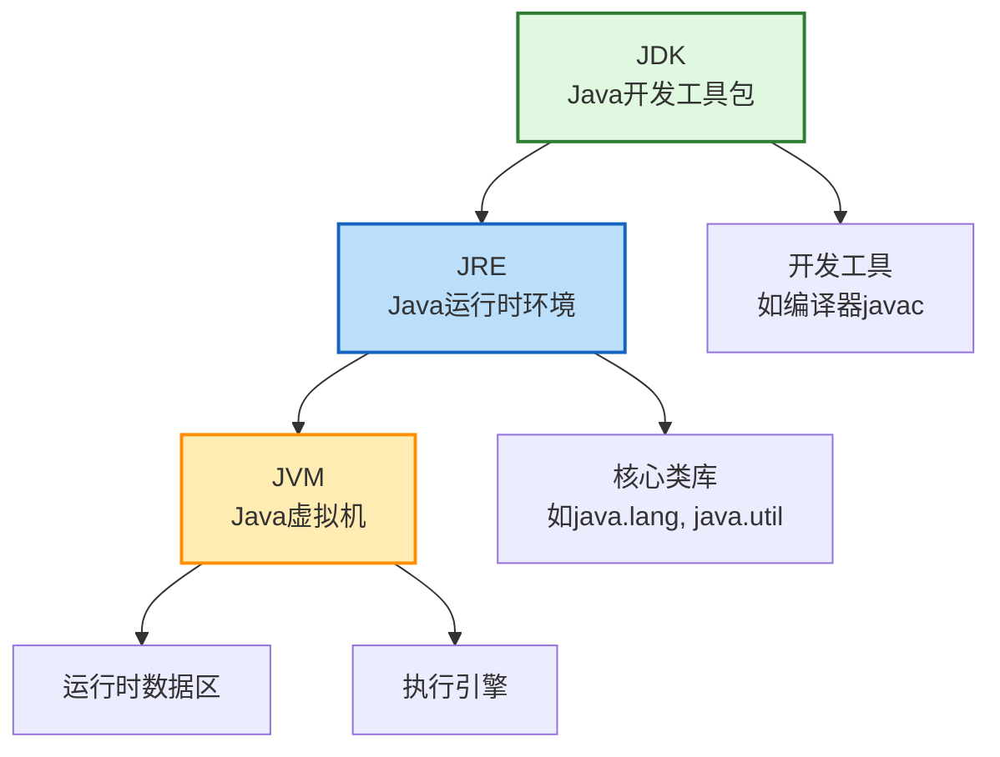

# JVM、JRE 和 JDK 的关系是什么？

## 一句话说明（白话）

这是一个 Java关键概念/特性，用于解释语言规则或运行机制。

## 它解决什么问题 / 为什么重要

帮助理解规范与最佳实践，避免常见错误。

## 核心原理（一步步讲清楚）

说明语法/机制，再解释运行时表现与影响。

##典型使用场景

面试常问点、日常开发高频使用。

## 简单例子 /伪代码

给出最小示例说明用法。

## 常见坑与误区

列出1-2个易错点。

##题库要点（原始材料）
这三者的关系是层层包含的，可以参考下面的图示来理解：

- **JVM (Java Virtual Machine)**：是 Java 能够实现跨平台的核心。它负责读取并执行字节码文件。但 JVM 本身并不知道 `String`、`ArrayList`这些常用类是如何实现的，它需要标准类库的支持。
- **JRE (Java Runtime Environment)**：**等于 JVM + 核心类库**。如果你只想运行一个已经开发好的 Java 程序，那么安装 JRE 就足够了。
- **JDK (Java Development Kit)**：**等于 JRE + 开发工具**。它除了包含 JRE 的所有内容，还提供了用于开发 Java 程序的关键工具，如编译器 (`javac`)、调试器 (`jdb`) 等。因此，作为开发者，我们需要安装的是 JDK。
简单来说，**JDK 用于开发 Java 程序，JRE 用于运行 Java 程序，而 JVM 是运行程序的引擎和跨平台基石。**

##关联知识
- 

## 延伸阅读（后续补充）
- 
