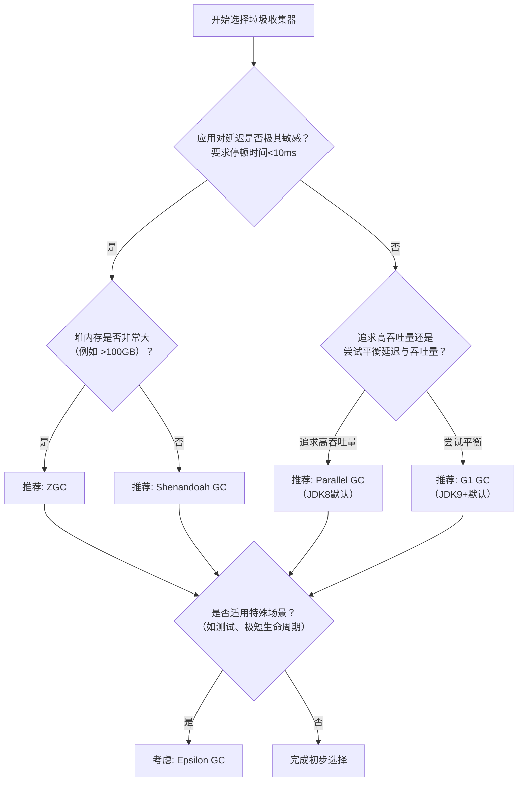

# 如何选择合适的垃圾收集器？

## 一句话说明（白话）

这是一个 Java关键概念/特性，用于解释语言规则或运行机制。

## 它解决什么问题 / 为什么重要

帮助理解规范与最佳实践，避免常见错误。

## 核心原理（一步步讲清楚）

说明语法/机制，再解释运行时表现与影响。

##典型使用场景

面试常问点、日常开发高频使用。

## 简单例子 /伪代码

给出最小示例说明用法。

## 常见坑与误区

列出1-2个易错点。

##题库要点（原始材料）
选择合适的垃圾收集器需要综合考虑应用的需求和特点。下面的决策流程图可以为您提供一个清晰的选型思路：

以上流程图提供了初步方向。在实际决策时，还需要结合一些具体考量：
- **ZGC**：如果你的应用对**延迟有极其苛刻的要求**（如金融交易系统、实时游戏服务器），并且堆内存可能非常大，ZGC通常是首选。它提供了最一致的响应时间。
- **Shenandoah GC**：同样适用于对延迟敏感的应用，尤其在**堆内存不是特别巨大**时，它提供了与ZGC类似的低停顿特性，可能更容易在较早的JDK版本中使用。
- **G1 GC**：从JDK 9开始是服务端模式的默认收集器。它在**延迟和吞吐量之间提供了一个良好的平衡**，适用于大多数不需要极致低延迟的应用。如果你的应用停顿时间要求可能在几十到几百毫秒之间，G1是一个稳健的选择。
- **Parallel GC**（吞吐量收集器）：如果你的应用是**后台计算、批处理任务**，对吞吐量有极高要求，而对停顿时间不敏感（几分钟的停顿都可以接受），那么Parallel GC可能提供最高的吞吐量。
- **Epsilon GC**：仅用于**非常特殊的场景**，如性能测试、已知内存分配确切且生命周期极短的应用。
**最佳实践**：理论是基础，但**最终一定要在模拟生产环境的压力测试下进行验证**，通过GC日志分析实际表现。

##关联知识
- 

## 延伸阅读（后续补充）
- 
