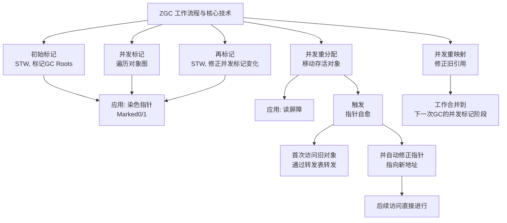

# 什么是 ZGC？

## 一句话说明（白话）

这是一个 Java关键概念/特性，用于解释语言规则或运行机制。

## 它解决什么问题 / 为什么重要

帮助理解规范与最佳实践，避免常见错误。

## 核心原理（一步步讲清楚）

说明语法/机制，再解释运行时表现与影响。

##典型使用场景

面试常问点、日常开发高频使用。

## 简单例子 /伪代码

给出最小示例说明用法。

## 常见坑与误区

列出1-2个易错点。

##题库要点（原始材料）
ZGC（Z Garbage Collector）是一款自**JDK 15**起正式生产可用的**低延迟垃圾收集器**，其设计目标是实现**亚毫秒级（<1ms）的最大停顿时间**，并且停顿时间不会随着堆内存的增大而增加。它能够管理从几百MB到数TB大小的堆内存。
ZGC实现低延迟的核心依赖于几项关键技术，其工作流程也围绕这些技术展开。下面的流程图直观展示了ZGC的工作阶段、核心技术及应用，以及关键的“指针自愈”特性：

##关联知识
- 

## 延伸阅读（后续补充）
- 
