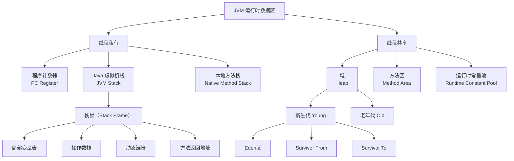

# JVM 运行时数据区有哪些？

## 一句话说明（白话）

## 它解决什么问题 / 为什么重要

## 核心原理（一步步讲清楚）

##典型使用场景

## 简单例子 /伪代码

## 常见坑与误区

##题库要点（原始材料）
JVM 运行时数据区是 Java 虚拟机在执行 Java 程序时所管理的内存区域，可根据线程共享与否进行划分。其核心组件与关系如下：

##关联知识
- 

## 延伸阅读（后续补充）
- 
