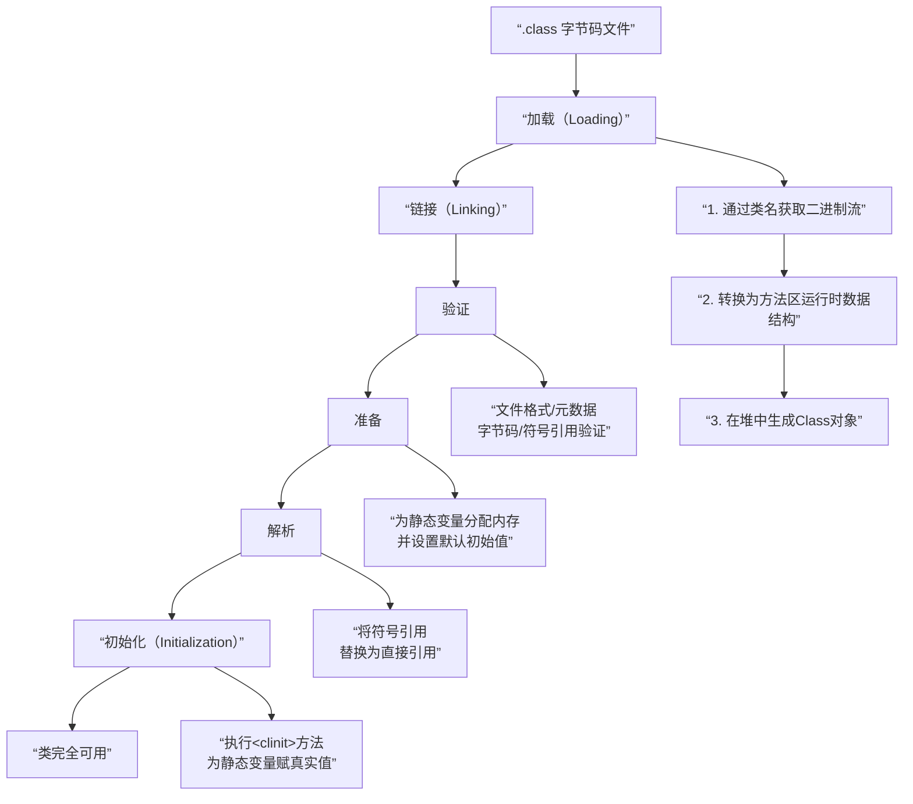

# 类加载的过程是什么？

## 一句话说明（白话）

## 它解决什么问题 / 为什么重要

## 核心原理（一步步讲清楚）

##典型使用场景

## 简单例子 /伪代码

## 常见坑与误区

##题库要点（原始材料）

上图展示了类加载的宏观过程。下面我们来详细解读图中的关键阶段：
- **加载**：这是第一步。JVM 需要完成三件事：
    1. 通过类的全限定名获取其定义的二进制字节流。
    2. 将这个字节流所代表的静态存储结构转换为**方法区**的运行时数据结构。
    3. 在内存中（通常是堆区）生成一个代表这个类的 `java.lang.Class`对象，作为方法区中这些数据的访问入口。这个阶段是可控性最强的，开发者可以自定义类加载器来控制字节流的获取方式。
- **验证**：这是链接的第一步，确保被加载的类的正确性，不会危害 JVM 安全。主要包括四个阶段的检验：
    - **文件格式验证**：验证字节流是否符合 Class 文件格式规范（如魔数、版本号）。
    - **元数据验证**：对字节码描述的信息进行语义分析，保证符合 Java 语言规范（如是否有父类，是否继承了 final 类）。
    - **字节码验证**：通过数据流和控制流分析，确定程序语义是合法的、符合逻辑的。这是最复杂的阶段。
    - **符号引用验证**：发生在解析阶段，确保符号引用可以转化为直接引用。
- **准备**：此阶段正式为**类变量**分配内存并设置**初始值**。注意两点：
    - 内存分配在方法区。
    - “初始值”通常是数据类型的**零值**，如 `int`是 0，`boolean`是 false。例如 `public static int value = 123;`在准备阶段后是 0，赋值为 123 的动作发生在初始化阶段。但被 `final static`修饰的常量除外，它可能在准备阶段后就直接赋值为真实值。
- **解析**：JVM 将常量池内的**符号引用**替换为**直接引用**的过程。符号引用是一组无歧义的描述符号；直接引用是直接指向目标的指针、相对偏移量或能间接定位到目标的句柄。
- **初始化**：这是类加载过程的最后一步。此阶段才真正开始执行类中定义的 Java 代码，主要是执行类构造器 `<clinit>()`方法的过程。`<clinit>()`方法是由编译器自动收集类中的所有**类变量的赋值动作**和**静态语句块**中的语句合并产生的。JVM 保证在初始化一个类之前，其父类的初始化已经完成。

##关联知识
- 

## 延伸阅读（后续补充）
- 
