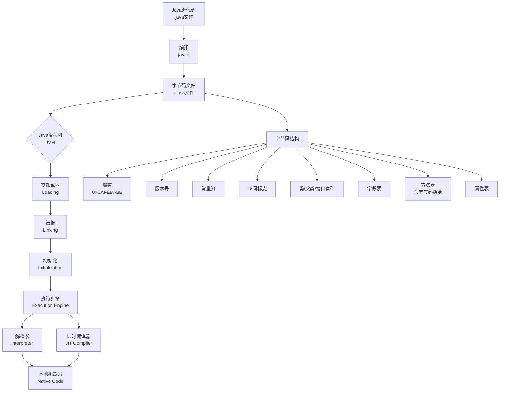

# 什么是字节码？字节码的好处是什么？

## 一句话说明（白话）

这是一个 Java关键概念/特性，用于解释语言规则或运行机制。

## 它解决什么问题 / 为什么重要

帮助理解规范与最佳实践，避免常见错误。

## 核心原理（一步步讲清楚）

说明语法/机制，再解释运行时表现与影响。

##典型使用场景

面试常问点、日常开发高频使用。

## 简单例子 /伪代码

给出最小示例说明用法。

## 常见坑与误区

列出1-2个易错点。

##题库要点（原始材料）
字节码是Java实现“一次编写，到处运行”（Write Once, Run Anywhere）理念的核心。

简单来说，字节码（Bytecode）**是一种由Java编译器（`javac`）生成的、与特定机器指令集无关的中间代码，保存在 `.class`文件中。它本质上是 JVM 的机器语言指令集**。
- **平台无关的中间表示**：字节码不是直接面向任何特定的物理CPU（如x86或ARM），而是面向JVM这个抽象层。这使得它独立于底层硬件和操作系统。
- **二进制格式与紧凑结构**：字节码采用二进制格式存储，比源代码更紧凑。一个 `.class`文件具有严格的结构，包含魔数（`0xCAFEBABE`）、版本号、常量池、访问标志、字段表、方法表（内含字节码指令）等组成部分。
- **基于栈的计算模型**：JVM采用栈架构来执行字节码，大多数指令通过操作数栈进行数据处理，而非直接依赖于寄存器。
采用字节码为Java生态系统带来了多方面的重要好处。

| 优势             | 核心说明                                                | 价值体现                             |
| -------------- | --------------------------------------------------- | -------------------------------- |
| **跨平台性**       | 一次编译，到处运行。字节码由JVM解释或编译执行，JVM屏蔽了不同平台的差异。             | 显著降低了程序部署和分发的复杂性，是Java成功的基石。     |
| **安全性**        | JVM在执行字节码前会进行严格的验证，防止有害操作，同时Java字节码无法直接操作内存。        | 为网络环境下的代码执行提供了安全沙箱。              |
| **高性能（JIT优化）** | JVM会监控代码执行频率，通过即时编译器将热点字节码编译成本地机器码并缓存，大幅提升性能。       | 使Java应用在长期运行的服务端场景中能获得接近本地代码的效率。 |
| **动态性与灵活性**    | 支持运行时动态加载和修改字节码，反射机制也依赖于字节码的运行时信息。                  | 是实现热部署、AOP、动态代理等重要特性的基础。         |
| **强大的生态与工具支持** | 字节码是许多开发工具（如反编译、调试、性能分析工具）和框架（如Spring AOP）直接操作的对象。  | 方便开发者分析、调试、优化和增强程序行为。            |
| **跨语言支持**      | JVM成为了一个通用的运行时平台，其他语言如Kotlin、Scala等也可编译成字节码在JVM上运行。 | 丰富了JVM生态。                        |

如何查看与分析字节码，可以使用JDK自带的 `javap`工具来查看字节码。
1. **编译Java源文件**：首先使用 `javac YourClass.java`生成 `.class`文件。
2. **反编译查看字节码**：使用 `javap -c YourClass`可以输出易于阅读的字节码指令序列。添加 `-verbose`参数（`javap -c -verbose YourClass`）能获得更详细的信息，包括常量池、方法描述符等。

了解字节码的实用场景
- **代码优化**：通过分析关键代码路径的字节码，可以发现潜在的性能瓶颈，例如不必要的自动装箱、创建多余临时对象等。
- **问题排查**：当遇到一些底层机制相关的问题（如序列化、反射、同步等问题）时，查看字节码可能有助于理解深层原因。
- **字节码增强技术**：许多高级框架（如Spring的AOP功能）在运行时通过ASM、Byte Buddy等库动态修改或生成字节码，实现强大功能。

##关联知识
- 

## 延伸阅读（后续补充）
- 
