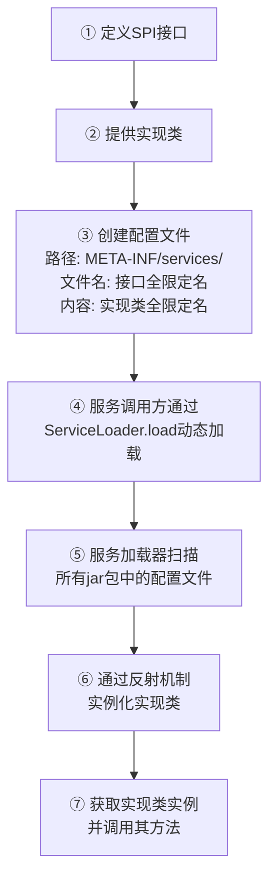

# SPI 的实现原理是什么？

## 一句话说明（白话）

## 它解决什么问题 / 为什么重要

## 核心原理（一步步讲清楚）

##典型使用场景

## 简单例子 /伪代码

## 常见坑与误区

##题库要点（原始材料）
以Java SPI为例，其实现原理主要依赖于`java.util.ServiceLoader`类，并遵循一套明确的约定。其核心运作流程如下图所示，它展示了从定义接口到运行时加载的完整过程：

**SPI 的三大要素**
- **SPI 接口**：一个标准的Java接口或抽象类，为服务提供者制定规范。
- **实现类**：一个或多个具体类，完整实现了SPI接口定义的功能。
- **配置文件**：在实现类的JAR包中，必须在 `/META-INF/services/`目录下创建一个**以接口全限定名命名的文件**。文件内容是该接口实现类的全限定名，每行一个。
**ServiceLoader 的核心工作流程**
当程序调用 `ServiceLoader.load(Interface.class)`时，会触发以下步骤：
- **扫描配置**：`ServiceLoader`会遍历整个项目的classpath（包括所有引入的JAR包），查找所有 `/META-INF/services/`目录下符合命名约定的配置文件。
- **读取与解析**：读取对应接口的配置文件，获取所有实现类的全限定名。
- **反射实例化**：通过反射机制（`Class.forName()`和`newInstance()`），依次加载并实例化这些实现类。
**SPI 的优缺点**
- **优点**：
    - **解耦**：将服务接口与实现分离，避免了硬编码，符合面向对象设计原则。
    - **可扩展性**：通过添加新的实现JAR包即可扩展程序功能，无需修改原有代码。
- **缺点**：
    - **全量加载**：`ServiceLoader`会实例化配置文件中所有的实现类，即使某些类暂时用不到，这可能造成资源浪费。
    - **不灵活**：只能通过迭代器（`Iterator`）遍历所有实现，无法根据某个参数（如“别名”）直接获取指定的实现类。

##关联知识
- 

## 延伸阅读（后续补充）
- 
