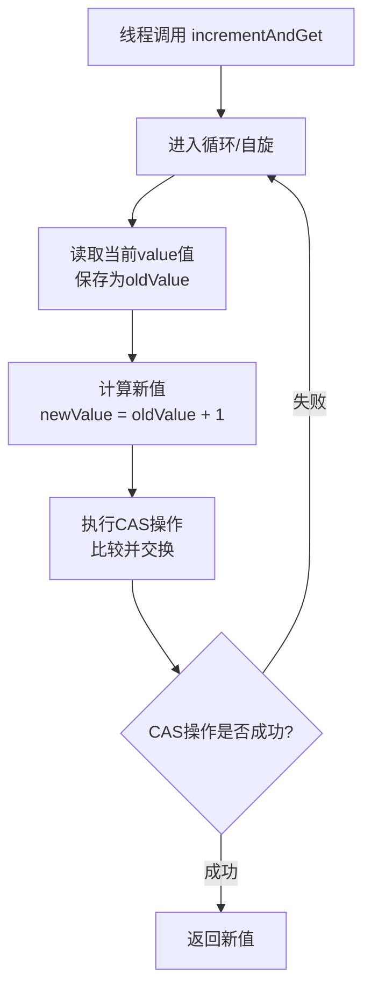

# AtomicInteger 的实现原理是什么？

## 一句话说明（白话）

## 它解决什么问题 / 为什么重要

## 核心原理（一步步讲清楚）

##典型使用场景

## 简单例子 /伪代码

## 常见坑与误区

##题库要点（原始材料）
`AtomicInteger`的核心实现依赖于三个关键部分：
1. **`volatile int value`**：用于存储实际整数值的变量，用 `volatile`修饰，保证了多线程之间的**可见性**。一个线程修改后，新值能立即被其他线程看到。
2. **`Unsafe`类**：这是一个JDK内部使用的类（`sun.misc.Unsafe`），提供了执行低级、不安全操作的能力，包括直接内存访问和CAS操作。原子类通过它来调用底层的CAS指令。
3. **`valueOffset`**：这是一个静态常量，在类加载时通过Unsafe类获取到 `value`字段在内存中的偏移量。有了这个偏移量，Unsafe类就能精准地定位到需要更新的变量。
其最典型的操作 `incrementAndGet()`（自增）的流程，清晰地展示了CAS的核心思想。下图描绘了这一“乐观锁”的工作机制：

##关联知识
- 

## 延伸阅读（后续补充）
- 
