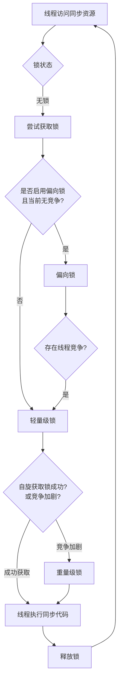

# synchronized 的锁升级过程是怎样的？

## 一句话说明（白话）

## 它解决什么问题 / 为什么重要

## 核心原理（一步步讲清楚）

##典型使用场景

## 简单例子 /伪代码

## 常见坑与误区

##题库要点（原始材料）
为了减少获得锁和释放锁带来的性能开销，JVM 会对 `synchronized`锁进行优化，其升级过程是单向的（不可降级）。下面的流程图清晰地展示了这一过程：

##关联知识
- 

## 延伸阅读（后续补充）
- 
