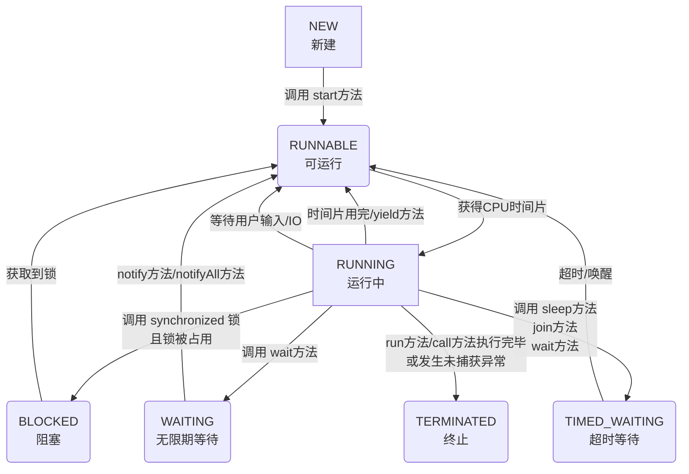

# 什么是线程的生命周期？线程有哪些状态？

## 一句话说明（白话）

## 它解决什么问题 / 为什么重要

## 核心原理（一步步讲清楚）

##典型使用场景

## 简单例子 /伪代码

## 常见坑与误区

##题库要点（原始材料）
Java线程在其生命周期中会处于以下几种状态之一（定义在 `Thread.State`枚举中）。

1. **NEW (新建)**：线程对象被创建，但尚未调用 `start()`方法。
2. **RUNNABLE (可运行)**：调用 `start()`后，线程等待CPU时间片或正在运行。注意，Java将**就绪（Ready）​和**运行（Running）**​ 都归入此状态。
3. **BLOCKED (阻塞)**：线程等待获取一个**由`synchronized`保护的排他锁**，若锁被其他线程占用，则进入此状态。
4. **WAITING (无限期等待)**：线程进入等待状态，需要被其他线程显式唤醒。例如调用 `Object.wait()`（不带超时）或 `Thread.join()`（不带超时）。
5. **TIMED_WAITING (超时等待)**：线程在指定的时间范围内等待，超时后自动唤醒。例如调用 `Thread.sleep(millis)`, `Object.wait(timeout)`, `Thread.join(timeout)`。
6. **TERMINATED (终止)**：线程执行完毕（`run`方法正常结束）或因异常退出，不可再次启动。

##关联知识
- 

## 延伸阅读（后续补充）
- 
