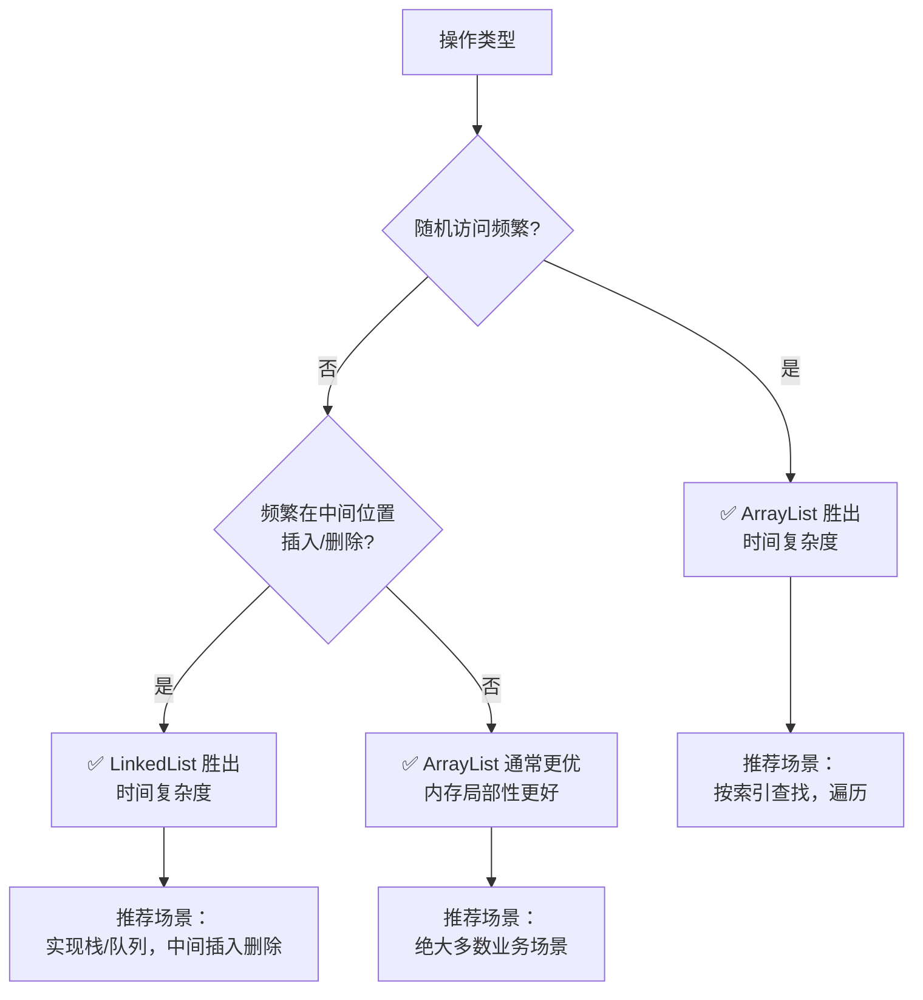

# ArrayList 和 LinkedList 在不同场景下的性能对比？

## 一句话说明（白话）

## 它解决什么问题 / 为什么重要

## 核心原理（一步步讲清楚）

##典型使用场景

## 简单例子 /伪代码

## 常见坑与误区

##题库要点（原始材料）
`ArrayList`和`LinkedList`的底层实现完全不同（动态数组 vs. 双向链表），因此它们的性能特性在不同场景下差异巨大。下面的对比图直观展示了两者在关键操作上的性能差异：

**简单来说**：**`ArrayList`在绝大多数情况下是更优的选择**，因为它能利用CPU缓存局部性原理，连续的内存分布使访问速度更快。只有在需要**频繁在列表中间位置进行插入或删除操作**时，`LinkedList`才有明显优势。此外，`LinkedList`还天然实现了`Deque`接口，非常适合用于实现栈和队列。

##关联知识
- 

## 延伸阅读（后续补充）
- 
