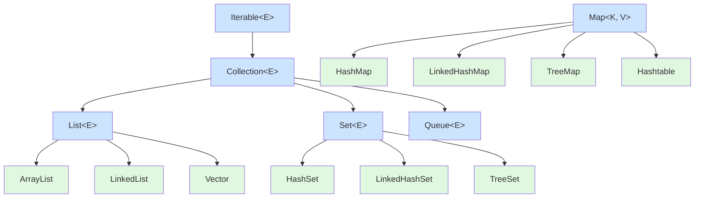

# Java 集合框架的层次结构是怎样的？

## 一句话说明（白话）

## 它解决什么问题 / 为什么重要

## 核心原理（一步步讲清楚）

##典型使用场景

## 简单例子 /伪代码

## 常见坑与误区

##题库要点（原始材料）
Java集合框架是一个设计精良的、用于表示和操作集合的类库体系。其核心接口的继承与实现关系，可以通过下图清晰地展示：

从图中可以看出：
- 最顶层的 `Iterable`接口定义了获取迭代器（`Iterator`）的能力，从而实现增强for循环。
- `Collection`接口继承自 `Iterable`，其下主要有三大分支：**List**（有序可重复）、**Set**（不可重复）和**Queue**（队列，FIFO等）。
- **Map**​ 是一个独立的接口，它存储的是键值对（Key-Value），并不继承自 `Collection`。

##关联知识
- 

## 延伸阅读（后续补充）
- 
