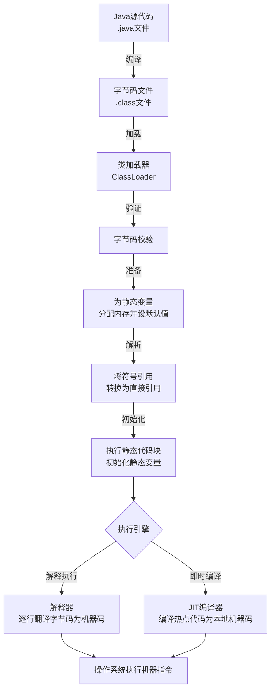
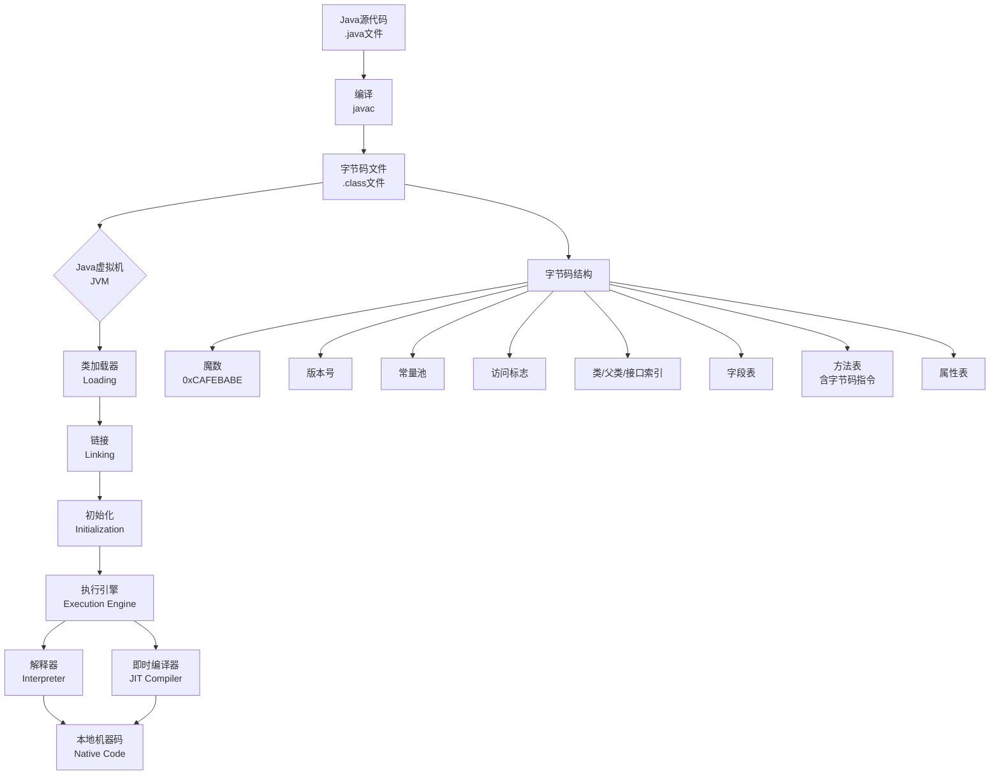

### 一、Java 语言基础

###### 1. Java 语言有哪些特点⁠⁠​？
   Java 语言是一种被广泛使用的面向对象编程语言，具有以下核心特点：
- ==**面向对象**：Java 支持封装、继承、多态等面向对象特性，鼓励以对象为中心设计程序，提高代码的可维护性和复用性。==
- ==**平台无关性与跨平台性**：Java 程序通过编译生成字节码（.class 文件），由 Java 虚拟机（JVM）在不同平台上解释执行，实现"一次编写，到处运行"。==
- ==**健壮性**：Java 提供强类型检查、异常处理机制和自动内存管理（垃圾回收），有效减少程序崩溃和内存泄漏问题。==
- ==**安全性**：Java 内置安全机制，如沙箱（Sandbox）模型、字节码验证器和访问控制，防止恶意代码攻击。==
- ==**多线程支持**：Java 在语言级别支持多线程编程，允许程序同时执行多个任务，提高并发性能和资源利用率。==
- **简单易学**：Java 语法类似于 C++，但摒弃了 C++ 中复杂的特性（如指针、运算符重载、多重继承），并提供了自动垃圾回收机制，降低了学习门槛和编程复杂度。
- **分布式支持**：Java 提供网络编程类库（如 java.net 包），便于开发分布式应用和 Web 服务。
- **高性能**：通过即时编译器（JIT）将热点代码编译为本地机器码，性能接近 C++，同时垃圾回收机制优化了内存使用。
- **动态性**：支持运行时加载类、反射机制等，使程序能适应变化的环境
###### 2. 说说你对 JDK、JRE、JVM 的理解⁠⁠​？
JDK、JRE 和 JVM 是 Java 技术的核心组件，关系紧密但职责不同：
- **JVM（Java Virtual Machine，Java 虚拟机）**：是虚拟的计算机，负责将 Java 字节码（.class 文件）解释或编译为特定平台的机器指令执行。JVM 是 Java 跨平台的基础，不同平台有对应的 JVM 实现。
- **JRE（Java Runtime Environment，Java 运行环境）**：是运行 Java 程序所需的环境，包含 JVM 和 Java 核心类库（如 java.lang、java.util）。用户只需安装 JRE 即可运行已编译的 Java 程序，但无法进行开发。
- **JDK（Java Development Kit，Java 开发工具包）**：是开发者使用的工具集，包含 JRE 以及开发工具（如编译器 javac、调试器 jdb、打包工具 jar）。JDK 用于编写、编译和调试 Java 代码。
- **三者的关系**：JDK ⊃ JRE ⊃ JVM。即 JDK 包含 JRE，JRE 包含 JVM。开发 Java 程序需要 JDK，而运行程序只需 JRE
###### 3. Java 是如何实现跨平台的?⁠​
Java 通过 **Java 虚拟机（JVM）** 和 **字节码机制** 实现跨平台，具体过程如下：
- **编译阶段**：Java 源代码（.java）被编译器（javac）编译成与平台无关的字节码（.class 文件），而不是直接生成机器码。字节码是一种中间格式，不依赖任何特定操作系统或硬件。
- **运行阶段**：不同平台（如 Windows、Linux、macOS）安装对应的 JVM。JVM 将字节码加载到内存，通过解释器或即时编译器（JIT）将其转换为当前平台的本地机器指令并执行。由于字节码是标准化的，而各平台 JVM 负责适配本地环境，因此同一份字节码可在不同平台上运行，实现"一次编写，到处运行"。
- **关键点**：JVM 屏蔽了底层平台的差异，使开发者无需关注操作系统细节。但 JVM 本身不跨平台，每个平台需安装专属 JVM 实现
###### 4. 简单说说你写的 java 程序是如何执行的?⁠​
一个Java程序从源代码到最终执行，主要经历编译和运行两大阶段。



①编译阶段：从 `.java`到 `.class`
用 `javac`命令编译 `.java`源文件时，会经历词法分析、语法分析（生成抽象语法树）、语义分析等步骤，最终生成平台无关的 `.class`字节码文件。字节码是JVM的机器语言。
②运行阶段：
1. **类加载（Loading & Linking）**
    JVM的类加载器（ClassLoader）会去寻找并加载所需的 `.class`文件。加载后，会进行**链接（Linking）**，包括：
    - **验证**：确保字节码是安全合法的。
    - **准备**：为类变量（静态变量）分配内存并设置默认初始值（如int为0）。
    - **解析**：将常量池中的符号引用转换为直接引用。
    - **初始化**：执行类中的静态变量赋值语句和静态代码块。
2. **执行引擎（Execution Engine）如何工作**
    加载和初始化完成后，JVM的**执行引擎**负责执行字节码。
    - **解释执行**：执行引擎中的解释器（Interpreter）会逐行读取字节码，并快速地将其翻译成本地机器码并执行。优点是启动快，立即执行；缺点是逐行解释效率相对较低。
    - **即时编译（JIT Compilation）**：为了提升性能，JVM会监控代码的执行频率。对于那些被频繁调用的“**热点代码**”（如循环、常用方法），**JIT（Just-In-Time）编译器**会将其整个方法或代码块编译成本地机器码。这样，下次再执行这段代码时，就可以直接运行高效的本地机器码，无需再次解释，大大提高了长期运行的性能。这是一种在程序运行时进行的编译。
3. **内存管理（自动垃圾回收）**
    程序运行中创建的对象都存放在堆（Heap）内存中。JVM内置了**垃圾回收器（GC， Garbage Collector）**，它会自动回收不再使用的对象所占用的内存，从而避免了像C/C++那样需要手动管理内存可能带来的内存泄漏问题。
###### 5. 标识符的命名规则⁠?⁠​
标识符是用来为 Java 中的变量、方法、类、包等元素命名的符号。
**硬性规则（必须遵守，否则编译错误）**：
1. **组成字符**：可以由字母（A-Z, a-z）、数字（0-9）、下划线（_ ）和美元符号（$）组成。
2. **首字符**：**不能以数字开头**。
3. **区分大小写**：`myVar`和 `myvar`是两个不同的标识符。
4. **不能是关键字或保留字**：如 `class`, `public`, `static`, `void`等不能作为标识符。
5. **长度无限制**。
**特别注意**：虽然 Java 使用 Unicode 字符集，理论上可以使用中文等字符作为标识符，但**强烈不建议这样做**，会降低代码的可维护性和专业性。
###### 6. Java中的main方法为什么要声明为public static void?⁠
Java 中的 `main`方法声明为 `public static void`是由 Java 虚拟机（JVM）的调用机制决定的。
- **`public`**：`main`方法是程序的入口，JVM 需要从类的外部调用这个方法。`public`访问修饰符确保了 JVM 在任何情况下都能无障碍地访问到这个方法。
- **`static`**：JVM 在启动时，还没有创建包含 `main`方法的类的任何对象实例。`static`关键字表示该方法是**属于类本身**的，而不是属于某个对象。因此，JVM 可以直接通过类名来调用 `main`方法，而无需先实例化对象，这简化了程序的启动过程。
- **`void`**：`main`方法作为程序的起点，它执行完毕后，不需要向 JVM 返回一个结果。`void`关键字表明该方法**没有返回值**。任何返回值对 JVM 来说都没有意义。
**总结**：这个特定的方法签名是一个约定俗成的规范，确保了 JVM 能够**简单、直接地找到并执行**程序的入口点。
###### 7. 什么是字节码？字节码的好处是什么？
字节码是Java实现“一次编写，到处运行”（Write Once, Run Anywhere）理念的核心。



简单来说，字节码（Bytecode）**是一种由Java编译器（`javac`）生成的、与特定机器指令集无关的中间代码，保存在 `.class`文件中。它本质上是 JVM 的机器语言指令集**。
- **平台无关的中间表示**：字节码不是直接面向任何特定的物理CPU（如x86或ARM），而是面向JVM这个抽象层。这使得它独立于底层硬件和操作系统。
- **二进制格式与紧凑结构**：字节码采用二进制格式存储，比源代码更紧凑。一个 `.class`文件具有严格的结构，包含魔数（`0xCAFEBABE`）、版本号、常量池、访问标志、字段表、方法表（内含字节码指令）等组成部分。
- **基于栈的计算模型**：JVM采用栈架构来执行字节码，大多数指令通过操作数栈进行数据处理，而非直接依赖于寄存器。
采用字节码为Java生态系统带来了多方面的重要好处。

| 优势             | 核心说明                                                | 价值体现                             |
| -------------- | --------------------------------------------------- | -------------------------------- |
| **跨平台性**       | 一次编译，到处运行。字节码由JVM解释或编译执行，JVM屏蔽了不同平台的差异。             | 显著降低了程序部署和分发的复杂性，是Java成功的基石。     |
| **安全性**        | JVM在执行字节码前会进行严格的验证，防止有害操作，同时Java字节码无法直接操作内存。        | 为网络环境下的代码执行提供了安全沙箱。              |
| **高性能（JIT优化）** | JVM会监控代码执行频率，通过即时编译器将热点字节码编译成本地机器码并缓存，大幅提升性能。       | 使Java应用在长期运行的服务端场景中能获得接近本地代码的效率。 |
| **动态性与灵活性**    | 支持运行时动态加载和修改字节码，反射机制也依赖于字节码的运行时信息。                  | 是实现热部署、AOP、动态代理等重要特性的基础。         |
| **强大的生态与工具支持** | 字节码是许多开发工具（如反编译、调试、性能分析工具）和框架（如Spring AOP）直接操作的对象。  | 方便开发者分析、调试、优化和增强程序行为。            |
| **跨语言支持**      | JVM成为了一个通用的运行时平台，其他语言如Kotlin、Scala等也可编译成字节码在JVM上运行。 | 丰富了JVM生态。                        |

如何查看与分析字节码，可以使用JDK自带的 `javap`工具来查看字节码。
1. **编译Java源文件**：首先使用 `javac YourClass.java`生成 `.class`文件。
2. **反编译查看字节码**：使用 `javap -c YourClass`可以输出易于阅读的字节码指令序列。添加 `-verbose`参数（`javap -c -verbose YourClass`）能获得更详细的信息，包括常量池、方法描述符等。

了解字节码的实用场景
- **代码优化**：通过分析关键代码路径的字节码，可以发现潜在的性能瓶颈，例如不必要的自动装箱、创建多余临时对象等。
- **问题排查**：当遇到一些底层机制相关的问题（如序列化、反射、同步等问题）时，查看字节码可能有助于理解深层原因。
- **字节码增强技术**：许多高级框架（如Spring的AOP功能）在运行时通过ASM、Byte Buddy等库动态修改或生成字节码，实现强大功能。
### 二、面向对象

###### 1. 面向对象和面向过程的区别?

###### 2. 说说面向对象编程三大特性⁠?

###### 3. 什么是多态机制？

###### 4. 说说重载和重写的区别⁠?

###### 5. 重载的方法能否根据返回类型进行区分?⁠

###### 6. 简单说说 Java 中接口和抽象类的区别?

###### 7. 抽象类能使用 final 修饰吗？⁠

###### 8. 抽象的（abstract）方法是否可同时是静态的?⁠

###### 9. 什么是封装？如何实现封装？

###### 10. 接口和抽象类各自的使用场景是什么？

### 三、数据类型与变量

###### 1. 说说八种基本数据类型的大小，以及他们的封装类⁠？⁠​
Java 的八种基本数据类型及其封装类如下：

|**基本数据类型**|**大小（字节）**|**封装类**|**取值范围/说明**|
|---|---|---|---|
|`byte`|1|`Byte`|-128 ~ 127|
|`short`|2|`Short`|-32768 ~ 32767|
|`int`|4|`Integer`|-2^31 ~ 2^31-1|
|`long`|8|`Long`|-2^63 ~ 2^63-1|
|`float`|4|`Float`|单精度浮点数|
|`double`|8|`Double`|双精度浮点数|
|`char`|2|`Character`|Unicode字符，0~65535|
|`boolean`|未严格定义（通常1位）|`Boolean`|true/false|

###### 2. char 型变量中能不能存贮一个中文汉字? 为什么?⁠⁠​
**可以**。原因在于：
- Java 的 `char`类型采用 **Unicode 编码**，占 **2 字节（16 位）**，可表示的范围是 0~65535（即 Unicode 字符集）。
- 中文汉字属于 Unicode 字符集的一部分（如常用汉字在 CJK 统一编码区间），每个汉字对应一个 Unicode 码点，因此可以被 `char`变量存储。
例如：

```java
char ch = '中';// 合法，存储汉字'中'
```

但需注意：某些生僻字或表情符号可能超出 Basic Multilingual Plane（BMP），需使用两个 `char`（即 `String`）表示。
###### 3. Java 中包装类型和基本类型的区别是什么⁠​？
Java 中的基本类型（Primitive Types）和包装类型（Wrapper Classes）在设计目的和特性上有显著区别，主要体现在以下几个方面：

| **特性**     | **基本类型**                            | **包装类型**                                                    |
| ---------- | ----------------------------------- | ----------------------------------------------------------- |
| **本质**     | 是 Java 预定义的简单数据类型，不是对象              | 是对基本类型的封装，是真正的类                                             |
| **声明与初始化** | 直接使用（如 `int num = 10;`），无需 `new`    | 通常需要使用 `new`关键字（如 `Integer num = new Integer(10);`），但支持自动装箱 |
| **存储方式**   | 变量直接存储**数据值**，通常在栈内存中               | 变量存储的是对象的**引用（地址）**，对象本身存储在堆内存中                             |
| **默认值**    | 有默认值（如 `int`为 0，`boolean`为 `false`） | 默认值为 `null`                                                 |
| **可空性**    | **不能**为 `null`                      | **可以**为 `null`                                              |
| **功能方法**   | 没有方法，只是一个数据值                        | 提供了丰富的实用方法（如 `Integer.parseInt()`、`Integer.valueOf()`）      |
| **泛型支持**   | **不能**用于泛型（如 `List<int>`是错误的）       | **可以**用于泛型（如 `List<Integer>`是正确的）                           |
| **性能**     | 更高效，因为直接在栈上分配，开销小                   | 相对较低，因为需要在堆上创建和回收对象，有额外开销                                   |
| **适用场景**   | 适用于大量计算、性能要求高的场景                    | 适用于集合框架、需要对象特性的场景（如可空性、作为方法参数传递对象）                          |

###### 4. 说说 Java 自动装箱与拆箱⁠⁠​？
自动装箱（Auto-boxing）和自动拆箱（Auto-unboxing）是 Java 5 引入的语法糖，用于简化基本类型和对应包装类型之间的转换
- **自动装箱**：指基本数据类型**自动转换**为对应的包装类对象。
``` java
// 手动装箱 (Java 5 之前)
Integer num1 = Integer.valueOf(100);
// 自动装箱 (Java 5 之后)
Integer num2 = 100;// 编译器自动转换为 Integer.valueOf(100)
```
- **自动拆箱**：指包装类对象**自动转换**为对应的基本数据类型。
```java
// 手动拆箱
int value1 = num1.intValue();
// 自动拆箱
int value2 = num2;// 编译器自动转换为 num2.intValue()
```
**实现原理**：这本质上是编译器在编译期帮我们完成的代码转换。自装箱时调用的是包装类的 `valueOf()`方法，自动拆箱时调用的是对应的 `xxxValue()`方法（如 `intValue()`。
**主要应用场景**：
- **集合框架（Collection）**：集合（如 `ArrayList`）只能存储对象，当我们添加基本类型时会发生自动装箱。
``` java
List<Integer> list = new ArrayList<>();
list.add(10);// 自动装箱：int -> Integerint 
first = list.get(0);// 自动拆箱：Integer -> int
```
- **泛型（Generics）**：泛型类型参数必须是引用类型。
- **方法参数和返回值传递**。
**注意事项**：
- **空指针异常（NullPointerException）**：如果一个包装类对象为 `null`，对其进行自动拆箱操作会抛出异常。
``` java
Integer nullInteger = null;
int num = nullInteger;// 运行时抛出 NullPointerException
```
- **性能开销**：在循环或大量数据操作中，频繁的装箱和拆箱会创建大量临时对象，增加垃圾回收（GC）压力，影响性能。在性能敏感的场景应谨慎使用 。
- **比较陷阱**：使用 `==`比较包装对象时，需要注意缓存范围。
###### 5. Integer a= 127 与 Integer b = 127 相等吗？⁠​
**相等（使用 `==`比较结果为 `true`）。**
**原因是 Integer 类的缓存机制（Integer Cache）**。默认情况下，Integer 类会缓存 **-128 到 127**之间的所有整数对象。
当通过自动装箱（即直接赋值）或调用 Integer.valueOf(int i) 方法创建 Integer 对象时，如果数值在这个范围内，就会直接返回缓存池中已存在的同一个对象的引用。
```java
Integer a = 127;// 相当于 Integer.valueOf(127)
Integer b = 127;// 相当于 Integer.valueOf(127)
System.out.println(a == b);// true，因为 a 和 b 指向缓存中的同一个对象
```
**但是，如果数值超出缓存范围，结果就不同了**：
```java
Integer c = 128;
Integer d = 128;
System.out.println(c == d);// false，因为 128 超出了默认缓存范围，会创建新的 Integer 对象
```
**要点**：
- 这种缓存机制是一种性能优化，避免频繁创建和销毁小整数对象。
- ==使用 `new Integer(int)`构造器会强制创建新对象，不会使用缓存==。
- 其他包装类也有类似的缓存机制，如 `Byte`缓存所有值（范围是-128 到 127），`Short`、`Long`缓存 -128 到 127，`Character`缓存 0 到 127，`Boolean`缓存 `TRUE`和 `FALSE`。
- 可以使用 `XX:AutoBoxCacheMax=<size>`JVM 参数来调整 Integer 缓存的上限 。
###### 6. 成员变量与局部变量有什么区别？⁠​
| **特性**    | **成员变量**                                                 | **局部变量**                         |
| --------- | -------------------------------------------------------- | -------------------------------- |
| **声明位置**  | 类内部，方法体外。                                                | 方法体、构造方法或代码块内部。                  |
| **生命周期**  | 伴随对象的存在而存在。实例变量随对象创建而诞生，随对象被回收而消亡；静态变量随类的加载而诞生，随类的卸载而消亡。 | 伴随方法的调用而存在，方法调用结束，栈帧弹出，局部变量随之销毁。 |
| **存储位置**  | 实例变量存储在堆内存的对象实体中；静态变量存储在方法区。                             | 存储在栈内存的方法栈帧中。                    |
| **默认值**   | **有默认值**。如数值类型为0，布尔型为false，引用类型为null。                    | **没有默认值**，必须先显式初始化后才能使用，否则编译报错。  |
| **访问修饰符** | 可以使用 `public`, `protected`, `private`, `static`等修饰。      | 不能使用访问修饰符，但可以被 `final`修饰。        |
| **作用域**   | 在整个类内部基本都可以直接访问（静态变量可通过类名访问）。                            | 仅限于定义它的方法、构造方法或代码块内部，出了这个范围即失效。  |
###### 7. 静态变量和实例变量区别?⁠⁠​
静态变量和实例变量是成员变量的两种类型。

|**特性**|**静态变量（类变量）**|**实例变量**|
|---|---|---|
|**归属**|属于**类**，所有对象共享同一份数据。|属于**对象实例**，每个对象都有自己独立的一份副本。|
|**内存分配**|在类加载的初始化阶段分配内存于方法区，仅分配一次。|在每次创建对象实例时，在堆内存中随对象一起分配内存。|
|**调用方式**|既可以通过**类名**直接访问，也可以通过对象引用访问（但不推荐）。|只能通过**对象引用**来访问。|
|**生命周期**|最长，随类的加载而存在，随类的卸载而消亡。|随对象的创建而存在，随对象的垃圾回收而消亡。|
###### 8. 静态变量与普通变量（局部变量）区别?⁠⁠​
|**方面**|**静态变量**|**局部变量**|
|---|---|---|
|**声明位置与作用域**|类内方法外，类级别作用域。|方法或代码块内，块级别作用域。|
|**内存与生命周期**|方法区，生命周期与类相同。|栈内存，生命周期与方法调用相同。|
|**初始化与访问**|有默认值，可通过类名或对象访问。|必须显式初始化，只能在作用域内访问。|
|**修饰符**|可用 `public`, `static`等。|仅可用 `final`。|
###### 9. 3 * 0.1 == 0.3 将会返回什么? true 还是 false?⁠⁠​
这个表达式将返回 **`false`**。
**原因**：这是由**浮点数在计算机中的表示方式**决定的。Java 中的 `float`和 `double`类型遵循 IEEE 754 标准，该标准使用二进制小数来近似表示十进制小数。有些十进制小数（如 `0.1`）无法用二进制小数精确表示。
- 在计算 `3 * 0.1`时，实际结果是一个非常接近但不完全等于 `0.3`的值（例如 `0.30000000000000004`）。
- 当使用 `==`运算符直接比较时，是在比较两个值的精确二进制表示，由于微小的误差，比较结果自然为 `false`。
**正确处理方式**：比较浮点数时，不应使用 `==`，而应检查两数之差的绝对值是否在一个极小的误差范围（epsilon）内。
```java
double result = 3 * 0.1;
double epsilon = 1e-10;// 定义一个极小的误差阈值
boolean isEqual = Math.abs(result - 0.3) < epsilon;// 返回 true
```
对于需要精确计算的场景（如金融），应使用 `BigDecimal`类。
###### 10. 什么是类型转换？自动类型转换和强制类型转换的区别？
类型转换是Java中将一个数据类型的值转换为另一种数据类型的过程。这对于处理不同数据类型之间的赋值、运算和方法调用至关重要。

|特性|自动类型转换 (隐式转换)|强制类型转换 (显式转换)|
|---|---|---|
|**转换方向**|小范围类型 → 大范围类型 (`byte`-> `int`等)|大范围类型 → 小范围类型 (`double`-> `int`等)|
|**语法要求**|自动完成，无需特殊语法|必须显式使用 `(目标类型)`进行转换|
|**数据风险**|安全，通常不会丢失信息|**可能丢失精度**（如小数部分）或**溢出**（超出目标类型范围）|
|**典型场景**|将`int`常量赋值给`long`变量|将`double`转换为`int`（取整）|
|**转换原则**|由编译器自动完成，保证安全性|开发者显式干预，**“后果自负”**|
**自动类型转换（隐式转换）**
自动类型转换就像是将一小杯水倒入一个大桶中，因为目标容器的容量足够大，所以这个过程是安全且自动完成的。
- **发生时机**：当将**数据范围较小**的类型（如 `byte`、`short`）赋值给**数据范围较大**的类型（如 `int`、`long`、`double`）时，编译器会自动进行转换。基本数据类型的转换方向通常遵循：`byte`-> `short`-> `int`-> `long`-> `float`-> `double`，以及 `char`-> `int`。
- **安全性**：这种转换是**安全**的，因为更大范围的类型足以容纳小范围类型的所有信息，通常不会导致数据丢失。
**强制类型转换（显式转换）**
强制类型转换则像是试图将一大桶水强行倒入一个小杯子，你必须明确下指令，并且必须承担可能溢出或洒掉（数据丢失）的风险。
- **发生时机与语法**：当需要将**数据范围较大**的类型赋值给**数据范围较小**的类型时，必须使用强制类型转换。语法是在需要转换的值或变量前加上`(目标类型)`，例如 `int i = (int) 10.5;`。
- **风险与后果**：这是**不安全**的转换，可能导致：
    - **精度丢失**：最常见的是浮点数转换为整数，小数部分会**直接舍弃**，而不是四舍五入。例如，`(int) 10.9`的结果是 `10`。
    - **数据溢出**：如果值超出了目标类型的表示范围，结果将不可预测。例如，将 `128`强制转换为 `byte`（范围-128~127）会得到错误的值 `-128`。
*关键场景与最佳实践*
- **表达式中的自动提升**
	在表达式中，如果存在不同数据类型一起运算，Java会自动将所有操作数提升到表达式中范围最大的那个类型。特别需要注意的是，`byte`、`short`、`char`在参与运算时，会**先自动提升为 `int`类型**。这就是为什么 `byte a = 1; byte b = a + 1;`会编译报错，因为 `a + 1`的结果已经是 `int`类型，不能自动赋值给 `byte`。
- **谨慎使用强制转换**
	由于强制转换存在风险，使用时务必确保你清楚可能的数据丢失后果，并确保转换后的值在目标类型的合理范围内。
- **注意扩展赋值运算符**
    类似 `+=`、`*=`这样的运算符内部**隐含了强制类型转换**。例如 `short s = 1; s += 1;`能正确编译，因为它等价于 `s = (short) (s + 1);`。
- **不相容类型的转换**
    `boolean`类型与其他7种基本数据类型**互不兼容**，不能进行任何形式的类型转换。
###### 11. 为什么浮点数运算会有精度问题？
浮点数运算的精度问题确实常让人困惑。其根源在于，**有些十进制小数无法用二进制精确表示**，以及计算机使用**IEEE 754标准**这类格式，以有限内存来近似表示实数。
下面这个表格汇总了常见精度问题的场景和原因，帮你快速了解：

| 问题场景                 | 示例 (Java代码)                                | 实际输出/结果                | 核心原因                                               |
| -------------------- | ------------------------------------------ | ---------------------- | -------------------------------------------------- |
| **简单加法**             | `System.out.println(0.05 + 0.01);`         | `0.060000000000000005` | 0.05和0.1的二进制表示是无限循环小数，存在舍入误差<br><br>。              |
| **简单减法**             | `System.out.println(1.0 - 0.42);`          | `0.5800000000000001`   | 参与计算的数值在二进制下已存在误差<br><br>。                         |
| **乘法运算**             | `System.out.println(4.015 * 100);`         | `401.49999999999994`   | 二进制表示不精确与运算过程中的舍入误差共同导致<br><br>。                   |
| **循环累加**             | `for (int i=0; i<10; i++) { sum += 0.1; }` | `0.9999999999999999`   | 误差在多次运算中不断累积<br><br>。                              |
| **数值比较**             | `if (0.1 + 0.2 == 0.3)`                    | `false`                | 运算结果的实际二进制表示与0.3的二进制表示不同。                          |
| **构造BigDecimal(错误)** | `new BigDecimal(0.1)`                      | 内部值并非精确的0.1            | `BigDecimal(double)`构造器直接继承了double本身的精度误差<br><br>。 |
*深入理解精度根源*
浮点数精度问题的根源可以归结为以下几个方面：
1. **二进制表示的“先天不足”**
    计算机使用二进制存储数据。对于小数，我们通常采用"乘2取整"的方法将十进制小数转换为二进制，但**很多在十进制下有限的小数，在二进制中会是无限循环的**。
    例如，十进制的0.1在二进制中是一个无限循环小数：`0.0001100110011...`。由于计算机的存储空间有限（float有23位尾数，double有52位尾数），必须对无限小数进行**截断和舍入**，这就引入了最初的误差。这类似于在十进制中无法精确表示1/3（0.333...）一样。
2. **IEEE 754标准与内存表示**
    浮点数在计算机中遵循IEEE 754标准，其表示格式可概括为 `(-1)^s * M * 2^E`，包括符号位（s）、阶码（E）和尾数（M）三部分。以32位的float类型为例，其内存布局如下：
    - **符号位 (s)**: 占1位（第31位），0代表正数，1代表负数。
    - **指数位 (E)**: 占8位（第23-30位），采用**偏移码**（float的偏移量是127）表示，目的是为了表示负指数。
    - **尾数位 (M)**: 占23位（第0-22位），存储的是规格化后二进制小数**小数点后的部分**。因为规格化后总可以表示为1.xxx...的形式，所以最高位的1被隐含，不直接存储，这样实际上获得了24位有效数字的精度。这种基于有限精度和指数表示的模型，本质上是实数的一种**离散化近似**，决定了浮点数无法精确表示所有实数。
3. **误差的累积与放大**
    单个浮点数的表示误差可能很小，但在运算（尤其是连续运算如累加`sum += 0.1`）过程中，这些微小的误差会**不断累积和放大**，最终导致计算结果与理论值出现明显偏差。在科学计算、金融等领域，这种累积误差可能带来严重后果。
*应对精度问题的策略*
核心原则是：**在需要精确计算的场景（特别是商业计算、金融领域），避免直接使用float和double进行计算**。
4. **使用 `BigDecimal`进行精确计算**
    Java提供了`BigDecimal`类来表示和计算精确的小数。它通过一个**未缩放整数值（BigInteger）**和一个**缩放因子（scale）**来表示小数（例如，`BigDecimal`可表示为 `unscaledValue × 10^(-scale)`），从而避免二进制表示问题。
    - **关键点：使用String构造器**
        务必使用`BigDecimal(String val)`构造器，而不是`BigDecimal(double val)`。因为使用double构造器时，不精确的二进制表示已经被带入，无法得到精确值。正确做法是：			
        `// 错误做法：精度已污染`
        `BigDecimal bad = new BigDecimal(0.1);`
        `// 正确做法：精确表示`
        `BigDecimal good = new BigDecimal("0.1");`
    - **比较值：使用 `compareTo()`**
        比较两个`BigDecimal`数值是否相等时，应使用`compareTo()`方法而非`equals()`方法。因为`equals()`还会比较缩放比例（scale），而`compareTo()`仅比较数值本身。
    - **除法运算：指定精度和舍入模式**
        进行除法运算时，如果结果是无限小数，必须指定精度（scale）和舍入模式（RoundingMode），否则会抛出`ArithmeticException`。
        BigDecimal a = new BigDecimal("10");
        BigDecimal b = new BigDecimal("3");
        // 正确：指定保留3位小数，采用四舍五入
        BigDecimal result = a.divide(b, 3, RoundingMode.HALF_UP);
5. **使用整数类型表示最小单位**
    在处理货币时，一个常见且高效的实践是使用**整数类型（如long）来表示金额的最小单位**（例如，用“分”而不是“元”）。这样可以完全避免小数运算。`long priceInCents = 199; // 表示1.99元`
6. **利用工具类简化 `BigDecimal`操作**
    为了方便使用，可以封装一个类似`ArithUtil`的工具类，将基本的四则运算封装起来，内部使用`BigDecimal`并处理字符串转换和精度控制。
### 四、关键字与运算符

###### 1. final 有哪些用法?⁠⁠​
`final`关键字在 Java 中用途广泛，用于表示“不可改变”，可以修饰变量、方法和类。
1. **final 变量（常量）**：
    - 修饰基本类型变量：值一旦初始化就不能再改变。
    - 修饰引用类型变量：引用地址不能改变，但其所指向对象内部的状态（属性值）是可以改变的。
    - 常与 `static`联用定义类常量，如 `public static final double PI = 3.14;`。
2. **final 方法**：
    - 被 `final`修饰的方法不能被子类**重写**。
    - 用于防止继承类改变方法的核心逻辑，或用于效率优化（早期版本，现在已不明显）。
3. **final 类**：
    - 被 `final`修饰的类不能被**继承**。
    - 用于表示这个类已经是“最终”形态，不需要或不允许被扩展，例如 Java 中的 `String`类。
###### 2. 说说 this 关键字的用法?⁠⁠​
`this`关键字在 Java 中是一个指向**当前对象实例**的引用。它的核心用途是帮助在类的内部明确地访问当前对象的成员（变量和方法），尤其在处理命名冲突或需要在多个构造方法之间进行调用时非常有用。
其主要用法可以归纳为以下四个方面：
1. **区分成员变量与局部变量**：当方法的参数名或局部变量名与类的成员变量名相同时，使用 `this.变量名`来明确指定要访问的是当前对象的成员变量，而不是局部变量。这避免了赋值无效或逻辑错误，是 `this`最常用的场景。
  ```java
   public class Person {
     private String name;
      public void setName(String name) {
      this.name = name;// 等号左边的this.name是成员变量，右边的name是方法参数
       }
    }
    ```
2. **在构造方法中调用其他构造方法**：在一个构造方法中，可以使用 `this()`或 `this(参数列表)`来调用同一个类中的其他构造方法。这种调用**必须位于构造方法的第一条语句**，目的是实现代码复用，避免在多个构造方法中编写重复的初始化逻辑。
```java
    public class Person {
       private String name;
       private int age;
    
    public Person() {
        this("未知", 0);// 调用带两个参数的构造器
      }
    
    public Person(String name, int age) {
       this.name = name;
        this.age = age;
	    }
    }
    ```
3. **将当前对象作为参数传递**：在需要将自身实例传递给其他方法或对象的场景下（例如事件监听、回调机制），可以使用 `this`来代表当前对象。
```java
    public class Button {
        public void click() {
            EventManager.register(this);// 将当前按钮对象注册到事件管理器
        }
    }
    ```
    
4. **实现链式调用（Method Chaining）**：通过在方法中返回当前对象（即 `return this;`），可以使多个方法调用连续进行，让代码更加简洁流畅。
```java
    public class Calculator {
        private int result;
        public Calculator add(int value) {
            this.result += value;
            return this;// 返回当前对象，支持链式调用
        }
        public Calculator multiply(int value) {
            this.result *= value;
            return this;
        }
    }
    // 使用方式：
    new Calculator().add(5).multiply(2).getResult();
```

**重要注意事项**：`this`关键字指向的是当前对象的实例，因此它**不能在静态方法（`static`方法）中使用**，因为静态方法属于类本身，不依赖于任何对象实例。
###### 3. 说说 super 关键字的用法?⁠​
`super`关键字在 Java 中是一个指向**当前对象的直接父类**的引用。
它主要用于在子类中访问和调用那些被子类覆盖或隐藏了的父类成员（变量、方法和构造方法）。
其主要用法有以下三种：
1. **调用父类的构造方法**：在子类的构造方法中，必须首先调用父类的构造方法以确保父类部分被正确初始化。这是通过 `super()`或 `super(参数列表)`实现的，并且**这条语句必须位于子类构造方法的第一行**。如果子类构造方法中没有显式写出，编译器会自动加上一个 `super()`调用父类的无参构造方法。
```java
    class Animal {
        public Animal(String type) {
            System.out.println("Animal constructor: " + type);
        }
    }
    class Dog extends Animal {
        public Dog(String name) {
            super("Dog");// 调用父类的有参构造方法，必须放在第一行
            System.out.println("Dog name: " + name);
        }
    }
```
2. **调用父类中被重写的方法**：当子类重写了父类的方法后，如果需要在子类方法中再次使用父类该方法的原始实现，可以使用 `super.方法名()`进行调用。
```java
    class Parent {
        public void display() {
            System.out.println("Parent's display method");
        }
    }
    class Child extends Parent {
        @Override
        public void display() {
            super.display();// 先调用父类的display方法
            System.out.println("Child's display method");
        }
    }
```
3. **访问父类中被隐藏的成员变量**：如果子类中声明的成员变量与父类中的成员变量同名，则父类的变量会被"隐藏"。此时，可以使用 `super.变量名`来访问父类中的那个变量。
``` java
	class Parent {
	    String name = "Parent";
	}
	class Child extends Parent {
	    String name = "Child";
	    void printNames() {
	        System.out.println(super.name);// 输出 "Parent"
	        System.out.println(this.name);// 输出 "Child"
	    }
	}
```
###### 4. this() & super()在构造方法中的区别？⁠​
`this()`和 `super()`都用于构造方法中，且都必须作为构造方法的第一条语句，但它们的目的是完全不同的。

| **特性**   | **`this()`**                   | **`super()`**                 |
| -------- | ------------------------------ | ----------------------------- |
| **调用对象** | 调用**当前类**的其他构造方法               | 调用**父类**的构造方法                 |
| **目的**   | 实现当前类内**构造方法的重用**，减少代码重复       | **初始化从父类继承来的部分**，确保父类被正确构造    |
| **语法要求** | 必须是构造方法中的**第一条语句**             | 必须是构造方法中的**第一条语句**            |
| **共存性**  | **不能**与 `super()`在同一个构造方法中同时出现 | **不能**与 `this()`在同一个构造方法中同时出现 |

**核心区别与选择**：
- 使用 `this()`是为了在本类的多个构造方法之间实现链式调用，目的是让代码更简洁。
- 使用 `super()`是为了显式地调用父类的特定构造方法，这是继承机制中保证对象初始化正确性的基石。
- 在一个构造方法中，你只能选择使用 `this()`或 `super()`其中之一，因为它们都必须占据第一行的位置。如果两者都不写，编译器会默认插入 `super()`。
###### 5. static 都有哪些用法?⁠⁠​
`static`关键字用于修饰类的成员（变量、方法、代码块以及内部类），表示这些成员属于**类本身**，而不是属于类的某个具体实例。因此，静态成员也被称为**类成员**。
1. **静态变量（类变量）**
    - 特点：在内存中只有一份拷贝，在类加载时被初始化。所有该类的实例共享同一份静态变量。
    - 访问方式：推荐通过**类名.变量名**直接访问（如 `Math.PI`），也可以通过对象实例访问（但不推荐）。
    - 与实例变量区别：实例变量是每个对象独有的，互不影响。
2. **静态方法（类方法）**
    - 特点：不依赖于任何对象实例，可以直接通过**类名.方法名()** 调用（如 `Arrays.sort()`）。
    - 限制：静态方法内部**不能直接访问**类的非静态成员（实例变量和实例方法），因为非静态成员需要先创建对象才能存在。静态方法内也不能使用 `this`和 `super`关键字。
    - 常见例子：`main`方法必须是静态的，因为程序启动时还没有创建任何对象。
3. **静态代码块**
    - 特点：用 `static { ... }`定义。在**类被加载到内存时执行一次**，且仅执行一次。执行顺序优先于实例代码块和构造方法。
    - 用途：用于对静态变量进行复杂的初始化，或执行只需进行一次的初始化操作（如加载驱动、建立连接）。
4. **静态内部类**
    - 特点：使用 `static`修饰的内部类。它不依赖于外部类的实例，可以独立创建。静态内部类不能直接访问外部类的非静态成员。
**核心理解**：`static`将成员提升到类级别，使其与实例解耦。静态成员的生命周期与类相同，从类加载开始，到类被卸载结束。
###### 6. &和&&的区别？⁠⁠​
`&`和 `&&`在 Java 中都表示逻辑"与"操作，但它们在行为上有根本性的不同，主要体现在**是否具有"短路"特性**上。

| **运算符**  | **名称**             | **短路特性**                                                          | **用途**                                    |
| -------- | ------------------ | ----------------------------------------------------------------- | ----------------------------------------- |
| **`&&`** | **短路与**            | **有**。如果**第一个操作数为 `false`**，则整个表达式结果必定为 `false`，**不会再去计算第二个操作数**。 | 仅用于**布尔值**的逻辑判断。                          |
| **`&`**  | **逻辑与**（当操作数为布尔值时） | **无**。无论第一个操作数是 `true`还是 `false`，**都会计算两个操作数**。                   | 1. 用于**布尔值**的逻辑判断。 2. 用于**整数**的**按位与**运算。 |

**核心区别与示例**：
- **短路特性是关键**：`&&`的效率通常更高，并且可以避免一些潜在的错误。例如，在检查一个对象不为 `null`后再调用其方法时，使用 `&&`是安全且高效的。
```java
    if (obj != null && obj.isValid()) {// 如果obj为null，&& 不会执行后面的方法，避免NullPointerException
	    // ...
    }
```
	如果使用 `&`，即使 `obj`为 `null`，它也会执行 `obj.isValid()`，从而抛出 `NullPointerException`。
- **`&`的额外功能**：`&`还可以作为按位运算符，对两个整数的二进制每一位进行"与"操作。
```java
    int a = 5;// 二进制 0101
    int b = 3;// 二进制 0011
    int c = a & b;// 结果 0001，即十进制 1
```
**总结**：在绝大多数需要进行逻辑"与"判断的场景下，都应优先使用 `&&`，以利用其短路特性保证效率和安全性。只有在需要确保两边操作数都被执行，或进行按位运算时，才使用 `&`。
###### 7. switch 是否能作用在 byte 上，是否能作用在 long 上，是否能作用在 String 上？⁠⁠​
`switch`语句的表达式的类型是有限制的。以下是具体规则：
- **能作用在 `byte`上**：**可以**。`switch`支持 `byte`类型，以及 `short`、`char`、`int`这些整数类型。
- **不能作用在 `long`上**：**不可以**。所有比 `int`大的整数类型，如 `long`，都不能作为 `switch`的表达式的类型。
- **能作用在 `String`上**：**可以（从 Java 7 开始）**。从 Java 7 开始，`switch`支持 `String`类型。
- **其他支持的类型**：还支持枚举（`enum`）类型和它们的包装类（如 `Integer`, `Character`）。
**底层原理**：对于 `String`类型的 `switch`，编译器在底层是通过调用 `hashCode()`和 `equals()`方法将其转换为 `int`值来实现的，从而保持高效性。
###### 8. a=a+b 与 a+=b 有什么区别吗?⁠​

###### 9. 熟悉 instanceOf 关键字的作用吗？⁠⁠​

###### 10. transient 关键字的作用是什么？

###### 11. volatile 关键字的作用是什么？

### 五、String 与常用类

###### 1. String、StringBuffer 和 StringBuilder⁠？⁠​

###### 2. String s = new String ("abc") 创建了几个 String 对象?⁠​

###### 3. 说说你对 String 类的 intern () 方法的理解?⁠​

###### 4. String 类的常用方法都有那些？⁠⁠​

###### 5. String 字符串为什么说是不可变？⁠​

###### 6. Object 有哪些常用方法？大致说一下每个方法的含义?⁠⁠​

###### 7. 一个空 Object 对象的占多大空间？⁠⁠​

###### 8. 说说你对 equals 与== 的理解？⁠​

###### 9. 说说 Hash Code 的作用⁠？⁠​

###### 10. 有没有可能两个不相等的对象有相同的 Hash Code⁠？⁠​

###### 11. 两个对象值相同 (x.equals (y) == true)，但却可有不同的 Hash Code，这句话对不对？⁠​

###### 12. StringBuilder 和 StringBuffer 的底层实现原理是什么？

###### 13. String 为什么要设计成不可变的？

### 六、对象与内存

###### 1. 什么是构造函数？构造函数有什么特点？⁠⁠​

###### 2. 说说 Java 代码初始化顺序?⁠⁠​

###### 3. Java 创建对象有几种方式？⁠​

###### 4. 如何实现对象克隆？⁠​

###### 5. 深拷贝和浅拷贝的区别是什么?⁠​

###### 6. 熟悉 Java 的对象引用类型吗？⁠⁠​

###### 7. 为什么 Java 中只有值传递？⁠​

###### 8. 值传递和引用传递有什么区别？⁠​

###### 9. Java 对象的内存布局是怎样的？

###### 10. 什么是对象的逃逸分析？

### 七、内部类

###### 1. 什么是内部类？

###### 2. 内部类有什么优点？⁠​

###### 3. 内部类有哪些应用场景？⁠​

###### 4. 为什么匿名内部类只能使用成员变量或者被 final 修饰的局部变量呢？⁠​

###### 5. 静态内部类和非静态内部类的区别？

###### 6. 局部内部类有什么特点？

### 八、异常处理

###### 1. Java中的异常体系是怎样的？⁠⁠​

###### 2. 说说你对 Excption 与 Error 包的理解?⁠​

###### 3. try catch finally，try 里有 return，finally 还执行么？⁠​

###### 4. throw 和 throws 的区别是什么？

###### 5. 如何自定义异常？

###### 6. finally 块中的代码一定会执行吗？

### 九、泛型

###### 1. 为什么需要泛型？⁠⁠​

###### 2. 如何使用泛型？⁠⁠​

###### 3. 泛型的上限和下限是什么？⁠⁠​

###### 4. Java中的泛型为什么是伪泛型？⁠​

###### 5. 什么是类型擦除？

###### 6. 泛型中 extends 和 super 的区别（PECS 原则）？

### 十、序列化

###### 1. 什么是序列化和反序列化？Serializable 接口的作用是什么？⁠​

###### 2. Java 序列化中如果有些字段不想进行序列化，怎么办？⁠​

###### 3. serialVersionUID 的作用是什么？

###### 4. 序列化的底层实现原理是什么？

### 十一、IO 流

###### 1. 说说 Java 中 IO 流?⁠⁠​

###### 2. 既然有了字节流, 为什么还要有字符流?⁠⁠​

###### 3. 字节流如何转为字符流？⁠⁠​

###### 4. Files 的常用方法都有哪些？⁠​

###### 5. FileInputStream 和 FileReader 的区别是什么？⁠​

###### 6. 简单说说 Java IO 与 NIO 的区别⁠？⁠​

###### 7. BIO、NIO、AIO 有什么区别？⁠​

###### 8. Java IO 中用到了哪些设计模式？⁠⁠​

###### 9. 如何正确关闭 IO 流？⁠⁠​

###### 10. Java 有几种文件拷贝方式，哪一种效率最高？⁠​

###### 11. 什么是零拷贝技术？

###### 12. RandomAccessFile 的使用场景是什么？

### 十二、反射

###### 1. 说说你对 Java 反射的理解⁠？⁠​

###### 2. 说说反射机制的优缺点？⁠​

###### 3. 获取一个类 Class 对象的方式有哪些？⁠​

###### 4. Class. forName 和 ClassLoader 有什么区别 ？⁠​

###### 5. 反射机制的应用场景有哪些？⁠​

###### 6. 如何通过反射创建对象？

###### 7. 如何通过反射调用私有方法？

### 十三、注解

###### 1. Java 中的注解的作用是什么？⁠​

###### 2. Java注解的常见分类？⁠⁠​

###### 3. 如何自定义注解？

###### 4. 元注解有哪些？各自的作用是什么？

###### 5. 注解和反射的关系是什么？

### 十四、代理

###### 1. 什么是 Java 中的动态代理？⁠⁠​

###### 2. JDK 动态代理和 CGLIB 动态代理有什么区别？⁠​

###### 3. 什么是静态代理？

###### 4. 动态代理的实现原理是什么？

### 十五、SPI 机制

###### 1. 什么是 SPI?⁠⁠​

###### 2. SPI 和 API 的区别是什么？

###### 3. SPI 的实现原理是什么？

### 十六、JDK 常用包与新特性

###### 1. 熟悉 JDK 哪些包？⁠⁠​

###### 2. JDK 1.8 有哪些新特性？⁠⁠​

###### 3. Java 8-22 新特性总结?⁠⁠​

###### 4. Stream API 的常用操作有哪些？

###### 5. Optional 类的作用是什么？如何使用？

###### 6. Lambda 表达式的底层实现原理是什么？