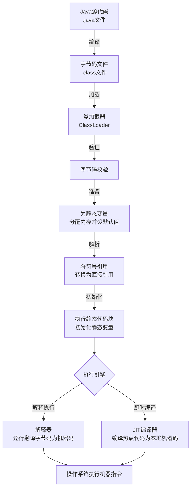
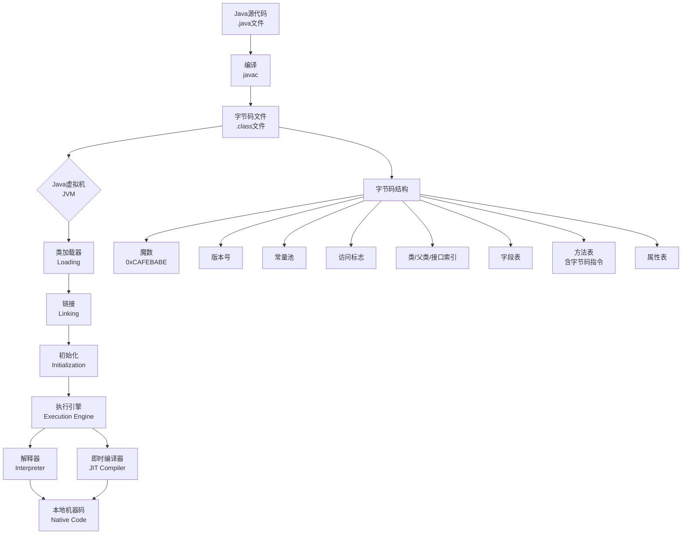

### 一、Java 语言基础

###### 1. Java 语言有哪些特点⁠⁠​？
   Java 语言是一种被广泛使用的面向对象编程语言，具有以下核心特点：
- ==**面向对象**：Java 支持封装、继承、多态等面向对象特性，鼓励以对象为中心设计程序，提高代码的可维护性和复用性。==
- ==**平台无关性与跨平台性**：Java 程序通过编译生成字节码（.class 文件），由 Java 虚拟机（JVM）在不同平台上解释执行，实现"一次编写，到处运行"。==
- ==**健壮性**：Java 提供强类型检查、异常处理机制和自动内存管理（垃圾回收），有效减少程序崩溃和内存泄漏问题。==
- ==**安全性**：Java 内置安全机制，如沙箱（Sandbox）模型、字节码验证器和访问控制，防止恶意代码攻击。==
- ==**多线程支持**：Java 在语言级别支持多线程编程，允许程序同时执行多个任务，提高并发性能和资源利用率。==
- **简单易学**：Java 语法类似于 C++，但摒弃了 C++ 中复杂的特性（如指针、运算符重载、多重继承），并提供了自动垃圾回收机制，降低了学习门槛和编程复杂度。
- **分布式支持**：Java 提供网络编程类库（如 java.net 包），便于开发分布式应用和 Web 服务。
- **高性能**：通过即时编译器（JIT）将热点代码编译为本地机器码，性能接近 C++，同时垃圾回收机制优化了内存使用。
- **动态性**：支持运行时加载类、反射机制等，使程序能适应变化的环境
###### 2. 说说你对 JDK、JRE、JVM 的理解⁠⁠​？
JDK、JRE 和 JVM 是 Java 技术的核心组件，关系紧密但职责不同：
- **JVM（Java Virtual Machine，Java 虚拟机）**：是虚拟的计算机，负责将 Java 字节码（.class 文件）解释或编译为特定平台的机器指令执行。JVM 是 Java 跨平台的基础，不同平台有对应的 JVM 实现。
- **JRE（Java Runtime Environment，Java 运行环境）**：是运行 Java 程序所需的环境，包含 JVM 和 Java 核心类库（如 java.lang、java.util）。用户只需安装 JRE 即可运行已编译的 Java 程序，但无法进行开发。
- **JDK（Java Development Kit，Java 开发工具包）**：是开发者使用的工具集，包含 JRE 以及开发工具（如编译器 javac、调试器 jdb、打包工具 jar）。JDK 用于编写、编译和调试 Java 代码。
- **三者的关系**：JDK ⊃ JRE ⊃ JVM。即 JDK 包含 JRE，JRE 包含 JVM。开发 Java 程序需要 JDK，而运行程序只需 JRE
###### 3. Java 是如何实现跨平台的?⁠​
Java 通过 **Java 虚拟机（JVM）** 和 **字节码机制** 实现跨平台，具体过程如下：
- **编译阶段**：Java 源代码（.java）被编译器（javac）编译成与平台无关的字节码（.class 文件），而不是直接生成机器码。字节码是一种中间格式，不依赖任何特定操作系统或硬件。
- **运行阶段**：不同平台（如 Windows、Linux、macOS）安装对应的 JVM。JVM 将字节码加载到内存，通过解释器或即时编译器（JIT）将其转换为当前平台的本地机器指令并执行。由于字节码是标准化的，而各平台 JVM 负责适配本地环境，因此同一份字节码可在不同平台上运行，实现"一次编写，到处运行"。
- **关键点**：JVM 屏蔽了底层平台的差异，使开发者无需关注操作系统细节。但 JVM 本身不跨平台，每个平台需安装专属 JVM 实现
###### 4. 简单说说你写的 java 程序是如何执行的?⁠​
一个Java程序从源代码到最终执行，主要经历编译和运行两大阶段。



①编译阶段：从 `.java`到 `.class`
用 `javac`命令编译 `.java`源文件时，会经历词法分析、语法分析（生成抽象语法树）、语义分析等步骤，最终生成平台无关的 `.class`字节码文件。字节码是JVM的机器语言。
②运行阶段：
1. **类加载（Loading & Linking）**
    JVM的类加载器（ClassLoader）会去寻找并加载所需的 `.class`文件。加载后，会进行**链接（Linking）**，包括：
    - **验证**：确保字节码是安全合法的。
    - **准备**：为类变量（静态变量）分配内存并设置默认初始值（如int为0）。
    - **解析**：将常量池中的符号引用转换为直接引用。
    - **初始化**：执行类中的静态变量赋值语句和静态代码块。
2. **执行引擎（Execution Engine）如何工作**
    加载和初始化完成后，JVM的**执行引擎**负责执行字节码。
    - **解释执行**：执行引擎中的解释器（Interpreter）会逐行读取字节码，并快速地将其翻译成本地机器码并执行。优点是启动快，立即执行；缺点是逐行解释效率相对较低。
    - **即时编译（JIT Compilation）**：为了提升性能，JVM会监控代码的执行频率。对于那些被频繁调用的“**热点代码**”（如循环、常用方法），**JIT（Just-In-Time）编译器**会将其整个方法或代码块编译成本地机器码。这样，下次再执行这段代码时，就可以直接运行高效的本地机器码，无需再次解释，大大提高了长期运行的性能。这是一种在程序运行时进行的编译。
3. **内存管理（自动垃圾回收）**
    程序运行中创建的对象都存放在堆（Heap）内存中。JVM内置了**垃圾回收器（GC， Garbage Collector）**，它会自动回收不再使用的对象所占用的内存，从而避免了像C/C++那样需要手动管理内存可能带来的内存泄漏问题。
###### 5. 标识符的命名规则⁠?⁠​
标识符是用来为 Java 中的变量、方法、类、包等元素命名的符号。
**硬性规则（必须遵守，否则编译错误）**：
1. **组成字符**：可以由字母（A-Z, a-z）、数字（0-9）、下划线（_ ）和美元符号（$）组成。
2. **首字符**：**不能以数字开头**。
3. **区分大小写**：`myVar`和 `myvar`是两个不同的标识符。
4. **不能是关键字或保留字**：如 `class`, `public`, `static`, `void`等不能作为标识符。
5. **长度无限制**。
**特别注意**：虽然 Java 使用 Unicode 字符集，理论上可以使用中文等字符作为标识符，但**强烈不建议这样做**，会降低代码的可维护性和专业性。
###### 6. Java中的main方法为什么要声明为public static void?⁠
Java 中的 `main`方法声明为 `public static void`是由 Java 虚拟机（JVM）的调用机制决定的。
- **`public`**：`main`方法是程序的入口，JVM 需要从类的外部调用这个方法。`public`访问修饰符确保了 JVM 在任何情况下都能无障碍地访问到这个方法。
- **`static`**：JVM 在启动时，还没有创建包含 `main`方法的类的任何对象实例。`static`关键字表示该方法是**属于类本身**的，而不是属于某个对象。因此，JVM 可以直接通过类名来调用 `main`方法，而无需先实例化对象，这简化了程序的启动过程。
- **`void`**：`main`方法作为程序的起点，它执行完毕后，不需要向 JVM 返回一个结果。`void`关键字表明该方法**没有返回值**。任何返回值对 JVM 来说都没有意义。
**总结**：这个特定的方法签名是一个约定俗成的规范，确保了 JVM 能够**简单、直接地找到并执行**程序的入口点。
###### 7. 什么是字节码？字节码的好处是什么？
字节码是Java实现“一次编写，到处运行”（Write Once, Run Anywhere）理念的核心。



简单来说，字节码（Bytecode）**是一种由Java编译器（`javac`）生成的、与特定机器指令集无关的中间代码，保存在 `.class`文件中。它本质上是 JVM 的机器语言指令集**。
- **平台无关的中间表示**：字节码不是直接面向任何特定的物理CPU（如x86或ARM），而是面向JVM这个抽象层。这使得它独立于底层硬件和操作系统。
- **二进制格式与紧凑结构**：字节码采用二进制格式存储，比源代码更紧凑。一个 `.class`文件具有严格的结构，包含魔数（`0xCAFEBABE`）、版本号、常量池、访问标志、字段表、方法表（内含字节码指令）等组成部分。
- **基于栈的计算模型**：JVM采用栈架构来执行字节码，大多数指令通过操作数栈进行数据处理，而非直接依赖于寄存器。
采用字节码为Java生态系统带来了多方面的重要好处。

| 优势             | 核心说明                                                | 价值体现                             |
| -------------- | --------------------------------------------------- | -------------------------------- |
| **跨平台性**       | 一次编译，到处运行。字节码由JVM解释或编译执行，JVM屏蔽了不同平台的差异。             | 显著降低了程序部署和分发的复杂性，是Java成功的基石。     |
| **安全性**        | JVM在执行字节码前会进行严格的验证，防止有害操作，同时Java字节码无法直接操作内存。        | 为网络环境下的代码执行提供了安全沙箱。              |
| **高性能（JIT优化）** | JVM会监控代码执行频率，通过即时编译器将热点字节码编译成本地机器码并缓存，大幅提升性能。       | 使Java应用在长期运行的服务端场景中能获得接近本地代码的效率。 |
| **动态性与灵活性**    | 支持运行时动态加载和修改字节码，反射机制也依赖于字节码的运行时信息。                  | 是实现热部署、AOP、动态代理等重要特性的基础。         |
| **强大的生态与工具支持** | 字节码是许多开发工具（如反编译、调试、性能分析工具）和框架（如Spring AOP）直接操作的对象。  | 方便开发者分析、调试、优化和增强程序行为。            |
| **跨语言支持**      | JVM成为了一个通用的运行时平台，其他语言如Kotlin、Scala等也可编译成字节码在JVM上运行。 | 丰富了JVM生态。                        |

如何查看与分析字节码，可以使用JDK自带的 `javap`工具来查看字节码。
1. **编译Java源文件**：首先使用 `javac YourClass.java`生成 `.class`文件。
2. **反编译查看字节码**：使用 `javap -c YourClass`可以输出易于阅读的字节码指令序列。添加 `-verbose`参数（`javap -c -verbose YourClass`）能获得更详细的信息，包括常量池、方法描述符等。

了解字节码的实用场景
- **代码优化**：通过分析关键代码路径的字节码，可以发现潜在的性能瓶颈，例如不必要的自动装箱、创建多余临时对象等。
- **问题排查**：当遇到一些底层机制相关的问题（如序列化、反射、同步等问题）时，查看字节码可能有助于理解深层原因。
- **字节码增强技术**：许多高级框架（如Spring的AOP功能）在运行时通过ASM、Byte Buddy等库动态修改或生成字节码，实现强大功能。
### 二、面向对象

###### 1. 面向对象和面向过程的区别?
| 特性         | 面向对象编程 (OOP)                                      | 面向过程编程 (POP)                                 |
| ---------- | ------------------------------------------------- | -------------------------------------------- |
| **编程思想**​  | 以**对象**为中心，对象是数据和行为的封装体。分析问题由哪些实体参与，这些实体有哪些属性和方法。 | 以**过程/步骤**为中心。将问题分解成一系列步骤，然后用函数实现这些步骤，按顺序调用。 |
| **数据与功能**​ | **封装**在一起，数据和对数据的操作绑定在对象中。                        | **相分离**，数据通常作为全局变量或参数传递给函数。                  |
| **程序结构**​  | 使用**类**和**对象**组织代码，更易于模拟现实世界，适合复杂、需协作的系统。         | 使用**函数**作为组织代码的基本单元。                         |
| **抽象级别**​  | 抽象级别更高，通过类和对象隐藏实现细节。                              | 抽象级别较低，更直接地操作数据和逻辑。                          |
| **核心特性**​  | 封装、继承、多态。                                         | 不支持继承和多态。                                    |
| **优势**​    | 代码**易维护、易复用、易扩展**，更适合应对复杂和变化的系统需求。                | **性能**通常更优，流程控制直接，适合性能敏感的场景（如嵌入式系统）或简单任务。    |
| **典型语言**​  | Java, C++, Pytho。                                 | C, Fortran。                                  |
###### 2. 说说面向对象编程三大特性⁠?
面向对象编程的三大基本特性是封装、继承和多态。
1. **封装（Encapsulation）**
    封装是将对象的**数据（属性）和行为（方法）捆绑在一起成为一个独立的单位（即类），并隐藏对象的内部实现细节**。通常，对象的属性会被设置为私有（private），只通过公共（public）的方法提供给外部访问和操作。这样做的好处是控制了外部代码对对象内部状态的随意修改，提高了代码的安全性和可维护性。
2. **继承（Inheritance）**
    继承是一种机制，它允许创建一个新类（子类或派生类）来**继承**另一个现有类（父类或基类）的**属性和方法**。这样可以实现代码的复用，并且子类可以在继承的基础上进行扩展，添加新的属性和方法，或修改父类的方法（重写）。继承清晰地描述了类与类之间“是（is-a）”的关系。
3. **多态（Polymorphism）**
    多态是指**同一个行为具有多个不同表现形式**的能力。在OOP中，它通常表现为：父类的引用变量可以指向子类的对象，且通过这个父类引用调用方法时，实际执行的是子类重写的方法。多态增强了程序的灵活性和可扩展性。
###### 3. 什么是多态机制？
多态机制是面向对象编程的核心特性之一，它允许**同一操作作用于不同的对象，可以产生不同的执行结果**。简单来说，就是“用一个接口，实现多种功能”。
多态的存在主要依赖于以下两点：
- **继承关系**：存在继承关系的类层次结构。
- **方法重写**：子类对父类的方法进行重新定义。
在程序运行时，JVM会根据实际对象的类型来动态决定调用哪个方法，这种行为称为**动态绑定**或**晚期绑定**。多态的最大意义在于，它允许程序在编写时面向父类（或接口）等通用类型编程，而在运行时却可以执行子类的具体实现，从而提高了代码的通用性和可扩展性。例如，一个“动物”父类有“叫”的方法，其子类“狗”和“猫”都重写了“叫”的方法。当使用“动物”引用指向一个“狗”对象并调用“叫”的方法时，实际执行的是狗的叫声，这便是多态的体现。
###### 4. 说说重载和重写的区别⁠?
重载（Overload）和重写（Override）都是实现多态的方式，但二者有本质区别。

| 特性        | 方法重载 (Overload)                    | 方法重写 (Override)                           |
| --------- | ---------------------------------- | ----------------------------------------- |
| **发生范围**​ | 发生在**同一个类内部**。                     | 发生在**具有继承关系的父类和子类之间**。                    |
| **方法名**​  | **必须相同**。                          | **必须相同**。                                 |
| **参数列表**​ | **必须不同**（参数类型、个数或顺序不同）。            | **必须完全相同**。                               |
| **返回类型**​ | **可以修改**，不能仅以返回类型不同作为重载的标准。        | 返回类型需要**相同或是父类方法返回类型的子类**。                |
| **访问权限**​ | **可以修改**，可以改变方法的访问修饰符。             | 子类方法的访问权限**不能比父类方法更严格**（即要大于等于父类权限）。      |
| **异常抛出**​ | **可以修改**，可以声明新的或更广的检查异常。           | 子类方法抛出的异常类型**不能比父类方法声明的更宽泛**（即要小于等于父类异常）。 |
| **本质**​   | 一个类中**同名不同参**的方法，是**编译时多态**（静态多态）。 | 子类对父类方法的**重新实现**，是**运行时多态**（动态多态）。        |
###### 5. 重载的方法能否根据返回类型进行区分?⁠
**不能。重载的方法**不能仅根据返回类型的不同来区分。
因为编译器在决定调用哪个重载方法时，是**根据方法调用的实参列表来匹配的**，与方法的返回类型无关。如果在同一个类中定义了两个方法名相同、参数列表也完全相同，仅返回类型不同的方法，编译器将无法区分，会导致编译错误。
例如，以下代码是错误的：
```java
public class Example {
    public int calculate(int a, int b) { ... }
    public double calculate(int a, int b) { ... } // 编译错误：已存在 calculate(int, int) 的方法
}
```
###### 6. 简单说说 Java 中接口和抽象类的区别?
| 特性         | 接口 (Interface)                                                                                | 抽象类 (Abstract Class)                                 |
| ---------- | --------------------------------------------------------------------------------------------- | ---------------------------------------------------- |
| **定义关键字**​ | `interface`                                                                                   | `abstract class`                                     |
| **方法实现**​  | 在 Java 8 之前，所有方法都是**抽象方法**（隐式 `public abstract`），不能有具体实现。Java 8 后允许有 `default`和 `static`方法实现。 | 可以包含**抽象方法**（无方法体）和**具体实现的方法**。                      |
| **成员变量**​  | 变量默认为 `public static final`（常量）。                                                              | 变量可以是各种访问权限的普通成员变量。                                  |
| **构造方法**​  | **没有**构造方法。                                                                                   | **有**构造方法（虽然不能实例化，但可用于子类初始化）。                        |
| **继承方式**​  | 一个类可以**实现多个接口**（`implements Interface1, Interface2`）。                                         | 一个类只能**继承一个抽象类**（`extends AbstractClass`），Java 是单继承。 |
| **设计目的**​  | 定义一套**行为规范**，强调“能做什么”的契约。核心是 **"has-a"**​ （具有某种能力）的关系。                                        | 表示一种 **"is-a"**​ （是一种）的层次关系，用于代码复用和模板设计。             |
###### 7. 抽象类能使用 final 修饰吗？⁠
**不能。不能**被 `final`修饰。
因为 `abstract`和 `final`关键字的设计目的本质上是**冲突**的：
- `abstract`修饰的类**必须被继承**才能使用，它的价值需要子类来实现其抽象方法并创建实例来体现。
- `final`修饰的类表示**不可被继承**，是最终形态。
如果一个类被同时声明为 `abstract final`，则意味着它既需要被子类继承，又不允许被子类继承，这会产生矛盾，所以 Java 语法不允许这样做。
###### 8. 抽象的（abstract）方法是否可同时是静态的?⁠
**不能。 `abstract`方法和 `static`方法不能同时修饰一个方法。
原因如下：
- `abstract`方法是一个**没有方法体的抽象方法**，它**必须被子类重写**才能使用。它的调用是与具体的对象实例动态绑定在一起的（多态）。
- `static`方法（静态方法）是**属于类本身**的，它可以通过类名直接调用，**不需要创建对象实例**。静态方法也不能被重写（Override），只可以被隐藏。
由于 `abstract`方法要求被子类实现，而 `static`方法与具体实例无关，二者在语义上是矛盾的。因此，Java 不允许定义一个抽象静态方法。
###### 9. 什么是封装？如何实现封装？
封装是面向对象编程的核心理念之一，它有两个基本含义：
- **将数据（属性）和操作数据的行为（方法）捆绑在一起**，形成一个独立的单元（即类）。
- **隐藏对象的内部实现细节**，仅对外提供有限的、可控的访问方式。
实现封装通常通过以下步骤：
- **使用访问修饰符**：将类的成员变量（属性）声明为 **`private`**。这样，这些属性就不能被该类以外的代码直接访问，实现了信息的隐藏。
- **提供公共的访问方法**：为需要被外部访问或修改的私有属性，提供公共的（`public`）getter（获取值）和 setter（设置值）方法。在这些方法中，可以加入逻辑控制，对数据的有效性进行验证，确保对象的状态始终是安全有效的。
例如，一个 `BankAccount`类的封装实现：
```java
public class BankAccount {
    // 1. 将关键数据私有化
    private double balance;

    // 2. 通过构造方法初始化，也可控制逻辑
    public BankAccount(double initialBalance) {
        if (initialBalance >= 0) {
            this.balance = initialBalance;
        } else {
            this.balance = 0;
        }
    }

    // 3. 提供公共的方法来访问和修改数据，并加入控制逻辑
    public void deposit(double amount) { // 存款
        if (amount > 0) {
            balance += amount;
        }
    }

    public boolean withdraw(double amount) { // 取款，加入业务逻辑
        if (amount > 0 && amount <= balance) {
            balance -= amount;
            return true;
        }
        return false;
    }

    public double getBalance() { // 获取余额，只提供读权限
        return balance;
    }
    // 不提供 setBalance 方法，防止余额被随意修改
}
```
封装的好处在于提高了代码的**安全性**和**可维护性**。内部实现的改变只要不影响到公共方法的签名，就不会影响外部调用者。
###### 10. 接口和抽象类各自的使用场景是什么？
选择使用接口还是抽象类，取决于具体的设计需求：
**优先考虑使用接口的场景：**
- **定义行为契约**：当需要定义一组不相关的类**都应该遵循的某种行为规范**时。例如，`Flyable`（可飞行的）、`Serializable`（可序列化的），这些能力与类的本身层次关系不大。
- **需要多重继承**：由于 Java 的单继承限制，当一个类需要具备多种不同能力时，通过实现多个接口来扩展功能是最佳选择。
- **作为架构的骨架**：在框架设计中，接口常用于定义模块之间的通信契约，降低耦合，提高系统的灵活性和可扩展性。
**优先考虑使用抽象类的场景：**
- **代码复用和模板设计**：当多个相关的类**共享一些通用的状态或行为**时，可以将这些共性的内容放在抽象类中实现，让子类继承，避免代码重复。抽象类可以提供一些部分实现的方法，作为模板。
- **定义紧密的类层次结构**：当要描述的是一种严格的 **"is-a"**​ （是一种）关系，并且这些类有很强的内在联系时。例如，`Animal`作为抽象类，其子类 `Dog`, `Cat`都是动物。
简单来说，**接口关注于功能，抽象类关注于共性**。在现代设计中，有一种“面向接口编程”的趋势，即优先使用接口来定义类型，以获得最大的灵活性，然后用抽象类或具体类去实现它，结合二者的优点。
### 三、数据类型与变量

###### 1. 说说八种基本数据类型的大小，以及他们的封装类⁠？⁠​
Java 的八种基本数据类型及其封装类如下：

|**基本数据类型**|**大小（字节）**|**封装类**|**取值范围/说明**|
|---|---|---|---|
|`byte`|1|`Byte`|-128 ~ 127|
|`short`|2|`Short`|-32768 ~ 32767|
|`int`|4|`Integer`|-2^31 ~ 2^31-1|
|`long`|8|`Long`|-2^63 ~ 2^63-1|
|`float`|4|`Float`|单精度浮点数|
|`double`|8|`Double`|双精度浮点数|
|`char`|2|`Character`|Unicode字符，0~65535|
|`boolean`|未严格定义（通常1位）|`Boolean`|true/false|

###### 2. char 型变量中能不能存贮一个中文汉字? 为什么?⁠⁠​
**可以**。原因在于：
- Java 的 `char`类型采用 **Unicode 编码**，占 **2 字节（16 位）**，可表示的范围是 0~65535（即 Unicode 字符集）。
- 中文汉字属于 Unicode 字符集的一部分（如常用汉字在 CJK 统一编码区间），每个汉字对应一个 Unicode 码点，因此可以被 `char`变量存储。
例如：

```java
char ch = '中';// 合法，存储汉字'中'
```

但需注意：某些生僻字或表情符号可能超出 Basic Multilingual Plane（BMP），需使用两个 `char`（即 `String`）表示。
###### 3. Java 中包装类型和基本类型的区别是什么⁠​？
Java 中的基本类型（Primitive Types）和包装类型（Wrapper Classes）在设计目的和特性上有显著区别，主要体现在以下几个方面：

| **特性**     | **基本类型**                            | **包装类型**                                                    |
| ---------- | ----------------------------------- | ----------------------------------------------------------- |
| **本质**     | 是 Java 预定义的简单数据类型，不是对象              | 是对基本类型的封装，是真正的类                                             |
| **声明与初始化** | 直接使用（如 `int num = 10;`），无需 `new`    | 通常需要使用 `new`关键字（如 `Integer num = new Integer(10);`），但支持自动装箱 |
| **存储方式**   | 变量直接存储**数据值**，通常在栈内存中               | 变量存储的是对象的**引用（地址）**，对象本身存储在堆内存中                             |
| **默认值**    | 有默认值（如 `int`为 0，`boolean`为 `false`） | 默认值为 `null`                                                 |
| **可空性**    | **不能**为 `null`                      | **可以**为 `null`                                              |
| **功能方法**   | 没有方法，只是一个数据值                        | 提供了丰富的实用方法（如 `Integer.parseInt()`、`Integer.valueOf()`）      |
| **泛型支持**   | **不能**用于泛型（如 `List<int>`是错误的）       | **可以**用于泛型（如 `List<Integer>`是正确的）                           |
| **性能**     | 更高效，因为直接在栈上分配，开销小                   | 相对较低，因为需要在堆上创建和回收对象，有额外开销                                   |
| **适用场景**   | 适用于大量计算、性能要求高的场景                    | 适用于集合框架、需要对象特性的场景（如可空性、作为方法参数传递对象）                          |

###### 4. 说说 Java 自动装箱与拆箱⁠⁠​？
自动装箱（Auto-boxing）和自动拆箱（Auto-unboxing）是 Java 5 引入的语法糖，用于简化基本类型和对应包装类型之间的转换
- **自动装箱**：指基本数据类型**自动转换**为对应的包装类对象。
``` java
// 手动装箱 (Java 5 之前)
Integer num1 = Integer.valueOf(100);
// 自动装箱 (Java 5 之后)
Integer num2 = 100;// 编译器自动转换为 Integer.valueOf(100)
```
- **自动拆箱**：指包装类对象**自动转换**为对应的基本数据类型。
```java
// 手动拆箱
int value1 = num1.intValue();
// 自动拆箱
int value2 = num2;// 编译器自动转换为 num2.intValue()
```
**实现原理**：这本质上是编译器在编译期帮我们完成的代码转换。自装箱时调用的是包装类的 `valueOf()`方法，自动拆箱时调用的是对应的 `xxxValue()`方法（如 `intValue()`。
**主要应用场景**：
- **集合框架（Collection）**：集合（如 `ArrayList`）只能存储对象，当我们添加基本类型时会发生自动装箱。
``` java
List<Integer> list = new ArrayList<>();
list.add(10);// 自动装箱：int -> Integerint 
first = list.get(0);// 自动拆箱：Integer -> int
```
- **泛型（Generics）**：泛型类型参数必须是引用类型。
- **方法参数和返回值传递**。
**注意事项**：
- **空指针异常（NullPointerException）**：如果一个包装类对象为 `null`，对其进行自动拆箱操作会抛出异常。
``` java
Integer nullInteger = null;
int num = nullInteger;// 运行时抛出 NullPointerException
```
- **性能开销**：在循环或大量数据操作中，频繁的装箱和拆箱会创建大量临时对象，增加垃圾回收（GC）压力，影响性能。在性能敏感的场景应谨慎使用 。
- **比较陷阱**：使用 `==`比较包装对象时，需要注意缓存范围。
###### 5. Integer a= 127 与 Integer b = 127 相等吗？⁠​
**相等（使用 `==`比较结果为 `true`）。**
**原因是 Integer 类的缓存机制（Integer Cache）**。默认情况下，Integer 类会缓存 **-128 到 127**之间的所有整数对象。
当通过自动装箱（即直接赋值）或调用 Integer.valueOf(int i) 方法创建 Integer 对象时，如果数值在这个范围内，就会直接返回缓存池中已存在的同一个对象的引用。
```java
Integer a = 127;// 相当于 Integer.valueOf(127)
Integer b = 127;// 相当于 Integer.valueOf(127)
System.out.println(a == b);// true，因为 a 和 b 指向缓存中的同一个对象
```
**但是，如果数值超出缓存范围，结果就不同了**：
```java
Integer c = 128;
Integer d = 128;
System.out.println(c == d);// false，因为 128 超出了默认缓存范围，会创建新的 Integer 对象
```
**要点**：
- 这种缓存机制是一种性能优化，避免频繁创建和销毁小整数对象。
- ==使用 `new Integer(int)`构造器会强制创建新对象，不会使用缓存==。
- 其他包装类也有类似的缓存机制，如 `Byte`缓存所有值（范围是-128 到 127），`Short`、`Long`缓存 -128 到 127，`Character`缓存 0 到 127，`Boolean`缓存 `TRUE`和 `FALSE`。
- 可以使用 `XX:AutoBoxCacheMax=<size>`JVM 参数来调整 Integer 缓存的上限 。
###### 6. 成员变量与局部变量有什么区别？⁠​
| **特性**    | **成员变量**                                                 | **局部变量**                         |
| --------- | -------------------------------------------------------- | -------------------------------- |
| **声明位置**  | 类内部，方法体外。                                                | 方法体、构造方法或代码块内部。                  |
| **生命周期**  | 伴随对象的存在而存在。实例变量随对象创建而诞生，随对象被回收而消亡；静态变量随类的加载而诞生，随类的卸载而消亡。 | 伴随方法的调用而存在，方法调用结束，栈帧弹出，局部变量随之销毁。 |
| **存储位置**  | 实例变量存储在堆内存的对象实体中；静态变量存储在方法区。                             | 存储在栈内存的方法栈帧中。                    |
| **默认值**   | **有默认值**。如数值类型为0，布尔型为false，引用类型为null。                    | **没有默认值**，必须先显式初始化后才能使用，否则编译报错。  |
| **访问修饰符** | 可以使用 `public`, `protected`, `private`, `static`等修饰。      | 不能使用访问修饰符，但可以被 `final`修饰。        |
| **作用域**   | 在整个类内部基本都可以直接访问（静态变量可通过类名访问）。                            | 仅限于定义它的方法、构造方法或代码块内部，出了这个范围即失效。  |
###### 7. 静态变量和实例变量区别?⁠⁠​
静态变量和实例变量是成员变量的两种类型。

|**特性**|**静态变量（类变量）**|**实例变量**|
|---|---|---|
|**归属**|属于**类**，所有对象共享同一份数据。|属于**对象实例**，每个对象都有自己独立的一份副本。|
|**内存分配**|在类加载的初始化阶段分配内存于方法区，仅分配一次。|在每次创建对象实例时，在堆内存中随对象一起分配内存。|
|**调用方式**|既可以通过**类名**直接访问，也可以通过对象引用访问（但不推荐）。|只能通过**对象引用**来访问。|
|**生命周期**|最长，随类的加载而存在，随类的卸载而消亡。|随对象的创建而存在，随对象的垃圾回收而消亡。|
###### 8. 静态变量与普通变量（局部变量）区别?⁠⁠​
|**方面**|**静态变量**|**局部变量**|
|---|---|---|
|**声明位置与作用域**|类内方法外，类级别作用域。|方法或代码块内，块级别作用域。|
|**内存与生命周期**|方法区，生命周期与类相同。|栈内存，生命周期与方法调用相同。|
|**初始化与访问**|有默认值，可通过类名或对象访问。|必须显式初始化，只能在作用域内访问。|
|**修饰符**|可用 `public`, `static`等。|仅可用 `final`。|
###### 9. 3 * 0.1 == 0.3 将会返回什么? true 还是 false?⁠⁠​
这个表达式将返回 **`false`**。
**原因**：这是由**浮点数在计算机中的表示方式**决定的。Java 中的 `float`和 `double`类型遵循 IEEE 754 标准，该标准使用二进制小数来近似表示十进制小数。有些十进制小数（如 `0.1`）无法用二进制小数精确表示。
- 在计算 `3 * 0.1`时，实际结果是一个非常接近但不完全等于 `0.3`的值（例如 `0.30000000000000004`）。
- 当使用 `==`运算符直接比较时，是在比较两个值的精确二进制表示，由于微小的误差，比较结果自然为 `false`。
**正确处理方式**：比较浮点数时，不应使用 `==`，而应检查两数之差的绝对值是否在一个极小的误差范围（epsilon）内。
```java
double result = 3 * 0.1;
double epsilon = 1e-10;// 定义一个极小的误差阈值
boolean isEqual = Math.abs(result - 0.3) < epsilon;// 返回 true
```
对于需要精确计算的场景（如金融），应使用 `BigDecimal`类。
###### 10. 什么是类型转换？自动类型转换和强制类型转换的区别？
类型转换是Java中将一个数据类型的值转换为另一种数据类型的过程。这对于处理不同数据类型之间的赋值、运算和方法调用至关重要。

|特性|自动类型转换 (隐式转换)|强制类型转换 (显式转换)|
|---|---|---|
|**转换方向**|小范围类型 → 大范围类型 (`byte`-> `int`等)|大范围类型 → 小范围类型 (`double`-> `int`等)|
|**语法要求**|自动完成，无需特殊语法|必须显式使用 `(目标类型)`进行转换|
|**数据风险**|安全，通常不会丢失信息|**可能丢失精度**（如小数部分）或**溢出**（超出目标类型范围）|
|**典型场景**|将`int`常量赋值给`long`变量|将`double`转换为`int`（取整）|
|**转换原则**|由编译器自动完成，保证安全性|开发者显式干预，**“后果自负”**|
**自动类型转换（隐式转换）**
自动类型转换就像是将一小杯水倒入一个大桶中，因为目标容器的容量足够大，所以这个过程是安全且自动完成的。
- **发生时机**：当将**数据范围较小**的类型（如 `byte`、`short`）赋值给**数据范围较大**的类型（如 `int`、`long`、`double`）时，编译器会自动进行转换。基本数据类型的转换方向通常遵循：`byte`-> `short`-> `int`-> `long`-> `float`-> `double`，以及 `char`-> `int`。
- **安全性**：这种转换是**安全**的，因为更大范围的类型足以容纳小范围类型的所有信息，通常不会导致数据丢失。
**强制类型转换（显式转换）**
强制类型转换则像是试图将一大桶水强行倒入一个小杯子，你必须明确下指令，并且必须承担可能溢出或洒掉（数据丢失）的风险。
- **发生时机与语法**：当需要将**数据范围较大**的类型赋值给**数据范围较小**的类型时，必须使用强制类型转换。语法是在需要转换的值或变量前加上`(目标类型)`，例如 `int i = (int) 10.5;`。
- **风险与后果**：这是**不安全**的转换，可能导致：
    - **精度丢失**：最常见的是浮点数转换为整数，小数部分会**直接舍弃**，而不是四舍五入。例如，`(int) 10.9`的结果是 `10`。
    - **数据溢出**：如果值超出了目标类型的表示范围，结果将不可预测。例如，将 `128`强制转换为 `byte`（范围-128~127）会得到错误的值 `-128`。
*关键场景与最佳实践*
- **表达式中的自动提升**
	在表达式中，如果存在不同数据类型一起运算，Java会自动将所有操作数提升到表达式中范围最大的那个类型。特别需要注意的是，`byte`、`short`、`char`在参与运算时，会**先自动提升为 `int`类型**。这就是为什么 `byte a = 1; byte b = a + 1;`会编译报错，因为 `a + 1`的结果已经是 `int`类型，不能自动赋值给 `byte`。
- **谨慎使用强制转换**
	由于强制转换存在风险，使用时务必确保你清楚可能的数据丢失后果，并确保转换后的值在目标类型的合理范围内。
- **注意扩展赋值运算符**
    类似 `+=`、`*=`这样的运算符内部**隐含了强制类型转换**。例如 `short s = 1; s += 1;`能正确编译，因为它等价于 `s = (short) (s + 1);`。
- **不相容类型的转换**
    `boolean`类型与其他7种基本数据类型**互不兼容**，不能进行任何形式的类型转换。
###### 11. 为什么浮点数运算会有精度问题？
浮点数运算的精度问题确实常让人困惑。其根源在于，**有些十进制小数无法用二进制精确表示**，以及计算机使用**IEEE 754标准**这类格式，以有限内存来近似表示实数。
下面这个表格汇总了常见精度问题的场景和原因，帮你快速了解：

| 问题场景                 | 示例 (Java代码)                                | 实际输出/结果                | 核心原因                                               |
| -------------------- | ------------------------------------------ | ---------------------- | -------------------------------------------------- |
| **简单加法**             | `System.out.println(0.05 + 0.01);`         | `0.060000000000000005` | 0.05和0.1的二进制表示是无限循环小数，存在舍入误差<br><br>。              |
| **简单减法**             | `System.out.println(1.0 - 0.42);`          | `0.5800000000000001`   | 参与计算的数值在二进制下已存在误差<br><br>。                         |
| **乘法运算**             | `System.out.println(4.015 * 100);`         | `401.49999999999994`   | 二进制表示不精确与运算过程中的舍入误差共同导致<br><br>。                   |
| **循环累加**             | `for (int i=0; i<10; i++) { sum += 0.1; }` | `0.9999999999999999`   | 误差在多次运算中不断累积<br><br>。                              |
| **数值比较**             | `if (0.1 + 0.2 == 0.3)`                    | `false`                | 运算结果的实际二进制表示与0.3的二进制表示不同。                          |
| **构造BigDecimal(错误)** | `new BigDecimal(0.1)`                      | 内部值并非精确的0.1            | `BigDecimal(double)`构造器直接继承了double本身的精度误差<br><br>。 |
*深入理解精度根源*
浮点数精度问题的根源可以归结为以下几个方面：
1. **二进制表示的“先天不足”**
    计算机使用二进制存储数据。对于小数，我们通常采用"乘2取整"的方法将十进制小数转换为二进制，但**很多在十进制下有限的小数，在二进制中会是无限循环的**。
    例如，十进制的0.1在二进制中是一个无限循环小数：`0.0001100110011...`。由于计算机的存储空间有限（float有23位尾数，double有52位尾数），必须对无限小数进行**截断和舍入**，这就引入了最初的误差。这类似于在十进制中无法精确表示1/3（0.333...）一样。
2. **IEEE 754标准与内存表示**
    浮点数在计算机中遵循IEEE 754标准，其表示格式可概括为 `(-1)^s * M * 2^E`，包括符号位（s）、阶码（E）和尾数（M）三部分。以32位的float类型为例，其内存布局如下：
    - **符号位 (s)**: 占1位（第31位），0代表正数，1代表负数。
    - **指数位 (E)**: 占8位（第23-30位），采用**偏移码**（float的偏移量是127）表示，目的是为了表示负指数。
    - **尾数位 (M)**: 占23位（第0-22位），存储的是规格化后二进制小数**小数点后的部分**。因为规格化后总可以表示为1.xxx...的形式，所以最高位的1被隐含，不直接存储，这样实际上获得了24位有效数字的精度。这种基于有限精度和指数表示的模型，本质上是实数的一种**离散化近似**，决定了浮点数无法精确表示所有实数。
3. **误差的累积与放大**
    单个浮点数的表示误差可能很小，但在运算（尤其是连续运算如累加`sum += 0.1`）过程中，这些微小的误差会**不断累积和放大**，最终导致计算结果与理论值出现明显偏差。在科学计算、金融等领域，这种累积误差可能带来严重后果。
*应对精度问题的策略*
核心原则是：**在需要精确计算的场景（特别是商业计算、金融领域），避免直接使用float和double进行计算**。
4. **使用 `BigDecimal`进行精确计算**
    Java提供了`BigDecimal`类来表示和计算精确的小数。它通过一个**未缩放整数值（BigInteger）**和一个**缩放因子（scale）**来表示小数（例如，`BigDecimal`可表示为 `unscaledValue × 10^(-scale)`），从而避免二进制表示问题。
    - **关键点：使用String构造器**
        务必使用`BigDecimal(String val)`构造器，而不是`BigDecimal(double val)`。因为使用double构造器时，不精确的二进制表示已经被带入，无法得到精确值。正确做法是：			
        `// 错误做法：精度已污染`
        `BigDecimal bad = new BigDecimal(0.1);`
        `// 正确做法：精确表示`
        `BigDecimal good = new BigDecimal("0.1");`
    - **比较值：使用 `compareTo()`**
        比较两个`BigDecimal`数值是否相等时，应使用`compareTo()`方法而非`equals()`方法。因为`equals()`还会比较缩放比例（scale），而`compareTo()`仅比较数值本身。
    - **除法运算：指定精度和舍入模式**
        进行除法运算时，如果结果是无限小数，必须指定精度（scale）和舍入模式（RoundingMode），否则会抛出`ArithmeticException`。
        BigDecimal a = new BigDecimal("10");
        BigDecimal b = new BigDecimal("3");
        // 正确：指定保留3位小数，采用四舍五入
        BigDecimal result = a.divide(b, 3, RoundingMode.HALF_UP);
5. **使用整数类型表示最小单位**
    在处理货币时，一个常见且高效的实践是使用**整数类型（如long）来表示金额的最小单位**（例如，用“分”而不是“元”）。这样可以完全避免小数运算。`long priceInCents = 199; // 表示1.99元`
6. **利用工具类简化 `BigDecimal`操作**
    为了方便使用，可以封装一个类似`ArithUtil`的工具类，将基本的四则运算封装起来，内部使用`BigDecimal`并处理字符串转换和精度控制。
### 四、关键字与运算符

###### 1. final 有哪些用法?⁠⁠​
`final`关键字在 Java 中用途广泛，用于表示“不可改变”，可以修饰变量、方法和类。
1. **final 变量（常量）**：
    - 修饰基本类型变量：值一旦初始化就不能再改变。
    - 修饰引用类型变量：引用地址不能改变，但其所指向对象内部的状态（属性值）是可以改变的。
    - 常与 `static`联用定义类常量，如 `public static final double PI = 3.14;`。
2. **final 方法**：
    - 被 `final`修饰的方法不能被子类**重写**。
    - 用于防止继承类改变方法的核心逻辑，或用于效率优化（早期版本，现在已不明显）。
3. **final 类**：
    - 被 `final`修饰的类不能被**继承**。
    - 用于表示这个类已经是“最终”形态，不需要或不允许被扩展，例如 Java 中的 `String`类。
###### 2. 说说 this 关键字的用法?⁠⁠​
`this`关键字在 Java 中是一个指向**当前对象实例**的引用。它的核心用途是帮助在类的内部明确地访问当前对象的成员（变量和方法），尤其在处理命名冲突或需要在多个构造方法之间进行调用时非常有用。
其主要用法可以归纳为以下四个方面：
1. **区分成员变量与局部变量**：当方法的参数名或局部变量名与类的成员变量名相同时，使用 `this.变量名`来明确指定要访问的是当前对象的成员变量，而不是局部变量。这避免了赋值无效或逻辑错误，是 `this`最常用的场景。
  ```java
   public class Person {
     private String name;
      public void setName(String name) {
      this.name = name;// 等号左边的this.name是成员变量，右边的name是方法参数
       }
    }
    ```
2. **在构造方法中调用其他构造方法**：在一个构造方法中，可以使用 `this()`或 `this(参数列表)`来调用同一个类中的其他构造方法。这种调用**必须位于构造方法的第一条语句**，目的是实现代码复用，避免在多个构造方法中编写重复的初始化逻辑。
```java
    public class Person {
       private String name;
       private int age;
    
    public Person() {
        this("未知", 0);// 调用带两个参数的构造器
      }
    
    public Person(String name, int age) {
       this.name = name;
        this.age = age;
	    }
    }
    ```
3. **将当前对象作为参数传递**：在需要将自身实例传递给其他方法或对象的场景下（例如事件监听、回调机制），可以使用 `this`来代表当前对象。
```java
    public class Button {
        public void click() {
            EventManager.register(this);// 将当前按钮对象注册到事件管理器
        }
    }
    ```
    
4. **实现链式调用（Method Chaining）**：通过在方法中返回当前对象（即 `return this;`），可以使多个方法调用连续进行，让代码更加简洁流畅。
```java
    public class Calculator {
        private int result;
        public Calculator add(int value) {
            this.result += value;
            return this;// 返回当前对象，支持链式调用
        }
        public Calculator multiply(int value) {
            this.result *= value;
            return this;
        }
    }
    // 使用方式：
    new Calculator().add(5).multiply(2).getResult();
```

**重要注意事项**：`this`关键字指向的是当前对象的实例，因此它**不能在静态方法（`static`方法）中使用**，因为静态方法属于类本身，不依赖于任何对象实例。
###### 3. 说说 super 关键字的用法?⁠​
`super`关键字在 Java 中是一个指向**当前对象的直接父类**的引用。
它主要用于在子类中访问和调用那些被子类覆盖或隐藏了的父类成员（变量、方法和构造方法）。
其主要用法有以下三种：
1. **调用父类的构造方法**：在子类的构造方法中，必须首先调用父类的构造方法以确保父类部分被正确初始化。这是通过 `super()`或 `super(参数列表)`实现的，并且**这条语句必须位于子类构造方法的第一行**。如果子类构造方法中没有显式写出，编译器会自动加上一个 `super()`调用父类的无参构造方法。
```java
    class Animal {
        public Animal(String type) {
            System.out.println("Animal constructor: " + type);
        }
    }
    class Dog extends Animal {
        public Dog(String name) {
            super("Dog");// 调用父类的有参构造方法，必须放在第一行
            System.out.println("Dog name: " + name);
        }
    }
```
2. **调用父类中被重写的方法**：当子类重写了父类的方法后，如果需要在子类方法中再次使用父类该方法的原始实现，可以使用 `super.方法名()`进行调用。
```java
    class Parent {
        public void display() {
            System.out.println("Parent's display method");
        }
    }
    class Child extends Parent {
        @Override
        public void display() {
            super.display();// 先调用父类的display方法
            System.out.println("Child's display method");
        }
    }
```
3. **访问父类中被隐藏的成员变量**：如果子类中声明的成员变量与父类中的成员变量同名，则父类的变量会被"隐藏"。此时，可以使用 `super.变量名`来访问父类中的那个变量。
``` java
	class Parent {
	    String name = "Parent";
	}
	class Child extends Parent {
	    String name = "Child";
	    void printNames() {
	        System.out.println(super.name);// 输出 "Parent"
	        System.out.println(this.name);// 输出 "Child"
	    }
	}
```
###### 4. this() & super()在构造方法中的区别？⁠​
`this()`和 `super()`都用于构造方法中，且都必须作为构造方法的第一条语句，但它们的目的是完全不同的。

| **特性**   | **`this()`**                   | **`super()`**                 |
| -------- | ------------------------------ | ----------------------------- |
| **调用对象** | 调用**当前类**的其他构造方法               | 调用**父类**的构造方法                 |
| **目的**   | 实现当前类内**构造方法的重用**，减少代码重复       | **初始化从父类继承来的部分**，确保父类被正确构造    |
| **语法要求** | 必须是构造方法中的**第一条语句**             | 必须是构造方法中的**第一条语句**            |
| **共存性**  | **不能**与 `super()`在同一个构造方法中同时出现 | **不能**与 `this()`在同一个构造方法中同时出现 |

**核心区别与选择**：
- 使用 `this()`是为了在本类的多个构造方法之间实现链式调用，目的是让代码更简洁。
- 使用 `super()`是为了显式地调用父类的特定构造方法，这是继承机制中保证对象初始化正确性的基石。
- 在一个构造方法中，你只能选择使用 `this()`或 `super()`其中之一，因为它们都必须占据第一行的位置。如果两者都不写，编译器会默认插入 `super()`。
###### 5. static 都有哪些用法?⁠⁠​
`static`关键字用于修饰类的成员（变量、方法、代码块以及内部类），表示这些成员属于**类本身**，而不是属于类的某个具体实例。因此，静态成员也被称为**类成员**。
1. **静态变量（类变量）**
    - 特点：在内存中只有一份拷贝，在类加载时被初始化。所有该类的实例共享同一份静态变量。
    - 访问方式：推荐通过**类名.变量名**直接访问（如 `Math.PI`），也可以通过对象实例访问（但不推荐）。
    - 与实例变量区别：实例变量是每个对象独有的，互不影响。
2. **静态方法（类方法）**
    - 特点：不依赖于任何对象实例，可以直接通过**类名.方法名()** 调用（如 `Arrays.sort()`）。
    - 限制：静态方法内部**不能直接访问**类的非静态成员（实例变量和实例方法），因为非静态成员需要先创建对象才能存在。静态方法内也不能使用 `this`和 `super`关键字。
    - 常见例子：`main`方法必须是静态的，因为程序启动时还没有创建任何对象。
3. **静态代码块**
    - 特点：用 `static { ... }`定义。在**类被加载到内存时执行一次**，且仅执行一次。执行顺序优先于实例代码块和构造方法。
    - 用途：用于对静态变量进行复杂的初始化，或执行只需进行一次的初始化操作（如加载驱动、建立连接）。
4. **静态内部类**
    - 特点：使用 `static`修饰的内部类。它不依赖于外部类的实例，可以独立创建。静态内部类不能直接访问外部类的非静态成员。
**核心理解**：`static`将成员提升到类级别，使其与实例解耦。静态成员的生命周期与类相同，从类加载开始，到类被卸载结束。
###### 6. &和&&的区别？⁠⁠​
`&`和 `&&`在 Java 中都表示逻辑"与"操作，但它们在行为上有根本性的不同，主要体现在**是否具有"短路"特性**上。

| **运算符**  | **名称**             | **短路特性**                                                          | **用途**                                    |
| -------- | ------------------ | ----------------------------------------------------------------- | ----------------------------------------- |
| **`&&`** | **短路与**            | **有**。如果**第一个操作数为 `false`**，则整个表达式结果必定为 `false`，**不会再去计算第二个操作数**。 | 仅用于**布尔值**的逻辑判断。                          |
| **`&`**  | **逻辑与**（当操作数为布尔值时） | **无**。无论第一个操作数是 `true`还是 `false`，**都会计算两个操作数**。                   | 1. 用于**布尔值**的逻辑判断。 2. 用于**整数**的**按位与**运算。 |

**核心区别与示例**：
- **短路特性是关键**：`&&`的效率通常更高，并且可以避免一些潜在的错误。例如，在检查一个对象不为 `null`后再调用其方法时，使用 `&&`是安全且高效的。
```java
    if (obj != null && obj.isValid()) {// 如果obj为null，&& 不会执行后面的方法，避免NullPointerException
	    // ...
    }
```
	如果使用 `&`，即使 `obj`为 `null`，它也会执行 `obj.isValid()`，从而抛出 `NullPointerException`。
- **`&`的额外功能**：`&`还可以作为按位运算符，对两个整数的二进制每一位进行"与"操作。
```java
    int a = 5;// 二进制 0101
    int b = 3;// 二进制 0011
    int c = a & b;// 结果 0001，即十进制 1
```
**总结**：在绝大多数需要进行逻辑"与"判断的场景下，都应优先使用 `&&`，以利用其短路特性保证效率和安全性。只有在需要确保两边操作数都被执行，或进行按位运算时，才使用 `&`。
###### 7. switch 是否能作用在 byte 上，是否能作用在 long 上，是否能作用在 String 上？⁠⁠​
`switch`语句的表达式的类型是有限制的。以下是具体规则：
- **能作用在 `byte`上**：**可以**。`switch`支持 `byte`类型，以及 `short`、`char`、`int`这些整数类型。
- **不能作用在 `long`上**：**不可以**。所有比 `int`大的整数类型，如 `long`，都不能作为 `switch`的表达式的类型。
- **能作用在 `String`上**：**可以（从 Java 7 开始）**。从 Java 7 开始，`switch`支持 `String`类型。
- **其他支持的类型**：还支持枚举（`enum`）类型和它们的包装类（如 `Integer`, `Character`）。
**底层原理**：对于 `String`类型的 `switch`，编译器在底层是通过调用 `hashCode()`和 `equals()`方法将其转换为 `int`值来实现的，从而保持高效性。
###### 8. a=a+b 与 a+=b 有什么区别吗?⁠​
`a = a + b`和 `a += b`的核心区别在于**类型转换**和**底层操作**。

|特性|`a = a + b`|`a += b`|
|---|---|---|
|**操作本质**​|先执行加法运算，再进行赋值操作|复合赋值运算符，是一个单一操作|
|**类型转换**​|需要显式类型转换（针对特定类型）|**自动隐式类型转换**​|
|**底层实现 (Python示例)**​|调用对象的 `__add__`方法|优先调用对象的 `__iadd__`方法|
|**对象影响 (Python示例)**​|对于可变对象，通常创建新对象|对于可变对象，可能在原对象上修改|

**在Java中的关键区别：类型转换**
在Java中，当 `a`是 `byte`、`short`或 `char`类型时，`a + b`的运算结果会**自动提升为 `int`类型**。因此，直接将结果赋回给 `a`会导致编译错误，必须进行显式的强制类型转换。而 `a += b`则由编译器自动完成类型转换。

- **示例 (Java):**

    ```java
    byte a = 10;
    byte b = 20;
    
    // a = a + b; // 编译错误！需要强制转换: a = (byte)(a + b);
    a += b; // 正确！编译器自动转换为: a = (byte)(a + b);
    ```
**在Python中的关键区别：可变与不可变对象**
Python中的区别更为显著，取决于操作对象是可变的（如列表）还是不可变的（如整数、元组、字符串）。
- **对于不可变对象（如整数）**：两者效果类似，都会创建新对象。
  ```python
    a = 5
    print(id(a))  # 输出一个内存地址
    a = a + 3
    print(id(a))  # 输出新的内存地址，a指向了新对象
    ```
  ```python
    a = 5
    print(id(a))
    a += 3
    print(id(a))  # 同样输出新的内存地址
    ```
- **对于可变对象（如列表）**：两者行为有重大差异。
  ```python
    # 使用 a = a + b
    list_a = [1, 2]
    list_b = [3, 4]
    print(id(list_a))  # 输出内存地址X
    list_a = list_a + list_b  # 调用 __add__，创建新列表
    print(id(list_a))  # 输出新的内存地址Y，list_a指向新对象
    ```
    ```python
    # 使用 a += b
    list_a = [1, 2]
    list_b = [3, 4]
    print(id(list_a))  # 输出内存地址X
    list_a += list_b   # 调用 __iadd__，在原列表上扩展
    print(id(list_a))  # 输出相同的内存地址X，原对象被修改
    ```
这是因为 `+=`运算符会尝试调用方法的 `__iadd__`方法（就地修改），如果没有则退而调用 `__add__`方法（创建新对象）。而 `+`运算符直接调用 `__add__`方法。因此，对于列表，`a += b`的性能通常优于 `a = a + b`，因为它避免了创建新对象的开销。
###### 9. 熟悉 instanceOf 关键字的作用吗？⁠⁠​
`instanceof`是Java中的一个二元运算符，用于**在运行时检查一个对象是否属于某个特定类（或接口），或者是否属于其子类**。它返回一个布尔值（`true`或 `false`）。
**基本语法：**
```java
object instanceof ClassName
```
**主要作用与示例：**
1. **类型检查**：在向下转型前进行安全检查，避免 `ClassCastException`。
```java
    Object obj = "Hello";
    if (obj instanceof String) {
        String str = (String) obj; // 安全的向下转型
        System.out.println(str.length());
    }
    ```
2. **多态中的类型判断**：在处理继承体系时，根据具体类型执行不同逻辑。
    ```java
    class Animal {}
    class Dog extends Animal {}
    class Cat extends Animal {}
    
    Animal animal = new Dog();
    
    if (animal instanceof Dog) {
        System.out.println("这是一只狗");
    } else if (animal instanceof Cat) {
        System.out.println("这是一只猫");
    }
    ```
2. **处理泛型集合**：从无泛型的集合（如 `List`）中取出元素时，判断其具体类型。
```java
    List mixedList = new ArrayList();
    mixedList.add("String");
    mixedList.add(new Integer(10));
    
    for (Object item : mixedList) {
        if (item instanceof String) {
            // 处理字符串
        } else if (item instanceof Integer) {
            // 处理整数
        }
    }
    ```
**重要注意事项：**
- 如果被检测的 `object`为 `null`，`instanceof`会返回 `false`，因为 `null`不是任何类的实例。
- `instanceof`考虑了继承关系，如果 `object`是 `ClassName`的子类实例，也会返回 `true`。
###### 10. transient 关键字的作用是什么？
`transient`关键字的主要作用是**在对象序列化时，标记一个成员变量不被序列化**。
当一个类实现了 `java.io.Serializable`接口后，它的对象就可以被序列化（即转换成字节流以便存储或传输）。默认情况下，对象的所有非静态和非 `transient`的成员变量都会被序列化。使用 `transient`修饰变量，可以将其排除在序列化过程之外。
**为什么要使用 transient？**
1. **敏感信息保护**：如密码、银行卡号等字段，不希望被持久化到磁盘或通过网络传输。
2. **节省空间与提升性能**：对于某些可以由其他字段推导出的派生数据或大型临时数据，无需序列化。
3. **序列化无意义的字段**：如线程句柄等依赖于特定JVM运行环境的字段，序列化它们没有意义。
**示例：**
```java
import java.io.Serializable;

public class User implements Serializable {
    private String username;
    private transient String password; // 密码不被序列化

    // ... 构造方法、getter、setter ...
}
```
当序列化一个 `User`对象后，再反序列化回来，`password`字段的值将是 `null`（对于基本数据类型，则是其默认值，如 `0`、`false`等）。
**关键点：**
- `transient`只能修饰变量，不能修饰方法和类。
- 静态变量（`static`）无论是否被 `transient`修饰，都不会被序列化，因为序列化是针对对象实例状态的。
- 如果类实现的是 `Externalizable`接口（而非 `Serializable`），序列化过程完全由程序员控制的 `writeExternal`和 `readExternal`方法决定，`transient`关键字在此无效。
###### 11. volatile 关键字的作用是什么？
`volatile`是Java中用于修饰变量的一种轻量级同步机制。它的作用主要体现在**可见性**和**禁止指令重排序**上，但**不保证原子性**。
1. **保证可见性**：当一个线程修改了被 `volatile`修饰的变量时，这个新值会立即被刷新到主内存中。同时，其他线程在使用这个变量前，会强制从主内存重新读取最新值，而不是使用自己工作内存中的缓存旧值。这确保了多线程环境下，一个线程对变量的修改对其他线程是立即可见的。
2. **禁止指令重排序**：编译器和在执行程序时，为了优化性能，可能会对指令的执行顺序进行重排。`volatile`关键字通过插入内存屏障来禁止这种重排序优化，从而保证代码的执行顺序与程序的预期顺序一致。
**典型应用场景：**
- **状态标志位**：作为一个简单的线程间通信信号。
```java
    public class TaskRunner implements Runnable {
        private volatile boolean running = true; // 状态标志
    
        public void run() {
            while (running) { // 一个线程检查标志
                // 执行任务...
            }
        }
    
        public void stop() {
            running = false; // 另一个线程修改标志
        }
    }
    ```
如果没有 `volatile`，`running`变量的更新可能对执行循环的线程不可见，导致循环无法停止。
**volatile 的局限性：不保证原子性**
`volatile`无法保证复合操作的原子性。例如，`count++`这个操作看似一步，实则包含读取、加1、写入三个步骤。在多线程下，可能发生多个线程同时读取到旧值，然后分别加1再写回，导致最终结果小于预期。
```java
public class Counter {
    private volatile int count = 0;
    // 即使使用volatile，下面的操作在多线程下仍不安全
    public void increment() {
        count++; // 非原子操作
    }
}
```
对于需要原子性的操作，应使用 `synchronized`关键字或 `java.util.concurrent.atomic`包下的原子类（如 `AtomicInteger`）。
### 五、String 与常用类
###### 1. String、StringBuffer 和 StringBuilder⁠？⁠​
|特性|String|StringBuffer|StringBuilder|
|---|---|---|---|
|**可变性**​|**不可变**​|**可变**​|**可变**​|
|**线程安全**​|是（因不可变）|**是**（方法同步）|**否**​|
|**性能**​|低（频繁修改时）|中|**高**​|
|**使用场景**​|少量字符串操作、常量|多线程环境下大量字符串操作|**单线程**环境下大量字符串操作|

**核心区别与使用策略：**
- **String的不可变性**：String对象一旦创建，其内容（字符序列）就**不能被更改**。任何看似修改的操作（如拼接、替换）实际上都是**创建了一个新的String对象**。这是它和StringBuffer/StringBuilder最根本的区别。
- **性能考量**：由于String的不可变性，在需要频繁修改字符串的场景（如循环拼接）下，会产生大量临时对象，给垃圾回收（GC）带来压力，性能较差。而StringBuffer和StringBuilder直接在原字符数组上进行修改，避免了这个问题。
- **线程安全**：StringBuffer的方法大都使用了`synchronized`关键字进行同步，因此是**线程安全**的，可以在多线程环境下安全使用。StringBuilder则没有同步控制，效率更高，但**非线程安全**。在单线程环境下，**StringBuilder的性能通常优于StringBuffer**。
- **使用建议**：
	- **操作少量数据**或**字符串不需改变**时，使用String。
    - **单线程**下操作大量数据，**优先使用StringBuilder**。
    - **多线程**下操作大量数据，使用StringBuffer。
###### 2. String s = new String ("abc") 创建了几个 String 对象?⁠​
`String s = new String("abc")`这行代码创建的String对象数量**取决于字符串常量池中是否已存在内容为`"abc"`的字面量**。
- **情况一：常量池中尚无`"abc"`，创建2个对象。**
    1. **字面量对象**：首先，JVM会在**字符串常量池**中创建内容为`"abc"`的String对象。
    2. **new出来的对象**：然后，`new String(...)`会在**堆内存**中创建另一个新的、独立的String对象，它会将常量池中`"abc"`的内容复制到自己的字符数组里（在早期JDK版本中），最终变量`s`指向这个堆中的对象。
- **情况二：常量池中已存在`"abc"`，创建1个对象。**
    如果之前已有代码（如 `String temp = "abc";`）使得`"abc"`字面量已存在于常量池中，则本行代码**只会创建1个对象**，即堆中的那个`new String("abc")`对象。
**验证代码：**
```java
String temp = "abc"; // 确保常量池已有"abc"
String s1 = new String("abc");
String s2 = new String("abc");
System.out.println(s1 == s2); // 输出false，s1和s2指向堆中两个不同的对象
```
###### 3. 说说你对 String 类的 intern () 方法的理解?⁠​
`intern()`是一个本地方法，它的作用是**主动将字符串对象放入字符串常量池并返回池中对应字符串的引用**。
它的行为在**JDK 1.7及以上版本**有了重要优化：
- **调用`intern()`时**：JVM会检查常量池中是否存在与当前String对象内容相等的字符串。
    - **如果存在**：直接返回常量池中那个字符串的引用。
    - **如果不存在**：**不会**像JDK 1.6那样在常量池中复制一个该字符串的副本，而是**在常量池中记录当前堆中此对象的一个引用**，并返回这个引用。这意味着常量池和堆中的对象实际上是同一个。
**示例（JDK 1.7+）：**
```java
String s1 = new String("a") + new String("a"); // s1指向堆中的一个对象，内容为"aa"，注意此时常量池中还没有"aa"
s1.intern();  // 将s1的引用记录到常量池
String s2 = "aa"; // s2直接获取到的是常量池中记录的s1的引用
System.out.println(s1 == s2); // 输出true，因为s1和s2指向堆中同一个对象
```
**主要用途**：`intern()`方法可以**节省内存**，特别是当程序中存在大量重复内容的字符串时，通过池化可以只保留一份，减少内存占用。但也不可滥用，需根据实际情况评估。
###### 4. String 类的常用方法都有那些？⁠⁠​
String类提供了丰富的方法，以下是一些最常用的：

|方法类别|方法签名（示例）|作用|
|---|---|---|
|**获取信息**​|`int length()`|返回字符串长度|
||`boolean isEmpty()`/ `boolean isBlank()`|判断是否为空/空白符|
||`char charAt(int index)`|获取指定索引处的字符|
|**比较判断**​|`boolean equals(Object anObject)`|比较内容是否相等|
||`int compareTo(String anotherString)`|按字典顺序比较字符串|
||`boolean startsWith(String prefix)`|判断是否以指定前缀开头|
||`boolean contains(CharSequence s)`|判断是否包含指定字符序列|
|**操作子串**​|`String substring(int beginIndex, int endIndex)`|截取子串|
||`String concat(String str)`|连接字符串（等效于`+`）|
|**查找索引**​|`int indexOf(String str)`|返回指定子串第一次出现的索引|
||`int lastIndexOf(String str)`|返回指定子串最后一次出现的索引|
|**修改替换**​|`String replace(char oldChar, char newChar)`|替换字符|
||`String toLowerCase()`/ `toUpperCase()`|转换大小写|
||`String trim()`|去除首尾空白符|
|**切割转换**​|`String[] split(String regex)`|根据正则表达式切割字符串|
||`char[] toCharArray()`|转换为字符数组|
||`static String valueOf(基本类型/对象)`|将其他类型转换为String|
###### 5. String 字符串为什么说是不可变？⁠​
String的不可变性体现在三个方面：
1. **`final`修饰的类**：String类被`final`修饰，**不可被继承**，防止子类破坏不可变性。
2. **`final`修饰的底层数组**：String实际存储数据的是一个`private final char value[]`（JDK 8及之前）或`byte[]`（后续JDK为优化内存）。这个数组被声明为`final`，意味着**一旦初始化，该引用不能再指向其他数组**。
3. **没有公开的修改方法**：String类**没有提供任何能修改`value`数组内容**的公共方法（如`setChar`）。所有看似修改的方法都是创建新对象。
**这种设计带来的好处包括**：
- **实现字符串常量池**，提升性能，减少内存开销。
- **保证HashCode的稳定性**，使得String非常适合作为HashMap等容器的Key。
- **天然线程安全**，可在多线程中安全共享。
- **提高了安全性**，如在网络连接、文件路径等场景中，避免被意外修改。
###### 6. Object 有哪些常用方法？大致说一下每个方法的含义?⁠⁠​
Object是所有类的超类，其常用方法及含义如下：

|方法|含义|
|---|---|
|`protected Object clone()`|创建并返回此对象的一个副本。需实现`Cloneable`接口。|
|`boolean equals(Object obj)`|**核心方法**，用于判断两个对象在**逻辑上**是否“相等”（默认比较地址，通常需要重写）。|
|`protected void finalize()`|当垃圾回收器确定不存在对该对象的更多引用时，由对象的垃圾回收器调用此方法。**不推荐使用**。|
|`Class<?> getClass()`|返回此对象的运行时类。|
|`int hashCode()`|**核心方法**，返回对象的哈希码值。重写`equals`时必须重写此方法。|
|`String toString()`|返回该对象的字符串表示。强烈建议为所有子类重写此方法。|
|`void notify()`|唤醒在此对象监视器上等待的单个线程。|
|`void notifyAll()`|唤醒在此对象监视器上等待的所有线程。|
|`void wait()`|导致当前线程等待，直到另一个线程调用此对象的`notify()`或`notifyAll()`方法。|
###### 7. 一个空 Object 对象的占多大空间？⁠⁠​
在Java中，一个空`Object`对象（即`new Object()`）在堆中占用的空间大小通常是**8字节**。
这8字节是对象头（Mark Word），用于存储对象的元数据，如哈希码、锁状态、GC年龄等。
需要注意的是，这仅仅是对象本身的开销。一个引用变量（如 `Object obj;`）在32位JVM上占4字节，在64位JVM上通常占4或8字节（取决于指针压缩是否开启），但这部分空间不属于堆中的对象本身。
另外，Java内存管理有**字节对齐**的要求，为了高效访问，JVM会以8字节的整数倍来分配内存。所以，一个空Object对象实际占用的空间可能就是8字节。
###### 8. 说说你对 equals 与== 的理解？⁠​
|操作符/方法|`==`|`equals`|
|---|---|---|
|**比较本质**​|**比较的是值（Value）**​|**比较的是对象的内容（Content）**​|
|**对于基本类型**​|比较的是**变量中存储的数值**是否相等。`int a=10; int b=10; a==b // true`|基本类型不能调用`equals`方法。|
|**对于引用类型**​|比较的是**两个引用是否指向内存中的同一个对象**（即比较内存地址）。|默认行为与`==`相同（Object类中的实现）。但绝大多数类（如String、Integer）会**重写**此方法，用于比较两个对象**在逻辑上是否等价**。|

**示例：**
```java
String str1 = new String("hello");
String str2 = new String("hello");
String str3 = str1;

System.out.println(str1 == str2);   // false，比较地址，不是同一个对象
System.out.println(str1 == str3);   // true，指向同一个对象
System.out.println(str1.equals(str2)); // true，比较内容，内容相同
```
###### 9. 说说 Hash Code 的作用⁠？⁠​
哈希码（Hash Code）是一个由对象导出的**整型值**。它的主要作用是：
1. **提高哈希表（如HashMap、HashSet）的性能**：这是其最重要的用途。哈希表通过哈希码可以快速定位到对象可能存储的“桶”（bucket），大大减少了需要调用`equals`方法进行逐个比较的次数，使得查找、插入等操作的时间复杂度接近O(1)。
2. **用于对象的散列存储**。
**规范（重要）：**
- 如果两个对象根据`equals`方法是相等的，那么它们的**哈希码必须相同**。
- 如果两个对象根据`equals`方法不相等，它们的哈希码**不一定需要不同**。但好的哈希函数应尽可能产生不同的哈希码，以提升哈希表性能。
###### 10. 有没有可能两个不相等的对象有相同的 Hash Code⁠？⁠​
**有可能。这种情况被称为哈希冲突**。
即使两个对象不相等，它们也有可能产生相同的哈希码。一个好的哈希函数会尽量减少冲突，但由于哈希码是int类型，只有2^32种可能，而对象的状态组合是无限的，所以冲突是不可避免的。
哈希表（如HashMap）通过“链地址法”或“开放地址法”等技术来解决哈希冲突。
###### 11. 两个对象值相同 (x.equals (y) == true)，但却可有不同的 Hash Code，这句话对不对？⁠​
**不对。这句话严重违反了`equals`和`hashCode`方法的契约。
正确的规定是：如果`x.equals(y) == true`，那么`x.hashCode() == y.hashCode()`必须为`true`。**
反之则不一定：如果两个对象的hashCode相同，它们不一定equals。
如果违反了这条规则，当把这个对象放入基于哈希的集合（如HashSet）时，会导致无法正确找到对象等严重问题。因此，**当你重写`equals`方法时，必须同时重写`hashCode`方法**，以确保契约成立。
###### 12. StringBuilder 和 StringBuffer 的底层实现原理是什么？
StringBuilder和StringBuffer都继承自`AbstractStringBuilder`类。它们的底层实现原理基本一致：
1. **可变字符序列**：它们内部维护了一个**可变的字符数组**（`char[] value`，在JDK 8中）。这个数组没有被`final`修饰，因此可以改变。
2. **动态扩容**：当进行追加（`append`）操作时，如果当前字符数组的容量不够，会创建一个**更大的新数组**，然后将旧数组的内容复制过去。这类似于`ArrayList`的扩容机制。在创建时如果能够预估大小，通过构造函数指定初始容量（如 `new StringBuilder(100)`）可以有效减少扩容次数，提升性能。
3. **方法区别**：StringBuffer的方法都使用了`synchronized`关键字进行同步，从而保证线程安全；而StringBuilder的方法则没有，因此效率更高。
###### 13. String 为什么要设计成不可变的？
1. **实现字符串常量池**：这是最直接的原因。只有不可变，字符串常量池才能实现。不同的字符串变量可以指向池中的同一个对象，极大节省了内存空间并提高了性能。如果字符串可变，一个引用对内容的修改会影响到所有共享该对象的引用。
2. **安全性**：字符串被广泛用于类名、方法名、URL、文件名、网络连接参数等。不可变性可以防止这些关键信息被意外修改，提升了程序的安全性。例如，在数据库连接中，如果用户名和密码是可变的，可能会在建立连接后被恶意代码修改。
3. **线程安全**：由于不可变，String对象天生就是线程安全的，可以在多线程环境中安全地共享，无需额外的同步开销。
4. **作为HashMap的Key**：String的不可变性保证了其哈希码的稳定性。一旦被创建，其`hashCode`就不会改变，这使它成为HashMap等集合中Key的绝佳选择。如果Key的哈希值会变，那么在HashMap中将无法正确定位到对应的值。
5. **哈希码缓存**：String类内部有一个`hash`成员变量用于缓存第一次调用`hashCode()`计算出的结果。因为字符串内容不变，所以这个哈希码可以缓存起来反复使用，提高了像HashMap这类容器的性能。
### 六、对象与内存

###### 1. 什么是构造函数？构造函数有什么特点？⁠⁠​

###### 2. 说说 Java 代码初始化顺序?⁠⁠​

###### 3. Java 创建对象有几种方式？⁠​

###### 4. 如何实现对象克隆？⁠​

###### 5. 深拷贝和浅拷贝的区别是什么?⁠​

###### 6. 熟悉 Java 的对象引用类型吗？⁠⁠​

###### 7. 为什么 Java 中只有值传递？⁠​

###### 8. 值传递和引用传递有什么区别？⁠​

###### 9. Java 对象的内存布局是怎样的？

###### 10. 什么是对象的逃逸分析？

### 七、内部类

###### 1. 什么是内部类？

###### 2. 内部类有什么优点？⁠​

###### 3. 内部类有哪些应用场景？⁠​

###### 4. 为什么匿名内部类只能使用成员变量或者被 final 修饰的局部变量呢？⁠​

###### 5. 静态内部类和非静态内部类的区别？

###### 6. 局部内部类有什么特点？

### 八、异常处理

###### 1. Java中的异常体系是怎样的？⁠⁠​

###### 2. 说说你对 Excption 与 Error 包的理解?⁠​

###### 3. try catch finally，try 里有 return，finally 还执行么？⁠​

###### 4. throw 和 throws 的区别是什么？

###### 5. 如何自定义异常？

###### 6. finally 块中的代码一定会执行吗？

### 九、泛型

###### 1. 为什么需要泛型？⁠⁠​

###### 2. 如何使用泛型？⁠⁠​

###### 3. 泛型的上限和下限是什么？⁠⁠​

###### 4. Java中的泛型为什么是伪泛型？⁠​

###### 5. 什么是类型擦除？

###### 6. 泛型中 extends 和 super 的区别（PECS 原则）？

### 十、序列化

###### 1. 什么是序列化和反序列化？Serializable 接口的作用是什么？⁠​

###### 2. Java 序列化中如果有些字段不想进行序列化，怎么办？⁠​

###### 3. serialVersionUID 的作用是什么？

###### 4. 序列化的底层实现原理是什么？

### 十一、IO 流

###### 1. 说说 Java 中 IO 流?⁠⁠​

###### 2. 既然有了字节流, 为什么还要有字符流?⁠⁠​

###### 3. 字节流如何转为字符流？⁠⁠​

###### 4. Files 的常用方法都有哪些？⁠​

###### 5. FileInputStream 和 FileReader 的区别是什么？⁠​

###### 6. 简单说说 Java IO 与 NIO 的区别⁠？⁠​

###### 7. BIO、NIO、AIO 有什么区别？⁠​

###### 8. Java IO 中用到了哪些设计模式？⁠⁠​

###### 9. 如何正确关闭 IO 流？⁠⁠​

###### 10. Java 有几种文件拷贝方式，哪一种效率最高？⁠​

###### 11. 什么是零拷贝技术？

###### 12. RandomAccessFile 的使用场景是什么？

### 十二、反射

###### 1. 说说你对 Java 反射的理解⁠？⁠​

###### 2. 说说反射机制的优缺点？⁠​

###### 3. 获取一个类 Class 对象的方式有哪些？⁠​

###### 4. Class. forName 和 ClassLoader 有什么区别 ？⁠​

###### 5. 反射机制的应用场景有哪些？⁠​

###### 6. 如何通过反射创建对象？

###### 7. 如何通过反射调用私有方法？

### 十三、注解

###### 1. Java 中的注解的作用是什么？⁠​

###### 2. Java注解的常见分类？⁠⁠​

###### 3. 如何自定义注解？

###### 4. 元注解有哪些？各自的作用是什么？

###### 5. 注解和反射的关系是什么？

### 十四、代理

###### 1. 什么是 Java 中的动态代理？⁠⁠​

###### 2. JDK 动态代理和 CGLIB 动态代理有什么区别？⁠​

###### 3. 什么是静态代理？

###### 4. 动态代理的实现原理是什么？

### 十五、SPI 机制

###### 1. 什么是 SPI?⁠⁠​

###### 2. SPI 和 API 的区别是什么？

###### 3. SPI 的实现原理是什么？

### 十六、JDK 常用包与新特性

###### 1. 熟悉 JDK 哪些包？⁠⁠​

###### 2. JDK 1.8 有哪些新特性？⁠⁠​

###### 3. Java 8-22 新特性总结?⁠⁠​

###### 4. Stream API 的常用操作有哪些？

###### 5. Optional 类的作用是什么？如何使用？

###### 6. Lambda 表达式的底层实现原理是什么？