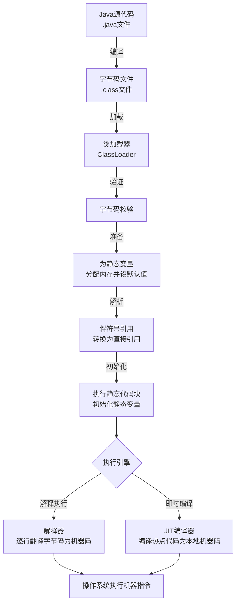
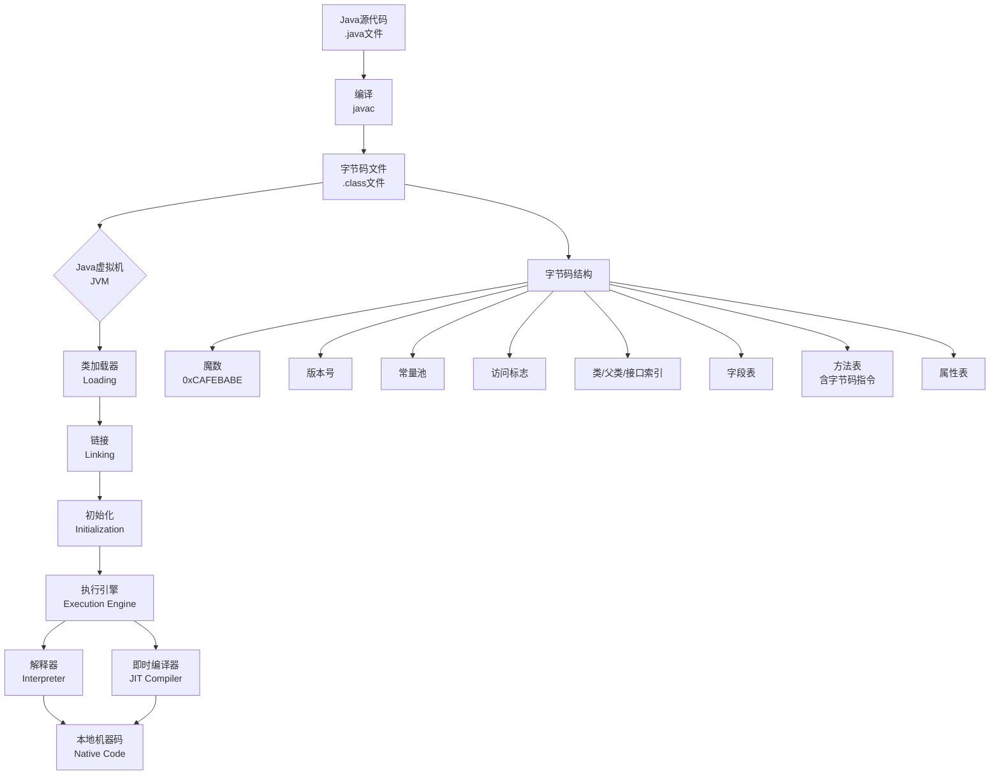

###### 1. Java 语言有哪些特点⁠⁠​？
   Java 语言是一种被广泛使用的面向对象编程语言，具有以下核心特点：
- ==**面向对象**：Java 支持封装、继承、多态等面向对象特性，鼓励以对象为中心设计程序，提高代码的可维护性和复用性。==
- ==**平台无关性与跨平台性**：Java 程序通过编译生成字节码（.class 文件），由 Java 虚拟机（JVM）在不同平台上解释执行，实现"一次编写，到处运行"。==
- ==**健壮性**：Java 提供强类型检查、异常处理机制和自动内存管理（垃圾回收），有效减少程序崩溃和内存泄漏问题。==
- ==**安全性**：Java 内置安全机制，如沙箱（Sandbox）模型、字节码验证器和访问控制，防止恶意代码攻击。==
- ==**多线程支持**：Java 在语言级别支持多线程编程，允许程序同时执行多个任务，提高并发性能和资源利用率。==
- **简单易学**：Java 语法类似于 C++，但摒弃了 C++ 中复杂的特性（如指针、运算符重载、多重继承），并提供了自动垃圾回收机制，降低了学习门槛和编程复杂度。
- **分布式支持**：Java 提供网络编程类库（如 java.net 包），便于开发分布式应用和 Web 服务。
- **高性能**：通过即时编译器（JIT）将热点代码编译为本地机器码，性能接近 C++，同时垃圾回收机制优化了内存使用。
- **动态性**：支持运行时加载类、反射机制等，使程序能适应变化的环境
###### 2. 说说你对 JDK、JRE、JVM 的理解⁠⁠​？
JDK、JRE 和 JVM 是 Java 技术的核心组件，关系紧密但职责不同：
- **JVM（Java Virtual Machine，Java 虚拟机）**：是虚拟的计算机，负责将 Java 字节码（.class 文件）解释或编译为特定平台的机器指令执行。JVM 是 Java 跨平台的基础，不同平台有对应的 JVM 实现。
- **JRE（Java Runtime Environment，Java 运行环境）**：是运行 Java 程序所需的环境，包含 JVM 和 Java 核心类库（如 java.lang、java.util）。用户只需安装 JRE 即可运行已编译的 Java 程序，但无法进行开发。
- **JDK（Java Development Kit，Java 开发工具包）**：是开发者使用的工具集，包含 JRE 以及开发工具（如编译器 javac、调试器 jdb、打包工具 jar）。JDK 用于编写、编译和调试 Java 代码。
- **三者的关系**：JDK ⊃ JRE ⊃ JVM。即 JDK 包含 JRE，JRE 包含 JVM。开发 Java 程序需要 JDK，而运行程序只需 JRE
###### 3. Java 是如何实现跨平台的?⁠​
Java 通过 **Java 虚拟机（JVM）** 和 **字节码机制** 实现跨平台，具体过程如下：
- **编译阶段**：Java 源代码（.java）被编译器（javac）编译成与平台无关的字节码（.class 文件），而不是直接生成机器码。字节码是一种中间格式，不依赖任何特定操作系统或硬件。
- **运行阶段**：不同平台（如 Windows、Linux、macOS）安装对应的 JVM。JVM 将字节码加载到内存，通过解释器或即时编译器（JIT）将其转换为当前平台的本地机器指令并执行。由于字节码是标准化的，而各平台 JVM 负责适配本地环境，因此同一份字节码可在不同平台上运行，实现"一次编写，到处运行"。
- **关键点**：JVM 屏蔽了底层平台的差异，使开发者无需关注操作系统细节。但 JVM 本身不跨平台，每个平台需安装专属 JVM 实现
###### 4. 简单说说你写的 java 程序是如何执行的?⁠​
一个Java程序从源代码到最终执行，主要经历编译和运行两大阶段。

①编译阶段：从 `.java`到 `.class`
用 `javac`命令编译 `.java`源文件时，会经历词法分析、语法分析（生成抽象语法树）、语义分析等步骤，最终生成平台无关的 `.class`字节码文件。字节码是JVM的机器语言。
②运行阶段：
1. **类加载（Loading & Linking）**
    JVM的类加载器（ClassLoader）会去寻找并加载所需的 `.class`文件。加载后，会进行**链接（Linking）**，包括：
    - **验证**：确保字节码是安全合法的。
    - **准备**：为类变量（静态变量）分配内存并设置默认初始值（如int为0）。
    - **解析**：将常量池中的符号引用转换为直接引用。
    - **初始化**：执行类中的静态变量赋值语句和静态代码块。
2. **执行引擎（Execution Engine）如何工作**
    加载和初始化完成后，JVM的**执行引擎**负责执行字节码。
    - **解释执行**：执行引擎中的解释器（Interpreter）会逐行读取字节码，并快速地将其翻译成本地机器码并执行。优点是启动快，立即执行；缺点是逐行解释效率相对较低。
    - **即时编译（JIT Compilation）**：为了提升性能，JVM会监控代码的执行频率。对于那些被频繁调用的“**热点代码**”（如循环、常用方法），**JIT（Just-In-Time）编译器**会将其整个方法或代码块编译成本地机器码。这样，下次再执行这段代码时，就可以直接运行高效的本地机器码，无需再次解释，大大提高了长期运行的性能。这是一种在程序运行时进行的编译。
3. **内存管理（自动垃圾回收）**
    程序运行中创建的对象都存放在堆（Heap）内存中。JVM内置了**垃圾回收器（GC， Garbage Collector）**，它会自动回收不再使用的对象所占用的内存，从而避免了像C/C++那样需要手动管理内存可能带来的内存泄漏问题。
###### 5. 标识符的命名规则⁠?⁠​
标识符是用来为 Java 中的变量、方法、类、包等元素命名的符号。
**硬性规则（必须遵守，否则编译错误）**：
1. **组成字符**：可以由字母（A-Z, a-z）、数字（0-9）、下划线（_ ）和美元符号（$）组成。
2. **首字符**：**不能以数字开头**。
3. **区分大小写**：`myVar`和 `myvar`是两个不同的标识符。
4. **不能是关键字或保留字**：如 `class`, `public`, `static`, `void`等不能作为标识符。
5. **长度无限制**。
**特别注意**：虽然 Java 使用 Unicode 字符集，理论上可以使用中文等字符作为标识符，但**强烈不建议这样做**，会降低代码的可维护性和专业性。
###### 6. Java中的main方法为什么要声明为public static void?⁠
Java 中的 `main`方法声明为 `public static void`是由 Java 虚拟机（JVM）的调用机制决定的。
- **`public`**：`main`方法是程序的入口，JVM 需要从类的外部调用这个方法。`public`访问修饰符确保了 JVM 在任何情况下都能无障碍地访问到这个方法。
- **`static`**：JVM 在启动时，还没有创建包含 `main`方法的类的任何对象实例。`static`关键字表示该方法是**属于类本身**的，而不是属于某个对象。因此，JVM 可以直接通过类名来调用 `main`方法，而无需先实例化对象，这简化了程序的启动过程。
- **`void`**：`main`方法作为程序的起点，它执行完毕后，不需要向 JVM 返回一个结果。`void`关键字表明该方法**没有返回值**。任何返回值对 JVM 来说都没有意义。
**总结**：这个特定的方法签名是一个约定俗成的规范，确保了 JVM 能够**简单、直接地找到并执行**程序的入口点。
###### 7. 什么是字节码？字节码的好处是什么？
字节码是Java实现“一次编写，到处运行”（Write Once, Run Anywhere）理念的核心。

简单来说，字节码（Bytecode）**是一种由Java编译器（`javac`）生成的、与特定机器指令集无关的中间代码，保存在 `.class`文件中。它本质上是 JVM 的机器语言指令集**。
- **平台无关的中间表示**：字节码不是直接面向任何特定的物理CPU（如x86或ARM），而是面向JVM这个抽象层。这使得它独立于底层硬件和操作系统。
- **二进制格式与紧凑结构**：字节码采用二进制格式存储，比源代码更紧凑。一个 `.class`文件具有严格的结构，包含魔数（`0xCAFEBABE`）、版本号、常量池、访问标志、字段表、方法表（内含字节码指令）等组成部分。
- **基于栈的计算模型**：JVM采用栈架构来执行字节码，大多数指令通过操作数栈进行数据处理，而非直接依赖于寄存器。
采用字节码为Java生态系统带来了多方面的重要好处。

| 优势             | 核心说明                                                | 价值体现                             |
| -------------- | --------------------------------------------------- | -------------------------------- |
| **跨平台性**       | 一次编译，到处运行。字节码由JVM解释或编译执行，JVM屏蔽了不同平台的差异。             | 显著降低了程序部署和分发的复杂性，是Java成功的基石。     |
| **安全性**        | JVM在执行字节码前会进行严格的验证，防止有害操作，同时Java字节码无法直接操作内存。        | 为网络环境下的代码执行提供了安全沙箱。              |
| **高性能（JIT优化）** | JVM会监控代码执行频率，通过即时编译器将热点字节码编译成本地机器码并缓存，大幅提升性能。       | 使Java应用在长期运行的服务端场景中能获得接近本地代码的效率。 |
| **动态性与灵活性**    | 支持运行时动态加载和修改字节码，反射机制也依赖于字节码的运行时信息。                  | 是实现热部署、AOP、动态代理等重要特性的基础。         |
| **强大的生态与工具支持** | 字节码是许多开发工具（如反编译、调试、性能分析工具）和框架（如Spring AOP）直接操作的对象。  | 方便开发者分析、调试、优化和增强程序行为。            |
| **跨语言支持**      | JVM成为了一个通用的运行时平台，其他语言如Kotlin、Scala等也可编译成字节码在JVM上运行。 | 丰富了JVM生态。                        |

如何查看与分析字节码，可以使用JDK自带的 `javap`工具来查看字节码。
1. **编译Java源文件**：首先使用 `javac YourClass.java`生成 `.class`文件。
2. **反编译查看字节码**：使用 `javap -c YourClass`可以输出易于阅读的字节码指令序列。添加 `-verbose`参数（`javap -c -verbose YourClass`）能获得更详细的信息，包括常量池、方法描述符等。

了解字节码的实用场景
- **代码优化**：通过分析关键代码路径的字节码，可以发现潜在的性能瓶颈，例如不必要的自动装箱、创建多余临时对象等。
- **问题排查**：当遇到一些底层机制相关的问题（如序列化、反射、同步等问题）时，查看字节码可能有助于理解深层原因。
- **字节码增强技术**：许多高级框架（如Spring的AOP功能）在运行时通过ASM、Byte Buddy等库动态修改或生成字节码，实现强大功能。