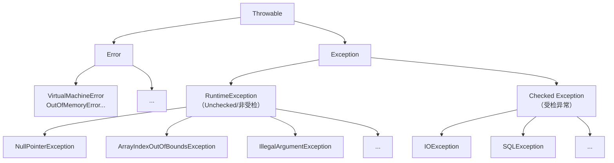

###### 1. Java中的异常体系是怎样的？⁠⁠​
Java的异常体系结构清晰地区分了不同类型的错误和异常。下图描绘了其核心框架：


- **`Throwable`**：所有错误和异常的顶级父类。
- **`Error`​ (错误)：指程序**无法处理**的严重系统级问题，通常与代码逻辑无关，而是运行时环境（如JVM）出现问题。例如 `OutOfMemoryError`（内存溢出）或 `StackOverflowError`（栈溢出）。应用通常无法处理或恢复，只能尽量安全地终止。
- **`Exception` (异常)：指程序**可以且应该处理**的各种意外情况，是异常处理的核心。它主要分为两类：
    - **`RuntimeException`及其子类 (运行时异常/非受检异常)**：如空指针、数组越界等。通常是编程逻辑错误，编译器不强制要求处理，应由代码质量保证。
    - **其他`Exception`子类 (受检异常)**：如`IOException`、`SQLException`。编译器要求必须处理（捕获或声明抛出），否则编译不通过。
###### 2. 说说你对 Excption 与 Error 包的理解?⁠​
| 特性            | `Exception`(异常)                                                            | `Error`(错误)                                          |
| ------------- | -------------------------------------------------------------------------- | ---------------------------------------------------- |
| **可预见/可恢复性**​ | 程序可预料、可恢复的情况。                                                              | 系统级别严重问题，程序通常无法处理或恢复。                                |
| **处理强制力**​    | **检查异常（Checked）**​ 必须显式处理（`try-catch`或`throws`），**运行时异常（Unchecked）**​ 非强制。 | 通常**不强制**捕获处理。                                       |
| **来源**​       | 主要源于程序逻辑或外部交互（如用户输入、I/O操作）。                                                | 通常由JVM或底层系统资源问题引发。                                   |
| **最佳实践**​     | **检查异常**：捕获并尝试恢复或转译。  <br>**运行时异常**：优先通过代码逻辑避免。                            | 通常难以在代码中处理。应记录日志并尝试优雅终止程序，避免随意捕获`Error`或`Throwable`。 |
###### 3. try catch finally，try 里有 return，finally 还执行么？⁠​
**`finally`块中的代码一定会执行**，即使在`try`或`catch`块中遇到了`return`语句。
执行顺序是：先执行`try`或`catch`块中的代码，直到遇到`return`语句时，计算`return`表达式的值（此时值已被暂存，但方法并未立即返回），然后去执行`finally`块中的代码。最后，`try`或`catch`块再带着之前暂存的返回值结束方法。
如果`finally`块中也包含`return`语句，那么它会**覆盖**`try`或`catch`块中的返回值。但**强烈不推荐**在`finally`中使用`return`，因为这会导致`try`或`catch`块中的返回值丢失，且可能抑制其他异常，极易引发难以调试的问题。
###### 4. throw 和 throws 的区别是什么？
| 方面          | `throw`                                    | `throws`                                                               |
| ----------- | ------------------------------------------ | ---------------------------------------------------------------------- |
| **语法位置**​   | 用于**方法体内部**。                               | 用于**方法声明处**，参数列表之后。                                                    |
| **后面跟随内容**​ | 一个**异常对象实例**，如 `throw new IOException();`。 | 一个或多个**异常类的类型**，如 `void method() throws IOException, SQLException {}`。 |
| **语义作用**​   | **主动抛出**一个具体的异常，表示异常在此处发生。                 | **声明**该方法可能抛出的异常类型，提醒调用者需要处理这些异常。                                      |
| **异常数量**​   | 一次只能抛出一个异常对象。                              | 可以声明抛出多个异常类型（用逗号分隔）。                                                   |
###### 5. 如何自定义异常？
当Java标准异常类无法清晰表达特定业务逻辑错误时，可以自定义异常。
1. **选择父类**：
    - 如果希望异常是**受检异常**（强制调用者处理），则继承 `Exception`类。
    - 如果希望异常是**运行时异常**（非强制处理），则继承 `RuntimeException`类。
2. **添加构造方法**：通常需要提供多个构造方法以确保可用性。
  ```java
    public class MyBusinessException extends RuntimeException { // 或 extends Exception
        // 无参构造
        public MyBusinessException() {
            super();
        }
        // 带详细消息的构造
        public MyBusinessException(String message) {
            super(message);
        }
        // 带详细消息和原因的构造（支持异常链，推荐）
        public MyBusinessException(String message, Throwable cause) {
            super(message, cause);
        }
        // 带原因的构造
        public MyBusinessException(Throwable cause) {
            super(cause);
        }
    }
    ```
3. **（可选）添加自定义属性**：根据业务需要，可以定义额外的属性，如错误码。
**最佳实践**：
- 命名以 `Exception`结尾。
- 提供有意义的错误信息。
- 利用异常链（传入 `cause`参数）保留原始异常信息，便于排查根因。
- 避免为琐碎或可恢复的错误创建过多自定义异常。
###### 6. finally 块中的代码一定会执行吗？
虽然一般情况下 `finally`块都会执行，但在一些极端场景下，它**可能不会执行**：
1. **JVM 非正常退出**：如果在 `try`或 `catch`块中调用了 `System.exit(int status)`方法，JVM 将立即终止，`finally`块没有机会执行。
2. **所在线程死亡**：如果执行 `try-catch`的线程被中断（`interrupt`）或死亡（`kill`），`finally`块可能无法执行。
3. **CPU 死循环或崩溃**：在 `try`或 `catch`块中进入无限循环，或者底层系统/CPU出现严重问题。
因此，**不能说 `finally`块是绝对百分百执行的**，但在正常的程序流程控制下（无 `System.exit`，线程正常），它是肯定会执行的。