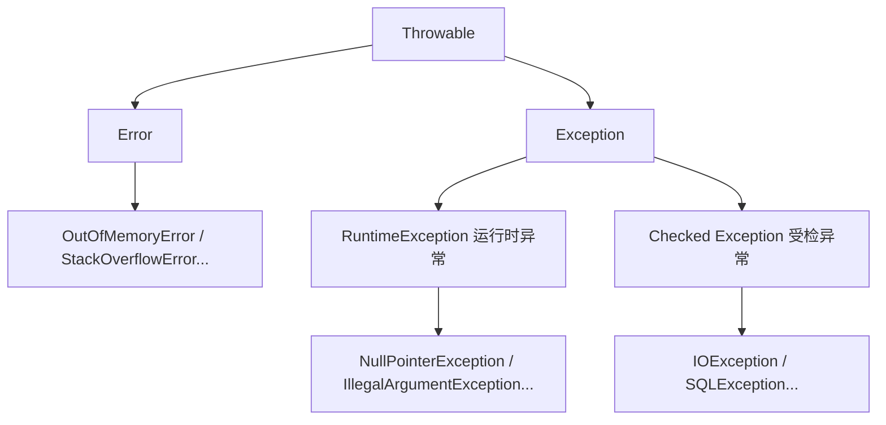

###### 1. Java中的异常体系是怎样的？

[[../../../20_JavaKnowledge/01_Java基础/05、异常处理机制#一、异常体系结构|📖]]
Java异常体系有一个清晰的层次结构，从顶部往下分：

所有异常和错误的根父类是`Throwable`。

`Throwable`往下分两大派：**`Error`** 和 **`Exception`**。

**`Error`（错误）**：程序无法处理的严重系统级问题，通常是JVM或底层资源出了问题，比如`OutOfMemoryError`（内存溢出）、`StackOverflowError`（栈溢出）。遇到Error基本无能为力，代码层面不建议捕获，只能记日志然后优雅退出。

**`Exception`（异常）**：程序可以且应该处理的问题，分两类：

**运行时异常（RuntimeException及其子类）**：如空指针`NullPointerException`、数组越界`ArrayIndexOutOfBoundsException`、类型转换失败`ClassCastException`。这类是编程错误导致的，编译器不强制要求处理，应该通过改代码来避免。

**受检异常（Checked Exception）**：如`IOException`、`SQLException`。编译器强制要求处理（捕获或者声明throws），否则编译报错。


```mermaid
flowchart TD
    A[Throwable] --> B[Error]
    A --> C[Exception]
    B --> B1[OutOfMemoryError / StackOverflowError...]
    C --> C1[RuntimeException 运行时异常]
    C --> C2[Checked Exception 受检异常]
    C1 --> C11[NullPointerException / IllegalArgumentException...]
    C2 --> C21[IOException / SQLException...]
```

###### 2. 说说你对 Exception 与 Error 的理解？

[[../../../20_JavaKnowledge/01_Java基础/05、异常处理机制#一、异常体系结构|📖]]
**Exception（异常）** 是程序预料到的、可以处理的意外情况，来源于程序逻辑或外部交互（用户输入、IO操作等）。受检异常必须显式处理，运行时异常建议通过代码逻辑避免。

**Error（错误）** 是系统级别的严重问题，通常由JVM或底层系统资源引发，程序基本无法从中恢复。不建议在代码中随意捕获Error或Throwable，遇到Error应记录日志并尽量优雅终止。

记忆口诀：Exception是"意外情况"，程序可以处理；Error是"系统故障"，程序只能挂。

###### 3. try catch finally，try 里有 return，finally 还执行么？

[[../../../20_JavaKnowledge/01_Java基础/05、异常处理机制#三、try-catch-finally|📖]]
**执行**。finally中的代码几乎一定会执行，包括try里有return的情况。

执行顺序是：执行try里的代码遇到return时，先暂存return的值，然后执行finally，finally执行完后再真正返回之前暂存的那个值。

一个关键点：如果**finally里也有return**，它会覆盖try里的return值。这是个大坑，**强烈不建议在finally里写return**，因为会导致try/catch里的return值悄无声息地被丢掉，非常难调试。

###### 4. throw 和 throws 的区别是什么？

[[../../../20_JavaKnowledge/01_Java基础/05、异常处理机制#四、throw 与 throws|📖]]
**`throw`**：写在方法体里，用来**主动抛出一个异常对象实例**，表示"此处发生了异常"，后面跟的是异常对象：`throw new IOException("文件读取失败")`。一次只能抛一个。

**`throws`**：写在方法声明的参数列表后面，用来**声明这个方法可能会抛出哪些受检异常**，告知调用者"你调用我时要处理这些异常"，后面跟的是异常类型：`void read() throws IOException, SQLException`。可以声明多个。

一句话记忆：`throw`是"扔出去"（动词，抛出对象），`throws`是"可能扔出"（声明，告知）。

###### 5. 如何自定义异常？

[[../../../20_JavaKnowledge/01_Java基础/05、异常处理机制#五、自定义异常|📖]]
两步：选继承`Exception`（受检）还是`RuntimeException`（非受检），然后按规范写几个构造方法。

```java
public class BusinessException extends RuntimeException {
    public BusinessException() { super(); }
    
    public BusinessException(String message) { super(message); }
    
    public BusinessException(String message, Throwable cause) {
        super(message, cause); // 支持异常链，推荐用这个
    }
    
    public BusinessException(Throwable cause) { super(cause); }
}
```

最佳实践：名字以Exception结尾；提供有意义的错误信息；用`cause`参数保留原始异常（异常链），方便排查根因；别为鸡毛蒜皮的小问题创建太多自定义异常类，保持简洁。

业务系统一般会定义一个顶层`BusinessException`或`AppException`继承RuntimeException，具体业务场景再继承它，这样调用方处理异常比较统一。

###### 6. finally 块中的代码一定会执行吗？

[[../../../20_JavaKnowledge/01_Java基础/05、异常处理机制#三、try-catch-finally|📖]]
正常情况下一定执行，但有几个极端情况**不会执行**：

**`System.exit()`**：这个调用会让JVM立即终止，finally根本没有机会运行。

**所在线程被强制终止（kill -9等）**：操作系统层面直接杀掉JVM进程，finally来不及执行。

**CPU/系统崩溃**：机器掉电、内核panic这种情况，更别指望finally了。

**`try`/`catch`里有无限循环**：代码永远出不来，finally也永远不执行。

所以准确的说法是：**在正常的程序流程控制下（没有System.exit，线程正常），finally一定执行**。但如果有人抬杠说"不一定"，上面这些例外情况是正确答案。
