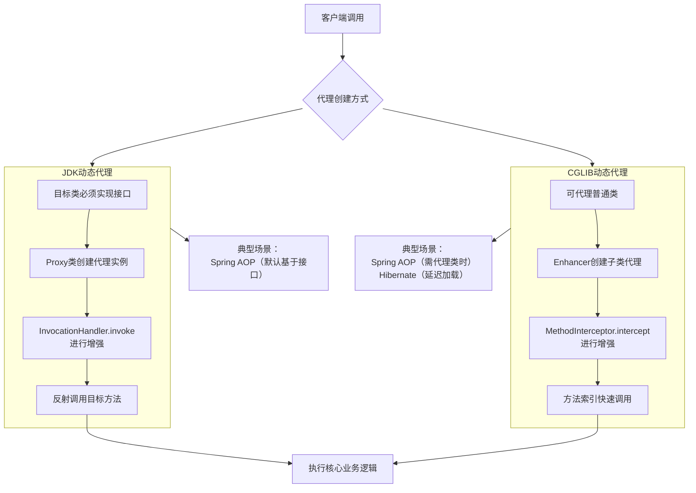

###### 1. 什么是 Java 中的动态代理？⁠⁠​
**动态代理**是一种在**程序运行时**动态创建代理对象的技术。你可以把它想象成一个“智能替身”。这个替身和真实对象实现了相同的接口（或继承自同一类），当客户端调用这个替身的方法时，调用不会直接到达真实对象，而是先被一个“调用处理器”拦截。在这个处理器中，你可以在执行真实方法的前后插入自己的逻辑，比如记录日志、检查权限、管理事务等，从而实现对原始功能的增强（AOP），而无需修改原始类的代码。
它的核心价值在于**解耦**和**扩展性**。它将那些与核心业务逻辑无关的通用功能（即“横切关注点”）从业务代码中剥离出来，使得代码更清晰、更易于维护和复用。
###### 2. JDK 动态代理和 CGLIB 动态代理有什么区别？⁠​
JDK动态代理和CGLIB动态代理是Java中实现动态代理的两种主要技术，它们在工作原理和应用场景上有显著区别，下图直观展示了它们各自的工作流程及典型应用场景。

复制



JDK动态代理和CGLIB动态代理是Java中实现动态代理的两种主要技术，它们在工作原理和应用场景上有显著区别。
**JDK 动态代理**​ 基于Java反射机制，要求被代理的类**必须至少实现一个接口**。其核心是`java.lang.reflect.Proxy`类和`java.lang.reflect.InvocationHandler`接口。代理对象是在运行时动态生成的，实现了目标接口。由于JDK代理在方法调用时使用了反射机制，在早期版本中其性能开销相对较大，但新版本JDK的性能已有显著提升。
**CGLIB (Code Generation Library) 动态代理**​ 是一个第三方库，它通过**继承**目标类并生成其子类的方式来实现代理。因为它是通过继承实现的，所以**不需要**目标类实现任何接口。CGLIB在运行时动态生成一个子类，并重写父类的方法。在调用方法时，它通常通过方法索引直接调用，避免了反射开销，因此通常比JDK动态代理的反射调用性能更高。
```java
//JDK动态代理demo
// 1. 接口（同上）
public interface UserService {
    void saveUser();
}

// 2. 原始类（同上）
public class UserServiceImpl implements UserService {
    @Override
    public void saveUser() {
        System.out.println("核心业务：用户数据已保存至数据库");
    }
}

// 3. 调用处理器（定义增强逻辑）
import java.lang.reflect.InvocationHandler;
import java.lang.reflect.Method;

public class UserServiceInvocationHandler implements InvocationHandler {
    private Object target; // 目标对象

    public UserServiceInvocationHandler(Object target) {
        this.target = target;
    }

    @Override
    public Object invoke(Object proxy, Method method, Object[] args) throws Throwable {
        // 在目标方法执行前添加逻辑
        System.out.println("动态代理-前置操作：权限检查...");

        // 通过反射调用目标对象的方法
        Object returnValue = method.invoke(target, args);

        // 在目标方法执行后添加逻辑
        System.out.println("动态代理-后置操作：记录日志...");
        return returnValue;
    }
}

// 4. 测试类：使用Proxy类动态生成代理对象
import java.lang.reflect.Proxy;

public class Test {
    public static void main(String[] args) {
        UserService target = new UserServiceImpl(); // 目标对象

        // 创建动态代理实例
        UserService proxy = (UserService) Proxy.newProxyInstance(
                target.getClass().getClassLoader(), // 1. 目标类的类加载器
                target.getClass().getInterfaces(),  // 2. 目标类实现的所有接口
                new UserServiceInvocationHandler(target) // 3. 调用处理器实例
        );

        proxy.saveUser(); // 调用代理对象的方法
        System.out.println("代理对象的实际类型：" + proxy.getClass().getName());
    }
}
```
首先，需要在项目中引入CGLIB依赖。如果使用Maven，可以在`pom.xml`中添加：
```xml
<dependency>
    <groupId>cglib</groupId>
    <artifactId>cglib</artifactId>
    <version>3.3.0</version> <!-- 请使用最新版本 -->
</dependency>
```
```java
//CGLib动态代理demo
// 1. 目标类（这次没有实现接口！）
public class UserService {
    public void saveUser() {
        System.out.println("核心业务（CGLIB代理）：用户数据已保存至数据库");
    }
}

// 2. 方法拦截器
import net.sf.cglib.proxy.MethodInterceptor;
import net.sf.cglib.proxy.MethodProxy;
import java.lang.reflect.Method;

public class UserServiceMethodInterceptor implements MethodInterceptor {
    @Override
    public Object intercept(Object obj, Method method, Object[] args, MethodProxy proxy) throws Throwable {
        // 在目标方法执行前添加逻辑
        System.out.println("CGLIB代理-前置操作：性能监控开始...");

        // 调用目标类（父类）的方法
        Object returnValue = proxy.invokeSuper(obj, args);

        // 在目标方法执行后添加逻辑
        System.out.println("CGLIB代理-后置操作：性能监控结束...");
        return returnValue;
    }
}

// 3. 测试类：使用Enhancer创建代理对象
import net.sf.cglib.proxy.Enhancer;

public class Test {
    public static void main(String[] args) {
        Enhancer enhancer = new Enhancer();
        enhancer.setSuperclass(UserService.class); // 设置目标类为父类
        enhancer.setCallback(new UserServiceMethodInterceptor()); // 设置回调（拦截器）

        UserService proxy = (UserService) enhancer.create(); // 创建代理对象
        proxy.saveUser();
        System.out.println("CGLIB代理对象的实际类型：" + proxy.getClass().getSuperclass());
    }
}
```
###### 3. 什么是静态代理？
**静态代理**是指在**程序编译期**就确定代理关系的代理模式。你需要手动编写一个代理类，这个代理类与被代理类实现相同的接口，并在内部持有被代理对象的引用。代理类中的每个方法都会调用被代理对象的相应方法，并可以在调用前后添加额外的逻辑。
静态代理的主要优点是简单、直观。但其致命缺点是**灵活性极差**。如果被代理的接口增加或修改方法，那么代理类和所有相关的类都需要同步修改，容易造成“类爆炸”。
```java
// 1. 定义接口
public interface UserService {
    void saveUser();
}

// 2. 原始类（目标对象）
public class UserServiceImpl implements UserService {
    @Override
    public void saveUser() {
        System.out.println("核心业务：用户数据已保存至数据库");
    }
}

// 3. 代理类（也实现相同接口）
public class UserServiceProxy implements UserService {
    private UserService target; // 持有目标对象的引用

    public UserServiceProxy(UserService target) {
        this.target = target;
    }

    @Override
    public void saveUser() {
        System.out.println("代理前置操作：开启事务..."); // 增强功能
        target.saveUser(); // 调用目标对象的方法
        System.out.println("代理后置操作：提交事务..."); // 增强功能
    }
}

// 4. 测试类
public class Test {
    public static void main(String[] args) {
        UserService target = new UserServiceImpl(); // 创建目标对象
        UserService proxy = new UserServiceProxy(target); // 创建代理对象，传入目标对象
        proxy.saveUser(); // 调用的是代理对象的方法
    }
}
```
###### 4. 动态代理的实现原理是什么？
**JDK 动态代理原理**
- **字节码生成**：当你调用 `Proxy.newProxyInstance()`时，JDK会**动态地在内存中生成一个代理类的字节码**（类名通常为 `$ProxyN`）。这个代理类实现了你指定的所有接口。
- **方法路由**：生成的代理类会将所有接口方法的调用，都路由到其内部持有的 `InvocationHandler`实例的 `invoke`方法。你可以在这个 `invoke`方法中实现增强逻辑。
- **反射调用**：在 `invoke`方法内部，你通过 `Method.invoke(target, args)`利用反射机制调用目标对象的具体方法。
**CGLIB 动态代理原理**
- **子类化**：CGLIB使用底层的**字节码操作库（如ASM）**​ 动态生成一个**继承自目标类的子类**作为代理类。
- **方法重写**：代理类会重写目标类的所有**非 final 方法**。在重写的方法中，会调用绑定的 `MethodInterceptor`的 `intercept`方法。
- **快速调用**：在 `intercept`方法中，CGLIB通过生成的 `MethodProxy`对象来调用父类（即目标类）的方法。这种方式比JDK的反射调用更高效。