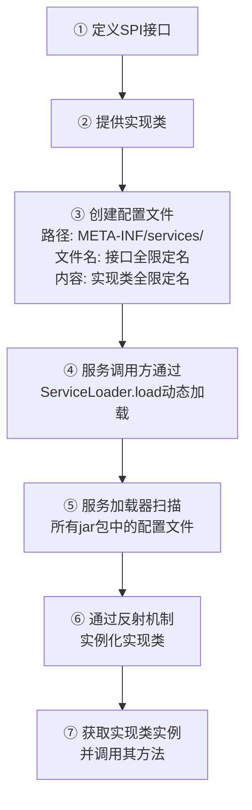

###### 1. 什么是 SPI?⁠⁠​
SPI 通常指 **服务提供者接口**，在软件设计中，**SPI 的全称是 Service Provider Interface**。它是一种服务发现机制，核心目标在于**解耦**​。
它的工作原理是：程序的框架或标准层定义好接口规范，而具体的实现则由第三方服务提供者来完成。这样，应用程序可以在运行时动态发现并加载这些实现类，从而无需在代码中硬编码具体的实现类。这种机制使得功能的扩展和替换变得非常灵活，实现了面向接口编程，而非面向实现编程。
###### 2. SPI 和 API 的区别是什么？
简单来说，API 和 SPI 的核心区别在于**接口的控制方和使用者不同**​。

| 特性        | SPI                                       | API                             |
| --------- | ----------------------------------------- | ------------------------------- |
| **核心关系**​ | 调用方制定接口，实现方提供实现。调用方选择使用哪个实现。              | 实现方制定接口并提供默认实现，调用方直接使用接口功能。     |
| **设计目标**​ | 用于**扩展和替换**，强调框架的可扩展性。                    | 用于**直接提供功能**，强调服务的稳定性和易用性。      |
| **使用者**​  | 框架扩展人员、服务提供者。                             | 应用程序开发人员。                       |
| **控制流向**​ | 一种**回调思想**。调用方定义标准，实现方注入具体逻辑，由调用方在合适时机回调。 | 控制权在调用方，调用方主动使用接口实现功能。          |
| **语义角度**​ | **“我是规范，请你来适配我”**。接口概念上更靠近调用方。            | **“我提供了功能，你来调用我”**。接口概念上更靠近实现方。 |

一个经典的例子是JDBC：
- `java.sql.Driver`接口是Java标准库定义的SPI。
- 数据库厂商（如MySQL、PostgreSQL）提供该SPI的具体实现（如`com.mysql.cj.jdbc.Driver`）。
- 作为应用程序开发者，我们使用的是`DriverManager.getConnection()`这个API来获取连接，而不需要关心底层是哪种数据库实现。在这里，SPI服务于框架扩展（数据库驱动），API服务于应用开发（获取数据库连接）。
###### 3. SPI 的实现原理是什么？
以Java SPI为例，其实现原理主要依赖于`java.util.ServiceLoader`类，并遵循一套明确的约定。其核心运作流程如下图所示，它展示了从定义接口到运行时加载的完整过程：

**SPI 的三大要素**
- **SPI 接口**：一个标准的Java接口或抽象类，为服务提供者制定规范。
- **实现类**：一个或多个具体类，完整实现了SPI接口定义的功能。
- **配置文件**：在实现类的JAR包中，必须在 `/META-INF/services/`目录下创建一个**以接口全限定名命名的文件**。文件内容是该接口实现类的全限定名，每行一个。
**ServiceLoader 的核心工作流程**
当程序调用 `ServiceLoader.load(Interface.class)`时，会触发以下步骤：
- **扫描配置**：`ServiceLoader`会遍历整个项目的classpath（包括所有引入的JAR包），查找所有 `/META-INF/services/`目录下符合命名约定的配置文件。
- **读取与解析**：读取对应接口的配置文件，获取所有实现类的全限定名。
- **反射实例化**：通过反射机制（`Class.forName()`和`newInstance()`），依次加载并实例化这些实现类。
**SPI 的优缺点**
- **优点**：
    - **解耦**：将服务接口与实现分离，避免了硬编码，符合面向对象设计原则。
    - **可扩展性**：通过添加新的实现JAR包即可扩展程序功能，无需修改原有代码。
- **缺点**：
    - **全量加载**：`ServiceLoader`会实例化配置文件中所有的实现类，即使某些类暂时用不到，这可能造成资源浪费。
    - **不灵活**：只能通过迭代器（`Iterator`）遍历所有实现，无法根据某个参数（如“别名”）直接获取指定的实现类。