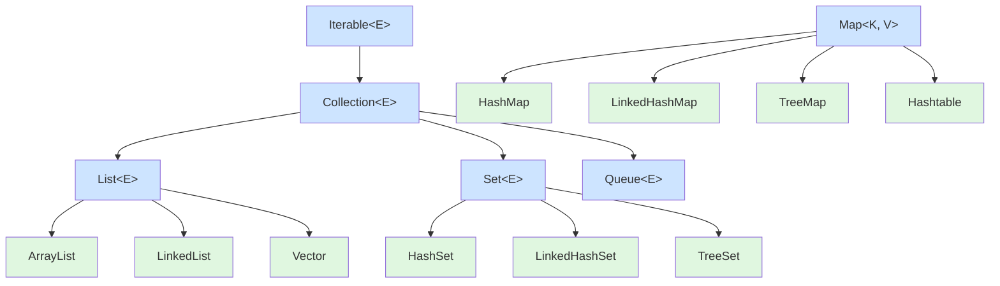
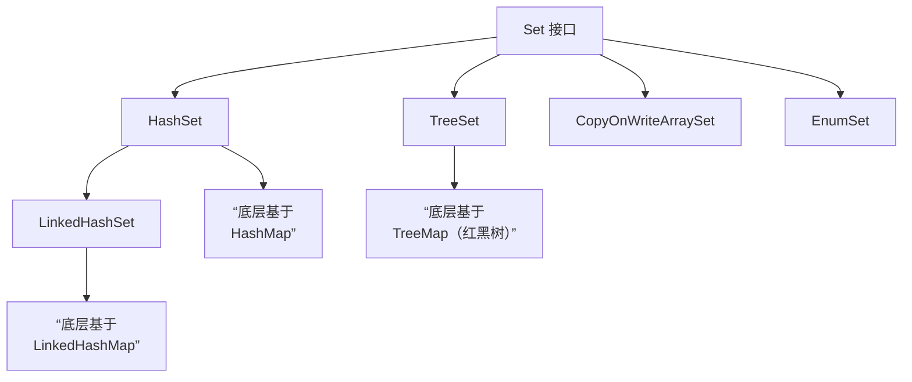
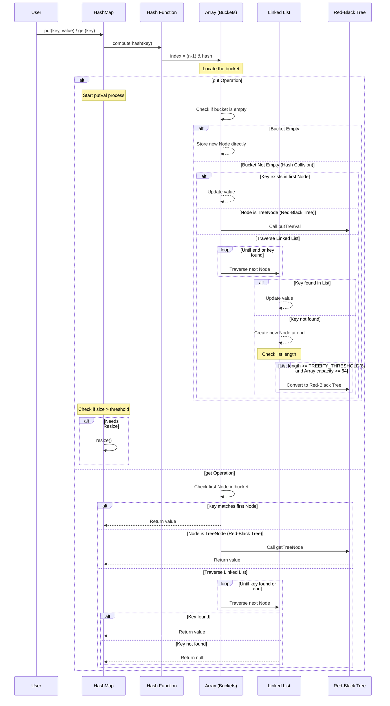
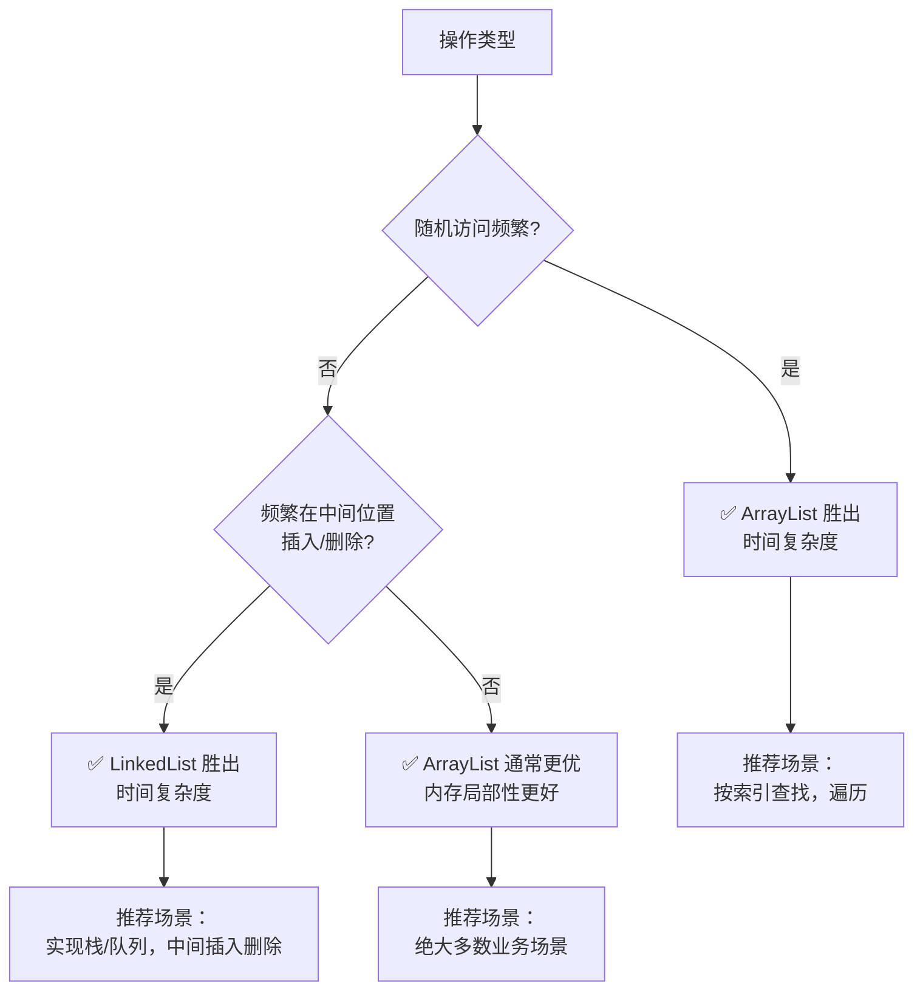

### 一、集合框架基础

###### 1. 简单说说 List, Set, Map 三者的区别？
理解这三者的区别是掌握Java集合框架的基础。下面的表格直观地展示了它们最核心的特性和常用实现类。

|特性|List|Set|Map|
|---|---|---|---|
|**核心特征**​|**有序、可重复**的序列|**不可重复**的集合|**键值对（Key-Value）**​ 映射|
|**元素顺序**​|保持插入顺序|大多数无序（但`LinkedHashSet`保持顺序，`TreeSet`按排序）|大多数无序（但`LinkedHashMap`保持顺序，`TreeMap`按键排序）|
|**元素重复性**​|允许重复元素|**不允许**重复元素（依据`equals()`方法判断）|**Key**不允许重复，**Value**允许重复|
|**空值（null）**​|通常允许多个`null`|通常最多允许一个`null`（`TreeSet`不允许）|不同实现类不同（`HashMap`允许一个`null`键和多个`null`值，`Hashtable`不允许）|
|**常用实现类**​|`ArrayList`, `LinkedList`, `Vector`|`HashSet`, `LinkedHashSet`, `TreeSet`|`HashMap`, `LinkedHashMap`, `TreeMap`, `Hashtable`|

**简要总结**：
- 当你需要维护元素的添加顺序，并且不关心重复时，使用 **List**。
- 当你需要确保元素的**唯一性**时，使用 **Set**。
- 当你需要通过一个**键（Key）​ 来高效地查找、更新或删除对应的**值（Value）**​ 时，使用 Map**。
###### 2. 说说 Collection 和 Collections 的区别？
- **Collection**：是一个**根接口**（`interface`）。它是整个集合框架的基石，代表一组对象的集合。`List`和`Set`都是它的直接子接口。它定义了集合类最基本的操作规范，如`add()`, `remove()`, `size()`, `iterator()`等。你不能直接创建`Collection`的实例，但可以用它的子接口（如`List<String> list = new ArrayList<>()`）来声明变量，这是一种面向接口编程的良好实践。
- **Collections**：是一个**工具类**（`utility class`）。它包含了一系列用于操作集合（如`List`, `Set`）的**静态方法**。这个类不能被实例化（构造器是私有的），你直接通过类名调用它的方法即可。它提供的方法非常实用，主要包括：
    - **排序**：`sort(List<T> list)`。
    - **线程安全包装**：`synchronizedList(List<T> list)`，将非线程安全的集合转换为线程安全的版本。
    - **创建不可修改集合**：`unmodifiableList(List<? extends T> list)`，用于创建只读集合。
    - **查找和替换**：如`binarySearch()`（二分查找）、`reverse()`（反转）、`max()`/`min()`（查找最大/最小值）等。
**核心记忆点**：**`Collection`是接口（定义规范），`Collections`是工具类（提供方法）**。
###### 3. Java 集合框架的层次结构是怎样的？
Java集合框架是一个设计精良的、用于表示和操作集合的类库体系。其核心接口的继承与实现关系，可以通过下图清晰地展示：




从图中可以看出：
- 最顶层的 `Iterable`接口定义了获取迭代器（`Iterator`）的能力，从而实现增强for循环。
- `Collection`接口继承自 `Iterable`，其下主要有三大分支：**List**（有序可重复）、**Set**（不可重复）和**Queue**（队列，FIFO等）。
- **Map**​ 是一个独立的接口，它存储的是键值对（Key-Value），并不继承自 `Collection`。
###### 4. Iterable 和 Iterator 接口有什么区别？
这两者共同支撑了Java集合的遍历，但职责不同。
- **Iterable**：这是一个接口。如果一个类实现了`Iterable`接口，就表示它是"可迭代的"。它只定义了一个核心方法：`Iterator<T> iterator()`，用于返回一个`Iterator`对象。我们常用的`for-each`循环（如`for (String s : list)`）就是基于`Iterable`接口工作的。`Collection`接口继承自`Iterable`，所以所有集合（List, Set, Queue）都是可迭代的。
- **Iterator**：这也是一个接口，是真正的**迭代器**。它提供了遍历集合元素的具体方法：
    - `boolean hasNext()`：判断是否还有下一个元素。
    - `E next()`：返回下一个元素。
    - `void remove()`：从底层集合中移除当前元素（可选操作）。我们通常通过`Iterator`来遍历集合，并可以在遍历过程中安全地移除元素。
**关系**：`Iterable`表示“我能够提供一个迭代器（`Iterator`），而`Iterator` 则是真正执行遍历操作的那个对象。
###### 5. 如何选择合适的集合类？
选择正确的集合类对程序的性能和正确性至关重要。以下是一份实用的选择指南：

| 需求场景                  | 推荐选择                                                                               | 理由                                                                    |
| --------------------- | ---------------------------------------------------------------------------------- | --------------------------------------------------------------------- |
| **需要快速随机访问（通过索引）**​   | **`ArrayList`**​                                                                   | 基于数组实现，类似增强版数组，通过索引直接定位元素，速度极快。                                       |
| **需要频繁在中间位置插入/删除**​   | **`LinkedList`**​                                                                  | 基于双向链表实现，插入删除只需改变指针，效率高。还可作为队列或双端队列使用。                                |
| **需要元素唯一，不关心顺序**​     | **`HashSet`**​                                                                     | 基于哈希表实现，查询和插入速度最快（平均O(1)），无序。                                         |
| **需要元素唯一，且保留插入顺序**​   | **`LinkedHashSet`**​                                                               | 在`HashSet`基础上增加了链表，维护了插入顺序。                                           |
| **需要元素唯一，且自然排序**​     | **`TreeSet`**​                                                                     | 基于红黑树实现，元素会自动排序，但效率相对较低（O(log n)）。                                    |
| **键值对存储，需要最快访问速度**​   | **`HashMap`**​                                                                     | 基于哈希表实现，通过键（Key）查找值（Value）效率最高。                                       |
| **键值对存储，需要保留键的插入顺序**​ | **`LinkedHashMap`**​                                                               | 在`HashMap`基础上维护了插入顺序或访问顺序（LRU）。                                       |
| **键值对存储，需要按键自然排序**​   | **`TreeMap`**​                                                                     | 基于红黑树，键（Key）会按顺序排列。                                                   |
| **多线程环境，需要线程安全**​     | **`ConcurrentHashMap`**（替代`Hashtable`）  <br>**`CopyOnWriteArrayList`**（替代`Vector`） | Java 5+提供了更高效的并发集合，性能远优于早期的`synchronized`包装类（如`Vector`, `Hashtable`）。 |

**最佳实践**：在声明变量时，**优先使用接口类型**，如 `List<String> list = new ArrayList<>();`。这样在需要更换实现时非常灵活。
###### 6. 集合和数组的区别是什么？
尽管都用于存储多个元素，但集合和数组有本质区别：

| 特性        | 数组（Array）                             | 集合（Collection）                                           |
| --------- | ------------------------------------- | -------------------------------------------------------- |
| **容量**​   | **固定长度**，一旦创建不可改变。                    | **动态增长**，可根据需要自动扩容。                                      |
| **功能**​   | 功能简单，仅提供有限的`length`属性和下标操作`[ ]`。      | 功能丰富，提供了各种操作（增删改查、排序、遍历等）。                               |
| **元素类型**​ | 可以存储基本数据类型（如`int`）和对象。                | 只能存储**对象**（但通过自动装箱/拆箱可以方便地处理基本类型，如`ArrayList<Integer>`）。 |
| **安全性**​  | 编译期类型检查不够安全（例如`ArrayStoreException`）。 | 通过**泛型**在编译期提供严格的类型检查，更安全。                               |
| **底层技术**​ | 是Java语言最基础的结构。                        | 是基于数组、链表、红黑树等数据结构构建的高级API。                               |

简单来说，**集合是对数组的增强和封装，提供了更强大、更便捷的功能**。在现代Java开发中，除非对性能有极致要求或特定场景，否则**优先使用集合**。
### 二、List 相关
###### 1. ArrayList 和 LinkedList 的区别是什么？
这两个类都实现了`List`接口，但底层数据结构的不同导致了性能和适用场景的显著差异。

| 特性           | ArrayList                    | LinkedList                     |
| ------------ | ---------------------------- | ------------------------------ |
| **底层数据结构**​  | 动态数组                         | 双向链表                           |
| **随机访问性能**​  | **极快 (O(1))**。基于索引直接定位，类似数组。 | **慢 (O(n))**。需要从链表头或尾开始遍历查找。   |
| **插入/删除性能**​ | **较差**。需移动后续元素（尾部添加快，中间插入慢）。 | **极快 (O(1))**。只需修改相邻节点的指针。     |
| **内存占用**​    | 较小。仅存储实际数据，内存连续。             | 较大。每个节点需存储数据和前后节点的引用。          |
| **额外功能**​    | 基础列表操作。                      | 实现了`Deque`接口，可轻松作为栈、队列或双端队列使用。 |

**小结**：**ArrayList 更适合随机访问密集（查询多）的场景，而 LinkedList 更适合频繁进行插入和删除操作的场景**​。
###### 2. ArrayList 和 Vector 的区别是什么？
尽管两者底层都是数组实现，但在线程安全性和性能上存在关键区别。

| 特性         | ArrayList         | Vector                                               |
| ---------- | ----------------- | ---------------------------------------------------- |
| **线程安全性**​ | **非线程安全**。性能更高。   | **线程安全**。其公共方法大多使用`synchronized`关键字修饰，但同步开销大，性能相对较低。 |
| **扩容策略**​  | 增长为原来的 **1.5倍**​。 | 默认增长为原来的 **2倍**（可通过构造参数设置扩容增量）。                      |
| **出现版本**​  | JDK 1.2。          | JDK 1.0。                                             |

**小结**：在现代Java开发中，由于Vector的同步开销较大，在**非线程安全**的场景下**ArrayList性能更优**。即便需要线程安全，也通常有更好的选择。
###### 3. ArrayList 的扩容机制是怎样的？ArrayList 的初始容量是多少？
ArrayList的核心优势在于其能够动态扩容，这背后有一套精巧的机制。
- **初始容量**：当使用无参构造函数 `new ArrayList()`时，底层数组初始化为一个**空数组**，并非直接创建容量为10的数组。真正的初始化在第一次添加元素时发生，容量会被设置为 **10**​。
- **触发扩容**：每当调用`add`方法时，会检查当前数组是否已满。如果已满，则会触发扩容。
- **扩容过程**：扩容的核心方法是 `grow()`。新容量的计算规则是：`新容量 = 旧容量 + (旧容量 >> 1)`，即大约增长为旧的 **1.5倍**​。如果计算后的新容量仍不足以容纳新元素，则直接使用所需的最小容量。新容量确定后，会调用 `Arrays.copyOf()`方法将原数组的数据复制到一个新大小的数组中，这是扩容过程中最耗时的操作。
**最佳实践**：如果能够预估数据量的大小，建议使用 `ArrayList(int initialCapacity)`构造函数指定初始容量，或者使用 `ensureCapacity(int minCapacity)`方法提前扩容，这样可以避免或减少后续添加元素时的多次扩容和数据复制，提升性能。
###### 4. 如何实现数组和 List 之间的转换？
- **数组 转 List**：
    - 使用 `Arrays.asList(T... a)`方法。但需要注意，返回的List并非 `java.util.ArrayList`，而是一个固定大小的视图，不支持添加(`add`)或删除(`remove`)操作，但可以修改元素。
    - 如果需要可变的List，可以这样创建：`new ArrayList<>(Arrays.asList(array))`。
- **List 转 数组**：
    - 使用 `List`的 `toArray()`方法。无参重载返回的是 `Object[]`类型。
    - 使用 `toArray(T[] a)`可以指定返回数组的类型，更常用。例如：`list.toArray(new String[0])`或 `list.toArray(new String[list.size()])`。
###### 5. ArrayList 和 LinkedList 的使用场景分别是什么？
- **优先使用 ArrayList**：在绝大多数情况下，由于ArrayList基于数组实现，具有出色的局部性原理，CPU缓存命中率高，因此**遍历和随机访问的效率极高**。它是目前**最常用、最通用**的List实现。
- **考虑使用 LinkedList**：
    - 当需要频繁在**列表的中部**进行插入和删除操作时。
    - 当需要将List当作**栈、队列或双端队列**使用时（因为它实现了`Deque`接口）。
###### 6. ArrayList 的线程安全问题如何解决？说说 CopyOnWriteArrayList 的原理和应用场景？
标准的ArrayList和LinkedList都是**非线程安全**的。在多线程环境下，如果多个线程同时修改一个ArrayList，可能会导致数据不一致或其他未定义行为。
解决方案主要有以下几种：
1. **使用 `Collections.synchronizedList(List<T> list)`**：
    - 该方法会返回一个同步包装器类，它使用同步块来保证方法级别的线程安全。
    - 性能有损耗，因为每个方法调用都需要获取锁。
2. **使用 `java.util.concurrent.CopyOnWriteArrayList`**：
    - **原理**：这是JUC包下提供的一个线程安全的List。其核心思想是 **"写时复制"​ 。每当需要修改列表（如add, set）时，它不会直接操作原数组，而是先将原数组完整地复制一份到一个新数组，然后在新数组上进行修改，修改完成后再将底层数组的引用指向新数组。读操作（如get）则完全无锁，直接在当前数组快照上进行。
    - **优点**：**适用于读多写少**的并发场景。因为读操作非常快，且不需要加锁，多个线程可以并发读而不会阻塞。
    - **缺点**：
        - **内存开销大**：每次写操作都会复制整个底层数组。
        - **数据最终一致性**：读操作可能无法立即读到最新写入的数据，因为它读取的是写操作开始前的数组快照。
###### 7. LinkedList 可以作为栈和队列使用吗？如何使用？
是的，**LinkedList 完全可以作为栈和队列使用**，这是因为它不仅实现了`List`接口，还实现了`Deque`（双端队列）接口。`Deque`接口提供了丰富的方法来模拟栈和队列的行为。
- **作为栈（LIFO，后进先出）**：
    - 入栈（压栈）：`push(e)`或 `addFirst(e)`
    - 出栈（弹栈）：`pop()`或 `removeFirst()`
    - 查看栈顶：`peek()`或 `peekFirst()`
- **作为队列（FIFO，先进先出）**：
    - 入队（队尾）：`add(e)`或 `offer(e)`
    - 出队（队首）：`remove()`或 `poll()`
    - 查看队首：`element()`或 `peek()`
由于LinkedList在两端（头尾）进行插入和删除操作的效率极高（O(1)），因此它非常适合用来实现栈和队列。
###### 8. subList 方法返回的是什么？使用时需要注意什么？
`List`的 `subList(int fromIndex, int toIndex)`方法返回的是原列表的一个**视图**（View），而非一个新的独立List对象。
这意味着：
- 对子列表的非结构性修改（如`set`方法）会反映到原列表上。
- 对原列表的结构性修改（如直接调用`add`, `remove`）会导致后续对子列表的任何操作（包括简单的遍历）抛出 `ConcurrentModificationException`异常。
**最佳实践**：如果你需要一份与原列表无关的副本，应该这样创建：`new ArrayList<>(originalList.subList(from, to))`。
### 三、Set 相关



###### 1. HashSet 的实现原理是什么？
`HashSet`的核心实现原理是**基于 `HashMap`的键（Key）来存储元素**。
- **内部封装**：当你创建一个 `HashSet`时，其内部实际上封装了一个 `HashMap`实例。默认初始容量是16，负载因子是0.75。
- **值存储**：当您调用 `hashSet.add(element)`时，这个 `element`会被放入底层 `HashMap`的 **Key**​ 上。而 `HashMap`的 **Value**​ 则统一指向一个静态的、不可变的虚拟对象，名为 `PRESENT`。
- 源码如下：
 ```java
    // HashSet 的核心成员变量
    private transient HashMap<E,Object> map;
    private static final Object PRESENT = new Object();
    
    // add 方法的实现
    public boolean add(E e) {
        return map.put(e, PRESENT) == null; // 如果map的put方法返回null，表示添加成功
    }
    ```
- **操作委托**：因此，`HashSet`的所有操作，如 `add`, `remove`, `contains`，本质上都是直接调用底层 `HashMap`的相应方法完成的。
###### 2. HashSet 如何保证元素不重复？
这正是 `HashSet`设计的精妙之处。由于它使用了 `HashMap`的 Key 来存储元素，而 `HashMap`的 **Key 是唯一的**。所以，`HashSet`的不重复性完全依赖于 `HashMap`对 Key 的唯一性判断逻辑。
当添加一个新元素 `e`时，底层 `HashMap`会进行如下判断：
1. **计算哈希值**：首先调用 `e`的 `hashCode()`方法计算哈希值，据此定位到数组中的桶（bucket）位置。
2. **检查哈希冲突**：如果该桶为空，直接存入，添加成功。
3. **解决哈希冲突**：如果该桶不为空（发生哈希冲突），则调用 `e`的 `equals()`方法，与该桶内已存在的所有 Key 进行比较：
    - 如果 `equals()`返回 `true`，则认为 Key 已存在，新元素添加失败。
    - 如果 `equals()`返回 `false`，则会将新元素以链表或树的形式加入该桶。
**因此，如果要将自定义类的对象放入 `HashSet`并正确去重，重写 `hashCode()`和 `equals()`方法至关重要**​。必须确保两个相等的对象（`equals()`返回 `true`）具有相同的哈希码（`hashCode()`返回值相等）。
###### 3. HashSet、LinkedHashSet 和 TreeSet 有什么区别？
这三种 Set 的主要区别在于底层数据结构、元素顺序和性能，具体对比如下：

|特性|HashSet|LinkedHashSet|TreeSet|
|---|---|---|---|
|**底层数据结构**​|基于 `HashMap`（哈希表）|继承自 `HashSet`，基于 `LinkedHashMap`（哈希表+双向链表）|基于 `TreeMap`（红黑树）|
|**元素顺序**​|**不保证**任何顺序，无序|保证元素的**插入顺序**​|保证元素处于**排序状态**（自然排序或定制排序）|
|**性能特点**​|添加、删除、查找最快（平均 O(1)）|性能略低于 `HashSet`，但迭代访问效率高|添加、删除、查找较慢（O(log n)），但有序|
|**`null`元素**​|**允许**一个 `null`元素|**允许**一个 `null`元素|**不允许**（取决于比较器，自然排序下不允许）|
|**线程安全**​|非线程安全|非线程安全|非线程安全|

**选择指南**：
- **`HashSet`**：**默认选择**。当您对元素的顺序没有要求，只关心唯一性和高性能时。
- **`LinkedHashSet`**：当您需要**按照元素添加的顺序进行迭代**时使用。例如，需要维护一个去重后的访问记录列表。
- **`TreeSet`**：当您需要元素**自动排序**时使用。例如，需要创建一个有序且不重复的集合。
###### 4. TreeSet 的排序规则是什么？
`TreeSet`的排序规则主要有两种：
1. **自然排序 (Natural Ordering)**：
    - 添加到 `TreeSet`中的元素类必须实现 `java.lang.Comparable`接口。
    - `TreeSet`会通过调用元素的 `compareTo(Object o)`方法来比较元素的大小，并据此进行排序。
    - 如果尝试添加未实现 `Comparable`接口的对象，会在运行时抛出 `ClassCastException`。
2. **定制排序 (Custom Ordering)**：
    - 在创建 `TreeSet`时，可以传入一个实现了 `java.util.Comparator`接口的比较器对象。
    - `TreeSet`会使用这个 `Comparator`的 `compare(Object o1, Object o2)`方法来比较元素，而不再要求元素类实现 `Comparable`接口。这为排序规则提供了更大的灵活性。
**重要原则**：为了保证排序的准确性，**`compareTo`（或 `compare`）方法与 `equals`方法的逻辑必须保持一致**。即当 `x.compareTo(y) == 0`时，应有 `x.equals(y)`为 `true`。
###### 5. HashSet 和 HashMap 的区别是什么？
|特性|HashSet|HashMap|
|---|---|---|
|**实现接口**​|实现 `Set`接口|实现 `Map`接口|
|**存储内容**​|存储**单个对象**​|存储**键值对 (Key-Value pairs)**​|
|**添加方法**​|`add(element)`|`put(key, value)`|
|**重复性保证**​|通过存储的**元素本身**保证唯一性|通过 **Key**​ 保证唯一性，**Value**​ 可以重复|
|**底层依赖**​|基于 `HashMap`实现|是独立的实现，是 `HashSet`的基础|

简单来说，**`HashSet`本身就是基于 `HashMap`的一个特化和封装**，它利用 `Map`的 Key 唯一性来实现了 Set 的元素不重复特性。
###### 6. 如何实现一个线程安全的 Set？CopyOnWriteArraySet 的特点是什么？
标准的 `HashSet`, `TreeSet`, `LinkedHashSet`都是**非线程安全**的。在多线程环境下，如果多个线程同时修改一个 Set，可能会导致数据不一致或其他未定义行为。
解决方案主要有两种：
1. **使用 `Collections.synchronizedSet()`包装**：
```java
    Set<String> syncSet = Collections.synchronizedSet(new HashSet<>());
    ```
该方法会返回一个同步包装器类，它使用同步块来保证方法级别的线程安全。性能有损耗，因为每个方法调用都需要获取锁。
2. **使用 `java.util.concurrent.CopyOnWriteArraySet`**：
    - **原理**：这是 JUC 包下提供的一个线程安全的 Set。其核心思想是 **"写时复制"**。每当需要修改集合（如 add, remove）时，它会先将底层数组完整地复制一份，然后在新数组上进行修改，修改完成后再将数组引用指向新数组。而读操作（如 contains, iterator）则完全无锁，直接在当前数组快照上进行。
    - **特点与应用场景**：
        - **优点**：**非常适合读多写少**的并发场景。因为读操作非常快，且不需要加锁，多个线程可以并发读而不会阻塞。
        - **缺点**：
            - **内存开销大**：每次写操作都会复制整个底层数组。
            - **数据最终一致性**：读操作可能无法立即读到最新写入的数据，因为它读取的是写操作开始前的数组快照。
            - **写性能差**：写操作（尤其是频繁修改）的开销非常大。
###### 8. EnumSet 是什么？有什么优势？
`EnumSet`是一个专门为**枚举类型**设计的高性能 Set 实现。
- **优势**：
    - **极致性能**：内部使用位向量（bit vector）实现，非常紧凑和高效。所有的基本操作（如 add, remove, contains）都在常数时间内完成，甚至比 `HashSet`还要快。
    - **类型安全**：与泛型完美结合，保证了类型安全。
    - **丰富的静态工厂方法**：提供了如 `of`, `range`, `allOf`等方法，方便创建包含指定枚举值的集合。
- **应用场景**：当需要存储某个枚举类型的值时，**应优先考虑使用 `EnumSet`**。
### 四、Map 相关
###### 1. HashMap 的实现原理是什么？
HashMap 的底层实现是“数组 + 链表 + 红黑树”的组合。您可以将其理解为一个“桶数组”，每个桶（数组元素）可以用来存放键值对。
- **数组（桶）**：主干，用于快速定位，默认初始大小为 16。
- **链表**：解决哈希冲突。当不同的键通过哈希计算落到同一个桶时，会以链表形式存储（拉链法）。
- **红黑树**：优化长链表查询。当链表长度超过阈值（默认为8）且数组容量达到一定值（默认为64）时，链表会转为红黑树，将查询效率从 O(n) 提升到 O(log n)。
为了更直观地理解其核心操作流程，我们可以参考下面的序列图，它描绘了 `put`和 `get`方法的关键步骤：


###### 2. HashMap 的 put 方法的执行流程？
`put`方法的详细步骤与上图的左侧流程一致，核心步骤包括：
1. **计算哈希**：使用 `hash(key)`方法计算键的哈希值，目的是为了均匀分布。
2. **定位桶**：通过 `(数组长度 - 1) & hash`计算键值对应在数组中的索引位置。
3. **处理冲突**：
    - 若桶为空，直接放入新节点。
    - 若桶不为空，则检查第一个节点：若键相同则覆盖值；若为树节点，调用红黑树方法；否则遍历链表，若找到相同键则覆盖，否则尾部插入新节点。
4. **转换树**：插入后若链表长度超8且数组容量≥64，链表转为红黑树。
5. **判断扩容**：插入后若键值对数量超过扩容阈值，则进行扩容。
###### 3. HashMap 的扩容机制是怎样的？
当 HashMap 中的元素数量超过（容量 × 负载因子）时，会自动触发扩容。
- **扩容过程**：创建一个新的、更大的数组（通常是原大小的2倍），然后重新计算每个元素在新数组中的位置，并将元素转移过去。这是一个相对耗时的操作。
- **高效重哈希**：由于容量总是 2 的幂次方，扩容后元素的新位置要么是**原位置**，要么是**原位置 + 旧容量**。这使得重哈希时无需重新计算哈希值，只需判断哈希值新增参与运算的位是0还是1即可，非常高效。
###### 4. HashMap 为什么线程不安全？
HashMap 在设计上未考虑同步，在多线程并发环境下使用主要存在以下问题：
- **数据覆盖**：多个线程同时执行 `put`操作，可能导致后一个线程覆盖前一个线程放入的值，造成数据丢失。
- **环形链表（JDK 1.7）**：在扩容过程中，线程不安全的转移操作可能导致链表形成环，进而引起后续的 `get`操作出现无限循环。
- **数据不一致**：一个线程在遍历，另一个线程在修改，可能会抛出 `ConcurrentModificationException`异常。
###### 5. HashMap 和 Hashtable 的区别？
| 特性            | HashMap                                              | Hashtable                                      |
| ------------- | ---------------------------------------------------- | ---------------------------------------------- |
| **线程安全**​     | **非线程安全**，性能更高。                                      | **线程安全**，方法使用 `synchronized`修饰，性能较低。           |
| **Null 键/值**​ | **允许**一个 `null`键和多个 `null`值。                         | **不允许**键或值为 `null`，会抛出 `NullPointerException`。 |
| **继承体系**​     | 是 Java Collections Framework 的一部分，继承自 `AbstractMap`。 | 是遗留类，继承自陈旧的 `Dictionary`类。                     |
| **迭代器**​      | 是 **fail-fast**​ 的。                                  | 是 **fail-fast**​ 的。                            |

**结论**：Hashtable 是过时的类，不应在新代码中使用。 需要线程安全时，应使用 `ConcurrentHashMap`；不需要线程安全时，使用 `HashMap`。
###### 6. HashMap 和 TreeMap 的区别？
|特性|HashMap|TreeMap|
|---|---|---|
|**底层结构**​|哈希表。|**红黑树**（自平衡的二叉搜索树）。|
|**元素顺序**​|**不保证**顺序（迭代顺序可能会变化）。|元素根据键的**自然顺序**或提供的 **Comparator**​ 进行**排序**。|
|**性能**​|插入、删除、查找的平均时间复杂度为 **O(1)**。|插入、删除、查找的时间复杂度为 **O(log n)**。|
|**Null 键**​|允许一个 `null`键。|不支持 `null`键（取决于排序规则）。|

**应用场景**：如果需要快速的键值查询且不关心顺序，用 `HashMap`；如果需要元素始终保持有序状态，用 `TreeMap`。
###### 7. HashMap 和 LinkedHashMap 的区别？
`LinkedHashMap`是 `HashMap`的子类。
- **`HashMap`**：不保证迭代顺序。
- **`LinkedHashMap`**：**维护着一个贯穿所有条目的双向链表**。这使得它可以保持元素的**插入顺序**（order of insertion）或**访问顺序**（order of access，即 LRU - Least Recently Used 算法的体现）。因此，在迭代 `LinkedHashMap`时，顺序是可以预测的。
###### 8. ConcurrentHashMap 的实现原理？
`ConcurrentHashMap`是 HashMap 的线程安全版本。
- **JDK 1.7**：采用 **分段锁（Segment）​机制。容器里包含一个 `Segment`数组，每个 `Segment`本身就是一个线程安全的哈希表。锁的粒度是段，不同的段上的操作可以并发进行。
- **JDK 1.8 及之后**：进行了重大优化，放弃了 `Segment`，改用 **`synchronized`锁桶数组的头节点**（链表头或红黑树根节点）的方式实现同步。同时结合 CAS（Compare-And-Swap） 操作，使得锁的粒度更细，并发性能更高。
###### 9. ConcurrentHashMap 在 JDK 1.7 和 1.8 中的区别？
| 特性        | JDK 1.7                           | JDK 1.8                                      |
| --------- | --------------------------------- | -------------------------------------------- |
| **底层结构**​ | **数组 + 链表**，分段锁（`ReentrantLock`）。 | **数组 + 链表 + 红黑树**，锁头节点（`synchronized`+ CAS）。 |
| **锁粒度**​  | 锁住整个 **Segment**（包含多个桶）。          | 只锁住单个**桶**（链表或树的头节点），粒度更小，并发性更好。             |
| **并发度**​  | 由 `Segment`的数量决定，创建后不可改变。         | 并发度理论上最高可达数组的大小，更灵活。                         |
###### 10. 为什么 HashMap 的负载因子是 0.75？
负载因子是权衡时间成本和空间成本的折中结果。
- 若**负载因子过高（如1.0）**：虽然空间利用率高，扩容次数少，但哈希冲突概率大增，查询效率下降。
- 若**负载因子过低（如0.5）**：哈希冲突减少，查询效率高，但空间利用率低，会导致频繁扩容。默认值 **0.75**​ 在时间和空间成本上达到了一个较好的平衡，是一个经过数学统计和实践检验的较优解。
###### 11. HashMap 的初始容量为什么是 2 的幂次方？
这主要是一种优化手段：
- **高效取模**：当容量为 2 的 n 次方时，`h & (length - 1)`操作等价于 `h % length`，但位运算的效率远高于取模运算。
- **减少哈希冲突**：使得 `length - 1`的二进制低位全是1，从而让哈希值的低位直接参与定位，分布更均匀。如果不是2的幂次方，`(length - 1)`的二进制中会有0，导致某些桶位永远无法被使用，增加冲突概率。
- **优化扩容**：如前所述，扩容时元素的新位置计算变得非常简单。
###### 12. HashMap 中的 hash 方法是如何实现的？
`hash(Object key)`方法并非直接使用 key 的 `hashCode()`，而是进行了一次“扰动处理”：
```java
static final int hash(Object key) {
    int h;
    return (key == null) ? 0 : (h = key.hashCode()) ^ (h >>> 16);
}
```
- **右移16位并异或**：将 `hashCode`的高16位与低16位进行异或运算。目的是**将高位的特征混合到低位中**。
- **原因**：因为计算索引时是 `(n-1) & hash`，当 n 较小时，实际上只有哈希值的低位参与了运算。如果直接使用 `hashCode`，高位的变化完全不影响索引，容易造成冲突。扰动后，高位的特征也参与了进来，从而**降低了哈希冲突的概率**​。
###### 13. HashMap 如何解决哈希冲突？
HashMap 主要使用**拉链法**（Separate Chaining）来解决哈希冲突。当多个键映射到同一个桶时，它们会以链表的形式存储在该桶中。当链表过长影响查询效率时，会进一步转换为红黑树以提升性能。
###### 14. 什么时候链表会转换为红黑树？
需要**同时满足两个条件**​：
1. **链表长度达到阈值**：`TREEIFY_THRESHOLD`，默认为 **8**。
2. **HashMap 的数组容量达到最小值**：`MIN_TREEIFY_CAPACITY`，默认为 **64**。
如果链表长度达到8但数组容量小于64，HashMap 会选择先进行扩容（`resize`），而不是立即树化，因为扩容本身可能就会减少链表的长度。这是一种在性能和结构复杂性之间的平衡。
###### 15. TreeMap 的排序规则是什么？
`TreeMap`的排序规则有两种指定方式：
1. **自然排序**：如果存储的键（Key）的类实现了 `Comparable`接口（如 `String`, `Integer`），`TreeMap`会使用其 `compareTo`方法进行排序。
2. **定制排序**：在创建 `TreeMap`时，可以传入一个自定义的 `Comparator`比较器对象，来指定键的排序规则。
###### 16. Java 中的 WeakHashMap 是什么？
`WeakHashMap`是一种特殊的 Map，其**键是弱引用（WeakReference）**。
- **特性**：当一个键不再被其他强引用或软引用所指向时（即只剩下 `WeakHashMap`自身的弱引用），该键值对会在下一次垃圾回收（GC）时被自动回收并从 Map 中移除。
- **应用场景**：常用于实现**缓存**或**存储与对象相关的元数据**，当对象本身不再被使用时，其对应的缓存或元数据能够自动被清理，防止内存泄漏。
### 五、Queue 相关

###### 1. Queue 接口的常用方法有哪些？
Java的`Queue`接口定义了队列的基本行为，其方法通常以成对的形式出现，分别对应不同的异常处理策略。

|操作类型|方法|功能描述|特殊情况处理|
|---|---|---|---|
|**添加元素**​|`add(e)`|插入元素到队列尾部，成功返回`true`|**队列已满时抛出 `IllegalStateException`**|
||`offer(e)`|插入元素到队列尾部，成功返回`true`|**队列已满时返回 `false`**|
|**移除元素**​|`remove()`|**移除并返回**队列头部的元素|**队列为空时抛出 `NoSuchElementException`**|
||`poll()`|**移除并返回**队列头部的元素|**队列为空时返回 `null`**|
|**检查元素**​|`element()`|**获取但不移除**队列头部的元素|**队列为空时抛出 `NoSuchElementException`**|
||`peek()`|**获取但不移除**队列头部的元素|**队列为空时返回 `null`**|

**最佳实践建议**：在不确定操作是否会失败时（例如，在容量受限的队列中插入元素），优先使用返回特殊值（如`offer(e)`, `poll()`, `peek()`）的方法，以避免不必要的异常处理，使代码更简洁。
###### 2. PriorityQueue 的实现原理是什么？
`PriorityQueue`是一个基于**优先级堆（通常是最小堆）的无界队列，元素出队的顺序由优先级决定，而非插入顺序。
- **底层结构**：基于一个动态数组（`Object[] queue`）来模拟一棵**完全二叉树**。这种结构可以利用数组下标快速定位父子节点：对于下标为`i`的节点，其父节点为`(i-1)/2`，左孩子为`2*i+1`，右孩子为`2*i+2`。
- **排序规则**：元素优先级可通过两种方式确定：
    1. **自然排序**：元素类实现`Comparable`接口。
    2. **定制排序**：在构造`PriorityQueue`时传入一个`Comparator`比较器。
- **核心操作（以最小堆为例）**：
    - **插入（`offer(e)`）**：新元素被放在数组末尾，然后执行**上浮（siftUp）操作，即不断与父节点比较，如果优先级更高（值更小），则与父节点交换，直到满足堆的性质。时间复杂度为O(log n)。
    - **取出队首（`poll()`）**：移除堆顶（数组第一个元素）后，将数组末尾元素移至堆顶，然后执行**下沉（siftDown）操作，即不断与优先级较高的那个子节点比较并交换，直到恢复堆的结构**。时间复杂度也为O(log n)。
`PriorityQueue`适用于需要按优先级处理任务的场景，如任务调度、求Top K问题等。需要注意的是，`PriorityQueue`的迭代遍历（`iterator()`）不保证按优先级顺序输出，只有通过`poll()`或`remove()`方法依次取出才能得到有序序列。
###### 3. ArrayDeque 和 LinkedList 作为队列有什么区别？
当被用作队列时，`ArrayDeque`和`LinkedList`都实现了`Deque`接口，但底层实现和性能特性有显著差异。

| 特性          | ArrayDeque                       | LinkedList                       |
| ----------- | -------------------------------- | -------------------------------- |
| **底层数据结构**​ | **动态扩容的数组**​                     | **双向链表**​                        |
| **性能特点**​   | 在大多数情况下作为栈或队列性能更优；内存连续，**缓存友好**。 | 每次插入/删除需要创建节点对象，内存开销相对较大。        |
| **内存占用**​   | 更紧凑，**通常更节省内存**。                 | 每个元素需要额外空间存储前后节点的引用。             |
| **功能特性**​   | **不允许插入`null`元素**。               | **允许插入`null`元素**。                |
|             | 随机访问效率低（O(n)）。                   | 实现了`List`接口，支持按索引随机访问（效率低，O(n)）。 |

**选择指南**：在**绝大多数单线程环境**下需要队列或栈功能时，**应优先选择`ArrayDeque`**，因为它通常能提供更优的性能和更低的内存占用。只有在需要同时使用`List`的按索引访问功能，或需要存储`null`值时，才考虑使用`LinkedList`。
###### 4. BlockingQueue 有哪些实现类？各有什么特点？
`BlockingQueue`是`java.util.concurrent`包中定义的接口，扩展了`Queue`，提供了**线程安全的阻塞操作**，是实现生产者-消费者模型的利器。

| 实现类                        | 核心特点                                                       | 适用场景                                             |
| -------------------------- | ---------------------------------------------------------- | ------------------------------------------------ |
| **ArrayBlockingQueue**​    | **有界**队列，基于数组。内部使用**单锁或分离锁（生产/消费）**，性能相对保守。                | 需要明确边界防止资源耗尽，对吞吐量要求不是极致的场景。                      |
| **LinkedBlockingQueue**​   | 默认是**无界**的（可指定容量），基于链表。通常采用**两把锁**，生产者和消费者操作分离，在高并发下吞吐量较好。 | 大多数生产者-消费者场景，特别是任务量波动大或通信数据量大的情况。                |
| **PriorityBlockingQueue**​ | **无界**的优先级阻塞队列。是`PriorityQueue`的线程安全版本，`take`操作会在队列为空时阻塞。  | 需要按优先级处理任务的并发场景。                                 |
| **SynchronousQueue**​      | **不存储元素**的阻塞队列。每个插入操作必须等待另一个线程的对应移除操作，反之亦然。直接传递，**吞吐量很高**。 | 任务交接场景，如`Executors.newCachedThreadPool()`中的工作队列。 |
| **DelayQueue**​            | **无界**队列，元素必须实现`Delayed`接口。只有在元素指定的**延迟时间到达后**，才能从队列中取出。   | 定时任务调度、缓存过期失效、超时处理等。                             |
###### 5. ArrayBlockingQueue 和 LinkedBlockingQueue 的区别？
|特性|ArrayBlockingQueue|LinkedBlockingQueue|
|---|---|---|
|**底层存储**​|**数组**​|**链表**​|
|**队列边界**​|**有界**（构造时必须指定容量）|默认**无界**（`Integer.MAX_VALUE`），也可指定为有界|
|**锁机制**​|**单锁**（或可选的分离锁）|**两把锁**（`putLock`和`takeLock`）|
|**并发性能**​|生产者和消费者会竞争同一把锁|生产者和消费者通常可并行操作，**高并发下吞吐量可能更高**​|
|**内存预分配**​|初始化时分配固定大小的数组|动态创建节点，**每次插入都有额外内存开销**|
###### 6. DelayQueue 的应用场景是什么？
`DelayQueue`是一个非常有特色的阻塞队列，它封装了一个`PriorityQueue`，要求所有元素都必须实现`Delayed`接口，该接口定义了`long getDelay(TimeUnit unit)`方法。队列根据延迟时间排序，延迟时间最短（即最早到期）的元素排在队首。
其典型应用场景包括：
- **定时任务调度**：将需要延迟执行的任务（如`TimerTask`）放入队列，工作线程在任务的延迟时间到达后取出并执行。
- **缓存系统**：将缓存项及其过期时间放入`DelayQueue`，一个后台线程不断检查并移除过期的缓存项。
- **会话管理**：管理具有超时时间的用户会话，超时后自动清理。
- **限流与熔断**：在微服务架构中，可用于实现熔断器在超时后自动尝试恢复。
###### 7. ConcurrentLinkedQueue 和 LinkedBlockingQueue 的区别？

|特性|ConcurrentLinkedQueue|LinkedBlockingQueue|
|---|---|---|
|**类型**​|**无界**的非阻塞队列|可指定为**有界**或**无界**的**阻塞**队列|
|**锁与阻塞**​|基于**CAS无锁算法**，`poll()`和`offer()`等操作不会阻塞线程|使用**锁机制**，`put()`和`take()`方法在条件不满足时会阻塞线程|
|**适用场景**​|**高并发、高性能，且生产消费速度大致匹配**的场景|**典型的生产者-消费者模型**，需要阻塞来协调生产消费速度|
|**功能特性**​|不提供`size()`方法的强一致性保证（因为无锁，计数成本高）|提供阻塞API，能有效协调生产消费节奏，避免CPU空转|
### 六、比较器与排序
###### 1. Comparable 和 Comparator 接口的区别？
`Comparable`和 `Comparator`是 Java 中用于定义对象排序规则的两种接口，它们的设计目的和使用场景有本质区别。下面的表格清晰地展示了它们的核心差异：

|特性|Comparable|Comparator|
|---|---|---|
|**包名**​|`java.lang`|`java.util`|
|**核心方法**​|`compareTo(T o)`|`compare(T o1, T o2)`|
|**排序概念**​|**自然排序**​ (Natural Ordering)|**定制排序**​ (Custom Ordering)|
|**实现方式**​|在要排序的**类内部实现**接口|在要排序的**类外部创建**一个独立的比较器类|
|**排序逻辑**​|与类本身绑定，**只有一种**默认排序方式|与类解耦，可以为同一个类创建**多种**排序规则|
|**对类的影响**​|需要**修改类的源代码**​|**无需修改原类**，符合开闭原则|

**核心理解**：您可以将 `Comparable`理解为对象**与生俱来**的一种比较能力（如 `String`、`Integer`等类自身就实现了该接口）。而 `Comparator`则像是外部配备的一个**定制化比较工具**，可以根据不同场景的需要，为同一个对象提供多种不同的排序标准
###### 2. 如何对集合进行排序？
在实际开发中，对集合进行排序主要依赖于 `Collections.sort()`和 `List.sort()`方法，它们都支持通过 `Comparable`（自然排序）和 `Comparator`（定制排序）两种方式工作。
###### 3. 如何对自定义对象进行排序？
**1. 实现 Comparable 接口（自然排序）**
当您希望某个类的对象具备一种默认的、最常用的排序方式时，可以让该类实现 `Comparable`接口。例如，希望 `Person`对象默认按年龄排序：
```java
public class Person implements Comparable<Person> {
    private String name;
    private int age;

    // 构造方法、getter和setter省略

    @Override
    public int compareTo(Person other) {
        // 按年龄升序排列
        return Integer.compare(this.age, other.age);
    }
}

// 使用：直接调用sort即可，默认按年龄排序
List<Person> people = new ArrayList<>();
// ... 添加Person对象
Collections.sort(people); // 或 people.sort(null);
```
**2. 使用 Comparator 比较器（定制排序）**
当您无法修改类的源代码（例如第三方库的类），或者需要为同一个类提供多种排序规则时，`Comparator`是理想选择。您可以在排序时传入一个 `Comparator`实例。
```java
// 按姓名排序
public class NameComparator implements Comparator<Person> {
    @Override
    public int compare(Person p1, Person p2) {
        return p1.getName().compareTo(p2.getName());
    }
}

// 使用
List<Person> people = new ArrayList<>();
// ... 添加Person对象
Collections.sort(people, new NameComparator());

// 更简洁的方式：使用Lambda表达式（Java 8+）
Collections.sort(people, (p1, p2) -> p1.getName().compareTo(p2.getName()));
// 或者使用方法引用
Collections.sort(people, Comparator.comparing(Person::getName));

// 支持多重排序：先按年龄，年龄相同再按姓名
Collections.sort(people, Comparator
    .comparingInt(Person::getAge)
    .thenComparing(Person::getName));
```
**最佳实践建议**：
- 实现 `Comparable`接口时，强烈建议保证 `compareTo`方法与 `equals`方法的结果一致，即当 `x.compareTo(y) == 0`时，应有 `x.equals(y)`为 `true`。这对于使用 `SortedSet`和 `SortedMap`至关重要。
- 使用 `Comparator`时，可以利用 Java 8 提供的静态方法（如 `Comparator.comparing`、`Comparator.thenComparing`）来流畅地构建复杂的比较器链，代码更简洁。
###### 4. Collections.sort() 和 Arrays.sort() 的实现原理？
**1. `Arrays.sort()`**
- **用于对象数组**：当排序对象数组时，它使用了一种改进的排序算法——**TimSort**​。
- **TimSort 简介**：这是一种混合排序算法，由 Tim Peters 为 Python 设计，结合了**归并排序**​ 和**插入排序**​ 的优点。它善于处理真实世界中部分有序的数据集，能提供稳定的、高效的排序性能。
- **用于基本数据类型数组**：当排序基本数据类型（如 `int[]`, `double[]`）的数组时，它使用**双基准快速排序**。该算法是经典快速排序的高效变体，通常比传统单基准快排更快。
**2. `Collections.sort()`**
- 该方法底层实际上是先将 `List`转换为数组，然后调用 `Arrays.sort()`方法进行排序，排序完成后再将结果更新回原来的 `List`。因此，**`Collections.sort()`的底层核心也是 TimSort 算法**​。
**TimSort 核心步骤简析**：
1. **判断数据量**：如果数组元素少于某个阈值（如 32），则使用高效的**二分插入排序**。
2. 识别并扩展 **"run"**：遍历数组，寻找连续的、单调递增或严格递减的序列（称为一个 "run"）。对于短于最小长度（minrun）的 run，使用二分插入排序进行扩展，使其达到 minrun 长度，以保证后续合并的平衡性。
3. **合并 run**：将识别出的所有 run 放入一个栈中，并按照特定规则（保持栈内 run 的长度满足一定约束）合并相邻的 run，直到所有 run 合并成一个有序序列。
这种策略使得 TimSort 在最佳情况下（数组已基本有序）时间复杂度接近 O(n)，平均和最坏情况下为 O(n log n)，并且是**稳定排序**（相等元素的相对位置不变）。
### 七、并发集合

###### 1. 说说 Java 中的并发集合有哪些？
Java的并发集合主要位于 `java.util.concurrent`包中，它们的设计目标是在保证线程安全的前提下，通过更精细的锁机制或无锁算法，最大限度地提升并发性能，其核心实现理念包括锁分离、无锁算法（如CAS）以及写时复制等。
下面的表格列出了主要的并发集合及其核心特点：

|集合类型|实现类|核心特点|典型应用场景|
|---|---|---|---|
|**并发Map**​|`ConcurrentHashMap`|高并发键值对存储，JDK 1.8后采用`synchronized`+ `CAS`+ **红黑树**优化|缓存、共享配置、计数器|
|**并发Queue**​|`ArrayBlockingQueue`|**有界**的基于数组的阻塞队列，内部使用可重入锁和条件变量|生产者-消费者模型（任务大小相对固定）|
||`LinkedBlockingQueue`|基于链表的**可选有界**阻塞队列，采用**两把锁**，吞吐量通常较高|生产者-消费者模型（通用）|
||`ConcurrentLinkedQueue`|基于链表的**无界非阻塞**队列，采用**CAS**实现|高并发、非阻塞的任务调度|
||`SynchronousQueue`|**不存储元素**，每个插入操作必须等待对应的移除操作|直接的任务传递（线程池）|
|**并发List**​|`CopyOnWriteArrayList`|**写时复制**，读操作完全无锁，**弱一致性**迭代器|**读多写少**的极致场景（监听器列表、黑白名单）|
|**并发Set**​|`CopyOnWriteArraySet`|内部基于`CopyOnWriteArrayList`实现|读多写少的集合场景|
||`ConcurrentSkipListSet`|基于跳表实现的有序并发Set|需要有序且线程安全的集合|
###### 2. CopyOnWriteArrayList 的原理和应用场景？
`CopyOnWriteArrayList`的实现策略是 **“写时复制”​。
- **核心原理**：所有写操作（如 `add`, `set`, `remove`）都会获取一把**可重入锁**，接着将底层数组完整复制一份，然后在**新数组**上进行修改。修改完成后，再将原数组的引用指向新数组。由于用于读操作的数组引用被 `volatile`关键字修饰，这个更新对所有读线程是立即可见的。
- **读操作**：所有的读操作（如 `get`）**完全无锁**，直接访问当前数组。因此，在存在写操作的情况下，读操作可能读取到的是旧数据，其迭代器也具有**弱一致性**。
- **优缺点与场景**：
    - **优点**：在**读操作远多于写操作**的场景下，读性能极高。
    - **缺点**：**内存占用大**（写操作会复制整个数组）；**数据实时性弱**，无法保证读到最新数据。
    - **适用场景**：适用于**读多写极少**且对数据实时性要求不高的场景，例如**事件监听器列表**、系统配置项或黑白名单的存储。
###### 3. ConcurrentHashMap 的原理？
`ConcurrentHashMap`是线程安全HashMap的高性能实现，其在JDK 1.7和1.8中有重大演进。
- **JDK 1.7：分段锁时代**
    采用**分段锁**机制。容器内包含一个 `Segment`数组，每个 `Segment`类似于一个小的 `HashMap`，并继承自 `ReentrantLock`。当线程修改数据时，只需锁住对应的 `Segment`，其他 `Segment`仍可被并发访问。这降低了锁的粒度，提升了并发度。
- **JDK 1.8及以后：`synchronized`+ CAS + 红黑树**
    放弃了 `Segment`，转而采用更细粒度的锁策略。
    - **锁粒度细化**：直接对数组中的每个桶（桶的首个节点）进行加锁（使用 `synchronized`关键字）。
    - **CAS无锁化**：在插入元素等操作中，大量使用**CAS操作**进行无锁化尝试，进一步减少线程阻塞。
    - **结构优化**：当链表长度超过阈值（默认8）且数组容量达到一定值（默认64）时，链表会转换为**红黑树**，以防止在极端哈希冲突下性能退化。查询时间复杂度从O(n)提升到O(log n)。
###### 4. 如何选择合适的并发集合？
选择合适的并发集合取决于具体的应用场景和需求。您可以参考以下指南：

| 需求场景             | 推荐容器                                          | 理由               |
| ---------------- | --------------------------------------------- | ---------------- |
| **高频键值存取**​      | `ConcurrentHashMap`                           | 高并发、低延迟，全能选手。    |
| **有序的键值存取**​     | `ConcurrentSkipListMap`                       | 线程安全且按键有序。       |
| **生产者-消费者模式**​   | `ArrayBlockingQueue`/ `LinkedBlockingQueue`   | 天然的阻塞特性，完美适配。    |
| **直接任务传递（高吞吐）**​ | `SynchronousQueue`                            | 不存储元素，直接传递，吞吐量高。 |
| **极高的读频率，极少写**​  | `CopyOnWriteArrayList`/ `CopyOnWriteArraySet` | 读操作无锁，性能极佳。      |
| **高性能非阻塞队列**​    | `ConcurrentLinkedQueue`                       | CAS实现，避免锁开销。     |

**重要原则**：优先使用JUC并发容器，而不是用 `Collections.synchronizedXXX()`来包装普通的非线程安全集合。
###### 5. 为什么不推荐使用 Vector 和 Hashtable？
`Vector`和 `Hashtable`是Java早期的线程安全集合类，它们通过在几乎所有方法上添加 `synchronized`关键字来实现线程安全。这种方式虽然保证了线程安全，但是一种**粗粒度的锁策略**，导致每次只允许一个线程访问集合，严重限制了并发性能。在高并发场景下，这种同步开销巨大，性能远低于JUC包中的并发集合（如 `ConcurrentHashMap`）。
###### 6. Collections.synchronizedXXX 方法的原理是什么？
`Collections.synchronizedList(List<T> list)`等方法是一种**装饰器模式**的应用。它们会返回一个包装类，这个包装类内部持有一个原始的集合对象（如 `ArrayList`），并且在其所有方法上使用 **`synchronized`关键字**进行同步，通常是在**方法级别**或使用一个**公共的互斥锁对象**进行同步块包装。
这种实现确实能保证线程安全，但其本质是一种**粗粒度锁**，性能上通常不如专门设计的JUC并发集合。它适用于并发访问量不高的场景，或者需要将现有非线程安全集合快速转换为线程安全版本的情况。
### 八、集合操作与工具

###### 1. Collections 工具类的常用方法有哪些？
`java.util.Collections`是一个纯粹的工具类，无法实例化，其所有方法都是静态的。它主要提供以下几类操作：

|功能类别|核心方法|作用描述|
|---|---|---|
|**排序与洗牌**​|`sort(List<T> list)`, `sort(list, Comparator)`|对列表排序（自然序或定制序）|
||`reverse(List<?> list)`|反转列表中元素的顺序|
||`shuffle(List<?> list)`|随机打乱列表元素顺序（常用于测试或游戏）|
|**查找与极值**​|`binarySearch(List, key)`|在**已排序**的列表中使用二分法查找，效率高（O(log n)）|
||`max(Collection)`, `min(Collection)`|返回集合中的最大/最小元素（基于自然顺序或比较器）|
||`frequency(Collection, Object)`|统计指定元素在集合中出现的次数|
|**修改与替换**​|`swap(List, int i, int j)`|交换列表中指定位置的元素|
||`replaceAll(List<T> list, T oldVal, T newVal)`|将列表中所有出现的某一指定值替换为另一值|
||`fill(List<? super T> list, T obj)`|使用指定元素填充列表的所有位置（**注意：会覆盖原有元素**）|
|**线程安全包装**​|`synchronizedList/Set/Map(...)`|返回一个线程安全的集合包装器。**注意：迭代时仍需手动同步**​|
|**不可变包装**​|`unmodifiableList/Set/Map(...)`|返回一个只读的集合视图。任何修改操作都会抛出 `UnsupportedOperationException`|
|**特殊集合创建**​|`emptyList()/emptySet()/emptyMap()`|返回一个不可变的空集合实例，避免返回`null`，推荐作为空结果返回|
||`singleton(T o)`, `singletonList(T o)`, `singletonMap(K, V)`|返回一个包含且仅包含一个指定元素的不可变集合，避免创建集合的开销|
|**批量添加**​|`addAll(Collection<? super T> c, T... elements)`|将所有指定元素添加到指定 collection 中，比多次调用`add`更方便|

**使用示例：**
```java
// 排序与查找
List<Integer> numbers = new ArrayList<>(Arrays.asList(3, 1, 4, 1, 5));
Collections.sort(numbers); // 列表变为 [1, 1, 3, 4, 5]
int index = Collections.binarySearch(numbers, 4); // 返回 3
int count = Collections.frequency(numbers, 1); // 返回 2

// 创建不可变空集合和单元素集合（安全返回的好习惯）
public List<String> getData() {
    // ... 如果没数据，返回空集合而非null，避免调用方空指针
    return Collections.emptyList();
}
public Set<String> getDefaultConfig() {
    return Collections.singleton("default_value");
}
```
###### 2. 如何实现集合的浅拷贝和深拷贝？
- **浅拷贝**：只复制对象本身和其内部基本数据类型的值，对于引用类型字段，则只复制引用地址，而不复制引用的对象本身。因此，**原对象和拷贝对象中的引用字段将指向同一个子对象**​。
```java
    // 浅拷贝的几种实现方式
    List<String> original = new ArrayList<>(Arrays.asList("A", "B"));
    List<String> shallowCopy1 = new ArrayList<>(original); // 使用构造函数
    List<String> shallowCopy2 = (List<String>) ((ArrayList<String>) original).clone(); // 使用clone方法
    List<String> shallowCopy3 = original.stream().collect(Collectors.toList()); // 使用Stream API
    ```
修改`original`中的字符串（字符串是不可变对象，此处指替换为新的字符串）不会影响`shallowCopy`，但如果列表里存的是自定义对象，修改某个对象的属性，则所有拷贝中的这个对象都会变化。
- **深拷贝**：不仅复制对象本身，还会递归地复制其所有子对象。生成一个完全独立的副本，与原对象完全脱离关系。
 ```java
    // 深拷贝的实现方式（以List为例，元素类Person需实现Serializable接口）
    import java.io.*;
    
    public static <T extends Serializable> List<T> deepCopy(List<T> src) throws IOException, ClassNotFoundException {
        ByteArrayOutputStream byteOut = new ByteArrayOutputStream();
        ObjectOutputStream out = new ObjectOutputStream(byteOut);
        out.writeObject(src);
        ByteArrayInputStream byteIn = new ByteArrayInputStream(byteOut.toByteArray());
        ObjectInputStream in = new ObjectInputStream(byteIn);
        @SuppressWarnings("unchecked")
        List<T> dest = (List<T>) in.readObject();
        return dest;
    }
    // 使用第三方库，如Apache Commons Lang
    // List<Person> deepCopy = SerializationUtils.clone(original);
    ```
**如何选择**：如果集合元素是不可变对象（如`String`, `Integer`），浅拷贝即可。如果元素是可变对象，且你希望副本的修改不影响原集合，则必须使用深拷贝。
###### 3. 如何实现集合的去重？
| 方法                 | 描述                                                                                                                | 是否保持顺序                               |
| ------------------ | ----------------------------------------------------------------------------------------------------------------- | ------------------------------------ |
| **利用 `Set`**​      | `Set<String> set = new HashSet<>(listWithDuplicates);`最常用、直接。`HashSet`不保证顺序，如需保持插入顺序，使用`LinkedHashSet`。           | `HashSet`: 否  <br>`LinkedHashSet`: 是 |
| **使用 Stream API**​ | `List<String> uniqueList = list.stream().distinct().collect(Collectors.toList());`代码简洁，是函数式编程风格，默认保持遇到顺序（通常是原顺序）。 | 是                                    |
| **循环判断**​          | 使用循环和`Collections.frequency`或`contains`方法判断，性能较差，不推荐大规模数据使用。                                                      | 是                                    |
###### 4. 如何实现两个集合的交集、并集、差集？
虽然`Collections`工具类没有直接提供这些运算的方法，但利用`Set`的特性可以轻松实现。以下示例均使用 `Set`，但思路也可用于其他集合类型。
```java
Set<Integer> set1 = new HashSet<>(Arrays.asList(1, 2, 3, 4));
Set<Integer> set2 = new HashSet<>(Arrays.asList(3, 4, 5, 6));

// 并集 (Union)
Set<Integer> union = new HashSet<>(set1);
union.addAll(set2); // union 包含 [1, 2, 3, 4, 5, 6]

// 交集 (Intersection)
Set<Integer> intersection = new HashSet<>(set1);
intersection.retainAll(set2); // intersection 包含 [3, 4]

// 差集 (Difference, 在set1中但不在set2中)
Set<Integer> difference = new HashSet<>(set1);
difference.removeAll(set2); // difference 包含 [1, 2]
```
对于`List`等，也可使用`retainAll`和`removeAll`，但需要注意重复元素和处理效率。
###### 5. Arrays.asList() 方法有什么注意事项？
这个方法是将数组转换为List的便捷方式，但有一些重要的限制：
1. **固定大小**：返回的列表是基于原数组的**视图**，是一个固定大小的列表。你不能对该列表进行**添加(`add`)或删除(`remove`)​ 操作，否则会抛出 `UnsupportedOperationException`。
2. **反映修改**：对返回列表的修改（如`set`方法）会**直接反映到原数组**上，因为它们共享存储。
3. **基本类型数组问题**：如果传入一个基本数据类型（如`int[]`）的数组，`Arrays.asList()`会将其视为单个元素，返回`List<int[]>`，而不是期望的`List<Integer>`。应使用包装类数组。
**正确使用示例：**
```java
String[] strArray = {"Hello", "World"};
List<String> list = Arrays.asList(strArray); // ok
// list.add("Java"); // 错误！不支持添加操作
list.set(0, "Hi"); // 正确，修改元素，同时strArray[0]也会变成"Hi"

// 对于基本类型数组，应使用如下方式
int[] intArray = {1, 2, 3};
List<Integer> realList = Arrays.stream(intArray).boxed().collect(Collectors.toList());
```
###### 6. 如何将集合转换为数组？
- **集合 → 数组**：使用 `toArray()`方法。
```java
    List<String> list = new ArrayList<>(Arrays.asList("A", "B", "C"));
    Object[] array1 = list.toArray(); // 返回 Object[] 类型，不常用
    
    String[] array2 = list.toArray(new String[0]); // 推荐方式，类型安全
    // 或者指定大小，避免分配新数组
    String[] array3 = list.toArray(new String[list.size()]);
    ```
- **数组 → 集合**：除了`Arrays.asList`，在Java 8+中更灵活的方式是使用Stream。
```java
    String[] array = {"A", "B", "C"};
    List<String> list1 = Arrays.asList(array); // 得到固定大小的列表
    List<String> list2 = new ArrayList<>(Arrays.asList(array)); // 得到一个可变的ArrayList
    List<String> list3 = Arrays.stream(array).collect(Collectors.toList()); // 使用Stream
    ```
###### 7. Stream API 对集合操作有什么优势？
Java 8 引入的 Stream API 为集合操作带来了革命性的变化，其核心优势包括：
- **声明式编程**：代码更简洁、易读。你只需说明"要做什么"（如`filter`, `map`, `collect`），而不是"如何做"（写循环和if条件）。
- **无缝并行**：只需将`stream()`改为`parallelStream()`，就能（在数据量大且操作耗时时）尝试利用多核优势，简化了并发编程的复杂性。
- **链式操作**：可以将多个中间操作（如`filter`, `map`, `sorted`）和一个终端操作（如`collect`, `forEach`）连接起来，形成流畅的管道（Pipeline），逻辑清晰。
- **优化潜力**：Stream API 在内部可能进行延迟执行、短路等优化，性能可能优于传统的循环。
**示例：找出一个列表中所有偶数，去重后转换为平方，并收集到新列表。
```java
// 传统方式
List<Integer> numbers = Arrays.asList(1, 2, 3, 2, 4, 5);
Set<Integer> evenNumbers = new HashSet<>();
for (Integer num : numbers) {
    if (num % 2 == 0) {
        evenNumbers.add(num);
    }
}
List<Integer> squares = new ArrayList<>();
for (Integer even : evenNumbers) {
    squares.add(even * even);
}

// 使用Stream API
List<Integer> result = numbers.stream()
        .filter(n -> n % 2 == 0)
        .distinct()
        .map(n -> n * n)
        .collect(Collectors.toList());
```
###### 8. 如何遍历集合？各种方式的优缺点是什么？
|方式|优点|缺点|适用场景|
|---|---|---|---|
|**for循环（带索引）**​|效率高，可通过索引直接访问元素|不适用于所有`Collection`（如`Set`），只能用于`List`|需要知道元素索引时|
|**增强for循环**​|语法简洁，不易出错，适用于所有`Iterable`对象|遍历过程中不能直接修改集合结构（增删元素）|**大多数情况下首选**，简单遍历|
|**Iterator迭代器**​|安全地在遍历时**移除**当前元素（使用`iterator.remove()`）|语法相对增强for循环稍显复杂|**需要在遍历中删除元素**时|
|**forEach + Lambda**​|代码简洁，函数式风格|同增强for循环，不能修改结构|Java 8+，简单遍历，代码可读性高|
|**Stream API**​|支持链式操作、过滤、映射等复杂数据处理，可并行|对于简单遍历，开销稍大|需要进行复杂**数据加工、过滤、转换**时|

**示例：**
```java
List<String> list = Arrays.asList("A", "B", "C");

// 1. 增强for循环 (推荐)
for (String item : list) {
    System.out.println(item);
}

// 2. Iterator迭代器 (需删除元素时用)
Iterator<String> iterator = list.iterator();
while (iterator.hasNext()) {
    String item = iterator.next();
    if ("B".equals(item)) {
        iterator.remove(); // 安全删除
    }
}

// 3. forEach + Lambda (Java 8+)
list.forEach(item -> System.out.println(item));
// 或使用方法引用
list.forEach(System.out::println);
```
### 九、fail-fast 与 fail-safe

###### 1. 什么是 fail-fast 机制？什么是 fail-safe 机制？在 Java 集合中是如何实现的？
为了快速把握核心区别，下表对比了这两种机制的关键特性：

| 特性         | Fail-Fast（快速失败）                                             | Fail-Safe（安全失败）                                                            |
| ---------- | ----------------------------------------------------------- | -------------------------------------------------------------------------- |
| **核心原则**​  | 一旦检测到并发修改，立即抛出`ConcurrentModificationException`异常，使程序快速失败。  | 允许在遍历过程中修改原集合，不会抛出异常。迭代器基于创建时的集合**副本**或**快照**工作，因此可能无法反映遍历开始后对原集合的所有修改。    |
| **实现基础**​  | 基于集合内部的**修改计数器**（`modCount`）实现。                             | 基于**写时复制**（如`CopyOnWriteArrayList`）或**弱一致性迭代器**（如`ConcurrentHashMap`）实现。   |
| **性能特点**​  | 检测开销小，但迭代过程中集合不能被结构性修改。                                     | 写操作（如添加、删除）通常有额外开销（如复制数组），但读操作性能很高。                                        |
| **数据一致性**​ | 强一致性，迭代器总能访问到最新的修改。                                         | 弱一致性，迭代器反映的是创建时刻的集合状态，可能读取到过时数据。                                           |
| **代表集合**​  | `ArrayList`, `HashMap`, `HashSet`等大部分`java.util`包下的非线程安全集合。 | `CopyOnWriteArrayList`, `ConcurrentHashMap`等`java.util.concurrent`包下的并发集合。 |

**Fail-Fast 的实现原理**
以`ArrayList`为例，其内部维护了一个 `modCount`（修改次数）字段。任何会改变集合结构的操作（如`add`, `remove`）都会使`modCount`加1。
当您通过`list.iterator()`获取迭代器时，迭代器会记录下当前集合的`modCount`值，存为`expectedModCount`。在迭代过程中，每次调用`next()`方法时，它都会检查当前的`modCount`是否与`expectedModCount`相等。如果不相等，则说明在迭代期间集合的结构被意外修改了，此时迭代器会立即抛出`ConcurrentModificationException`异常。
###### 2. ConcurrentModificationException 异常是什么？如何避免？
这个异常是**Fail-Fast机制的具体表现**，它是一个运行时异常，在迭代器正常遍历集合的过程中，集合的结构被改变了（但不是通过迭代器自身的`remove`方法）。
**触发该异常的典型场景包括：**
- **单线程环境**：在增强for循环（其底层也是使用迭代器）或显式使用迭代器遍历集合时，直接调用集合自身的`add`, `remove`等方法修改集合结构
```java
    List<String> list = new ArrayList<>(Arrays.asList("A", "B", "C"));
    for (String s : list) {
        if ("B".equals(s)) {
            list.remove(s); // 触发 ConcurrentModificationException
        }
    }
    ```
- **多线程环境**：一个线程正在迭代集合，另一个线程修改了该集合的结构。
###### 4. 如何在遍历集合时删除元素？
了解了异常产生的原因，我们就可以有针对性地避免它。以下是几种安全地在遍历时删除元素的方法，各有其适用场景。
**1. 使用迭代器自身的 remove() 方法**
这是**在单线程环境下，对`ArrayList`、`HashSet`等Fail-Fast集合进行遍历删除时的标准做法和最佳实践**。迭代器的`remove()`方法会在删除元素后，自动更新它内部记录的`expectedModCount`，从而与集合的`modCount`保持同步，避免了异常的发生。
```java
List<String> list = new ArrayList<>(Arrays.asList("A", "B", "C"));
Iterator<String> iterator = list.iterator();
while (iterator.hasNext()) {
    String item = iterator.next();
    if ("B".equals(item)) {
        iterator.remove(); // 安全删除！
    }
}
System.out.println(list); // 输出: [A, C]
```
**2. 使用 Java 8 的 removeIf() 方法**
这个方法非常简洁高效，它内部已经处理了迭代和删除的所有细节，是**单线程环境下更现代、更推荐的做法**​。
```java
List<String> list = new ArrayList<>(Arrays.asList("A", "B", "C"));
list.removeIf(item -> "B".equals(item)); // 一行代码搞定
System.out.println(list); // 输出: [A, C]
```
**3. 使用 Fail-Safe 并发集合（适用于多线程场景）**
如果你的应用场景是**多线程高并发**的，那么最根本的解决方案是使用`java.util.concurrent`包下的线程安全集合。
- **`CopyOnWriteArrayList`**：适用于**读多写少**的场景。每次写操作（如add, remove）都会复制底层数组的一个新副本，在副本上修改，然后替换掉旧的数组引用。它的迭代器基于创建时的旧数组快照工作，因此不会抛出异常，但也无法感知迭代开始后的新修改。
```java
    List<String> list = new CopyOnWriteArrayList<>(Arrays.asList("A", "B", "C"));
    for (String item : list) { // 即使在遍历时...
        if ("B".equals(item)) {
            list.remove(item); // ...删除是安全的，但本次循环不会立即看到变化
        }
    }
    ```
- **`ConcurrentHashMap`**：采用更复杂的锁机制（如分段锁或CAS操作）来保证并发安全，其迭代器是**弱一致性**的，它会尽力反映迭代开始后集合的更新，但不保证能反映所有修改，也绝不会抛出`ConcurrentModificationException`。
**4. 逆向遍历并删除（适用于ArrayList）**
这是一种针对`ArrayList`的特性（基于数组，尾部删除效率高）的**单线程场景下的技巧**。从后往前遍历，然后使用集合的`remove(int index)`方法删除，可以避免因为元素移动导致的索引错乱问题，且不会触发Fast-Fail（因为未使用迭代器）。
```java
List<String> list = new ArrayList<>(Arrays.asList("A", "B", "C"));
for (int i = list.size() - 1; i >= 0; i--) {
    if ("B".equals(list.get(i))) {
        list.remove(i);
    }
}
```
**5. 使用 Stream API 过滤（适用于创建新集合）**
如果你想**创建一个不包含特定元素的新集合**，而不是修改原集合，Java 8的Stream API提供了非常优雅的函数式解决方案。
```java
List<String> originalList = new ArrayList<>(Arrays.asList("A", "B", "C"));
List<String> newList = originalList.stream()
                                  .filter(item -> !"B".equals(item))
                                  .collect(Collectors.toList()); // 创建新集合
System.out.println(newList); // 输出: [A, C]
```
### 十、性能与优化

###### 1. 如何提高集合的性能？
| 优化维度        | 核心策略                                                | 关键收益                              |
| ----------- | --------------------------------------------------- | --------------------------------- |
| **集合选型**​   | 根据**访问模式**（随机访问/顺序访问）和**操作类型**（查询/插入/删除）选择最合适的集合实现。 | 从根本上匹配业务场景，避免数据结构本身带来的性能瓶颈。       |
| **容量初始化**​  | 基于对数据量的预估，为基于数组或哈希表的集合**设置合理的初始容量**。                | **减少或避免扩容操作**，这是提升此类集合性能最有效的手段之一。 |
| **算法与API**​ | 选用时间复杂度更低的算法和JDK提供的高效API（如`removeIf`）。              | 减少不必要的计算和遍历开销，提升执行效率。             |
| **并发控制**​   | 在多线程环境下，根据读写比例选择正确的并发集合（如`ConcurrentHashMap`）。      | 在保证线程安全的同时，尽可能提高并发吞吐量。            |
###### 2. 集合的初始容量应该如何设置？
- **为什么要设置初始容量**：像`ArrayList`、`HashMap`这样的集合，在元素数量超过当前容量时会触发**扩容**（如`ArrayList`扩容至1.5倍，`HashMap`扩容至2倍）。这个过程涉及新数组的创建和旧数据的复制，非常耗费性能。预先设置一个合理的容量可以避免或减少扩容次数。
- **如何计算初始容量**：
    - **对于`ArrayList`、`Vector`**：初始容量直接设置为预估的元素数量即可。例如，预计存储1000个元素，就设为1000。
    - **对于`HashMap`、`HashSet`、`ConcurrentHashMap`**：由于它们使用**负载因子**（默认0.75）来决定何时扩容，初始容量需要额外计算。公式为：`初始容量 = 预估元素个数 / 负载因子 + 缓冲值`。例如，预计存放1000个元素，则 `1000 / 0.75 ≈ 1333`。此外，`HashMap`会将其调整到最接近的**2的幂次方**（如1333会调整为2048），因此可以直接设置为2048以获得最佳性能。
###### 3. ArrayList 和 LinkedList 在不同场景下的性能对比？
`ArrayList`和`LinkedList`的底层实现完全不同（动态数组 vs. 双向链表），因此它们的性能特性在不同场景下差异巨大。下面的对比图直观展示了两者在关键操作上的性能差异：


**简单来说**：**`ArrayList`在绝大多数情况下是更优的选择**，因为它能利用CPU缓存局部性原理，连续的内存分布使访问速度更快。只有在需要**频繁在列表中间位置进行插入或删除操作**时，`LinkedList`才有明显优势。此外，`LinkedList`还天然实现了`Deque`接口，非常适合用于实现栈和队列。
###### 4. HashMap 的性能优化技巧有哪些？
1. **优化初始容量与负载因子**：如前所述，根据预期大小设置初始容量。在极端情况下，如果对内存利用率要求高且能接受较低的性能，可以适当**提高负载因子**（如0.8），减少内存占用但会增加哈希冲突概率；反之，若追求更高的查询性能，可**稍微降低负载因子**（如0.6），以减少冲突，但会增加扩容频率。
2. **保证键对象的`hashCode()`质量**：`HashMap`的性能高度依赖于键的哈希值是否分布均匀。一个好的`hashCode()`方法应能产生尽可能不同的哈希值，减少哈希冲突，从而避免链表过长或红黑树过于复杂。
3. **优化遍历方式**：遍历`HashMap`的键值对时，**使用`entrySet()` 直接获取键值对集合，而不是先获取`keySet()`再通过`get(key)`取值。后者相当于遍历了两次，效率很低。
    ```java
    // 低效遍历
    for (String key : map.keySet()) {
        Object value = map.get(key); // 每次get都是一次哈希查询
    }
    // 高效遍历
    for (Map.Entry<String, Object> entry : map.entrySet()) {
        String key = entry.getKey();
        Object value = entry.getValue();
    }
    ```
4. **理解树化阈值**：在JDK 8及以上，当链表长度超过`TREEIFY_THRESHOLD`（默认8）且数组容量达到`MIN_TREEIFY_CAPACITY`（默认64）时，链表会转化为红黑树，将查询效率从O(n)提升到O(log n)。了解这一机制有助于在诊断性能问题时判断是否发生了严重的哈希冲突。