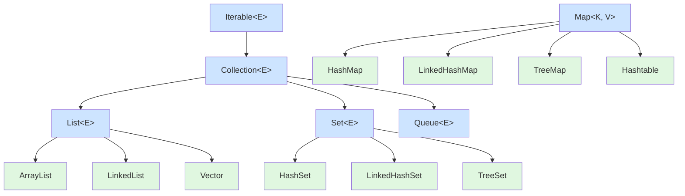

###### 1. 简单说说 List, Set, Map 三者的区别？
理解这三者的区别是掌握Java集合框架的基础。下面的表格直观地展示了它们最核心的特性和常用实现类。

|特性|List|Set|Map|
|---|---|---|---|
|**核心特征**​|**有序、可重复**的序列|**不可重复**的集合|**键值对（Key-Value）**​ 映射|
|**元素顺序**​|保持插入顺序|大多数无序（但`LinkedHashSet`保持顺序，`TreeSet`按排序）|大多数无序（但`LinkedHashMap`保持顺序，`TreeMap`按键排序）|
|**元素重复性**​|允许重复元素|**不允许**重复元素（依据`equals()`方法判断）|**Key**不允许重复，**Value**允许重复|
|**空值（null）**​|通常允许多个`null`|通常最多允许一个`null`（`TreeSet`不允许）|不同实现类不同（`HashMap`允许一个`null`键和多个`null`值，`Hashtable`不允许）|
|**常用实现类**​|`ArrayList`, `LinkedList`, `Vector`|`HashSet`, `LinkedHashSet`, `TreeSet`|`HashMap`, `LinkedHashMap`, `TreeMap`, `Hashtable`|

**简要总结**：
- 当你需要维护元素的添加顺序，并且不关心重复时，使用 **List**。
- 当你需要确保元素的**唯一性**时，使用 **Set**。
- 当你需要通过一个**键（Key）​ 来高效地查找、更新或删除对应的**值（Value）**​ 时，使用 Map**。
###### 2. 说说 Collection 和 Collections 的区别？
- **Collection**：是一个**根接口**（`interface`）。它是整个集合框架的基石，代表一组对象的集合。`List`和`Set`都是它的直接子接口。它定义了集合类最基本的操作规范，如`add()`, `remove()`, `size()`, `iterator()`等。你不能直接创建`Collection`的实例，但可以用它的子接口（如`List<String> list = new ArrayList<>()`）来声明变量，这是一种面向接口编程的良好实践。
- **Collections**：是一个**工具类**（`utility class`）。它包含了一系列用于操作集合（如`List`, `Set`）的**静态方法**。这个类不能被实例化（构造器是私有的），你直接通过类名调用它的方法即可。它提供的方法非常实用，主要包括：
    - **排序**：`sort(List<T> list)`。
    - **线程安全包装**：`synchronizedList(List<T> list)`，将非线程安全的集合转换为线程安全的版本。
    - **创建不可修改集合**：`unmodifiableList(List<? extends T> list)`，用于创建只读集合。
    - **查找和替换**：如`binarySearch()`（二分查找）、`reverse()`（反转）、`max()`/`min()`（查找最大/最小值）等。
**核心记忆点**：**`Collection`是接口（定义规范），`Collections`是工具类（提供方法）**。
###### 3. Java 集合框架的层次结构是怎样的？
Java集合框架是一个设计精良的、用于表示和操作集合的类库体系。其核心接口的继承与实现关系，可以通过下图清晰地展示：

从图中可以看出：
- 最顶层的 `Iterable`接口定义了获取迭代器（`Iterator`）的能力，从而实现增强for循环。
- `Collection`接口继承自 `Iterable`，其下主要有三大分支：**List**（有序可重复）、**Set**（不可重复）和**Queue**（队列，FIFO等）。
- **Map**​ 是一个独立的接口，它存储的是键值对（Key-Value），并不继承自 `Collection`。
###### 4. Iterable 和 Iterator 接口有什么区别？
这两者共同支撑了Java集合的遍历，但职责不同。
- **Iterable**：这是一个接口。如果一个类实现了`Iterable`接口，就表示它是"可迭代的"。它只定义了一个核心方法：`Iterator<T> iterator()`，用于返回一个`Iterator`对象。我们常用的`for-each`循环（如`for (String s : list)`）就是基于`Iterable`接口工作的。`Collection`接口继承自`Iterable`，所以所有集合（List, Set, Queue）都是可迭代的。
- **Iterator**：这也是一个接口，是真正的**迭代器**。它提供了遍历集合元素的具体方法：
    - `boolean hasNext()`：判断是否还有下一个元素。
    - `E next()`：返回下一个元素。
    - `void remove()`：从底层集合中移除当前元素（可选操作）。我们通常通过`Iterator`来遍历集合，并可以在遍历过程中安全地移除元素。
**关系**：`Iterable`表示“我能够提供一个迭代器（`Iterator`），而`Iterator` 则是真正执行遍历操作的那个对象。
###### 5. 如何选择合适的集合类？
选择正确的集合类对程序的性能和正确性至关重要。以下是一份实用的选择指南：

| 需求场景                  | 推荐选择                                                                               | 理由                                                                    |
| --------------------- | ---------------------------------------------------------------------------------- | --------------------------------------------------------------------- |
| **需要快速随机访问（通过索引）**​   | **`ArrayList`**​                                                                   | 基于数组实现，类似增强版数组，通过索引直接定位元素，速度极快。                                       |
| **需要频繁在中间位置插入/删除**​   | **`LinkedList`**​                                                                  | 基于双向链表实现，插入删除只需改变指针，效率高。还可作为队列或双端队列使用。                                |
| **需要元素唯一，不关心顺序**​     | **`HashSet`**​                                                                     | 基于哈希表实现，查询和插入速度最快（平均O(1)），无序。                                         |
| **需要元素唯一，且保留插入顺序**​   | **`LinkedHashSet`**​                                                               | 在`HashSet`基础上增加了链表，维护了插入顺序。                                           |
| **需要元素唯一，且自然排序**​     | **`TreeSet`**​                                                                     | 基于红黑树实现，元素会自动排序，但效率相对较低（O(log n)）。                                    |
| **键值对存储，需要最快访问速度**​   | **`HashMap`**​                                                                     | 基于哈希表实现，通过键（Key）查找值（Value）效率最高。                                       |
| **键值对存储，需要保留键的插入顺序**​ | **`LinkedHashMap`**​                                                               | 在`HashMap`基础上维护了插入顺序或访问顺序（LRU）。                                       |
| **键值对存储，需要按键自然排序**​   | **`TreeMap`**​                                                                     | 基于红黑树，键（Key）会按顺序排列。                                                   |
| **多线程环境，需要线程安全**​     | **`ConcurrentHashMap`**（替代`Hashtable`）   **`CopyOnWriteArrayList`**（替代`Vector`） | Java 5+提供了更高效的并发集合，性能远优于早期的`synchronized`包装类（如`Vector`, `Hashtable`）。 |

**最佳实践**：在声明变量时，**优先使用接口类型**，如 `List<String> list = new ArrayList<>();`。这样在需要更换实现时非常灵活。
###### 6. 集合和数组的区别是什么？
尽管都用于存储多个元素，但集合和数组有本质区别：

| 特性        | 数组（Array）                             | 集合（Collection）                                           |
| --------- | ------------------------------------- | -------------------------------------------------------- |
| **容量**​   | **固定长度**，一旦创建不可改变。                    | **动态增长**，可根据需要自动扩容。                                      |
| **功能**​   | 功能简单，仅提供有限的`length`属性和下标操作`[ ]`。      | 功能丰富，提供了各种操作（增删改查、排序、遍历等）。                               |
| **元素类型**​ | 可以存储基本数据类型（如`int`）和对象。                | 只能存储**对象**（但通过自动装箱/拆箱可以方便地处理基本类型，如`ArrayList<Integer>`）。 |
| **安全性**​  | 编译期类型检查不够安全（例如`ArrayStoreException`）。 | 通过**泛型**在编译期提供严格的类型检查，更安全。                               |
| **底层技术**​ | 是Java语言最基础的结构。                        | 是基于数组、链表、红黑树等数据结构构建的高级API。                               |

简单来说，**集合是对数组的增强和封装，提供了更强大、更便捷的功能**。在现代Java开发中，除非对性能有极致要求或特定场景，否则**优先使用集合**。