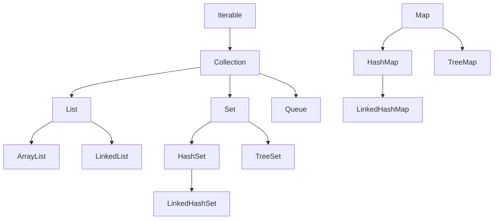

###### 1. 简单说说 List、Set、Map 三者的区别？

[[../../../20_JavaKnowledge/02_集合框架/01、集合框架总览#一、集合框架体系结构|📖]]
这三者是Java集合框架里最核心的三种数据结构，搞清楚它们的区别是用好集合的第一步。

**List** 是有序、可重复的序列。它保持元素的插入顺序，而且同一个元素可以出现多次。最常用的实现是 `ArrayList` 和 `LinkedList`。当你需要按顺序存放东西，不管有没有重复，就用 List。

**Set** 是不可重复的集合，核心特点就是去重。Set 里的元素不能有重复的（判断重复依赖 `equals()` 和 `hashCode()`）。大多数 Set 是无序的，但 `LinkedHashSet` 保持插入顺序，`TreeSet` 按自然顺序或自定义顺序排列。当你需要确保元素唯一性时，就用 Set。

**Map** 存储的是键值对（Key-Value）。Key 不能重复，Value 可以重复。常用的有 `HashMap`（无序、最快）、`LinkedHashMap`（保持插入顺序）、`TreeMap`（按 Key 排序）。当你需要通过一个 Key 来快速找到对应的 Value 时，就用 Map。

一句话总结：**需要有序可重复用 List，需要唯一性用 Set，需要键值映射用 Map**。

###### 2. 说说 Collection 和 Collections 的区别？

[[../../../20_JavaKnowledge/02_集合框架/01、集合框架总览#五、Collections 工具类|📖]]
这俩就差了一个字母，但本质完全不同，面试经常考。

**Collection** 是一个**接口**，是整个集合框架的根接口。`List`、`Set`、`Queue` 都是它的子接口。它定义了集合最基本的操作规范，比如 `add()`、`remove()`、`size()`、`iterator()` 等。你不会直接 `new Collection()`，但可以用它来声明变量，体现了面向接口编程的思想。

**Collections** 是一个**工具类**，构造器是私有的，不能被实例化，里面全是静态方法。它提供了一堆操作集合的工具方法：
- `sort()` 排序
- `shuffle()` 随机打乱
- `reverse()` 反转
- `binarySearch()` 二分查找
- `synchronizedList()` 把非线程安全的 List 包装成线程安全的
- `unmodifiableList()` 创建只读集合

记忆口诀：**Collection 是接口定规范，Collections 是工具类干实活**。

###### 3. Java 集合框架的层次结构是怎样的？

[[../../../20_JavaKnowledge/02_集合框架/01、集合框架总览#一、集合框架体系结构|📖]]
Java集合框架设计得非常精良，整体分两条线：

第一条线是 **Collection 体系**，最顶层是 `Iterable` 接口（定义了可以用 for-each 遍历的能力），`Collection` 继承自它，然后分三大分支：
- **List** → ArrayList、LinkedList、Vector
- **Set** → HashSet（→ LinkedHashSet）、TreeSet
- **Queue** → PriorityQueue、LinkedList、各种 BlockingQueue

第二条线是 **Map 体系**，独立于 Collection，不继承它。常见实现有 HashMap（→ LinkedHashMap）、TreeMap、Hashtable、ConcurrentHashMap。

```mermaid
graph TD
    I[Iterable] --> C[Collection]
    C --> L[List]
    C --> S[Set]
    C --> Q[Queue]
    L --> AL[ArrayList]
    L --> LL[LinkedList]
    S --> HS[HashSet]
    S --> TS[TreeSet]
    HS --> LHS[LinkedHashSet]
    M[Map] --> HM[HashMap]
    M --> TM[TreeMap]
    HM --> LHM[LinkedHashMap]
```

**Map 不属于 Collection 体系**，这是很多人容易搞混的地方，记住了。

###### 4. Iterable 和 Iterator 接口有什么区别？

[[../../../20_JavaKnowledge/02_集合框架/01、集合框架总览#三、迭代器模式|📖]]
这俩名字很像，但职责不一样。

**Iterable** 是"可迭代的"接口，实现它意味着这个类能被 for-each 遍历。它只有一个核心方法：`iterator()`，用来返回一个 Iterator 对象。Collection 继承自 Iterable，所以所有集合都能用 for-each。

**Iterator** 是真正的迭代器，负责具体的遍历动作。它有三个方法：
- `hasNext()` — 还有没有下一个？
- `next()` — 给我下一个
- `remove()` — 把当前元素从集合里删掉（在遍历中安全删除的唯一方式）

两者关系：**Iterable 是"我能给你一个迭代器"，Iterator 是"那个真正干遍历活儿的"**。

###### 5. 如何选择合适的集合类？

[[../../../20_JavaKnowledge/02_集合框架/01、集合框架总览#七、集合选型指南|📖]]
选集合类的核心思路是先搞清楚你的需求：

- **只是存数据、按顺序读** → `ArrayList`，大多数场景的首选
- **频繁在中间插入删除** → `LinkedList`（不过实际情况 ArrayList 也差不太多）
- **需要去重，不关心顺序** → `HashSet`，最快
- **去重且需要保持插入顺序** → `LinkedHashSet`
- **去重且需要自动排序** → `TreeSet`
- **键值对，查询快** → `HashMap`
- **键值对，需要保持插入顺序** → `LinkedHashMap`
- **键值对，需要按 Key 排序** → `TreeMap`
- **多线程环境** → `ConcurrentHashMap`（替代 Hashtable）、`CopyOnWriteArrayList`（替代 Vector）

**最佳实践**：声明变量时用接口类型，比如写 `List<String> list = new ArrayList<>()` 而不是 `ArrayList<String> list`。这样换实现的时候改一处就够了，不会满地找替换。

###### 6. 集合和数组的区别是什么？

[[../../../20_JavaKnowledge/02_集合框架/01、集合框架总览#一、集合框架体系结构|📖]]
两者最本质的区别是**数组长度固定，集合长度可变**。

**数组**创建的时候必须指定长度，之后不能改变。只能存固定数量的元素。功能也很简单，就是下标访问和 length 属性。它可以存基本类型（int、double 等）。

**集合**是动态的，可以随时 add、remove，会自动扩容。功能丰富，排序、查找、转换都有现成的方法。不过集合只能存对象，不能存基本类型（但有自动装箱帮你转）。泛型加持下，类型安全有保障。

实际开发中，除非是数值计算这种对性能极度敏感的场景，或者长度确定不变，否则**优先用集合**，更灵活、更安全、功能更强。
