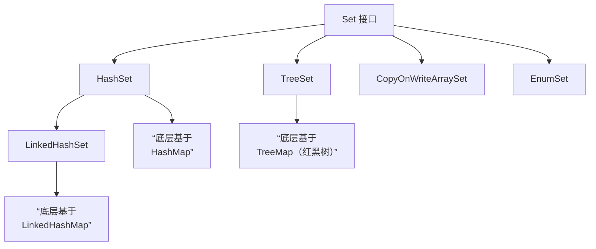

###### 1. HashSet 的实现原理是什么？
`HashSet`的核心实现原理是**基于 `HashMap`的键（Key）来存储元素**。
- **内部封装**：当你创建一个 `HashSet`时，其内部实际上封装了一个 `HashMap`实例。默认初始容量是16，负载因子是0.75。
- **值存储**：当您调用 `hashSet.add(element)`时，这个 `element`会被放入底层 `HashMap`的 **Key**​ 上。而 `HashMap`的 **Value**​ 则统一指向一个静态的、不可变的虚拟对象，名为 `PRESENT`。
- 源码如下：
 ```java
    // HashSet 的核心成员变量
    private transient HashMap<E,Object> map;
    private static final Object PRESENT = new Object();
    
    // add 方法的实现
    public boolean add(E e) {
        return map.put(e, PRESENT) == null; // 如果map的put方法返回null，表示添加成功
    }
    ```
- **操作委托**：因此，`HashSet`的所有操作，如 `add`, `remove`, `contains`，本质上都是直接调用底层 `HashMap`的相应方法完成的。
###### 2. HashSet 如何保证元素不重复？
这正是 `HashSet`设计的精妙之处。由于它使用了 `HashMap`的 Key 来存储元素，而 `HashMap`的 **Key 是唯一的**。所以，`HashSet`的不重复性完全依赖于 `HashMap`对 Key 的唯一性判断逻辑。
当添加一个新元素 `e`时，底层 `HashMap`会进行如下判断：
1. **计算哈希值**：首先调用 `e`的 `hashCode()`方法计算哈希值，据此定位到数组中的桶（bucket）位置。
2. **检查哈希冲突**：如果该桶为空，直接存入，添加成功。
3. **解决哈希冲突**：如果该桶不为空（发生哈希冲突），则调用 `e`的 `equals()`方法，与该桶内已存在的所有 Key 进行比较：
    - 如果 `equals()`返回 `true`，则认为 Key 已存在，新元素添加失败。
    - 如果 `equals()`返回 `false`，则会将新元素以链表或树的形式加入该桶。
**因此，如果要将自定义类的对象放入 `HashSet`并正确去重，重写 `hashCode()`和 `equals()`方法至关重要**​。必须确保两个相等的对象（`equals()`返回 `true`）具有相同的哈希码（`hashCode()`返回值相等）。
###### 3. HashSet、LinkedHashSet 和 TreeSet 有什么区别？
这三种 Set 的主要区别在于底层数据结构、元素顺序和性能，具体对比如下：

|特性|HashSet|LinkedHashSet|TreeSet|
|---|---|---|---|
|**底层数据结构**​|基于 `HashMap`（哈希表）|继承自 `HashSet`，基于 `LinkedHashMap`（哈希表+双向链表）|基于 `TreeMap`（红黑树）|
|**元素顺序**​|**不保证**任何顺序，无序|保证元素的**插入顺序**​|保证元素处于**排序状态**（自然排序或定制排序）|
|**性能特点**​|添加、删除、查找最快（平均 O(1)）|性能略低于 `HashSet`，但迭代访问效率高|添加、删除、查找较慢（O(log n)），但有序|
|**`null`元素**​|**允许**一个 `null`元素|**允许**一个 `null`元素|**不允许**（取决于比较器，自然排序下不允许）|
|**线程安全**​|非线程安全|非线程安全|非线程安全|

**选择指南**：
- **`HashSet`**：**默认选择**。当您对元素的顺序没有要求，只关心唯一性和高性能时。
- **`LinkedHashSet`**：当您需要**按照元素添加的顺序进行迭代**时使用。例如，需要维护一个去重后的访问记录列表。
- **`TreeSet`**：当您需要元素**自动排序**时使用。例如，需要创建一个有序且不重复的集合。
###### 4. TreeSet 的排序规则是什么？
`TreeSet`的排序规则主要有两种：
1. **自然排序 (Natural Ordering)**：
    - 添加到 `TreeSet`中的元素类必须实现 `java.lang.Comparable`接口。
    - `TreeSet`会通过调用元素的 `compareTo(Object o)`方法来比较元素的大小，并据此进行排序。
    - 如果尝试添加未实现 `Comparable`接口的对象，会在运行时抛出 `ClassCastException`。
2. **定制排序 (Custom Ordering)**：
    - 在创建 `TreeSet`时，可以传入一个实现了 `java.util.Comparator`接口的比较器对象。
    - `TreeSet`会使用这个 `Comparator`的 `compare(Object o1, Object o2)`方法来比较元素，而不再要求元素类实现 `Comparable`接口。这为排序规则提供了更大的灵活性。
**重要原则**：为了保证排序的准确性，**`compareTo`（或 `compare`）方法与 `equals`方法的逻辑必须保持一致**。即当 `x.compareTo(y) == 0`时，应有 `x.equals(y)`为 `true`。
###### 5. HashSet 和 HashMap 的区别是什么？
|特性|HashSet|HashMap|
|---|---|---|
|**实现接口**​|实现 `Set`接口|实现 `Map`接口|
|**存储内容**​|存储**单个对象**​|存储**键值对 (Key-Value pairs)**​|
|**添加方法**​|`add(element)`|`put(key, value)`|
|**重复性保证**​|通过存储的**元素本身**保证唯一性|通过 **Key**​ 保证唯一性，**Value**​ 可以重复|
|**底层依赖**​|基于 `HashMap`实现|是独立的实现，是 `HashSet`的基础|

简单来说，**`HashSet`本身就是基于 `HashMap`的一个特化和封装**，它利用 `Map`的 Key 唯一性来实现了 Set 的元素不重复特性。
###### 6. 如何实现一个线程安全的 Set？CopyOnWriteArraySet 的特点是什么？
标准的 `HashSet`, `TreeSet`, `LinkedHashSet`都是**非线程安全**的。在多线程环境下，如果多个线程同时修改一个 Set，可能会导致数据不一致或其他未定义行为。
解决方案主要有两种：
1. **使用 `Collections.synchronizedSet()`包装**：
```java
    Set<String> syncSet = Collections.synchronizedSet(new HashSet<>());
    ```
该方法会返回一个同步包装器类，它使用同步块来保证方法级别的线程安全。性能有损耗，因为每个方法调用都需要获取锁。
2. **使用 `java.util.concurrent.CopyOnWriteArraySet`**：
    - **原理**：这是 JUC 包下提供的一个线程安全的 Set。其核心思想是 **"写时复制"**。每当需要修改集合（如 add, remove）时，它会先将底层数组完整地复制一份，然后在新数组上进行修改，修改完成后再将数组引用指向新数组。而读操作（如 contains, iterator）则完全无锁，直接在当前数组快照上进行。
    - **特点与应用场景**：
        - **优点**：**非常适合读多写少**的并发场景。因为读操作非常快，且不需要加锁，多个线程可以并发读而不会阻塞。
        - **缺点**：
            - **内存开销大**：每次写操作都会复制整个底层数组。
            - **数据最终一致性**：读操作可能无法立即读到最新写入的数据，因为它读取的是写操作开始前的数组快照。
            - **写性能差**：写操作（尤其是频繁修改）的开销非常大。
###### 8. EnumSet 是什么？有什么优势？
`EnumSet`是一个专门为**枚举类型**设计的高性能 Set 实现。
- **优势**：
    - **极致性能**：内部使用位向量（bit vector）实现，非常紧凑和高效。所有的基本操作（如 add, remove, contains）都在常数时间内完成，甚至比 `HashSet`还要快。
    - **类型安全**：与泛型完美结合，保证了类型安全。
    - **丰富的静态工厂方法**：提供了如 `of`, `range`, `allOf`等方法，方便创建包含指定枚举值的集合。
- **应用场景**：当需要存储某个枚举类型的值时，**应优先考虑使用 `EnumSet`**。