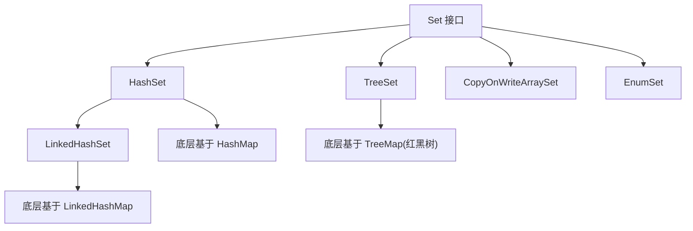

```mermaid
flowchart TD
    A[Set 接口] --> B[HashSet]
    A --> C[TreeSet]
    A --> D[CopyOnWriteArraySet]
    A --> E[EnumSet]
    B --> F[LinkedHashSet]
    B --> G["底层基于 HashMap"]
    F --> H["底层基于 LinkedHashMap"]
    C --> I["底层基于 TreeMap(红黑树)"]

```

###### 1. HashSet 的实现原理是什么？

[[../../../20_JavaKnowledge/02_集合框架/08、HashSet与TreeSet#二、HashSet 深度解析|📖]]
HashSet 的底层完全依赖 HashMap 实现，说白了 **HashSet 就是只用 Key 的 HashMap**。

当你创建一个 `HashSet` 时，它内部会创建一个 `HashMap` 实例（默认初始容量16，负载因子0.75）。调用 `hashSet.add(element)` 的时候，其实是把 element 作为 Key，放进这个内部的 HashMap，Value 统一是一个静态的占位对象 `PRESENT`（就是 `new Object()`）。

```java
private transient HashMap<E,Object> map;
private static final Object PRESENT = new Object();

public boolean add(E e) {
    return map.put(e, PRESENT) == null;
}
```

所以 HashSet 的 `add`、`remove`、`contains` 本质上都是调用 HashMap 对应的方法完成的。

###### 2. HashSet 如何保证元素不重复？

[[../../../20_JavaKnowledge/02_集合框架/08、HashSet与TreeSet#二、HashSet 深度解析|📖]]
依赖 HashMap 的 Key 唯一性来保证。每次 add 一个元素，底层 HashMap 会：

1. 先计算元素的 `hashCode()`，定位到对应的桶（bucket）
2. 如果桶为空，直接放进去，添加成功
3. 如果桶不为空（哈希冲突了），就用 `equals()` 方法与桶内已有的元素逐一比较：
   - `equals()` 返回 true → 认为是同一个元素，添加失败，返回 false
   - `equals()` 返回 false → 以链表或树节点形式追加进去

**因此，自定义类放入 HashSet 时，必须同时重写 `hashCode()` 和 `equals()` 方法**，而且两者的逻辑要一致：两个相等的对象（equals 为 true）必须有相同的 hashCode，否则去重就会失效。

###### 3. HashSet、LinkedHashSet 和 TreeSet 有什么区别？

[[../../../20_JavaKnowledge/02_集合框架/08、HashSet与TreeSet#五、三种 Set 对比|📖]]
三者都是 Set 的实现，核心区别在于**底层结构和元素顺序**。

**HashSet** 底层是 HashMap（哈希表）。无序，元素没有任何固定顺序，但性能最好，增删查都是平均 O(1)。允许存一个 null。是大多数场景下的首选。

**LinkedHashSet** 继承自 HashSet，底层是 LinkedHashMap（哈希表 + 双向链表）。性能略低于 HashSet，但**迭代时能按插入顺序输出**。允许存一个 null。当你需要去重但又想保留插入顺序时用它。

**TreeSet** 底层是 TreeMap（红黑树）。**元素自动有序**（自然顺序或自定义比较器），增删查都是 O(log n)，比前两者慢。**不允许存 null**（null 无法比较大小）。当你需要一个有序的去重集合时用它。

选哪个取决于需求：只要去重就 HashSet，要去重加保持插入顺序就 LinkedHashSet，要去重加自动排序就 TreeSet。

###### 4. TreeSet 的排序规则是什么？

[[../../../20_JavaKnowledge/02_集合框架/08、HashSet与TreeSet#四、TreeSet 深度解析|📖]]
TreeSet 的排序有两种方式：

**自然排序**：TreeSet 里的元素类必须实现 `Comparable` 接口，TreeSet 会调用元素的 `compareTo()` 方法来比较大小。`String`、`Integer` 等常用类已经实现了 Comparable，所以直接放进去就能排。如果放入没有实现 Comparable 的类，运行时会抛 `ClassCastException`。

**定制排序**：创建 TreeSet 时传入一个 `Comparator` 比较器，之后所有比较都用这个比较器来做，不再要求元素类本身实现 Comparable。这种方式更灵活，可以随时换排序规则。

**重要原则**：`compareTo`（或 `compare`）的结果必须与 `equals` 一致，即 compareTo 返回0时，equals 也应该返回 true。不一致的话在 TreeSet 里会出问题，比如两个 equals 相等的对象可能都被加进去了。

###### 5. HashSet 和 HashMap 的区别是什么？

[[../../../20_JavaKnowledge/02_集合框架/08、HashSet与TreeSet#二、HashSet 深度解析|📖]]
核心区别是**接口不同，存储方式不同**：

HashSet 实现的是 `Set` 接口，存储的是单个对象，用 `add(element)` 添加，通过元素本身保证唯一性。

HashMap 实现的是 `Map` 接口，存储的是键值对，用 `put(key, value)` 添加，通过 Key 保证唯一性，Value 可以重复。

底层依赖关系：**HashSet 就是基于 HashMap 实现的**，HashSet 把元素当作 HashMap 的 Key 来存，Value 统一是个占位符 PRESENT。

###### 6. 如何实现一个线程安全的 Set？CopyOnWriteArraySet 的特点是什么？

[[../../../20_JavaKnowledge/02_集合框架/10、并发集合全览（CopyOnWriteArrayList等）#一、为什么需要并发集合|📖]]
标准的 HashSet、TreeSet 都不是线程安全的，主要有两种解决方案：

**方案一**：`Collections.synchronizedSet(new HashSet<>())` 包装成同步 Set。每个方法都加 synchronized，简单但性能差，高并发下是瓶颈。

**方案二**：用 `CopyOnWriteArraySet`。它的实现原理和 CopyOnWriteArrayList 一样：**写操作（add、remove）先把底层数组复制一份，在新数组上修改，改完再把引用切过去。读操作完全无锁，直接读当前数组快照**。

优点：读非常快，没有锁竞争，适合读多写少的场景，比如功能开关集合、权限白名单等。

缺点：写操作代价高（要复制整个数组），内存占用大；读到的数据可能有延迟（不是强一致性）；不适合写频繁的场景。

###### 7. EnumSet 是什么？有什么优势？

[[../../../20_JavaKnowledge/02_集合框架/08、HashSet与TreeSet#一、Set 体系概览|📖]]
EnumSet 是专门为**枚举类型**设计的 Set 实现，性能极佳。

它内部用**位向量（bit vector）**实现，每个枚举值对应一个二进制位，增删查只需位运算，速度比 HashSet 还快，而且非常节省内存。

常用的静态工厂方法：
- `EnumSet.of(E1, E2, E3)` — 指定包含哪些枚举值
- `EnumSet.allOf(MyEnum.class)` — 包含所有枚举值
- `EnumSet.noneOf(MyEnum.class)` — 空集合
- `EnumSet.range(E1, E5)` — 范围内的枚举值

**原则上，只要 Set 里存的是枚举类型，就优先用 EnumSet**，性能和可读性都最好。
