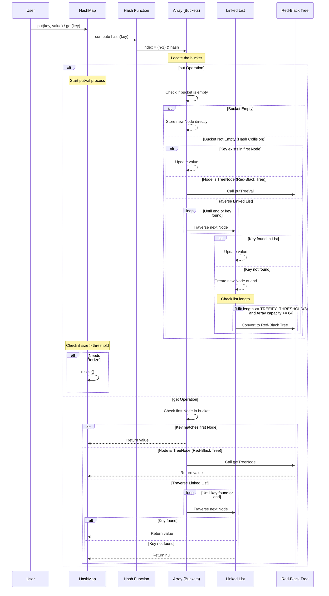

###### 1. HashMap 的实现原理是什么？
HashMap 的底层实现是“数组 + 链表 + 红黑树”的组合。您可以将其理解为一个“桶数组”，每个桶（数组元素）可以用来存放键值对。
- **数组（桶）**：主干，用于快速定位，默认初始大小为 16。
- **链表**：解决哈希冲突。当不同的键通过哈希计算落到同一个桶时，会以链表形式存储（拉链法）。
- **红黑树**：优化长链表查询。当链表长度超过阈值（默认为8）且数组容量达到一定值（默认为64）时，链表会转为红黑树，将查询效率从 O(n) 提升到 O(log n)。
为了更直观地理解其核心操作流程，我们可以参考下面的序列图，它描绘了 `put`和 `get`方法的关键步骤：


###### 2. HashMap 的 put 方法的执行流程？
`put`方法的详细步骤与上图的左侧流程一致，核心步骤包括：
1. **计算哈希**：使用 `hash(key)`方法计算键的哈希值，目的是为了均匀分布。
2. **定位桶**：通过 `(数组长度 - 1) & hash`计算键值对应在数组中的索引位置。
3. **处理冲突**：
    - 若桶为空，直接放入新节点。
    - 若桶不为空，则检查第一个节点：若键相同则覆盖值；若为树节点，调用红黑树方法；否则遍历链表，若找到相同键则覆盖，否则尾部插入新节点。
4. **转换树**：插入后若链表长度超8且数组容量≥64，链表转为红黑树。
5. **判断扩容**：插入后若键值对数量超过扩容阈值，则进行扩容。
###### 3. HashMap 的扩容机制是怎样的？
当 HashMap 中的元素数量超过（容量 × 负载因子）时，会自动触发扩容。
- **扩容过程**：创建一个新的、更大的数组（通常是原大小的2倍），然后重新计算每个元素在新数组中的位置，并将元素转移过去。这是一个相对耗时的操作。
- **高效重哈希**：由于容量总是 2 的幂次方，扩容后元素的新位置要么是**原位置**，要么是**原位置 + 旧容量**。这使得重哈希时无需重新计算哈希值，只需判断哈希值新增参与运算的位是0还是1即可，非常高效。
###### 4. HashMap 为什么线程不安全？
HashMap 在设计上未考虑同步，在多线程并发环境下使用主要存在以下问题：
- **数据覆盖**：多个线程同时执行 `put`操作，可能导致后一个线程覆盖前一个线程放入的值，造成数据丢失。
- **环形链表（JDK 1.7）**：在扩容过程中，线程不安全的转移操作可能导致链表形成环，进而引起后续的 `get`操作出现无限循环。
- **数据不一致**：一个线程在遍历，另一个线程在修改，可能会抛出 `ConcurrentModificationException`异常。
###### 5. HashMap 和 Hashtable 的区别？
| 特性            | HashMap                                              | Hashtable                                      |
| ------------- | ---------------------------------------------------- | ---------------------------------------------- |
| **线程安全**​     | **非线程安全**，性能更高。                                      | **线程安全**，方法使用 `synchronized`修饰，性能较低。           |
| **Null 键/值**​ | **允许**一个 `null`键和多个 `null`值。                         | **不允许**键或值为 `null`，会抛出 `NullPointerException`。 |
| **继承体系**​     | 是 Java Collections Framework 的一部分，继承自 `AbstractMap`。 | 是遗留类，继承自陈旧的 `Dictionary`类。                     |
| **迭代器**​      | 是 **fail-fast**​ 的。                                  | 是 **fail-fast**​ 的。                            |

**结论**：Hashtable 是过时的类，不应在新代码中使用。 需要线程安全时，应使用 `ConcurrentHashMap`；不需要线程安全时，使用 `HashMap`。
###### 6. HashMap 和 TreeMap 的区别？
|特性|HashMap|TreeMap|
|---|---|---|
|**底层结构**​|哈希表。|**红黑树**（自平衡的二叉搜索树）。|
|**元素顺序**​|**不保证**顺序（迭代顺序可能会变化）。|元素根据键的**自然顺序**或提供的 **Comparator**​ 进行**排序**。|
|**性能**​|插入、删除、查找的平均时间复杂度为 **O(1)**。|插入、删除、查找的时间复杂度为 **O(log n)**。|
|**Null 键**​|允许一个 `null`键。|不支持 `null`键（取决于排序规则）。|

**应用场景**：如果需要快速的键值查询且不关心顺序，用 `HashMap`；如果需要元素始终保持有序状态，用 `TreeMap`。
###### 7. HashMap 和 LinkedHashMap 的区别？
`LinkedHashMap`是 `HashMap`的子类。
- **`HashMap`**：不保证迭代顺序。
- **`LinkedHashMap`**：**维护着一个贯穿所有条目的双向链表**。这使得它可以保持元素的**插入顺序**（order of insertion）或**访问顺序**（order of access，即 LRU - Least Recently Used 算法的体现）。因此，在迭代 `LinkedHashMap`时，顺序是可以预测的。
###### 8. ConcurrentHashMap 的实现原理？
`ConcurrentHashMap`是 HashMap 的线程安全版本。
- **JDK 1.7**：采用 **分段锁（Segment）​机制。容器里包含一个 `Segment`数组，每个 `Segment`本身就是一个线程安全的哈希表。锁的粒度是段，不同的段上的操作可以并发进行。
- **JDK 1.8 及之后**：进行了重大优化，放弃了 `Segment`，改用 **`synchronized`锁桶数组的头节点**（链表头或红黑树根节点）的方式实现同步。同时结合 CAS（Compare-And-Swap） 操作，使得锁的粒度更细，并发性能更高。
###### 9. ConcurrentHashMap 在 JDK 1.7 和 1.8 中的区别？
| 特性        | JDK 1.7                           | JDK 1.8                                      |
| --------- | --------------------------------- | -------------------------------------------- |
| **底层结构**​ | **数组 + 链表**，分段锁（`ReentrantLock`）。 | **数组 + 链表 + 红黑树**，锁头节点（`synchronized`+ CAS）。 |
| **锁粒度**​  | 锁住整个 **Segment**（包含多个桶）。          | 只锁住单个**桶**（链表或树的头节点），粒度更小，并发性更好。             |
| **并发度**​  | 由 `Segment`的数量决定，创建后不可改变。         | 并发度理论上最高可达数组的大小，更灵活。                         |
###### 10. 为什么 HashMap 的负载因子是 0.75？
负载因子是权衡时间成本和空间成本的折中结果。
- 若**负载因子过高（如1.0）**：虽然空间利用率高，扩容次数少，但哈希冲突概率大增，查询效率下降。
- 若**负载因子过低（如0.5）**：哈希冲突减少，查询效率高，但空间利用率低，会导致频繁扩容。默认值 **0.75**​ 在时间和空间成本上达到了一个较好的平衡，是一个经过数学统计和实践检验的较优解。
###### 11. HashMap 的初始容量为什么是 2 的幂次方？
这主要是一种优化手段：
- **高效取模**：当容量为 2 的 n 次方时，`h & (length - 1)`操作等价于 `h % length`，但位运算的效率远高于取模运算。
- **减少哈希冲突**：使得 `length - 1`的二进制低位全是1，从而让哈希值的低位直接参与定位，分布更均匀。如果不是2的幂次方，`(length - 1)`的二进制中会有0，导致某些桶位永远无法被使用，增加冲突概率。
- **优化扩容**：如前所述，扩容时元素的新位置计算变得非常简单。
###### 12. HashMap 中的 hash 方法是如何实现的？
`hash(Object key)`方法并非直接使用 key 的 `hashCode()`，而是进行了一次“扰动处理”：
```java
static final int hash(Object key) {
    int h;
    return (key == null) ? 0 : (h = key.hashCode()) ^ (h >>> 16);
}
```
- **右移16位并异或**：将 `hashCode`的高16位与低16位进行异或运算。目的是**将高位的特征混合到低位中**。
- **原因**：因为计算索引时是 `(n-1) & hash`，当 n 较小时，实际上只有哈希值的低位参与了运算。如果直接使用 `hashCode`，高位的变化完全不影响索引，容易造成冲突。扰动后，高位的特征也参与了进来，从而**降低了哈希冲突的概率**​。
###### 13. HashMap 如何解决哈希冲突？
HashMap 主要使用**拉链法**（Separate Chaining）来解决哈希冲突。当多个键映射到同一个桶时，它们会以链表的形式存储在该桶中。当链表过长影响查询效率时，会进一步转换为红黑树以提升性能。
###### 14. 什么时候链表会转换为红黑树？
需要**同时满足两个条件**​：
1. **链表长度达到阈值**：`TREEIFY_THRESHOLD`，默认为 **8**。
2. **HashMap 的数组容量达到最小值**：`MIN_TREEIFY_CAPACITY`，默认为 **64**。
如果链表长度达到8但数组容量小于64，HashMap 会选择先进行扩容（`resize`），而不是立即树化，因为扩容本身可能就会减少链表的长度。这是一种在性能和结构复杂性之间的平衡。
###### 15. TreeMap 的排序规则是什么？
`TreeMap`的排序规则有两种指定方式：
1. **自然排序**：如果存储的键（Key）的类实现了 `Comparable`接口（如 `String`, `Integer`），`TreeMap`会使用其 `compareTo`方法进行排序。
2. **定制排序**：在创建 `TreeMap`时，可以传入一个自定义的 `Comparator`比较器对象，来指定键的排序规则。
###### 16. Java 中的 WeakHashMap 是什么？
`WeakHashMap`是一种特殊的 Map，其**键是弱引用（WeakReference）**。
- **特性**：当一个键不再被其他强引用或软引用所指向时（即只剩下 `WeakHashMap`自身的弱引用），该键值对会在下一次垃圾回收（GC）时被自动回收并从 Map 中移除。
- **应用场景**：常用于实现**缓存**或**存储与对象相关的元数据**，当对象本身不再被使用时，其对应的缓存或元数据能够自动被清理，防止内存泄漏。