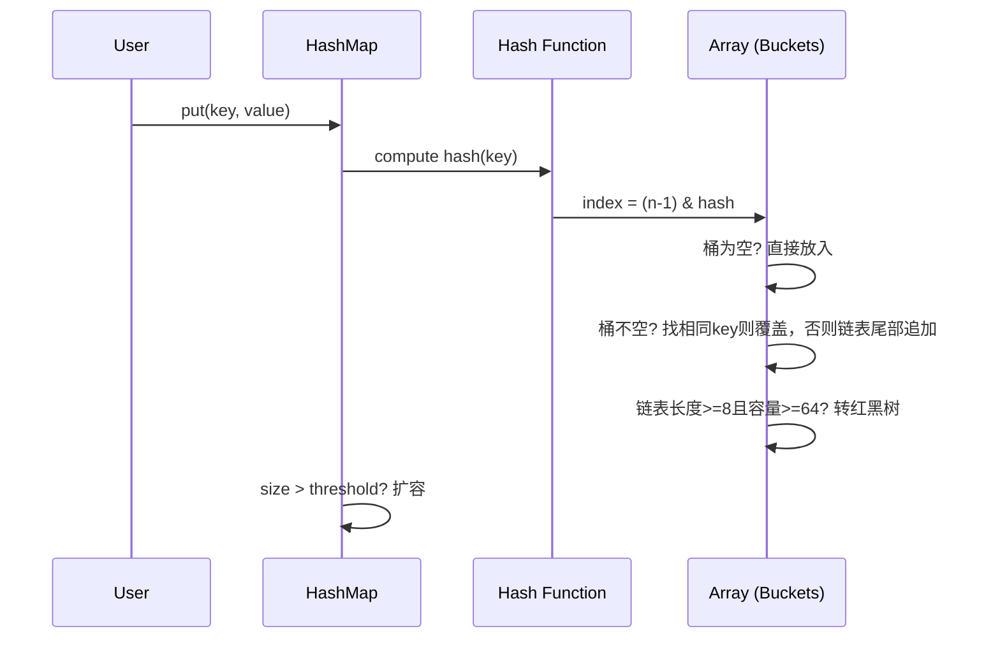

###### 1. HashMap 的实现原理是什么？

[[../../../20_JavaKnowledge/02_集合框架/04、HashMap深度解析#一、整体架构|📖]]
HashMap 的底层是**数组 + 链表 + 红黑树**的组合结构：

- **数组（桶数组）**：主体，默认初始大小16，用于快速定位元素位置
- **链表**：解决哈希冲突，相同桶位的元素以链表形式串起来（拉链法）
- **红黑树**：当链表过长时转化，提升查询效率

put 一个元素的流程：先对 key 做哈希计算，用 `(数组长度-1) & hash` 定位桶的位置；如果桶是空的，直接放；如果桶不空（哈希冲突），遍历链表找有没有相同的 key，有就覆盖 value，没有就追加到链表尾部；插入后如果链表长度超过8且数组长度>=64，链表转成红黑树；如果元素总数超过阈值（容量 × 负载因子），触发扩容。


```mermaid
sequenceDiagram
    participant U as User
    participant HM as HashMap
    participant H as Hash Function
    participant A as Array (Buckets)

    U->>HM: put(key, value)
    HM->>H: compute hash(key)
    H->>A: index = (n-1) & hash
    A->>A: 桶为空? 直接放入
    A->>A: 桶不空? 找相同key则覆盖，否则链表尾部追加
    A->>A: 链表长度>=8且容量>=64? 转红黑树
    HM->>HM: size > threshold? 扩容
```

###### 2. HashMap 的 put 方法的执行流程？

[[../../../20_JavaKnowledge/02_集合框架/04、HashMap深度解析#二、put 方法流程|📖]]
1. **计算哈希**：调用 `hash(key)` 做扰动处理（hashCode 的高16位和低16位异或），让哈希更均匀
2. **定位桶**：`(n-1) & hash` 算出数组下标
3. **处理冲突**：
   - 桶为空 → 直接新建节点放入
   - 桶不空 → 检查第一个节点，key 相同就更新 value；不同则判断是树节点还是链表节点，分别走红黑树插入或链表遍历追加
4. **树化检查**：插入后链表长度超8且数组容量 >= 64，链表转红黑树
5. **扩容检查**：整个 HashMap 的 size 超过 threshold（容量 × 0.75），触发 resize

###### 3. HashMap 的扩容机制是怎样的？

[[../../../20_JavaKnowledge/02_集合框架/04、HashMap深度解析#三、扩容机制|📖]]
当 HashMap 里的元素数量超过**容量 × 负载因子**（默认 16 × 0.75 = 12）时，触发扩容。

**扩容过程**：创建一个新数组，大小是原来的**2倍**，然后把所有元素重新分配到新数组中（rehash）。

**高效重哈希**的设计很巧妙：因为容量始终是2的幂次方，扩容后元素的新位置要么还在**原索引**，要么在**原索引 + 旧容量**。判断条件只需看哈希值的某一位是0还是1，不需要重新计算整个哈希，效率非常高。

频繁扩容是性能杀手，预估数据量时最好指定初始容量，比如要存1000个元素，可以用 `new HashMap<>(2048)` 避免多次扩容（2048 = 1000/0.75 向上取2的幂）。

###### 4. HashMap 为什么线程不安全？

[[../../../20_JavaKnowledge/02_集合框架/04、HashMap深度解析#五、线程安全问题|📖]]
HashMap 没有做任何同步，多线程并发操作时主要有以下问题：

- **数据丢失**：两个线程同时 put，如果恰好定位到同一个空桶，都判断为空然后各自插入，后插入的会覆盖先插入的，导致数据丢失
- **环形链表（JDK 1.7）**：JDK 1.7 扩容时采用头插法，多线程并发扩容会形成链表环，后续 get 操作遭遇死循环，CPU 飙升到100%（JDK 1.8 改为尾插法，消除了这个问题，但仍线程不安全）
- **遍历异常**：一个线程在 for-each，另一个线程在修改，会抛 `ConcurrentModificationException`

所以多线程环境务必换用 `ConcurrentHashMap`。

###### 5. HashMap 和 Hashtable 的区别？

[[../../../20_JavaKnowledge/02_集合框架/04、HashMap深度解析#一、整体架构|📖]]
这两个放在一起比较，其实结论很简单：**Hashtable 是过时的类，新代码不应该用它**。

主要区别是：HashMap 非线程安全、性能高，允许一个 null 键和多个 null 值；Hashtable 线程安全（所有方法加了 synchronized），但性能差，不允许 null 键或 null 值（会抛 NullPointerException）。Hashtable 继承自古老的 `Dictionary` 类，不是 Java Collections Framework 的一部分。

需要线程安全用 `ConcurrentHashMap`，不需要就用 `HashMap`，Hashtable 直接忘掉。

###### 6. HashMap 和 TreeMap 的区别？

[[../../../20_JavaKnowledge/02_集合框架/07、TreeMap与红黑树#一、整体架构|📖]]
核心区别就一个：**HashMap 不保证顺序，TreeMap 自动有序**。

HashMap 底层是哈希表，插入、查询平均 O(1)，速度快，但迭代顺序不固定。允许一个 null 键。

TreeMap 底层是红黑树，元素按 Key 的自然顺序或自定义比较器排序，插入、查询是 O(log n)，比 HashMap 慢。不允许 null 键（因为要比较大小，null 没法比）。

**选择原则**：只需要键值映射就用 HashMap；需要按 Key 有序遍历，或者需要 firstKey、lastKey、subMap 这类范围操作，就用 TreeMap。

###### 7. HashMap 和 LinkedHashMap 的区别？

[[../../../20_JavaKnowledge/02_集合框架/06、LinkedHashMap与LRU#一、LinkedHashMap 整体架构|📖]]
LinkedHashMap 继承自 HashMap，**在 HashMap 的基础上增加了一条贯穿所有节点的双向链表**，用来维护顺序。

HashMap 迭代顺序不可预测；LinkedHashMap 可以按**插入顺序**迭代（默认），也可以按**访问顺序**迭代（构造时传 `accessOrder=true`）。

访问顺序模式下，每次 get 都会把访问的节点移到链表末尾，这天然就是 **LRU（最近最少使用）算法**的实现，稍微改造一下就能做一个 LRU 缓存。

###### 8. ConcurrentHashMap 的实现原理？

[[../../../20_JavaKnowledge/02_集合框架/05、ConcurrentHashMap深度解析#一、整体架构|📖]]
ConcurrentHashMap 是 HashMap 的线程安全版本，但比 Hashtable 高效得多，因为锁的粒度更细。

**JDK 1.7**：采用分段锁（Segment）机制。整个数组被划分成若干个 Segment，每个 Segment 是一个独立的小哈希表，有自己的锁（ReentrantLock）。不同 Segment 上的操作可以并发进行，默认并发度是16。

**JDK 1.8 及之后**：彻底重构，放弃了 Segment，改用 **synchronized 锁单个桶的头节点 + CAS 无锁操作**。锁的粒度从"一段"缩小到"一个桶"，并发度大幅提升，理论上最高并发度等于数组长度。底层结构也和 HashMap 1.8 一样，引入了红黑树优化。

###### 9. ConcurrentHashMap 在 JDK 1.7 和 1.8 中的区别？

[[../../../20_JavaKnowledge/02_集合框架/05、ConcurrentHashMap深度解析#二、JDK 1.7 实现|📖]]
**JDK 1.7**：底层是数组+链表，使用 ReentrantLock 锁住整个 Segment（每个 Segment 包含多个桶）。并发度由 Segment 数量决定，创建后不可改变。

**JDK 1.8**：底层是数组+链表+红黑树，使用 synchronized 锁住单个桶的头节点，同时大量使用 CAS 操作。锁的粒度从 Segment（多桶）降到单个桶，并发性能大幅提升。并发度理论上最高可达数组大小，更灵活。

一句话总结：1.7 是"分段"加锁，1.8 是"分桶"加锁，粒度更细，性能更好。

###### 10. 为什么 HashMap 的负载因子是 0.75？

[[../../../20_JavaKnowledge/02_集合框架/04、HashMap深度解析#三、扩容机制|📖]]
负载因子是在**空间和时间**之间做权衡的结果：

负载因子太高（比如1.0）：空间利用率高，但哈希冲突会很频繁，链表变长，查询变慢。

负载因子太低（比如0.5）：哈希冲突少，查询快，但浪费内存，扩容也更频繁。

0.75 是经过数学统计和实践验证的较优值，在时间和空间上取得了较好的平衡。你也可以根据实际场景调整，但一般不建议轻易改动。

###### 11. HashMap 的初始容量为什么是 2 的幂次方？

[[../../../20_JavaKnowledge/02_集合框架/04、HashMap深度解析#一、整体架构|📖]]
主要是三个原因，都是性能优化：

**高效取模**：计算桶位置时用 `(n-1) & hash` 代替 `hash % n`，位运算比取模快得多。这个等价关系成立的前提就是 n 必须是2的幂次方。

**减少哈希冲突**：n 是2的幂次方时，`n-1` 的二进制全是1，哈希值的每一位都能有效参与定位，分布更均匀。如果 n 不是2的幂次方，`n-1` 的二进制会有0，导致某些桶位永远用不到，冲突增加。

**优化扩容**：如前所述，扩容时元素的新位置只有两种可能（原位置 or 原位置+旧容量），直接用一个位判断就够了，不需要重新全量哈希。

###### 12. HashMap 中的 hash 方法是如何实现的？

[[../../../20_JavaKnowledge/02_集合框架/04、HashMap深度解析#二、put 方法流程|📖]]
```java
static final int hash(Object key) {
    int h;
    return (key == null) ? 0 : (h = key.hashCode()) ^ (h >>> 16);
}
```

这里做了一个"扰动"处理：把 hashCode 的高16位和低16位做异或。

**为什么要这样做？** 因为计算桶位置时 `(n-1) & hash`，当数组容量较小时（比如默认的16），实际上只有哈希值的低4位参与了运算，高位的信息完全被浪费了。如果两个 key 的高位不同但低位相同，直接用 hashCode 就会映射到同一个桶，增加冲突。扰动之后，高位特征混入了低位，即使数组小，冲突概率也更低。

###### 13. HashMap 如何解决哈希冲突？

[[../../../20_JavaKnowledge/02_集合框架/04、HashMap深度解析#四、哈希冲突与链化|📖]]
使用**拉链法（Separate Chaining）**：多个 key 映射到同一个桶时，以链表的形式存储在该桶内。

JDK 1.8 的优化：当链表过长（超过8且数组容量 >= 64）时，链表自动转为红黑树，查询效率从 O(n) 提升到 O(log n)。当红黑树元素减少到6以下时，会退化回链表（避免频繁转换）。

###### 14. 什么时候链表会转换为红黑树？

[[../../../20_JavaKnowledge/02_集合框架/04、HashMap深度解析#四、哈希冲突与链化|📖]]
需要**同时满足两个条件**：
1. **链表长度 >= 8**（`TREEIFY_THRESHOLD = 8`）
2. **数组容量 >= 64**（`MIN_TREEIFY_CAPACITY = 64`）

如果链表已经到8了但数组容量还不到64，HashMap 会选择先扩容而不是树化——扩容之后元素会重新分布，链表自然就变短了。树化有额外的内存开销（TreeNode 比普通 Node 大），只在真正必要时才做。

###### 15. TreeMap 的排序规则是什么？

[[../../../20_JavaKnowledge/02_集合框架/07、TreeMap与红黑树#二、红黑树原理|📖]]
和 TreeSet 一样，也是两种方式：

**自然排序**：Key 必须实现 `Comparable` 接口，TreeMap 通过 `compareTo()` 方法排序。`String`、`Integer` 等默认支持。

**定制排序**：创建 TreeMap 时传入 `Comparator` 比较器，按自定义规则排序，不要求 Key 实现 Comparable。

TreeMap 还提供了一些基于排序的特有方法：`firstKey()`、`lastKey()`、`subMap()`、`headMap()`、`tailMap()` 等，非常适合范围查询场景。

###### 16. Java 中的 WeakHashMap 是什么？

[[../../../20_JavaKnowledge/02_集合框架/04、HashMap深度解析#一、整体架构|📖]]
WeakHashMap 是一种特殊的 Map，它的 **Key 是弱引用（WeakReference）**。

弱引用的特点是：当一个对象只被弱引用指向（没有强引用或软引用持有它）时，GC 运行时就会回收这个对象。对应到 WeakHashMap 里，当某个 Key 对象在外部没有强引用了，GC 时这个 Key 对应的键值对会自动从 WeakHashMap 中移除。

**适合用来做缓存或存储对象的附加元数据**——当对象本体不再被使用时，缓存条目能自动清理，天然防止内存泄漏。ThreadLocal 内部的 ThreadLocalMap 也是类似的弱引用机制。
