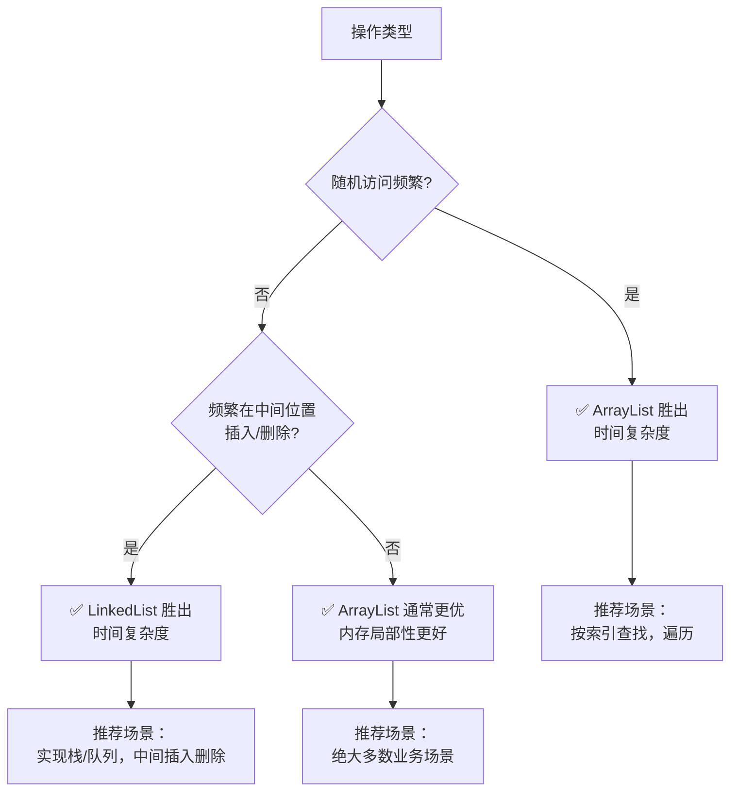

###### 1. 如何提高集合的性能？
| 优化维度        | 核心策略                                                | 关键收益                              |
| ----------- | --------------------------------------------------- | --------------------------------- |
| **集合选型**​   | 根据**访问模式**（随机访问/顺序访问）和**操作类型**（查询/插入/删除）选择最合适的集合实现。 | 从根本上匹配业务场景，避免数据结构本身带来的性能瓶颈。       |
| **容量初始化**​  | 基于对数据量的预估，为基于数组或哈希表的集合**设置合理的初始容量**。                | **减少或避免扩容操作**，这是提升此类集合性能最有效的手段之一。 |
| **算法与API**​ | 选用时间复杂度更低的算法和JDK提供的高效API（如`removeIf`）。              | 减少不必要的计算和遍历开销，提升执行效率。             |
| **并发控制**​   | 在多线程环境下，根据读写比例选择正确的并发集合（如`ConcurrentHashMap`）。      | 在保证线程安全的同时，尽可能提高并发吞吐量。            |
###### 2. 集合的初始容量应该如何设置？
- **为什么要设置初始容量**：像`ArrayList`、`HashMap`这样的集合，在元素数量超过当前容量时会触发**扩容**（如`ArrayList`扩容至1.5倍，`HashMap`扩容至2倍）。这个过程涉及新数组的创建和旧数据的复制，非常耗费性能。预先设置一个合理的容量可以避免或减少扩容次数。
- **如何计算初始容量**：
    - **对于`ArrayList`、`Vector`**：初始容量直接设置为预估的元素数量即可。例如，预计存储1000个元素，就设为1000。
    - **对于`HashMap`、`HashSet`、`ConcurrentHashMap`**：由于它们使用**负载因子**（默认0.75）来决定何时扩容，初始容量需要额外计算。公式为：`初始容量 = 预估元素个数 / 负载因子 + 缓冲值`。例如，预计存放1000个元素，则 `1000 / 0.75 ≈ 1333`。此外，`HashMap`会将其调整到最接近的**2的幂次方**（如1333会调整为2048），因此可以直接设置为2048以获得最佳性能。
###### 3. ArrayList 和 LinkedList 在不同场景下的性能对比？
`ArrayList`和`LinkedList`的底层实现完全不同（动态数组 vs. 双向链表），因此它们的性能特性在不同场景下差异巨大。下面的对比图直观展示了两者在关键操作上的性能差异：


**简单来说**：**`ArrayList`在绝大多数情况下是更优的选择**，因为它能利用CPU缓存局部性原理，连续的内存分布使访问速度更快。只有在需要**频繁在列表中间位置进行插入或删除操作**时，`LinkedList`才有明显优势。此外，`LinkedList`还天然实现了`Deque`接口，非常适合用于实现栈和队列。
###### 4. HashMap 的性能优化技巧有哪些？
1. **优化初始容量与负载因子**：如前所述，根据预期大小设置初始容量。在极端情况下，如果对内存利用率要求高且能接受较低的性能，可以适当**提高负载因子**（如0.8），减少内存占用但会增加哈希冲突概率；反之，若追求更高的查询性能，可**稍微降低负载因子**（如0.6），以减少冲突，但会增加扩容频率。
2. **保证键对象的`hashCode()`质量**：`HashMap`的性能高度依赖于键的哈希值是否分布均匀。一个好的`hashCode()`方法应能产生尽可能不同的哈希值，减少哈希冲突，从而避免链表过长或红黑树过于复杂。
3. **优化遍历方式**：遍历`HashMap`的键值对时，**使用`entrySet()` 直接获取键值对集合，而不是先获取`keySet()`再通过`get(key)`取值。后者相当于遍历了两次，效率很低。
    ```java
    // 低效遍历
    for (String key : map.keySet()) {
        Object value = map.get(key); // 每次get都是一次哈希查询
    }
    // 高效遍历
    for (Map.Entry<String, Object> entry : map.entrySet()) {
        String key = entry.getKey();
        Object value = entry.getValue();
    }
    ```
4. **理解树化阈值**：在JDK 8及以上，当链表长度超过`TREEIFY_THRESHOLD`（默认8）且数组容量达到`MIN_TREEIFY_CAPACITY`（默认64）时，链表会转化为红黑树，将查询效率从O(n)提升到O(log n)。了解这一机制有助于在诊断性能问题时判断是否发生了严重的哈希冲突。