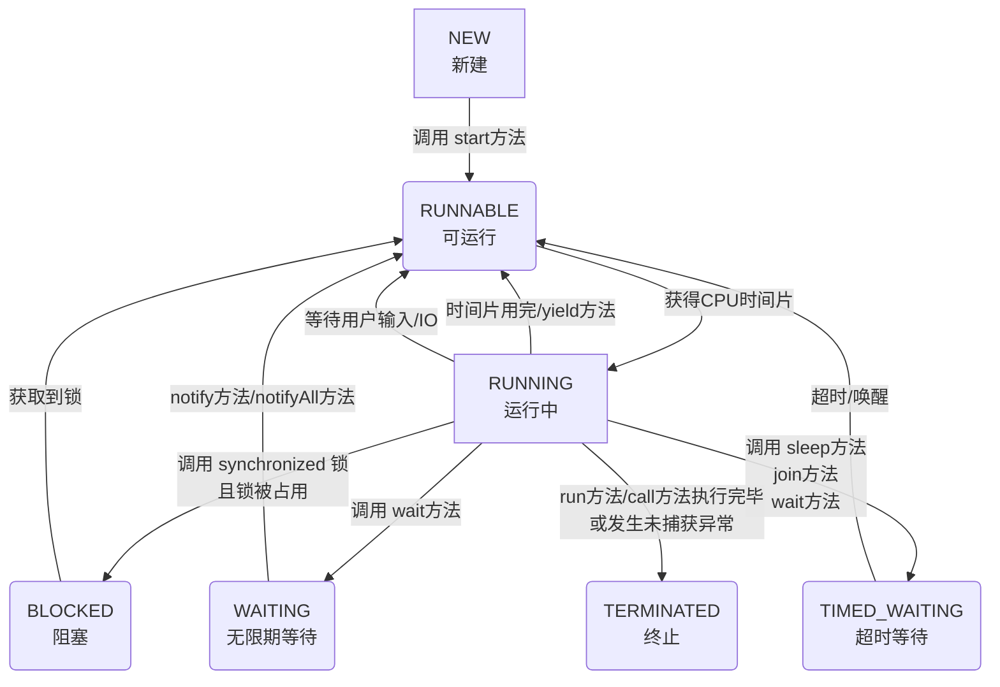
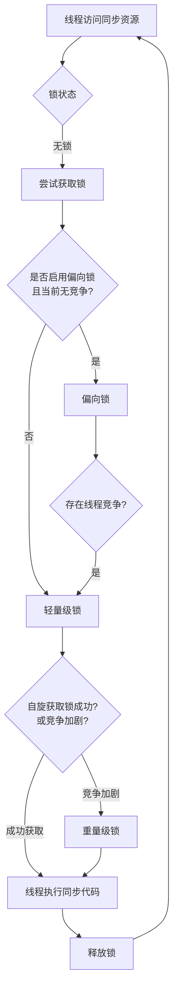

### 一、线程基础
###### 1. 说说进程和线程的区别？
|特性维度|进程 (Process)|线程 (Thread)|
|---|---|---|
|**根本区别**​|**资源分配的基本单位**，拥有独立的虚拟地址空间、代码、数据及其他系统资源。|**CPU调度的基本单位**，是进程中的一个执行流，共享进程的资源。|
|**从属关系**​|独立存在，一个进程崩溃通常不会影响其他进程（在保护模式下）。|依赖于进程，一个线程崩溃会导致整个进程崩溃，从而影响同进程下的其他线程。|
|**资源开销**​|创建、销毁、切换开销大，因为需要分配和回收独立的内存空间等资源。|创建、销毁、切换开销小，因为它们共享进程的地址空间和资源。|
|**数据共享**​|进程间通信（IPC）相对复杂，需要借助管道、消息队列、共享内存等机制。|线程间共享数据简单直接，因为它们天然共享进程的全局变量和堆空间，但需注意同步。|
|**健壮性**​|多进程程序更健壮，一个进程失效不会直接影响另一个。|多线程程序健壮性较低，一个线程异常可能导致整个进程终止。|

简单来说，**进程是“资源分配的容器”，而线程是“在这个容器里真正干活的工人”**。一个程序至少有一个进程，一个进程至少有一个线程。
###### 2. 如何创建线程？有几种方式？
在Java中，主要有三种方式来创建线程：
1. **继承 `Thread`类**
    通过继承 `Thread`类并重写其 `run()`方法。这种方式简单，但由于Java是单继承，限制了类的扩展性。
 ```java
    class MyThread extends Thread {
        @Override
        public void run() {
            System.out.println("线程运行中: " + Thread.currentThread().getName());
        }
    }
    public class Main {
        public static void main(String[] args) {
            MyThread thread = new MyThread();
            thread.start(); // 启动新线程
        }
    }
    ```
2. **实现 `Runnable`接口（推荐）**
    通过实现 `Runnable`接口，将线程任务和线程对象解耦，灵活性更高，也更符合面向接口编程的思想，是**最常用**的方式。
 ```java
    class MyRunnable implements Runnable {
        @Override
        public void run() {
            System.out.println("线程运行中: " + Thread.currentThread().getName());
        }
    }
    public class Main {
        public static void main(String[] args) {
            Thread thread = new Thread(new MyRunnable());
            thread.start();
    
            // 或使用Lambda表达式，更简洁
            new Thread(() -> {
                System.out.println("Lambda线程: " + Thread.currentThread().getName());
            }).start();
        }
    }
    ```
1. **实现 `Callable`接口**
	`Callable`接口的 `call()`方法可以返回结果并能抛出异常。需要配合 `FutureTask`来获取返回值。
```java
    import java.util.concurrent.Callable;
    import java.util.concurrent.FutureTask;
    
    class MyCallable implements Callable<Integer> {
        @Override
        public Integer call() throws Exception {
            int sum = 0;
            for (int i = 1; i <= 100; i++) {
                sum += i;
            }
            return sum; // 返回计算结果
        }
    }
    public class Main {
        public static void main(String[] args) throws Exception {
            FutureTask<Integer> futureTask = new FutureTask<>(new MyCallable());
            Thread thread = new Thread(futureTask);
            thread.start();
            Integer result = futureTask.get(); // 获取线程执行的结果，会阻塞直到计算完成
            System.out.println("计算结果: " + result);
        }
    }
    ```
**最佳实践**：对于需要管理大量线程的场景，强烈建议使用 `ExecutorService`线程池，它可以有效减少线程创建和销毁的开销，并提供更强大的线程管理功能。
###### 3. 什么是线程安全？如何保证线程安全？
**线程安全**指的是当多个线程同时访问同一个共享资源时，无论运行时环境如何调度或交替执行，且无需调用方进行额外的同步操作，程序都能表现出正确的行为。
线程不安全最典型的例子就是多个线程同时修改一个变量导致数据错乱。
保证线程安全的核心思路是**对共享资源的访问进行同步**，确保同一时刻只有一个（或有限个）线程可以操作该资源。主要方案有：

|方案类别|核心思想|典型实现|适用场景|
|---|---|---|---|
|**互斥同步（阻塞同步）**​|悲观策略，通过加锁保证同一时间只有一个线程进入临界区。|`synchronized`关键字、`ReentrantLock`|写入竞争激烈，需要保证强一致性|
|**非阻塞同步**​|乐观策略，先操作，冲突时重试。|`AtomicInteger`等原子变量（基于CAS）|读多写少，竞争不激烈，追求高吞吐|
|**无需同步**​|从根本上避免共享。|使用局部变量、不可变对象（如`String`）、`ThreadLocal`|无状态对象、只读操作、线程隔离数据|

**示例：使用 `synchronized`解决线程不安全问题**
```java
public class Counter {
    private int count = 0;
    
    // 使用synchronized保证方法同步
    public synchronized void increment() {
        count++; // 这个操作现在原子了
    }
    
    public int getCount() {
        return count;
    }
}
```
###### 4. 什么是线程的生命周期？线程有哪些状态？
Java线程在其生命周期中会处于以下几种状态之一（定义在 `Thread.State`枚举中）。


1. **NEW (新建)**：线程对象被创建，但尚未调用 `start()`方法。
2. **RUNNABLE (可运行)**：调用 `start()`后，线程等待CPU时间片或正在运行。注意，Java将**就绪（Ready）​和**运行（Running）**​ 都归入此状态。
3. **BLOCKED (阻塞)**：线程等待获取一个**由`synchronized`保护的排他锁**，若锁被其他线程占用，则进入此状态。
4. **WAITING (无限期等待)**：线程进入等待状态，需要被其他线程显式唤醒。例如调用 `Object.wait()`（不带超时）或 `Thread.join()`（不带超时）。
5. **TIMED_WAITING (超时等待)**：线程在指定的时间范围内等待，超时后自动唤醒。例如调用 `Thread.sleep(millis)`, `Object.wait(timeout)`, `Thread.join(timeout)`。
6. **TERMINATED (终止)**：线程执行完毕（`run`方法正常结束）或因异常退出，不可再次启动。
###### 5. start() 和 run() 方法有什么区别？
- `start()`：**启动新线程**的真正方法。它会使JVM创建一个新的线程，并在新线程中异步执行 `run()`方法。
- `run()`：**普通的方法调用**。如果直接调用 `run()`，它会在当前线程（如main线程）中同步执行，而不会启动新线程。
###### 6. sleep() 和 wait() 方法有什么区别？

|特性|`Thread.sleep(long millis)`|`Object.wait(long timeout)`|
|---|---|---|
|**所属类**​|`Thread`类的静态方法|`Object`类的方法|
|**作用**​|**让当前正在执行的线程暂停执行指定的时间**，不释放已持有的锁。|**让当前线程等待**，并**释放已经持有的对象锁**，以便其他线程可以进入同步块。|
|**唤醒条件**​|时间到期。|1. 超时时间到。 2. 其他线程调用该对象的 `notify()`/`notifyAll()`。|
|**用途**​|用于暂停线程执行，与同步无关。|用于线程间的协同工作，必须在同步代码块（synchronized）内使用。|
###### 7. yield() 和 join() 方法的作用是什么？
- `yield()`：静态方法。提示调度器**当前线程愿意让出当前使用的CPU**，但调度器可以忽略这个提示。它会让线程从运行状态回到就绪状态，而不是阻塞状态。主要用于测试和调试，实践中很少用。
- `join()`：实例方法。用于**线程顺序执行**。比如在A线程中调用 `B.join()`，那么A线程会一直阻塞，直到B线程执行完毕。可以设置超时时间 `B.join(1000)`。
###### 8. 什么是守护线程？如何创建守护线程？
- **概念**：一种低优先级的线程，**在后台为其他线程提供服务**，例如垃圾回收线程。当一个JVM中**所有的非守护线程**都结束时，JVM会自动退出，无论是否还有守护线程在运行，它们都会被直接终止。
- **创建**：在线程启动 (`start()`) **之前**，调用 `thread.setDaemon(true)`即可将线程设置为守护线程。
- **注意**：守护线程中产生的子线程默认也是守护线程。守护线程通常不适合用于执行I/O操作或重要的事务逻辑，因为可能无法正常清理资源。
### 二、synchronized 关键字
###### 1. 说说 synchronized 关键字的理解？
`synchronized`是 Java 内置的同步锁机制，用于解决多线程访问共享资源时的线程安全问题。它的核心作用是确保**同一时刻最多只有一个线程**可以执行被保护的代码段或方法，从而避免数据不一致等问题。
它主要提供以下三大保证：
- **原子性**：确保被锁定的操作作为一个不可分割的整体执行。
- **可见性**：当一个线程释放锁时，它对共享变量的修改会强制刷新到主内存。当另一个线程获取锁时，它会清空本地缓存，从主内存重新加载变量值，从而保证能看到最新结果。
- **有序性**：有效防止指令重排序对并发操作的影响，确保代码执行顺序符合预期。
###### 2. synchronized 的底层原理是什么？
`synchronized`的底层实现依赖于 **Java 对象头**​ 和 **监视器锁**​ 机制。
- **对象头与 Monitor**：在 JVM 中，每个对象在内存中均包含一个对象头。对象头中的 **Mark Word**​ 区域存储了与锁相关的信息（如锁状态、持有锁的线程ID等）。每个对象也与一个 **监视器锁（Monitor）​关联。
- **字节码指令**：当使用 `synchronized`修饰代码块时，JVM 会在编译后的字节码中插入 `monitorenter`和 `monitorexit`指令来标识同步代码块的开始和结束。当线程进入同步块时执行 `monitorenter`尝试获取 Monitor 的所有权，退出时执行 `monitorexit`释放锁。
- **方法级同步**：对于 `synchronized`修饰的实例方法或静态方法，JVM 通过方法常量池中的 `ACC_SYNCHRONIZED`访问标志来标识。线程执行方法前会先尝试获取锁（实例方法锁 `this`，静态方法锁当前类的 `Class`对象）。
###### 3. synchronized 可以修饰哪些地方？有什么区别？
`synchronized`主要有三种应用方式，其作用和锁对象有所不同：

|用法|示例|作用对象（锁是什么）|说明|
|---|---|---|---|
|**修饰实例方法**​|`public synchronized void method() {...}`|**当前对象实例**​ (`this`)|不同线程访问**同一个对象实例**的此方法会互斥<br><br>。|
|**修饰静态方法**​|`public static synchronized void staticMethod() {...}`|**当前类的 Class 对象**​|对不同对象实例也互斥，因为静态方法属于类<br><br>。|
|**修饰代码块**​|`synchronized(obj) {...}`或 `synchronized(MyClass.class) {...}`|**指定对象**（如实例obj、类Class对象）|提供最细粒度的锁控制，灵活性最高<br><br>。|

**重要注意点**：修饰实例方法时，锁是当前对象实例；修饰静态方法时，锁是当前类的Class对象。因此，一个线程访问实例同步方法，另一个线程访问静态同步方法，**它们获取的是不同的锁，不会发生互斥**​。
###### 4. synchronized 的锁升级过程是怎样的？
为了减少获得锁和释放锁带来的性能开销，JVM 会对 `synchronized`锁进行优化，其升级过程是单向的（不可降级）。下面的流程图清晰地展示了这一过程：




###### 5. 什么是偏向锁、轻量级锁、重量级锁？
| 锁类型       | 核心思想                                        | 适用场景                                  | 特点                                                      |
| --------- | ------------------------------------------- | ------------------------------------- | ------------------------------------------------------- |
| **偏向锁**​  | 消除无竞争情况下的同步开销。锁会偏向第一个获取它的线程，该线程再次请求时无需同步操作。 | 适用于**只有一个线程**多次访问同步块的场景。              | 加锁解锁无需CAS操作，性能开销极小。但发生竞争时需要撤销偏向锁。                       |
| **轻量级锁**​ | 在没有多线程竞争的前提下，减少传统重量级锁的性能消耗。                 | 适用于**交替执行**、**锁持有时间短**、且**竞争不激烈**的场景。 | 线程通过CAS操作在栈帧中创建锁记录（Lock Record）来尝试获取锁。若失败，会先进行**自旋**尝试。 |
| **重量级锁**​ | 通过操作系统的互斥量实现，线程阻塞和唤醒需要从用户态切换到内核态，开销大。       | 适用于**高并发**、**锁持有时间长**、**竞争激烈**的场景。    | 未获取到锁的线程会**被阻塞**，等待被唤醒。能够减少CPU空转，但上下文切换开销大。             |
###### 6. synchronized 和 Lock 的区别是什么？
尽管 `synchronized`和 `Lock`接口（如 `ReentrantLock`）都用于同步，但存在显著差异：

| 特性           | synchronized        | Lock (如 ReentrantLock)                    |
| ------------ | ------------------- | ----------------------------------------- |
| **实现层次**​    | JVM 级别，内置关键字。       | JDK 级别，接口 API 实现。                         |
| **锁的获取与释放**​ | 自动管理，代码块结束或异常时自动释放。 | 需手动 `lock()`和 `unlock()`，通常放在 `finally`块。 |
| **灵活性**​     | 相对不灵活。              | 支持尝试非阻塞获取锁、可中断获取锁、超时获取锁、公平锁等。             |
| **等待机制**​    | 线程若未获锁，会一直等待。       | 可通过 `Condition`进行精确的线程等待/唤醒，一个锁可关联多个条件。   |
###### 7. synchronized 和 volatile 的区别是什么？
`synchronized`和 `volatile`是解决内存可见性的两种手段，但侧重点不同：

| 特性        | synchronized               | volatile                                |
| --------- | -------------------------- | --------------------------------------- |
| **功能**​   | 保证**原子性**、**可见性**和**有序性**。 | 保证**可见性**和**有序性**（禁止指令重排序），**不保证原子性**​。 |
| **性能**​   | 重量级，可能涉及线程阻塞和上下文切换。        | 轻量级，不会引起线程阻塞。                           |
| **使用场景**​ | 控制多个线程对**多个**共享变量的复杂同步访问。  | 修饰单个变量，确保所有线程看到最新值，适用于状态标志位等简单场景。       |
###### 8. synchronized 的可见性和有序性如何保证？
- **可见性**：得益于 `synchronized`的监视器锁规则：对一个锁的解锁操作 happens-before 于后续对这个锁的加锁操作。这意味着，前一个线程在解锁前对共享变量的所有修改，对下一个加锁的线程一定是可见的。
- **有序性**：`synchronized`通过“一个变量在同一时刻只允许一个线程对其进行锁操作”的规则，间接保证了有序性。这使得被同步的代码段在单线程执行视角下依然有序，从而避免了由于重排序导致的数据不一致问题。
###### 9. synchronized 的锁优化有哪些？
JVM 和编译器还会对 `synchronized`进行其他优化：
- **锁消除**：JIT 编译器在运行时检测到某些共享数据不可能存在竞争时，会自动消除这些不必要的锁。
- **锁粗化**：如果虚拟机检测到有一串零碎的操作都对同一个对象反复加锁和解锁，会将锁同步的范围扩展（粗化）到整个操作序列的外部，减少不必要的锁请求和释放。
- **自适应自旋**：线程在请求锁时，如果锁被占用，不会立即挂起，而是执行一个忙循环（自旋）若干次，尝试获取锁。如果经常成功，则增加自旋次数；如果很少成功，则减少或直接挂起线程。
###### 10. synchronized 能防止指令重排序吗？
**可以防止**。`synchronized`通过其内存语义（as-if-serial 和 happens-before 规则）确保了在同步代码块内部，编译器和处理器不会为了优化性能而进行会破坏程序正确性的指令重排序。这使得在同步块内，代码的执行顺序看起来就像是严格按照顺序执行的。
### 三、volatile 关键字

###### 1. 说说 volatile 关键字的理解？
###### 2. volatile 如何保证可见性？
###### 3. volatile 如何禁止指令重排序？
###### 4. volatile 能保证原子性吗？为什么？
###### 5. volatile 的应用场景有哪些？
###### 6. volatile 和 synchronized 的区别是什么？

### 四、Lock 接口与实现

###### 1. Lock 接口有哪些实现类？
###### 2. ReentrantLock 的实现原理是什么？
###### 3. ReentrantLock 的公平锁和非公平锁有什么区别？
###### 4. ReentrantLock 如何实现可重入？
###### 5. ReentrantLock 和 synchronized 的区别是什么？
###### 6. 什么是读写锁？ReadWriteLock 的使用场景是什么？
###### 7. ReentrantReadWriteLock 的实现原理是什么？
###### 8. 什么是锁降级？为什么不支持锁升级？
###### 9. StampedLock 是什么？与 ReentrantReadWriteLock 有什么区别？
###### 10. Lock 的 tryLock() 方法有什么用？
###### 11. Condition 接口的作用是什么？如何使用？
###### 12. LockSupport 的 park() 和 unpark() 方法是什么？

### 五、AQS（AbstractQueuedSynchronizer）

###### 1. 什么是 AQS？它的作用是什么？
###### 2. AQS 的核心思想是什么？
###### 3. AQS 的数据结构是怎样的？
###### 4. AQS 的独占模式和共享模式有什么区别？
###### 5. AQS 中的 state 变量是什么？如何使用？
###### 6. AQS 的等待队列是如何实现的？
###### 7. AQS 如何实现公平锁和非公平锁？
###### 8. 基于 AQS 实现的同步组件有哪些？

### 六、线程池

###### 1. 什么是线程池？为什么要使用线程池？
###### 2. 线程池的核心参数有哪些？各有什么作用？
###### 3. 线程池的工作流程是怎样的？
###### 4. 线程池有哪些拒绝策略？
###### 5. 线程池有哪些常见的类型？
###### 6. 如何合理配置线程池的大小？
###### 7. ThreadPoolExecutor 的构造函数参数有哪些？
###### 8. execute() 和 submit() 方法有什么区别？
###### 9. 线程池如何优雅关闭？shutdown() 和 shutdownNow() 的区别？
###### 10. 什么是 ForkJoinPool？它的工作窃取算法是什么？
###### 11. ScheduledThreadPoolExecutor 的实现原理是什么？
###### 12. 为什么不建议使用 Executors 创建线程池？

### 七、并发工具类

###### 1. CountDownLatch 的作用和使用场景是什么？
###### 2. CyclicBarrier 的作用和使用场景是什么？
###### 3. CountDownLatch 和 CyclicBarrier 的区别是什么？
###### 4. Semaphore 的作用和使用场景是什么？
###### 5. Exchanger 的作用和使用场景是什么？
###### 6. Phaser 是什么？与 CyclicBarrier 有什么区别？
###### 7. CompletableFuture 的作用是什么？如何使用？
###### 8. Future 和 CompletableFuture 的区别是什么？
###### 9. 如何实现异步任务的链式调用？
###### 10. CompletableFuture 的异常处理如何实现？

### 八、并发集合

###### 1. ConcurrentHashMap 的实现原理是什么？
###### 2. ConcurrentHashMap 在 JDK 1.7 和 1.8 中的区别是什么？
###### 3. ConcurrentHashMap 如何保证线程安全？
###### 4. ConcurrentHashMap 的 put 操作流程是怎样的？
###### 5. ConcurrentHashMap 能保证复合操作的原子性吗？
###### 6. CopyOnWriteArrayList 的实现原理是什么？
###### 7. CopyOnWriteArrayList 的应用场景是什么？
###### 8. BlockingQueue 有哪些实现类？它们的区别是什么？
###### 9. ArrayBlockingQueue 和 LinkedBlockingQueue 的区别是什么？
###### 10. ConcurrentLinkedQueue 的实现原理是什么？

### 九、原子类

###### 1. 什么是原子类？Java 中有哪些原子类？
###### 2. AtomicInteger 的实现原理是什么？
###### 3. CAS 算法是什么？它的优缺点是什么？
###### 4. CAS 的 ABA 问题是什么？如何解决？
###### 5. AtomicStampedReference 和 AtomicMarkableReference 的区别是什么？
###### 6. LongAdder 和 AtomicLong 的区别是什么？
###### 7. LongAdder 的实现原理是什么？
###### 8. 原子类的应用场景有哪些？

### 十、线程通信与协作

###### 1. 线程间通信的方式有哪些？
###### 2. wait()、notify() 和 notifyAll() 的使用方法是什么？
###### 3. 为什么 wait() 和 notify() 必须在同步代码块中调用？
###### 4. notify() 和 notifyAll() 的区别是什么？
###### 5. 如何实现生产者-消费者模式？
###### 6. ThreadLocal 的作用和实现原理是什么？

### 十一、内存模型与可见性

###### 1. 什么是 Java 内存模型（JMM）？
###### 2. JMM 中的主内存和工作内存是什么？
###### 3. 什么是内存可见性问题？如何解决？
###### 4. 什么是指令重排序？JMM 如何禁止指令重排序？
###### 5. 什么是 happens-before 原则？
###### 6. final 关键字的内存语义是什么？
###### 7. 什么是伪共享？如何避免？
###### 8. CPU 缓存一致性协议是什么？

### 十二、死锁与性能优化

###### 1. 什么是死锁？死锁产生的条件是什么？
###### 2. 如何避免死锁？
###### 3. 如何检测和定位死锁？
###### 4. 什么是活锁？与死锁有什么区别？
###### 5. 什么是饥饿？如何避免线程饥饿？
###### 6. 如何提高并发程序的性能？
###### 7. 什么是无锁编程？有哪些应用场景？
###### 8. 如何使用 JMH 进行并发性能测试？