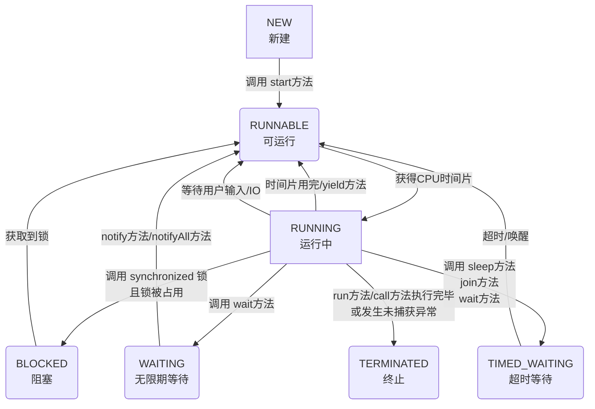
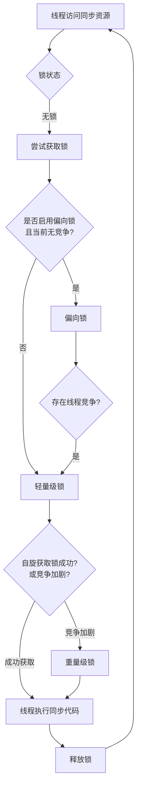
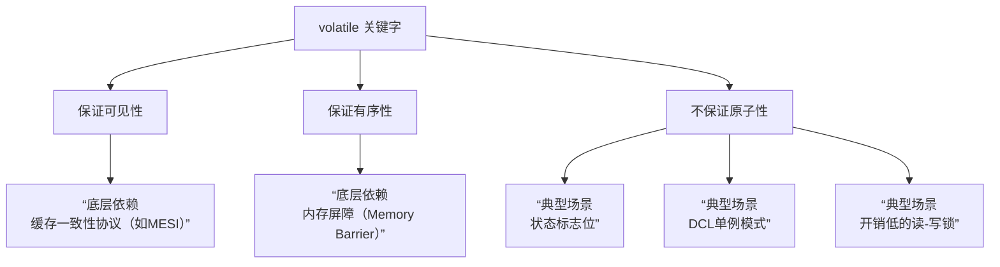
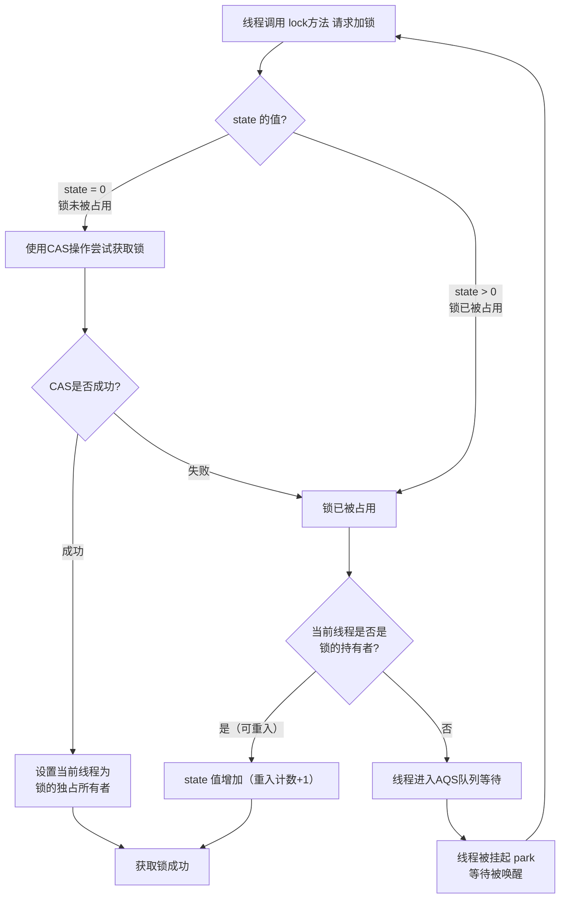
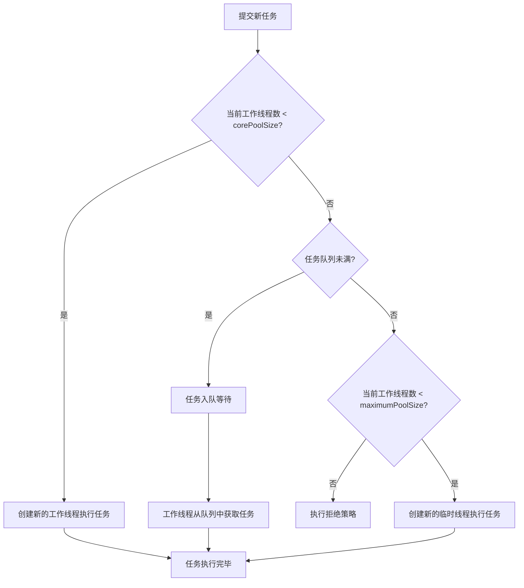
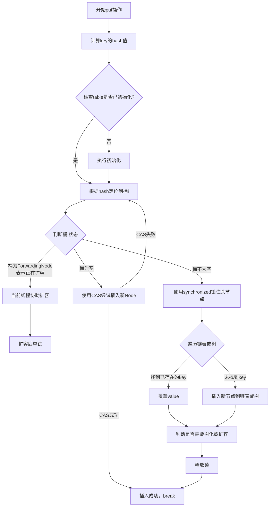
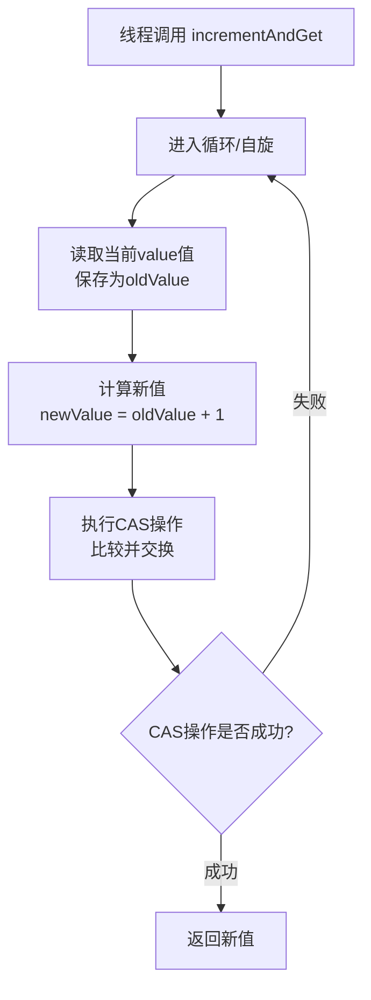

### 一、线程基础
###### 1. 说说进程和线程的区别？
|特性维度|进程 (Process)|线程 (Thread)|
|---|---|---|
|**根本区别**​|**资源分配的基本单位**，拥有独立的虚拟地址空间、代码、数据及其他系统资源。|**CPU调度的基本单位**，是进程中的一个执行流，共享进程的资源。|
|**从属关系**​|独立存在，一个进程崩溃通常不会影响其他进程（在保护模式下）。|依赖于进程，一个线程崩溃会导致整个进程崩溃，从而影响同进程下的其他线程。|
|**资源开销**​|创建、销毁、切换开销大，因为需要分配和回收独立的内存空间等资源。|创建、销毁、切换开销小，因为它们共享进程的地址空间和资源。|
|**数据共享**​|进程间通信（IPC）相对复杂，需要借助管道、消息队列、共享内存等机制。|线程间共享数据简单直接，因为它们天然共享进程的全局变量和堆空间，但需注意同步。|
|**健壮性**​|多进程程序更健壮，一个进程失效不会直接影响另一个。|多线程程序健壮性较低，一个线程异常可能导致整个进程终止。|

简单来说，**进程是“资源分配的容器”，而线程是“在这个容器里真正干活的工人”**。一个程序至少有一个进程，一个进程至少有一个线程。
###### 2. 如何创建线程？有几种方式？
在Java中，主要有三种方式来创建线程：
1. **继承 `Thread`类**
    通过继承 `Thread`类并重写其 `run()`方法。这种方式简单，但由于Java是单继承，限制了类的扩展性。
 ```java
    class MyThread extends Thread {
        @Override
        public void run() {
            System.out.println("线程运行中: " + Thread.currentThread().getName());
        }
    }
    public class Main {
        public static void main(String[] args) {
            MyThread thread = new MyThread();
            thread.start(); // 启动新线程
        }
    }
    ```
2. **实现 `Runnable`接口（推荐）**
    通过实现 `Runnable`接口，将线程任务和线程对象解耦，灵活性更高，也更符合面向接口编程的思想，是**最常用**的方式。
 ```java
    class MyRunnable implements Runnable {
        @Override
        public void run() {
            System.out.println("线程运行中: " + Thread.currentThread().getName());
        }
    }
    public class Main {
        public static void main(String[] args) {
            Thread thread = new Thread(new MyRunnable());
            thread.start();
    
            // 或使用Lambda表达式，更简洁
            new Thread(() -> {
                System.out.println("Lambda线程: " + Thread.currentThread().getName());
            }).start();
        }
    }
    ```
1. **实现 `Callable`接口**
	`Callable`接口的 `call()`方法可以返回结果并能抛出异常。需要配合 `FutureTask`来获取返回值。
```java
    import java.util.concurrent.Callable;
    import java.util.concurrent.FutureTask;
    
    class MyCallable implements Callable<Integer> {
        @Override
        public Integer call() throws Exception {
            int sum = 0;
            for (int i = 1; i <= 100; i++) {
                sum += i;
            }
            return sum; // 返回计算结果
        }
    }
    public class Main {
        public static void main(String[] args) throws Exception {
            FutureTask<Integer> futureTask = new FutureTask<>(new MyCallable());
            Thread thread = new Thread(futureTask);
            thread.start();
            Integer result = futureTask.get(); // 获取线程执行的结果，会阻塞直到计算完成
            System.out.println("计算结果: " + result);
        }
    }
    ```
**最佳实践**：对于需要管理大量线程的场景，强烈建议使用 `ExecutorService`线程池，它可以有效减少线程创建和销毁的开销，并提供更强大的线程管理功能。
###### 3. 什么是线程安全？如何保证线程安全？
**线程安全**指的是当多个线程同时访问同一个共享资源时，无论运行时环境如何调度或交替执行，且无需调用方进行额外的同步操作，程序都能表现出正确的行为。
线程不安全最典型的例子就是多个线程同时修改一个变量导致数据错乱。
保证线程安全的核心思路是**对共享资源的访问进行同步**，确保同一时刻只有一个（或有限个）线程可以操作该资源。主要方案有：

|方案类别|核心思想|典型实现|适用场景|
|---|---|---|---|
|**互斥同步（阻塞同步）**​|悲观策略，通过加锁保证同一时间只有一个线程进入临界区。|`synchronized`关键字、`ReentrantLock`|写入竞争激烈，需要保证强一致性|
|**非阻塞同步**​|乐观策略，先操作，冲突时重试。|`AtomicInteger`等原子变量（基于CAS）|读多写少，竞争不激烈，追求高吞吐|
|**无需同步**​|从根本上避免共享。|使用局部变量、不可变对象（如`String`）、`ThreadLocal`|无状态对象、只读操作、线程隔离数据|

**示例：使用 `synchronized`解决线程不安全问题**
```java
public class Counter {
    private int count = 0;
    
    // 使用synchronized保证方法同步
    public synchronized void increment() {
        count++; // 这个操作现在原子了
    }
    
    public int getCount() {
        return count;
    }
}
```
###### 4. 什么是线程的生命周期？线程有哪些状态？
Java线程在其生命周期中会处于以下几种状态之一（定义在 `Thread.State`枚举中）。


1. **NEW (新建)**：线程对象被创建，但尚未调用 `start()`方法。
2. **RUNNABLE (可运行)**：调用 `start()`后，线程等待CPU时间片或正在运行。注意，Java将**就绪（Ready）​和**运行（Running）**​ 都归入此状态。
3. **BLOCKED (阻塞)**：线程等待获取一个**由`synchronized`保护的排他锁**，若锁被其他线程占用，则进入此状态。
4. **WAITING (无限期等待)**：线程进入等待状态，需要被其他线程显式唤醒。例如调用 `Object.wait()`（不带超时）或 `Thread.join()`（不带超时）。
5. **TIMED_WAITING (超时等待)**：线程在指定的时间范围内等待，超时后自动唤醒。例如调用 `Thread.sleep(millis)`, `Object.wait(timeout)`, `Thread.join(timeout)`。
6. **TERMINATED (终止)**：线程执行完毕（`run`方法正常结束）或因异常退出，不可再次启动。
###### 5. start() 和 run() 方法有什么区别？
- `start()`：**启动新线程**的真正方法。它会使JVM创建一个新的线程，并在新线程中异步执行 `run()`方法。
- `run()`：**普通的方法调用**。如果直接调用 `run()`，它会在当前线程（如main线程）中同步执行，而不会启动新线程。
###### 6. sleep() 和 wait() 方法有什么区别？

|特性|`Thread.sleep(long millis)`|`Object.wait(long timeout)`|
|---|---|---|
|**所属类**​|`Thread`类的静态方法|`Object`类的方法|
|**作用**​|**让当前正在执行的线程暂停执行指定的时间**，不释放已持有的锁。|**让当前线程等待**，并**释放已经持有的对象锁**，以便其他线程可以进入同步块。|
|**唤醒条件**​|时间到期。|1. 超时时间到。 2. 其他线程调用该对象的 `notify()`/`notifyAll()`。|
|**用途**​|用于暂停线程执行，与同步无关。|用于线程间的协同工作，必须在同步代码块（synchronized）内使用。|
###### 7. yield() 和 join() 方法的作用是什么？
- `yield()`：静态方法。提示调度器**当前线程愿意让出当前使用的CPU**，但调度器可以忽略这个提示。它会让线程从运行状态回到就绪状态，而不是阻塞状态。主要用于测试和调试，实践中很少用。
- `join()`：实例方法。用于**线程顺序执行**。比如在A线程中调用 `B.join()`，那么A线程会一直阻塞，直到B线程执行完毕。可以设置超时时间 `B.join(1000)`。
###### 8. 什么是守护线程？如何创建守护线程？
- **概念**：一种低优先级的线程，**在后台为其他线程提供服务**，例如垃圾回收线程。当一个JVM中**所有的非守护线程**都结束时，JVM会自动退出，无论是否还有守护线程在运行，它们都会被直接终止。
- **创建**：在线程启动 (`start()`) **之前**，调用 `thread.setDaemon(true)`即可将线程设置为守护线程。
- **注意**：守护线程中产生的子线程默认也是守护线程。守护线程通常不适合用于执行I/O操作或重要的事务逻辑，因为可能无法正常清理资源。
### 二、synchronized 关键字
###### 1. 说说 synchronized 关键字的理解？
`synchronized`是 Java 内置的同步锁机制，用于解决多线程访问共享资源时的线程安全问题。它的核心作用是确保**同一时刻最多只有一个线程**可以执行被保护的代码段或方法，从而避免数据不一致等问题。
它主要提供以下三大保证：
- **原子性**：确保被锁定的操作作为一个不可分割的整体执行。
- **可见性**：当一个线程释放锁时，它对共享变量的修改会强制刷新到主内存。当另一个线程获取锁时，它会清空本地缓存，从主内存重新加载变量值，从而保证能看到最新结果。
- **有序性**：有效防止指令重排序对并发操作的影响，确保代码执行顺序符合预期。
###### 2. synchronized 的底层原理是什么？
`synchronized`的底层实现依赖于 **Java 对象头**​ 和 **监视器锁**​ 机制。
- **对象头与 Monitor**：在 JVM 中，每个对象在内存中均包含一个对象头。对象头中的 **Mark Word**​ 区域存储了与锁相关的信息（如锁状态、持有锁的线程ID等）。每个对象也与一个 **监视器锁（Monitor）​关联。
- **字节码指令**：当使用 `synchronized`修饰代码块时，JVM 会在编译后的字节码中插入 `monitorenter`和 `monitorexit`指令来标识同步代码块的开始和结束。当线程进入同步块时执行 `monitorenter`尝试获取 Monitor 的所有权，退出时执行 `monitorexit`释放锁。
- **方法级同步**：对于 `synchronized`修饰的实例方法或静态方法，JVM 通过方法常量池中的 `ACC_SYNCHRONIZED`访问标志来标识。线程执行方法前会先尝试获取锁（实例方法锁 `this`，静态方法锁当前类的 `Class`对象）。
###### 3. synchronized 可以修饰哪些地方？有什么区别？
`synchronized`主要有三种应用方式，其作用和锁对象有所不同：

|用法|示例|作用对象（锁是什么）|说明|
|---|---|---|---|
|**修饰实例方法**​|`public synchronized void method() {...}`|**当前对象实例**​ (`this`)|不同线程访问**同一个对象实例**的此方法会互斥<br><br>。|
|**修饰静态方法**​|`public static synchronized void staticMethod() {...}`|**当前类的 Class 对象**​|对不同对象实例也互斥，因为静态方法属于类<br><br>。|
|**修饰代码块**​|`synchronized(obj) {...}`或 `synchronized(MyClass.class) {...}`|**指定对象**（如实例obj、类Class对象）|提供最细粒度的锁控制，灵活性最高<br><br>。|

**重要注意点**：修饰实例方法时，锁是当前对象实例；修饰静态方法时，锁是当前类的Class对象。因此，一个线程访问实例同步方法，另一个线程访问静态同步方法，**它们获取的是不同的锁，不会发生互斥**​。
###### 4. synchronized 的锁升级过程是怎样的？
为了减少获得锁和释放锁带来的性能开销，JVM 会对 `synchronized`锁进行优化，其升级过程是单向的（不可降级）。下面的流程图清晰地展示了这一过程：




###### 5. 什么是偏向锁、轻量级锁、重量级锁？
| 锁类型       | 核心思想                                        | 适用场景                                  | 特点                                                      |
| --------- | ------------------------------------------- | ------------------------------------- | ------------------------------------------------------- |
| **偏向锁**​  | 消除无竞争情况下的同步开销。锁会偏向第一个获取它的线程，该线程再次请求时无需同步操作。 | 适用于**只有一个线程**多次访问同步块的场景。              | 加锁解锁无需CAS操作，性能开销极小。但发生竞争时需要撤销偏向锁。                       |
| **轻量级锁**​ | 在没有多线程竞争的前提下，减少传统重量级锁的性能消耗。                 | 适用于**交替执行**、**锁持有时间短**、且**竞争不激烈**的场景。 | 线程通过CAS操作在栈帧中创建锁记录（Lock Record）来尝试获取锁。若失败，会先进行**自旋**尝试。 |
| **重量级锁**​ | 通过操作系统的互斥量实现，线程阻塞和唤醒需要从用户态切换到内核态，开销大。       | 适用于**高并发**、**锁持有时间长**、**竞争激烈**的场景。    | 未获取到锁的线程会**被阻塞**，等待被唤醒。能够减少CPU空转，但上下文切换开销大。             |
###### 6. synchronized 和 Lock 的区别是什么？
尽管 `synchronized`和 `Lock`接口（如 `ReentrantLock`）都用于同步，但存在显著差异：

| 特性           | synchronized        | Lock (如 ReentrantLock)                    |
| ------------ | ------------------- | ----------------------------------------- |
| **实现层次**​    | JVM 级别，内置关键字。       | JDK 级别，接口 API 实现。                         |
| **锁的获取与释放**​ | 自动管理，代码块结束或异常时自动释放。 | 需手动 `lock()`和 `unlock()`，通常放在 `finally`块。 |
| **灵活性**​     | 相对不灵活。              | 支持尝试非阻塞获取锁、可中断获取锁、超时获取锁、公平锁等。             |
| **等待机制**​    | 线程若未获锁，会一直等待。       | 可通过 `Condition`进行精确的线程等待/唤醒，一个锁可关联多个条件。   |
###### 7. synchronized 和 volatile 的区别是什么？
`synchronized`和 `volatile`是解决内存可见性的两种手段，但侧重点不同：

| 特性        | synchronized               | volatile                                |
| --------- | -------------------------- | --------------------------------------- |
| **功能**​   | 保证**原子性**、**可见性**和**有序性**。 | 保证**可见性**和**有序性**（禁止指令重排序），**不保证原子性**​。 |
| **性能**​   | 重量级，可能涉及线程阻塞和上下文切换。        | 轻量级，不会引起线程阻塞。                           |
| **使用场景**​ | 控制多个线程对**多个**共享变量的复杂同步访问。  | 修饰单个变量，确保所有线程看到最新值，适用于状态标志位等简单场景。       |
###### 8. synchronized 的可见性和有序性如何保证？
- **可见性**：得益于 `synchronized`的监视器锁规则：对一个锁的解锁操作 happens-before 于后续对这个锁的加锁操作。这意味着，前一个线程在解锁前对共享变量的所有修改，对下一个加锁的线程一定是可见的。
- **有序性**：`synchronized`通过“一个变量在同一时刻只允许一个线程对其进行锁操作”的规则，间接保证了有序性。这使得被同步的代码段在单线程执行视角下依然有序，从而避免了由于重排序导致的数据不一致问题。
###### 9. synchronized 的锁优化有哪些？
JVM 和编译器还会对 `synchronized`进行其他优化：
- **锁消除**：JIT 编译器在运行时检测到某些共享数据不可能存在竞争时，会自动消除这些不必要的锁。
- **锁粗化**：如果虚拟机检测到有一串零碎的操作都对同一个对象反复加锁和解锁，会将锁同步的范围扩展（粗化）到整个操作序列的外部，减少不必要的锁请求和释放。
- **自适应自旋**：线程在请求锁时，如果锁被占用，不会立即挂起，而是执行一个忙循环（自旋）若干次，尝试获取锁。如果经常成功，则增加自旋次数；如果很少成功，则减少或直接挂起线程。
###### 10. synchronized 能防止指令重排序吗？
**可以防止**。`synchronized`通过其内存语义（as-if-serial 和 happens-before 规则）确保了在同步代码块内部，编译器和处理器不会为了优化性能而进行会破坏程序正确性的指令重排序。这使得在同步块内，代码的执行顺序看起来就像是严格按照顺序执行的。
### 三、volatile 关键字
###### 1. 说说 volatile 关键字的理解？
`volatile`是 Java 提供的一种**轻量级的同步机制**，主要用于确保**变量修改的可见性**和**防止指令重排序**。
当一个变量被声明为 `volatile`时，意味着所有线程在访问这个变量时，都会直接从主内存中读取它的值，并且对它的修改都会立即写回主内存。这解决了因线程将变量副本保存在各自的工作内存（如CPU缓存）中而可能导致的**数据不一致**问题。


###### 2. volatile 如何保证可见性？
可见性问题产生的根源在于现代计算机的多级缓存架构。每个CPU核心都可能在自己的缓存中保留共享变量的副本，当一个线程修改了其缓存中的副本值，这个修改可能不会立即同步给其他线程，导致其他线程读取到的是过期的旧数据。
`volatile`通过以下机制保证可见性：
1. **强制主内存读写**：对 `volatile`变量进行**写操作**时，JVM会向处理器发送一条指令（如`lock`前缀的指令），强制将新值立即刷新到主内存。对 `volatile`变量进行**读操作**时，JVM会使该线程的工作内存中对应变量的缓存行**失效**，从而强制它必须从主内存中重新加载最新值。
2. **缓存一致性协议**：在硬件层面，这通常通过缓存一致性协议（如Intel的MESI协议）实现。当某个CPU核心修改了`volatile`变量，其他CPU核心会通过该协议嗅探到这一变化，并将自己缓存中对应的数据标记为**无效状态**。当它们下次需要读取这个变量时，发现缓存失效，就会从主内存重新获取最新数据。
###### 3. volatile 如何禁止指令重排序？
为了提高性能，编译器和处理器常常会对指令进行**重排序**。在单线程下，这不会影响最终结果，但在多线程环境下，可能导致程序出现意想不到的错误。
`volatile`通过**内存屏障**​ 来禁止指令重排序。内存屏障是一组CPU指令，用于控制特定操作间的顺序。JMM为`volatile`的读写操作插入了以下类型的内存屏障：
- **在每个 volatile 写操作之前插入 StoreStore 屏障**：确保该屏障之前的普通写操作结果，对于随后的`volatile`写操作是可见的。
- **在每个 volatile 写操作之后插入 StoreLoad 屏障**：确保该`volatile`写操作的结果能立即对其他线程可见。
- **在每个 volatile 读操作之后插入 LoadLoad 屏障**：确保该`volatile`读操作先于其后所有的读操作。
- **在每个 volatile 读操作之后插入 LoadStore 屏障**：确保该`volatile`读操作先于其后所有的写操作。
这些屏障规则共同作用，就像在代码中划定了“界线”，阻止了重排序跨越`volatile`操作，从而保证了有序性。
###### 4. volatile 能保证原子性吗？为什么？
**不能**。
原子性意味着一个操作是不可中断的，要么全部执行成功，要么完全不执行。而 `volatile`无法保证复合操作的原子性。最经典的例子就是自增操作 `count++`。这个操作并非原子操作，它实际上包含三个步骤：
1. 读取变量 `count`的当前值。
2. 将值加1。
3. 将新值写回 `count`。
如果两个线程同时读取了 `count`的初始值（比如都是5），然后各自加1并写回，最终结果会是6，而不是正确的7。这是因为后一个线程的写操作覆盖了前一个线程的结果。
如果需要保证原子性，应该使用 `synchronized`关键字或 `java.util.concurrent.atomic`包下的原子类（如 `AtomicInteger`）。
###### 5. volatile 的应用场景有哪些？
基于 `volatile`的特性，它适用于以下场景：
1. **状态标志位**：用一个 `volatile boolean`变量作为线程运行或中断的标志。由于可见性有保证，其他线程修改标志后，当前线程能立即感知并安全退出。
  ```java
    public class WorkerThread extends Thread {
        private volatile boolean running = true;
    
        public void run() {
            while (running) {
                // 执行任务...
            }
        }
    
        public void stopWorker() {
            running = false; // 其他线程调用此方法，WorkerThread能立即看到false
        }
    }
    ```
1. **双重检查锁定**：在单例模式的DCL中，`volatile`可以防止指令重排序带来的问题，确保其他线程获取到的是完全初始化后的实例，而不是一个半成品的对象
 ```java
    public class Singleton {
        private static volatile Singleton instance;
    
        public static Singleton getInstance() {
            if (instance == null) { // 第一次检查
                synchronized (Singleton.class) {
                    if (instance == null) { // 第二次检查
                        instance = new Singleton(); // volatile 防止这行代码重排序
                    }
                }
            }
            return instance;
        }
    }
    ```
1. **“读多写少”的简单共享变量**：当某个变量读操作远多于写操作，且写操作不依赖于变量的当前值时（即直接赋值，而非先读后写），可以使用 `volatile`来保证可见性，这比使用锁的性能开销要小。
###### 6. volatile 和 synchronized 的区别是什么？
| 特性         | volatile                  | synchronized                          |
| ---------- | ------------------------- | ------------------------------------- |
| **功能范围**​  | 仅保证**可见性**和**有序性**。       | 保证**原子性**、可见性和有序性。                    |
| **阻塞性**​   | **不会**引起线程阻塞。             | 在获取锁失败时，线程会**阻塞**，直到锁被释放。             |
| **适用级别**​  | 只能修饰**变量**。               | 可以修饰**方法**、**代码块**。                   |
| **性能开销**​  | 开销更小，是**轻量级**的同步。         | 开销相对较大，是**重量级**的同步。但在现代JVM中，其性能已大幅优化。 |
| **原子性保证**​ | **不能**保证复合操作（如`i++`）的原子性。 | **能**保证整个同步块内操作的原子性。                  |
### 四、Lock 接口与实现
###### 1. Lock 接口有哪些实现类？
`java.util.concurrent.locks.Lock`接口是 Java 5 引入的替代 `synchronized`关键字的一种更灵活的同步机制。它的主要实现类包括：

| 实现类                         | 核心特性                                                                        | 适用场景                                 |
| --------------------------- | --------------------------------------------------------------------------- | ------------------------------------ |
| **ReentrantLock**​          | **可重入的互斥锁**，支持公平与非公平策略，是 `synchronized`的增强版。                                | 大多数需要互斥访问的场景，尤其是需要可中断、超时或公平性控制的复杂同步。 |
| **ReentrantReadWriteLock**​ | 维护一对关联的锁：**读锁（共享）**​ 和 **写锁（独占）**，适用于读多写少的场景。                               | 读操作远多于写操作，且对数据一致性有要求的场景，如缓存、配置管理。    |
| **StampedLock**​            | JDK 8 引入，提供三种模式的访问控制：写锁、悲观读锁和**乐观读**。性能通常优于 `ReentrantReadWriteLock`，但不可重入。 | 读多写少，对性能要求极高，且能够处理乐观读失败情况的场景。        |
###### 2. ReentrantLock 的实现原理是什么？
`ReentrantLock`的核心实现依赖于 **AQS（AbstractQueuedSynchronizer）**，这是一个用于构建锁和同步器的框架。其核心原理可以通过下图展示的加锁流程来理解：


AQS 内部维护一个 volatile 的整型变量 `state`和一个 FIFO 线程等待队列。
- **获取锁**：当 `state`为 0 时，表示锁空闲，线程通过 CAS（Compare-And-Swap） 操作尝试将 `state`设为 1 来获取锁。若成功，则记录当前线程为锁的持有者。若 `state`不为 0 且当前线程已是持有者，则 `state`加 1（重入）。
- **释放锁**：线程调用 `unlock()`时，将 `state`减 1。只有当 `state`减为 0 时，才彻底释放锁，并唤醒等待队列中的下一个线程。
###### 3. ReentrantLock 的公平锁和非公平锁有什么区别？
`ReentrantLock`在构造时可选择公平性，两者的区别在于获取锁的策略不同，对性能有直接影响。

| 特性        | 非公平锁（默认）                                    | 公平锁                                                                |
| --------- | ------------------------------------------- | ------------------------------------------------------------------ |
| **获取策略**​ | 线程获取锁时可直接尝试 **CAS 抢锁**，无论等待队列中是否有其他线程在等待。   | 严格按照线程在等待队列中的 **FIFO（先来后到）**​ 顺序获取锁。                               |
| **性能**​   | **吞吐量通常更高**。因为减少了线程挂起和唤醒的开销，但可能导致线程**饥饿**​。 | 吞吐量相对较低，因为需要维护严格的顺序，避免了饥饿问题。                                       |
| **实现差异**​ | 在 `tryAcquire`方法中**不检查**等待队列是否为空。           | 在 `tryAcquire`方法中会先调用 `hasQueuedPredecessors()`方法**检查**是否有前驱节点在等待。 |

**选择建议**：除非有明确的公平性需求，否则**优先使用非公平锁**，以获得更好的整体性能。
###### 4. ReentrantLock 如何实现可重入？
可重入性是指**同一个线程可以多次获取同一把锁而不会自我死锁**​。`ReentrantLock`通过 AQS 的 `state`字段和 `exclusiveOwnerThread`变量来实现：
- `state`不仅表示锁的状态（0/1），还记录锁的**重入次数**。
- 当线程首次获取锁时，`state`设为 1，并记录持有线程。
- 该线程再次获取锁时，会检查当前线程是否为锁的持有者。如果是，则简单地将 `state`加 1。
- 释放锁时，每次 `unlock()`只将 `state`减 1。只有当 `state`减至 0 时，才真正释放锁，其他线程才能获取。
###### 5. ReentrantLock 和 synchronized 的区别是什么？
尽管功能相似，但 `ReentrantLock`在功能上提供了更多灵活性，是 `synchronized`的增强。

| 特性           | ReentrantLock                                              | synchronized                                        |
| ------------ | ---------------------------------------------------------- | --------------------------------------------------- |
| **实现级别**​    | JDK 级别，是 API 层面的接口实现。                                      | JVM 级别，是 Java 语言的内置关键字。                             |
| **锁的获取与释放**​ | **显式**操作，必须手动调用 `lock()`和 `unlock()`，通常放在 `try-finally`块中。 | **隐式**管理，进入同步块自动加锁，退出（正常或异常）自动释放。                   |
| **灵活性**​     | 支持**可中断的锁获取**、**超时获取锁**、**尝试非阻塞获取锁**，以及**公平锁**选择。          | 不支持上述高级功能，锁的获取是非中断的。                                |
| **等待条件**​    | 通过 `Condition`接口，一个锁可以关联**多个等待条件**，实现更精细的线程通信。             | 通过 `Object`的 `wait()`, `notify()`实现，一个锁只能有一个等待条件。   |
| **性能**​      | 在竞争激烈时性能表现更好。                                              | 随着 JDK 版本升级，两者的性能差距已缩小，在低竞争环境下 `synchronized`优化得很好。 |
###### 6. 什么是读写锁？ReadWriteLock 的使用场景是什么？
`ReadWriteLock`接口，通常由 `ReentrantReadWriteLock`实现，定义了一对锁：
- **读锁（ReadLock）**：**共享锁**。允许多个线程同时持有读锁，只要没有线程持有写锁。
- **写锁（WriteLock）**：**排他锁**。同一时间只能有一个线程持有写锁，且持有写锁时，其他线程无法获取读锁或写锁。
这种设计极大地提升了**读多写少**场景下的并发性能。
###### 7. ReentrantReadWriteLock 的实现原理是什么？
其内部也是基于 AQS 的 `state`变量。它巧妙地将一个 32 位的 `int`类型的 `state`拆分使用：
- **高 16 位**：表示读锁的持有数量（包括重入）。
- **低 16 位**：表示写锁的重入次数。
通过位运算，可以高效地判断读、写锁的状态。
###### 8. 什么是锁降级？为什么不支持锁升级？
**锁降级**是指**当前线程在持有写锁的情况下，再获取读锁，随后释放写锁的过程**。这样，写操作完成后，线程仍然持有读锁，可以安全地读取数据，防止其他写线程的干扰，保证了数据可见性。
**为什么不支持锁升级？**（即持有读锁时，直接获取写锁）
因为这样**极易导致死锁**。假设多个线程都持有读锁，其中一个线程尝试升级为写锁，它必须等待所有其他读锁释放。而如果这个升级请求本身又阻塞了其他读锁的释放，就会形成循环等待，导致死锁。因此，`ReentrantReadWriteLock`不允许锁升级。
###### 9. StampedLock 是什么？与 ReentrantReadWriteLock 有什么区别？
`StampedLock`是 JDK 8 引入的高性能锁，它不是 `ReadWriteLock`的实现类，但提供了类似的三种模式：
- **写锁**：独占锁，类似于写锁。
- **悲观读锁**：共享锁，类似于读锁。
- **乐观读**：这是其核心优势。线程在进行读操作时，**不直接加锁**，而是先获取一个 **“邮戳”**。读完数据后，验证这个邮戳是否有效（即在此期间没有写锁被获取过）。如果有效，则读操作成功，避免了加锁开销；如果无效，则可以退化成悲观读锁再试一次。
**与 `ReentrantReadWriteLock`的区别**：
- **性能**：`StampedLock`的乐观读大幅提升了读性能。
- **可重入性**：`StampedLock`**不可重入**。
- **条件变量**：`StampedLock`不支持条件变量 `Condition`。
###### 10. Lock 的 tryLock() 方法有什么用？
`tryLock()`方法是 `Lock`接口提供的一种**非阻塞**或**带超时**的获取锁方式。
- **无参 `tryLock()`**：尝试获取锁，成功返回 `true`，失败立即返回 `false`，线程**不会阻塞**。
- **带超时 `tryLock(long time, TimeUnit unit)`**：在指定时间内尝试获取锁，超时后返回 `false`。
**应用场景**：用于避免线程无限期等待，可用于死锁检测和恢复，或执行非关键任务时快速失败。
###### 11. Condition 接口的作用是什么？如何使用？
`Condition`接口提供了类似 `Object.wait()`和 `Object.notify()`的线程协调机制，但与 `Lock`绑定，功能更强大。
- **一个 `Lock`可以创建多个 `Condition`对象**，允许对不同条件下的线程进行分组管理。
- 核心方法：`await()`（等待）、`signal()`（唤醒一个）、`signalAll()`（唤醒所有）。
**使用示例**（生产者-消费者模型）：
```java
Lock lock = new ReentrantLock();
Condition notFull = lock.newCondition(); // 条件：队列未满
Condition notEmpty = lock.newCondition(); // 条件：队列非空

// 生产者
lock.lock();
try {
    while (queue.isFull()) {
        notFull.await(); // 等待"队列未满"条件
    }
    // 生产数据...
    notEmpty.signal(); // 唤醒等待"队列非空"的消费者
} finally {
    lock.unlock();
}

// 消费者
lock.lock();
try {
    while (queue.isEmpty()) {
        notEmpty.await(); // 等待"队列非空"条件
    }
    // 消费数据...
    notFull.signal(); // 唤醒等待"队列未满"的生产者
} finally {
    lock.unlock();
}
```
###### 12. LockSupport 的 park() 和 unpark() 方法是什么？
`LockSupport`是更底层的线程阻塞工具。
- `park()`：阻塞当前线程。
- `unpark(Thread thread)`：唤醒指定的被阻塞的线程。
与 `Object.wait()`相比，它的优势在于：
- 不需要先获得锁。
- 以线程为操作对象，更精准。
- 不会出现因 `unpark`发生在 `park`之前而导致线程无法被唤醒的问题（"许可"机制）。
AQS 底层正是使用 `LockSupport`来挂起和唤醒线程的。
### 五、AQS（AbstractQueuedSynchronizer）

###### 1. 什么是 AQS？它的作用是什么？
AQS（`AbstractQueuedSynchronizer`）是一个用于构建**锁**和**其他同步组件**（如信号量、栅栏等）的**基础框架**。它位于 `java.util.concurrent.locks`包下。你可以把它想象成一个强大的“脚手架”，JDK中的许多同步工具类，比如 `ReentrantLock`、`CountDownLatch`、`Semaphore`等，都是基于AQS构建的。
它的核心作用是提供了一个**模板**，将复杂的线程排队、阻塞、唤醒等底层机制封装起来。作为开发者，当我们想要实现一个自定义的同步组件时，只需要继承AQS，并重写几个关键的方法（主要涉及对共享资源状态`state`的获取和释放），而无需关心复杂的队列管理。这大大简化了并发组件的实现难度。
###### 2. AQS 的核心思想是什么？
AQS的核心思想可以概括为：**如果请求的共享资源处于空闲状态，那么就将当前请求资源的线程设置为有效的工作线程，并将资源标记为已锁定。如果请求的资源已被占用，那么就需要一套机制来让后续的线程进行等待、在适当时机被唤醒并分配资源。这套机制就是通过一个FIFO（先进先出）的线程等待队列（一个CLH锁队列的变体）来实现的**。
简单来说，AQS通过一个整型的同步状态变量（`state`）​ 和一个**FIFO线程等待队列**来解决多线程访问共享资源的问题。
###### 3. AQS 的数据结构是怎样的？
AQS的内部数据结构主要由两部分组成，这也是其实现同步的基石：
1. **同步状态（`state`）**：一个使用 `volatile`关键字修饰的 `int`类型变量。这个变量是**多线程竞争的核心**，不同的同步组件对其含义有不同的定义。
	例如：
    - 在 `ReentrantLock`中，`state`表示锁被同一个线程重入的次数。
    - 在 `Semaphore`中，`state`表示当前可用的许可证数量。
    - 在 `CountDownLatch`中，`state`表示计数器当前的值。
2. **同步队列**：一个**双向链表**结构的线程等待队列，用于存放那些未能成功获取到同步状态的线程。AQS会将每个等待线程包装成一个 `Node`节点。这个队列是CLH锁的一种变体，它通过每个节点中的 `waitStatus`字段来维护节点的状态（如 `SIGNAL`, `CANCELLED`等），从而高效地管理线程的阻塞和唤醒。
为什么是双向链表？
主要是为了高效地管理节点的前驱和后继，特别是在处理线程取消或超时等情况时，可以快速地将节点从队列中移除
###### 4. AQS 的独占模式和共享模式有什么区别？
|特性|独占模式（Exclusive）|共享模式（Shared）|
|---|---|---|
|**核心概念**​|同一时刻**只有一个线程**能获取资源，如写锁。|同一时刻**多个线程**可以同时获取资源，如读锁。|
|**代表组件**​|`ReentrantLock`|`Semaphore`, `CountDownLatch`, `ReentrantReadWriteLock`的读锁。|
|**关键方法**​|`acquire(int arg)`, `release(int arg)`|`acquireShared(int arg)`, `releaseShared(int arg)`|
|**尝试获取**​|`tryAcquire(int arg)`：成功返回true，失败返回false。|`tryAcquireShared(int arg)`：返回负数表示失败；0表示成功但无剩余资源；正数表示成功且有剩余资源。|
|**尝试释放**​|`tryRelease(int arg)`|`tryReleaseShared(int arg)`|
###### 5. AQS 中的 state 变量是什么？如何使用？
`state`变量是AQS的灵魂，它代表了同步组件的状态。AQS提供了三个**final**方法来安全地操作这个变量，这些方法都保证了内存可见性和原子性：
- `getState()`：获取当前同步状态。
- `setState(int newState)`：设置新的同步状态。
- `compareAndSetState(int expect, int update)`：通过CAS（比较并交换）​ 操作原子性地设置状态值。这是实现无锁线程安全的核心。
同步组件的实现者（即AQS的子类）需要根据自身的语义来定义如何通过操作 `state`来实现同步。例如，一个简单的互斥锁可以这样实现：
- `tryAcquire(1)`：通过CAS尝试将 `state`从0设置为1。成功则表示获取锁。
- `tryRelease(1)`：将 `state`从1设置回0，表示释放锁。
###### 6. AQS 的等待队列是如何实现的？
AQS的等待队列是一个FIFO的双向链表，其实现非常精妙。当一个线程尝试获取同步状态失败时，AQS会执行以下步骤：
1. **构造节点并入队**：将当前线程封装成一个 `Node`节点，然后通过一个**自旋（循环）CAS操作**，安全地将此节点添加到队列的尾部（`tail`）。
2. **线程阻塞**：一旦节点成功入队，如果该节点的前驱节点是头节点（`head`），它会再次尝试获取状态。如果失败，或者前驱节点状态为 `SIGNAL`（表示前驱节点释放资源后需要唤醒它），则当前线程会被 `LockSupport.park()`方法挂起（阻塞），等待被唤醒。
3. **线程唤醒与出队**：当持有锁的线程释放资源时，会唤醒队列中头节点的后继节点（如果存在）。被唤醒的线程会再次尝试获取资源。获取成功后，该节点就成为新的头节点，原头节点会被断开链接以便垃圾回收。
###### 7. AQS 如何实现公平锁和非公平锁？
基于AQS的锁可以实现公平和非公平两种策略，其区别关键在于 **新线程到来时，是否检查队列中已有等待者**：
- **非公平锁**：当线程尝试获取锁时，无论等待队列中是否有其他线程在排队，它都会**直接尝试通过CAS抢占**​ `state`。这可能导致“插队”现象，但吞吐量通常更高，因为减少了线程挂起和唤醒的开销。`ReentrantLock`默认就是非公平锁。
- **公平锁**：当线程尝试获取锁时，它会先调用 `hasQueuedPredecessors()`方法**检查等待队列中是否有比它更早的线程在排队**。如果有，则当前线程乖乖入队等待；如果没有，才会尝试获取锁。这保证了“先来后到”的公平性，但可能引入额外的检查开销。
实现上的唯一区别通常就在 `tryAcquire`方法中，公平锁多了一次检查队列是否为空的操作。
###### 8. 基于 AQS 实现的同步组件有哪些？
Java并发包（JUC）中大量同步工具都基于AQS构建，以下是几个典型的例子：

|同步组件|资源模式|功能描述|
|---|---|---|
|**ReentrantLock**​|独占|可重入的互斥锁，支持公平/非公平策略。|
|**ReentrantReadWriteLock**​|独占 + 共享|读写锁，读锁共享，写锁独占。|
|**Semaphore**​|共享|信号量，控制同时访问特定资源的线程数量。|
|**CountDownLatch**​|共享|倒计时门闩，让一个或多个线程等待一组操作完成。|
|**ThreadPoolExecutor**​|独占|Java线程池的Worker类使用AQS维护线程状态。|
### 六、线程池
###### 1. 什么是线程池？为什么要使用线程池？
**线程池**是一种多线程处理形式，它预先创建一组线程，并对任务进行统一管理和调度。其核心思想是**线程复用**，通过维护一个线程集合来执行多个任务，避免为每个任务都创建和销毁线程的开销。
使用线程池主要基于以下优势：
- **降低资源消耗**：通过复用已创建的线程，减少频繁创建和销毁线程的性能开销。
- **提高响应速度**：当任务到达时，可以立即由空闲线程执行，无需等待线程创建。
- **提高线程的可管理性**：线程是稀缺资源，使用线程池可以进行统一分配、监控和调优，避免无限制创建线程导致系统资源耗尽。
- **控制并发数量，防止服务器过载**：线程池可以控制最大并发线程数，避免过多线程争夺CPU资源，减少上下文切换，并防止因线程数量爆炸导致的内存溢出（OOM）。
###### 2. 线程池的核心参数有哪些？各有什么作用？
要理解线程池，首先要掌握其七大核心参数。正是这些参数的组合决定了线程池的行为。

| 参数名                  | 作用说明                                                                      |
| -------------------- | ------------------------------------------------------------------------- |
| **corePoolSize**​    | 核心线程数。线程池中长期存活、即使空闲也不会被回收的线程数量（除非设置`allowCoreThreadTimeout`为true）。        |
| **maximumPoolSize**​ | 线程池允许创建的最大线程数。当工作队列满了之后，可以创建新线程，直到总数达到此值。                                 |
| **keepAliveTime**​   | 空闲线程存活时间。当线程数超过`corePoolSize`时，多余的空闲线程等待新任务的最长时间，超过此时间将被回收。               |
| **unit**​            | `keepAliveTime`参数的时间单位（如秒、毫秒）。                                            |
| **workQueue**​       | 任务队列/工作队列。用于保存等待执行的任务的阻塞队列（如`ArrayBlockingQueue`, `LinkedBlockingQueue`）。 |
| **threadFactory**​   | 线程工厂。用于创建新线程，可以定制线程名、优先级、守护状态等，有助于问题排查和监控。                                |
| **handler**​         | 拒绝策略处理器。当线程池已关闭，或线程数达到最大值且队列已满，无法接受新任务时采取的补救措施（如丢弃、抛出异常等）。                |
###### 3. 线程池的工作流程是怎样的？
线程池处理任务的核心流程遵循一套清晰的规则，下图直观展示了从任务提交到执行的完整路径，以及各核心参数在其中发挥的作用：



###### 4. 线程池有哪些拒绝策略？
当线程池和队列都无法容纳更多任务时，拒绝策略开始起作用。JDK默认提供了四种策略：

| 策略                       | 行为                                                      |
| ------------------------ | ------------------------------------------------------- |
| **AbortPolicy**​         | **默认策略**。直接抛出`RejectedExecutionException`异常，使提交任务的过程失败。 |
| **CallerRunsPolicy**​    | 由调用者所在线程（如主线程）直接执行该任务，从而降低新任务提交速度。                      |
| **DiscardPolicy**​       | 直接静默地丢弃无法处理的任务，不抛异常。                                    |
| **DiscardOldestPolicy**​ | 丢弃队列中最老（下一个即将被执行）的任务，然后重新尝试提交当前任务。                      |
###### 5. 线程池有哪些常见的类型？为什么不建议使用 Executors 创建线程池？
通过`Executors`工具类，可以快速创建几种常见类型的线程池，但它们各有适用场景：

| 线程池类型                     | 创建方法                                  | 特点与适用场景                                               |
| ------------------------- | ------------------------------------- | ----------------------------------------------------- |
| **FixedThreadPool**​      | `Executors.newFixedThreadPool(n)`     | 固定线程数，无界队列（`LinkedBlockingQueue`）。适用于负载较重、需要稳定线程数的场景。 |
| **CachedThreadPool**​     | `Executors.newCachedThreadPool()`     | 线程数可灵活回收，几乎无界。适用于执行大量短生命周期异步任务的场景。                    |
| **SingleThreadExecutor**​ | `Executors.newSingleThreadExecutor()` | 只有一个线程，保证任务顺序执行。适用于需要顺序执行任务的场景。                       |
| **ScheduledThreadPool**​  | `Executors.newScheduledThreadPool(n)` | 支持定时或周期性任务执行。适用于需要任务调度（如延时、周期执行）的场景。                  |
| **WorkStealingPool**​     | `Executors.newWorkStealingPool()`     | 基于ForkJoin框架，使用工作窃取算法。适用于计算密集型任务，能有效利用多核CPU。          |

**特别注意**：`FixedThreadPool`和`SingleThreadExecutor`使用的无界队列（默认容量为`Integer.MAX_VALUE`），以及`CachedThreadPool`和`ScheduledThreadPool`允许创建的最大线程数（`Integer.MAX_VALUE`），都可能因任务堆积或线程暴增导致OOM风险。因此，**生产环境建议直接使用`ThreadPoolExecutor`构造函数创建线程池**，以便明确设定合理的队列容量和最大线程数。
###### 6. 如何合理配置线程池的大小？
线程池大小配置没有固定公式，需根据任务类型调整：
- **CPU密集型任务**：任务主要消耗CPU资源。建议线程数设置为 **CPU核数 + 1**，以防止线程因页缺失等暂停时，CPU能保持忙碌。
- **I/O密集型任务**：任务经常等待I/O操作（如网络、数据库读写）。此时CPU常有空闲，可设置更多线程。建议线程数可设置为 **CPU核数 * (1 + 平均等待时间/平均CPU计算时间)**。也可粗略设置为 **CPU核数 * 2**。
- **混合型任务**：可拆分为CPU密集和I/O密集部分，分别估算后加和。实际配置后需在真实环境中压测调整。
###### 7. ThreadPoolExecutor 的构造函数参数有哪些？
`ThreadPoolExecutor`最完整的构造函数包含前述的七大核心参数：
```java
public ThreadPoolExecutor(
    int corePoolSize,
    int maximumPoolSize,
    long keepAliveTime,
    TimeUnit unit,
    BlockingQueue<Runnable> workQueue,
    ThreadFactory threadFactory,
    RejectedExecutionHandler handler
)
```
生产环境推荐直接使用此构造函数创建线程池，例如一个针对I/O密集型服务的配置：
```java
// 一个更符合生产环境的示例
ThreadPoolExecutor executor = new ThreadPoolExecutor(
    5, // 核心线程数，根据系统负载调整
    20, // 最大线程数，考虑系统资源
    60L, TimeUnit.SECONDS, // 空闲线程存活时间
    new LinkedBlockingQueue<>(100), // 有界队列，防止无限制堆积
    new CustomThreadFactory("business-pool"), // 自定义线程工厂，便于日志追踪
    new ThreadPoolExecutor.CallerRunsPolicy() // 饱和时由调用线程执行，提供一种简单的反馈机制
);
```
###### 8. execute() 和 submit() 方法有什么区别？
这两个方法都用于提交任务，但存在区别：
- **execute()**：用于提交不需要返回值的任务（`Runnable`），无法获取任务执行结果。
- **submit()**：用于提交需要返回值的任务（可提交`Runnable`或`Callable`任务）。它返回一个`Future`对象，可以通过`Future.get()`获取任务执行结果或异常。
###### 9. 线程池如何优雅关闭？shutdown() 和 shutdownNow() 的区别？
关闭线程池应调用`shutdown`或`shutdownNow`方法，它们都会拒绝新任务，但处理已有任务的方式不同：
- **shutdown()**：将线程池状态置为SHUTDOWN，**不再接受新任务**，但会**执行完已提交的任务**（包括队列中的任务）。
- **shutdownNow()**：将线程池状态置为STOP，**不再接受新任务**，并**尝试中断所有正在执行的任务**，并**返回队列中尚未执行的任务列表**。它不保证能停止正在执行的任务。
通常建议使用`shutdown()`，如需强制关闭可结合`shutdownNow()`和`awaitTermination`使用。
###### 10. 什么是 ForkJoinPool？它的工作窃取算法是什么？
`ForkJoinPool`是JDK7引入的、用于并行执行"分治"任务的线程池。其核心是**工作窃取算法**：每个工作线程都有一个双端队列。线程生成子任务时，将其放入自己的队列。当自己的队列为空时，线程会从其他繁忙线程的队列**尾部**"窃取"任务来执行。这种方式减少了线程间的竞争，提高了CPU利用率。
###### 11. ScheduledThreadPoolExecutor 的实现原理是什么？
它用于执行定时或周期性任务。其底层使用了一个特定的**延迟队列**（`DelayedWorkQueue`）。队列中的任务会按照下次执行时间排序。工作线程会从队列中获取已到期的任务来执行，对于周期性任务，执行完毕后会重新计算下次执行时间并放回队列。
### 七、并发工具类
|工具类|核心作用|关键特性|典型应用场景|
|---|---|---|---|
|**CountDownLatch**​|让一个或多个线程**等待**其他一组线程完成操作后再执行。|**一次性使用**，计数器不可重置。|主线程等待所有服务启动完成。|
|**CyclicBarrier**​|让一组线程**互相等待**，直到所有线程都到达屏障点后，再一起继续执行。|**可循环使用**，支持屏障动作和重置。|多阶段任务，如分步骤计算，最后合并结果。|
|**Semaphore**​|控制同时访问特定资源的**线程数量**。|支持公平/非公平策略，可用于流量控制。|数据库连接池限流、资源池管理。|
|**Exchanger**​|用于两个线程之间**交换数据**。|提供同步点，线程成对交换数据。|遗传算法中的数据交换，双人数据校对。|
|**Phaser**​|更灵活、可重用的同步屏障，支持**动态注册/注销**线程。|分阶段同步，阶段数可动态控制。|复杂的多阶段并行计算任务。|
|**CompletableFuture**​|用于**异步编程**，支持链式调用和组合多个异步任务。|非阻塞，功能强大，可组合Future。|异步RPC调用，流水线式异步任务处理。|
###### 1. CountDownLatch 的作用和使用场景是什么？
**作用**：CountDownLatch 允许一个或多个线程等待另一组线程完成操作。其内部维护一个计数器，初始值在构造时设定。每个完成任务的线程调用 `countDown()`方法使计数器减1。调用 `await()`方法的线程会阻塞，直到计数器归零，此时等待的线程得以继续执行。
**核心用法**：
- **构造方法**：`CountDownLatch latch = new CountDownLatch(int N);`// 初始化计数器为 N
- **子线程完成任务时**：调用 `latch.countDown();`// 计数器减1
- **主线程等待时**：调用 `latch.await();`// 阻塞直到计数器为0
**使用场景**：
- **主线程等待所有子线程完成任务**：例如，程序启动时需要等待所有服务初始化完成。
- **并发测试**：确保所有线程准备就绪后同时开始执行任务。
- **最大等待时间**：使用 `await(long timeout, TimeUnit unit)`方法避免无限期等待，例如设置超时5秒，超时后主线程可处理未完成情况。
###### 2. CyclicBarrier 的作用和使用场景是什么？
**作用**：CyclicBarrier 让一组线程相互等待，当所有线程都到达屏障点后，屏障才打开，所有线程再继续执行。它支持重置，可以重复使用，适用于更复杂的多阶段任务同步。
**核心用法**：
- **构造方法**：可指定参与等待的线程数 `parties`，还可选择指定一个 `Runnable barrierAction`，当所有线程到达屏障后，此操作由最后一个进入屏障的线程执行，常用于执行汇总任务。
- **线程等待**：每个线程调用 `cyclicBarrier.await()`方法通知 CyclicBarrier 已到达屏障，随即被阻塞。
**使用场景**：
- **多阶段计算**：将复杂计算任务分解为多个独立子任务，由不同线程并行计算，在特定阶段点（屏障）同步，交换数据或进行阶段汇总，然后进入下一阶段。
- **模拟"人满发车"**：如多个玩家同时开始游戏回合。
###### 3. CountDownLatch 和 CyclicBarrier 的区别是什么？

###### 4. Semaphore 的作用和使用场景是什么？
**作用**：Semaphore 通过维护一组**许可证**来限制能同时访问某特定资源的线程数量，用于做流量控制或资源池化，防止资源被过度使用导致系统崩溃。
**核心概念**：
- **许可数量**：Semaphore 在构造时指定许可证的总数，例如 `new Semaphore(10)`表示允许最多10个线程同时访问。
- **获取许可**：线程执行操作前需调用 `semaphore.acquire()`获取许可。若无可用的许可，线程将被阻塞，直到有其他线程释放许可。
- **释放许可**：线程使用完资源后，必须调用 `semaphore.release()`释放许可，以便其他等待的线程可以使用。
**使用场景**：
- **数据库连接池**：限制同时获取连接的线程数。
- **限流器**：在高并发接口中，控制每秒处理的请求数量。
###### 5. Exchanger 的作用和使用场景是什么？
###### 6. Phaser 是什么？与 CyclicBarrier 有什么区别？
Phaser 是 JDK 7 引入的、功能更强大的同步屏障，可以看作是 CyclicBarrier 的增强版。
**与 CyclicBarrier 的区别**：
- **动态调整**：Phaser 允许在运行时**动态注册**新的参与线程或**注销**已有线程，而 CyclicBarrier 的参与线程数在构造时固定。
- **多阶段**：Phaser 明确支持多阶段（Phase），每个阶段的同步点称为一个相位（Phase），阶段数可以非常大，甚至动态控制。
- **分层结构**：支持树形结构，降低大规模并发下的同步开销。
**使用场景**：适用于复杂的、可分解的多阶段并行计算任务，且任务参与方可能动态变化的场景。
###### 7. CompletableFuture 的作用是什么？如何使用？
`CompletableFuture`实现了 `Future`接口，并提供了丰富的API来支持**非阻塞式**的、**可组合**的异步编程。
**核心优势**：
- **链式调用**：可以通过 `thenApply`, `thenAccept`, `thenRun`等方法将多个异步操作串联起来，形成一个流水线。
- **组合操作**：可以通过 `thenCompose`, `thenCombine`等方法将多个独立的 `CompletableFuture`组合起来，等待它们全部完成 (`allOf`) 或任意一个完成 (`anyOf`)。
- **异常处理**：提供了 `exceptionally`, `handle`等方法来优雅地处理链式调用中可能出现的异常，避免链式调用因异常而中断。
- **手动完成**：支持通过 `complete`方法手动设置完成结果，使测试和集成更灵活。
**使用示例**：
```java
// 模拟一个异步计算任务
CompletableFuture.supplyAsync(() -> "Hello") // 第一阶段：异步生成消息
    .thenApplyAsync(result -> result + " World") // 第二阶段：对上一步结果进行转换
    .thenAcceptAsync(System.out::println) // 第三阶段：消费最终结果
    .exceptionally(throwable -> { // 异常处理：如果上述任何阶段出现异常，在此捕获
        System.out.println("Error: " + throwable.getMessage());
        return null;
    });
```
###### 8. Future 和 CompletableFuture 的区别是什么？
###### 9. 如何实现异步任务的链式调用？
###### 10. CompletableFuture 的异常处理如何实现？

### 八、并发集合

###### 1. ConcurrentHashMap 的实现原理是什么？ConcurrentHashMap 在 JDK 1.7 和 1.8 中的区别是什么？
ConcurrentHashMap 是 Java 并发包中高性能的线程安全哈希表实现。它的设计在 JDK 1.7 和 JDK 1.8 中有重大差异，其核心演进历程如下：

| 特性        | **JDK 1.7**​                                                                     | **JDK 1.8**​                                             |
| --------- | -------------------------------------------------------------------------------- | -------------------------------------------------------- |
| **核心思想**​ | **分段锁**，是一种"分而治之"的策略。                                                            | **细粒度锁 + CAS**，追求更低的锁粒度和更高的并发度。                          |
| **数据结构**​ | **Segment 数组 + HashEntry 链表**。整个 Map 被分成多个 Segment（默认为16个），每个 Segment 是一个独立的哈希表。 | **Node 数组 + 链表/红黑树**。结构类似 HashMap，取消了 Segment 层。         |
| **锁机制**​  | 每个 **Segment 继承自 ReentrantLock**。写操作时锁住一个 Segment，不影响其他 Segment 的访问。             | 使用 **synchronized 锁单个桶的头节点**，同时大量采用 **CAS 操作**​ 进行无锁化尝试。 |
| **锁粒度**​  | 较大（Segment 级别）。默认支持16个线程并发写。                                                     | 极小（桶级别）。理论上并发度与数组大小相关，更高。                                |
| **扩容机制**​ | 每个 Segment 独立扩容，单线程操作。                                                           | **多线程协同扩容**。线程在操作时发现正在扩容，会协助进行数据迁移。                      |

**JDK 1.8 的改进优势**：
- **性能提升**：锁粒度更细，synchronized 在 JDK 1.6 后性能大幅优化，CAS 减少了线程阻塞。
- **数据结构简化**：与 HashMap 结构统一，降低了维护和理解的复杂度。
- **查询效率**：引入红黑树，当链表过长时，查询时间复杂度从 O(n) 优化为 O(log n)。
###### 3. ConcurrentHashMap 如何保证线程安全？
- **CAS + synchronized**：这是 JDK 1.8 的核心机制。在执行写操作时，首先会尝试使用 CAS 无锁化方式插入数据，若失败（说明有竞争），则再使用 synchronized 对链表的头节点或树的根节点加锁。
- **volatile 变量**：用于存放键值对数据的 `Node`节点中的 `value`和 `next`指针均用 `volatile`修饰，这保证了一个线程修改了某个节点的值后，其他线程能立即看到最新结果，提供了**可见性**​。
- **线程安全的内部操作**：像 `sizeCtl`这样的控制变量也使用 `volatile`并结合 CAS 操作，确保扩容等控制逻辑的线程安全。
###### 4. ConcurrentHashMap 的 put 操作流程是怎样的？
JDK 1.8 中的 `put`方法流程精巧地融合了多种并发技术，其核心步骤可参考下图：



###### 5. ConcurrentHashMap 能保证复合操作的原子性吗？
**ConcurrentHashMap 只能保证单个方法调用（如 `put`, `get`）的线程安全，但不能保证多个连续操作组成的"复合操作"的原子性**​。
**错误示例**：
```java
// 非原子操作，线程不安全
if (!map.containsKey(key)) {
    map.put(key, value); // 在containsKey和put之间，可能有其他线程插入了key
}
```
**解决方案**：使用 ConcurrentHashMap 提供的**原子复合操作方法**​。
- `putIfAbsent(key, value)`: 如果 key 不存在，则放入 value，并返回 null；如果存在，则不操作，返回已存在的 value。
- `computeIfAbsent(key, function)`: 如果 key 不存在，则使用 function 计算出的 value 放入 map，并返回该 value。非常适合"如果不存在则计算并添加"的场景，如懒加载缓存。
- `computeIfPresent(key, function)`: 如果 key 存在，则根据 function 重新计算 value 并更新。
- `replace(key, oldValue, newValue)`: 只有当前 key 对应的值等于 oldValue 时，才替换为 newValue。
###### 6. CopyOnWriteArrayList 的实现原理是什么？
`CopyOnWriteArrayList`的核心思想是 **"写时复制"**​。
- **读操作**：所有读操作（`get`, `iterator`）都在一个**不变的底层数组快照**上进行，因此无需加锁，速度极快。
- **写操作**：任何会修改集合的操作（`add`, `set`, `remove`）都会先**获取锁**，然后**复制**当前的底层数组，在**新数组**上执行修改，最后将底层数组的引用指向**新数组**。由于这个过程是操作新数组，因此不影响并发的读操作。
###### 7. CopyOnWriteArrayList 的应用场景是什么？
- **核心应用场景**：**读多写少**的极致场景。
	例如，**事件监听器列表**、系统的**黑白名单**或**配置信息**等，这些数据很少修改，但需要被高频读取。
- **优点**：
    - **读性能极高**：读操作无锁，且不会与写操作冲突。
    - **迭代器弱一致性**：迭代器遍历的是创建瞬间的数组快照，在遍历过程中不会抛出 `ConcurrentModificationException`。
- **缺点**：
    - **内存开销大**：每次写操作都会复制整个数组，如果数组很大，频繁修改会带来巨大的内存压力和 GC 开销。
    - **数据弱一致性**：读操作可能无法立即读到最新写入的数据，因为读的是旧的数组快照。
###### 8. BlockingQueue 有哪些实现类？它们的区别是什么？
`BlockingQueue`是一个接口，定义了线程安全的阻塞队列。其主要实现类有：

|队列实现|核心特性|适用场景|
|---|---|---|
|**ArrayBlockingQueue**​|**有界队列**，基于数组实现。。内部使用**单锁**或**分离锁**（生产/消费），性能相对保守。|需要明确边界防止资源耗尽，对吞吐量要求不是极致的场景。|
|**LinkedBlockingQueue**​|默认是**无界**的（可指定容量），基于链表实现。通常采用**两把锁**（putLock 和 takeLock），生产者和消费者操作分离，在高并发下吞吐量较好。|大多数生产者-消费者场景，特别是任务量波动大或通信数据量大的情况。|
|**SynchronousQueue**​|**不存储元素**的阻塞队列。每个插入操作必须等待另一个线程的对应移除操作，反之亦然。直接传递，**吞吐量很高**。|任务交接场景，如 `Executors.newCachedThreadPool()`中的工作队列。|
|**PriorityBlockingQueue**​|**无界**的优先级阻塞队列。支持按优先级出队。|需要按优先级处理任务的场景。|
|**DelayQueue**​|**无界**队列，元素必须实现 `Delayed`接口。只有在元素指定的**延迟时间到达后**，才能从队列中取出。|定时任务调度、缓存过期失效、超时处理等。|
###### 9. ArrayBlockingQueue 和 LinkedBlockingQueue 的区别是什么？
|特性|ArrayBlockingQueue|LinkedBlockingQueue|
|---|---|---|
|**底层数据结构**​|**定长数组**​|**链表**（默认无界，可设为有界）|
|**锁机制**​|**单锁**（或可选的分离锁），生产者和消费者共用一把锁。|**两把锁**（`putLock`和 `takeLock`），生产者和消费者可并发操作。|
|**吞吐量**​|在低到中等并发下表现良好。|由于锁分离，**高并发下吞吐量通常更高**。|
|**内存预分配**​|初始化时分配固定大小的数组，内存连续。|动态创建节点，每次插入都有额外内存开销。|

**选择指南**：需要**明确边界**或**公平性**（防止饿死）时选 `ArrayBlockingQueue`；追求**更高吞吐量**且任务量不可预测时，可选 `LinkedBlockingQueue`。
###### 10. ConcurrentLinkedQueue 的实现原理是什么？
`ConcurrentLinkedQueue`是一个**非阻塞**的线程安全队列。它采用了 **CAS 无锁算法**​ 实现。
- **原理**：基于链表的 **FIFO**​ 队列。通过 **CAS 操作**​ 来保证入队（`offer`）和出队（`poll`）的原子性。它不会使线程阻塞，如果操作失败（由于竞争），它会立即重试，直到成功。
- **特点**：**高性能**、**无等待**。适用于**高并发**且**生产消费速度大致匹配**的场景，避免了锁带来的开销和上下文切换。
- **注意**：由于它的无界性和弱一致性，`size()`方法需要遍历整个链表，开销大，且结果可能不精确。通常使用 `isEmpty()`代替。
### 九、原子类

###### 1. 什么是原子类？Java 中有哪些原子类？
原子类通过**硬件级别的CAS（Compare-And-Swap）操作**和 **`volatile`变量**来保证单个共享变量操作的原子性、可见性和有序性。即使在多线程环境下，对原子类实例的每一次操作（如自增、比较并交换）都是不可分割的，从而避免了数据不一致的问题。
Java中的原子类主要位于 `java.util.concurrent.atomic`包下，可以根据其作用对象分为以下几大类：

|类别|核心类|说明|
|---|---|---|
|**基本类型**​|`AtomicInteger`, `AtomicLong`, `AtomicBoolean`|用于原子性操作对应的基本数据类型。|
|**数组类型**​|`AtomicIntegerArray`, `AtomicLongArray`, `AtomicReferenceArray`|原子性地更新数组中的单个元素。|
|**引用类型**​|`AtomicReference`, `AtomicStampedReference`, `AtomicMarkableReference`|用于原子性更新对象引用。后两者可解决ABA问题。|
|**字段更新器**​|`AtomicIntegerFieldUpdater`, `AtomicLongFieldUpdater`, `AtomicReferenceFieldUpdater`|以线程安全的方式更新已有类中的volatile字段。|
|**累加器**​|`LongAdder`, `DoubleAdder`, `LongAccumulator`, `DoubleAccumulator`|高并发场景下专为求和、求最大值等操作设计，性能通常优于AtomicLong。|
###### 2. AtomicInteger 的实现原理是什么？
`AtomicInteger`的核心实现依赖于三个关键部分：
1. **`volatile int value`**：用于存储实际整数值的变量，用 `volatile`修饰，保证了多线程之间的**可见性**。一个线程修改后，新值能立即被其他线程看到。
2. **`Unsafe`类**：这是一个JDK内部使用的类（`sun.misc.Unsafe`），提供了执行低级、不安全操作的能力，包括直接内存访问和CAS操作。原子类通过它来调用底层的CAS指令。
3. **`valueOffset`**：这是一个静态常量，在类加载时通过Unsafe类获取到 `value`字段在内存中的偏移量。有了这个偏移量，Unsafe类就能精准地定位到需要更新的变量。
其最典型的操作 `incrementAndGet()`（自增）的流程，清晰地展示了CAS的核心思想。下图描绘了这一“乐观锁”的工作机制：



###### 3. CAS 算法是什么？它的优缺点是什么？
CAS（Compare-And-Swap）是一种**乐观锁**策略。
它包含三个操作数：内存位置（V）、期望的原值（A）和新值（B）。当且仅当V的值等于A时，处理器才会原子性地将V更新为B，否则不执行任何操作。无论哪种情况，都会返回V的当前值。
- **优点**：
    - **高性能**：避免了线程阻塞和唤醒的开销，在低到中度竞争条件下，性能远高于锁。
    - **无死锁**：由于不存在锁的获取和释放，从根本上避免了死锁问题。
- **缺点**：
    - **ABA问题**：一个值可能从A变成B，又变回A。CAS检查时会误以为没有变化。下文会详述解决方案。
    - **循环时间长开销大**：如果竞争激烈，CAS长时间不成功，会导致CPU空转，消耗资源。
    - **只能保证一个共享变量的原子操作**：对于多个共享变量的操作，CAS无法保证其原子性，可能需要使用锁或者将变量合并到一个对象中再用 `AtomicReference`包装。
###### 4. CAS 的 ABA 问题是什么？如何解决？AtomicStampedReference 和 AtomicMarkableReference 的区别是什么？
ABA问题是CAS操作中一个经典的陷阱。假设一个变量的初始值是A。线程1准备将其改为C，但执行CAS前需要一段时间。在此期间，线程2将值从A改为B，然后另一个线程（或同一线程）又将其从B改回A。当线程1最终执行CAS时，它会发现当前值仍是A，于是误认为没有被修改过，从而操作成功。虽然结果看起来没问题，但中间可能已经发生了其他依赖此变量的逻辑错误。
解决方案是**使用版本号**。每次变量更新时，版本号都递增。这样，从A->B->A，虽然值一样，但版本号已经变了两次。
Java提供了两个类来解决引用类型的ABA问题：
- **`AtomicStampedReference`**：通过一个 `int`类型的版本号（ Stamp ）来跟踪引用变化。每次更新引用时，版本号都必须递增。
- **`AtomicMarkableReference`**：它是 `AtomicStampedReference`的一个简化版。它不关心引用被修改了多少次，只关心**是否被修改过**。它使用一个 `boolean`标记位来表示引用是否被改动过。
**区别**：如果你关心引用被修改的**次数**或需要记录完整的状态变化历史，请使用 `AtomicStampedReference`。如果你只关心引用**是否曾被修改**（例如，检查某个对象是否已被处理过），那么 `AtomicMarkableReference`更轻量且足够。
###### 6. LongAdder 和 AtomicLong 的区别是什么？LongAdder 的实现原理是什么？
在高并发写多读少的场景下（如统计计数器），`AtomicLong`可能会成为瓶颈，因为所有线程都竞争更新同一个 `value`变量，CAS失败率很高。
`LongAdder`采用了 **"分段CAS"​ 的思想。它的内部有一个 `base`变量和一个 `Cell[]`数组（`Cell`是一个填充了的原子类，用于减少缓存行伪共享）。
1. **低竞争时**：直接通过CAS操作更新 `base`值，与 `AtomicLong`类似。
2. **高竞争时**：当线程发现CAS更新 `base`失败，会根据线程的哈希值映射到 `Cell[]`数组中的某个槽位，然后在该槽位对应的 `Cell`上进行累加。这样，就将对单一变量的竞争分散到了多个单元上。
3. **获取最终值**：需要获取结果（调用 `sum()`方法）时，将 `base`和所有 `Cell`数组中的值累加起来。正因为如此，`LongAdder`在更新时有**最终一致性**，它返回的值可能是某一时刻的近似值，而不是一个精确的实时快照。而 `AtomicLong`通过锁和volatile读能保证在任何时刻的读取都是精确的。
**如何选择？**

| 场景                               | 推荐类               | 理由                                      |
| -------------------------------- | ----------------- | --------------------------------------- |
| **高并发写、读少、可接受最终一致性**（如统计点击数、QPS） | **`LongAdder`**​  | 吞吐量极高。                                  |
| **读多写少、或需要精确的实时值**（如序列号生成、状态标志）  | **`AtomicLong`**​ | 保证每次读操作的准确性，还提供 `compareAndSet`等复杂原子操作。 |

`LongAccumulator`是 `LongAdder`的功能增强版，允许你自定义累加规则（如求最大值、最小值），而不仅仅是加法。
###### 8. 原子类的应用场景有哪些？
原子类因其高效性，在以下场景中非常适用：
- **计数器**：如网站的访问量、API调用次数等。`AtomicLong`和 `LongAdder`是理想选择。
- **状态标志位**：控制某个流程的开关状态。使用 `AtomicBoolean`替代 `volatile boolean`可以轻松实现复杂的条件判断和设置。
- **序列号生成器**：为数据生成唯一的递增ID。`AtomicInteger`或 `AtomicLong`的 `getAndIncrement`方法能保证序列号的唯一和递增。
- **对象属性的原子更新**：当你无法修改一个类的源码，但又需要以线程安全的方式更新其某个 `volatile`字段时，可以使用字段更新器（如 `AtomicIntegerFieldUpdater`）。
- **实现非阻塞数据结构**：如无锁队列、栈等，其实现严重依赖 `AtomicReference`和CAS操作。
### 十、线程通信与协作

###### 1. 线程间通信的方式有哪些？
线程间通信主要解决**协调执行顺序**和**安全访问共享数据**两大问题。具体实现方式及其核心对比如下：

|通信机制|核心思想|关键类/关键字|适用场景|
|---|---|---|---|
|**等待/通知 (Wait/Notify)**​|线程在条件不满足时主动等待，条件满足时由其他线程通知唤醒。|`Object.wait()`, `Object.notify()`, `Object.notifyAll()`|经典的线程协作，如生产者-消费者模型。|
|**锁与条件变量 (Lock/Condition)**​|提供比 `synchronized`更灵活的锁机制，可关联多个条件队列，实现精细化的线程唤醒。|`Lock`, `Condition`(在 `java.util.concurrent.locks`包)|需要复杂线程协作的场景，如多条件触发的任务调度。|
|**同步工具类**​|提供高层抽象，封装了复杂的同步逻辑，直接实现特定协作模式。|`CountDownLatch`, `CyclicBarrier`, `Semaphore`, `Exchanger`等|特定协作模式（如倒计时、栅栏、信号量、数据交换）。|
|**线程安全容器**​|提供内置的线程安全数据容器，将通信细节封装于容器内部。|`BlockingQueue`, `ConcurrentHashMap`, `CopyOnWriteArrayList`等|生产者-消费者、共享数据缓存等场景，简化开发。|
|**ThreadLocal**​|为每个线程创建变量的独立副本，实现数据隔离，避免共享。|`ThreadLocal`|
###### 2. wait()、notify() 和 notifyAll() 的使用方法是什么？
这是最基础的线程协作机制，使用时需遵循特定模式。
- **`wait()`**：使**当前线程释放锁**并进入等待（WAITING）状态，直到被其他线程唤醒。
- **`notify()`**：**随机唤醒一个**在该对象上等待的单个线程。
- **`notifyAll()`**：**唤醒所有**在该对象上等待的线程。
**标准使用范式**：
```java
// 等待方 (Consumer)
synchronized (lockObject) { // 1. 获取锁
    while (!condition) { // 2. 循环检查条件（防止虚假唤醒）
        try {
            lockObject.wait(); // 3. 条件不满足，释放锁并等待
        } catch (InterruptedException e) {
            Thread.currentThread().interrupt(); // 恢复中断状态
        }
    }
    // 4. 条件满足，执行任务
}

// 通知方 (Producer)
synchronized (lockObject) { // 1. 获取锁
    changeCondition(); // 2. 改变条件
    lockObject.notifyAll(); // 3. 通知所有等待线程
}
```
**关键点**：
- **循环检查条件**：必须使用 `while`而非 `if`来检查条件，以应对**虚假唤醒**（线程未被通知也可被唤醒）。
- **同步块**：必须在 `synchronized`同步块或同步方法内调用这些方法。
###### 3. 为什么 wait() 和 notify() 必须在同步代码块中调用？
这是一个至关重要的设计约束，主要原因如下：
1. **保证原子性检查**：`wait()`调用本身涉及两个操作：**检查条件**和**进入等待**。如果没有锁保护，在线程检查条件为假后、即将调用 `wait()`前，另一个线程可能修改了条件并调用 `notify()`，导致信号丢失。而当前线程会依然调用 `wait()`并永久等待。同步块确保了检查条件和进入等待是原子操作。
2. **强制持有锁**：`wait()`方法需要**释放锁**，而 `notify()`需要**持有锁**才能进行通知。Java 强制要求线程在调用这些方法前必须先获得对象的监视器锁（通过 `synchronized`），否则会抛出 `IllegalMonitorStateException`。这保证了锁的释放和获取行为是确定且安全的。
###### 4. notify() 和 notifyAll() 的区别是什么？
| 特性        | `notify()`                            | `notifyAll()`                              |
| --------- | ------------------------------------- | ------------------------------------------ |
| **唤醒范围**​ | 随机唤醒**一个**等待线程。                       | 唤醒**所有**等待线程。                              |
| **确定性**​  | 不确定唤醒哪个线程。                            | 所有等待线程都会被唤醒，但需竞争锁。                         |
| **性能**​   | 只唤醒一个线程，**开销较小**。                     | 唤醒所有线程，可能导致**不必要的竞争和上下文切换**，开销较大。          |
| **风险**​   | 可能错误唤醒一个不满足执行条件的线程，导致**信号丢失**或**死锁**。 | 所有线程都有机会检查条件，**安全性更高**。                    |
| **选择建议**​ | 仅在**所有等待线程条件相同**（可互换）且**性能是首要考量**时考虑。 | **默认推荐使用**。尤其在等待条件可能不同或无法确定时，可避免信号丢失和死锁风险。 |
###### 5. 如何实现生产者-消费者模式？
这是一个经典用例，展示了如何用 `wait()`/`notifyAll()`协调不同速度的线程。
**使用 `wait()/notifyAll()`的实现**：
```java
public class SimpleMessageQueue {
    private final Queue<String> queue = new LinkedList<>();
    private final int maxSize;
    private final Object lock = new Object();

    public SimpleMessageQueue(int maxSize) {
        this.maxSize = maxSize;
    }

    // 生产者方法
    public void produce(String message) throws InterruptedException {
        synchronized (lock) {
            while (queue.size() == maxSize) {
                lock.wait(); // 队列满，生产者等待
            }
            queue.offer(message);
            System.out.println("Produced: " + message);
            lock.notifyAll(); // 通知可能正在等待的消费者
        }
    }

    // 消费者方法
    public String consume() throws InterruptedException {
        synchronized (lock) {
            while (queue.isEmpty()) {
                lock.wait(); // 队列空，消费者等待
            }
            String message = queue.poll();
            System.out.println("Consumed: " + message);
            lock.notifyAll(); // 通知可能正在等待的生产者
            return message;
        }
    }
}
```
**更优方案：使用 `BlockingQueue`**
在实际开发中，应优先使用 `java.util.concurrent`包中的 `BlockingQueue`（如 `LinkedBlockingQueue`或 `ArrayBlockingQueue`），它已内部完美实现了线程同步。
```java
BlockingQueue<String> queue = new LinkedBlockingQueue<>(10);
// 生产者线程
queue.put("Message"); // 阻塞式放入
// 消费者线程
String message = queue.take(); // 阻塞式取出
```
###### 6. ThreadLocal 的作用和实现原理是什么？
`ThreadLocal`并非用于线程间通信，而是通过**数据隔离**来避免共享变量引发的线程安全问题。
- **作用**：为每个使用该变量的线程提供一个独立的变量副本，每个线程只能访问和修改自己的副本，互不干扰。典型应用场景包括数据库连接、Session管理、传递上下文（如用户ID）等。
- **实现原理**：
    1. **数据结构**：每个 `Thread`对象内部都有一个 `ThreadLocalMap`类型的变量 `threadLocals`。这个Map的**Key**是 `ThreadLocal`对象本身（弱引用），**Value**是该线程设置的副本值。
    2. **数据存取**：当调用 `threadLocal.get()`或 `threadLocal.set(value)`时，会先获取当前线程的 `Thread`对象，然后找到其内部的 `ThreadLocalMap`，再以当前 `ThreadLocal`实例为Key进行读写操作。
- **内存泄漏风险与解决**：
    - **原因**：`ThreadLocalMap`的Key是弱引用，但Value是强引用。如果 `ThreadLocal`实例被回收，但线程未终止（如线程池中的线程），会导致Key为null，但Value仍存在，无法被访问也无法被回收，造成内存泄漏。
    - **防护**：
        1. **及时清理**：使用完 `ThreadLocal`后，务必调用其 `remove()`方法清除当前线程的Value。
        2. 尽量将 `ThreadLocal`声明为 `private static`，这既便于管理，也利于GC。
### 十一、内存模型与可见性

###### 1. 什么是 Java 内存模型（JMM）？
一个**规范/规则**，屏蔽硬件差异，保证 Java 程序在各种平台下内存访问的一致性。规定了线程如何通过主内存和工作内存的交互来访问变量。
Java 内存模型（JMM）是一种**抽象的规范**，它并不真实存在。它的核心目标是定义在多线程环境下，线程如何通过**主内存**（Main Memory）和**工作内存**（Working Memory）的交互来访问共享变量，从而在各种硬件和操作系统平台上提供一致的内存访问效果，解决由于不同平台内存访问差异可能引发的线程安全问题。
###### 2. JMM 中的主内存和工作内存是什么？
- **主内存**：存储所有的**共享变量**（实例字段、静态字段、数组元素）。所有线程都可以访问，是共享区域。
- **工作内存**：每个线程拥有**私有**的工作内存，存储该线程使用的共享变量的**副本**。线程对变量的所有操作（读、写）都必须先在工作内存中进行，不能直接操作主内存。
**注意**：JMM 的主内存和工作内存，与 JVM 运行时数据区的 Java 堆、栈是**不同层次的概念**。粗略对比，主内存主要对应堆中的对象实例数据，工作内存则对应虚拟机栈的部分区域，但从更底层看，主内存可对应硬件物理内存，工作内存则对应高速缓存和寄存器。
###### 3. 什么是内存可见性问题？什么是指令重排序？如何解决？
**内存可见性问题**根源在于：线程操作的是主内存变量的副本。若线程A修改了副本并未及时写回主内存，或线程B未及时从主内存刷新最新值，线程B就无法“看到”线程A的修改，从而可能操作过时数据。

**指令重排序**是为了提高性能，编译器和处理器可能会对指令进行重新排序，只要在**单线程**环境下结果不变。但在多线程环境下，指令重排序可能会破坏程序的预期执行顺序，导致问题。
JMM 提供了多种机制来解决可见性和重排序问题：
- **`volatile`关键字**：保证可见性（写立即刷新，读强制从主内存获取），并禁止指令重排序（通过插入内存屏障）。
- **`synchronized`关键字**：保证原子性、可见性（解锁前强制刷新到主内存）和有序性（使得代码块在多个线程之间是串行执行的）。
- **`final`关键字**：正确构造（无 this 引用逸出）下，保证 final 字段的可见性。
- **内存屏障**：CPU 指令，用于阻止特定类型的重排序，确保屏障前后指令的执行顺序。
- **happens-before 原则**：JMM 的核心规则，帮助程序员推理多线程环境下的操作顺序和可见性。
###### 5. 什么是 happens-before 原则？
happens-before 是 JMM 中定义的两个操作之间的偏序关系，用于描述**操作之间的可见性**​。如果操作 A happens-before 操作 B，那么 A 操作的结果对 B 操作是**可见的**。
常见的 happens-before 规则包括：
- **程序次序规则**：同一线程内，书写在前面的操作 happens-before 后面的操作。
- **管程锁定规则**：对一个锁的 unlock 操作 happens-before 后面对同一个锁的 lock 操作。
- **volatile 变量规则**：对一个 volatile 变量的写操作 happens-before 后面对这个变量的读操作。
- **线程启动规则**：Thread 对象的 start() 方法调用 happens-before 此线程的每一个动作。
- **线程终止规则**：线程中的所有操作都 happens-before 对此线程的终止检测（如 join() 方法返回）。
- **传递性**：如果 A happens-before B，且 B happens-before C，那么 A happens-before C。
###### 6. final 关键字的内存语义是什么？
正确使用 `final`关键字可以提供特殊的内存可见性保证：
- 只要在构造函数中正确构造了对象（没有发生 this 引用逸出），那么在其他线程中看到的 final 字段的值，一定是它在构造函数中被初始化后的值，而不需要额外的同步。
- 在对象引用被正确发布后，其 final 字段的读取不需要同步就能保证可见性。
- JMM 禁止将 final 字段的写操作重排序到构造函数之外。
###### 7. 什么是伪共享？如何避免？
**伪共享**是影响多线程程序性能的一个“隐形杀手”。现代 CPU 从主内存加载数据到缓存时，不是按字节加载，而是以**缓存行**（通常 64 字节）为单位。如果两个无关的变量 X 和 Y 恰好位于同一个缓存行，且被两个不同的核心（线程）频繁读写，那么一个核心修改 X 会导致整个缓存行在所有核心的缓存中失效。即使另一个核心只关心 Y，它也不得不重新从主内存加载整个缓存行，造成巨大的性能损失。
**避免伪共享的方法**：
- **字节填充**：通过增加无用的字段，使变量独占一个缓存行。
- **使用 `@Contended`注解**（JDK 8+）：JVM 会自动进行缓存行填充。
###### 8. CPU 缓存一致性协议是什么？
**缓存一致性协议**（如 MESI）是硬件层面解决伪共享背后问题的机制。它通过定义缓存行的状态（修改、独占、共享、无效）和状态转换规则，来维护多核 CPU 缓存数据的一致性。
### 十二、死锁与性能优化

###### 1. 什么是死锁？死锁产生的条件是什么？
死锁是指**两个或两个以上的线程**在执行过程中，因**争夺资源**而造成的一种互相等待的现象，若无外力干涉，这些线程都将无法推进下去。
死锁的产生必须同时满足以下四个必要条件：
1. **互斥条件**：一个资源每次只能被一个线程使用。
2. **请求与保持条件**：一个线程因请求资源而阻塞时，对已获得的资源保持不放。
3. **不剥夺条件**：线程已获得的资源，在未使用完之前，不能被其他线程强行剥夺。
4. **循环等待条件**：多个线程之间形成一种首尾相接的循环等待资源关系。
###### 2. 如何避免死锁？
避免死锁的核心在于**破坏上述四个必要条件中的至少一个**。以下是一些实践证明有效的方法：
1. **固定锁的顺序**：确保所有线程以**一致的顺序**获取锁。例如，有锁A和锁B，规定所有需要同时获取这两个锁的线程必须先获取A，再获取B。这能有效破坏“循环等待”条件。
2. **使用尝试性机制**：利用`ReentrantLock`的`tryLock()`方法，指定一个超时时间。如果在规定时间内无法获取所有需要的锁，则释放已持有的锁，进行回退并重试或执行其他逻辑。这破坏了“请求与保持”条件。
3. **避免嵌套锁**：尽量减少在持有一个锁的情况下再去获取另一个锁。如果无法避免，务必仔细设计锁的获取顺序。
4. **使用线程池**：通过`Executors`工具类创建线程池，可以有效管理线程生命周期，减少因频繁创建销毁线程带来的开销和潜在风险，但需注意线程池参数的合理配置。
###### 3. 如何检测和定位死锁？
1. **使用JDK内置工具**：
    - **jstack**：在命令行使用`jstack <pid>`（`pid`是Java进程ID）可以生成线程转储。线程转储会**明确提示发现的死锁**，并列出相关的线程和它们持有的锁信息。
    - **JConsole/JVisualVM**：这些图形化工具可以连接到正在运行的Java进程，在“线程”选项卡中通常有死锁检测功能，可以直观地查看死锁链。
2. **编程式检测**：通过`ThreadMXBean`在代码中定期检查死锁。
```java
    import java.lang.management.ManagementFactory;
    import java.lang.management.ThreadMXBean;
    
    public class DeadlockDetector {
        public static void checkForDeadlocks() {
            ThreadMXBean bean = ManagementFactory.getThreadMXBean();
            long[] threadIds = bean.findDeadlockedThreads(); // 返回发生死锁的线程ID数组
            if (threadIds != null) {
                System.err.println("Deadlock detected!");
                // 进一步输出详细线程信息，帮助定位
                for (long threadId : threadIds) {
                    System.err.println("Thread ID in deadlock: " + threadId);
                }
                // 此处可以触发告警或恢复逻辑
            }
        }
    }
    ```
3. **使用调试器和系统工具**：在Linux环境下，可使用`gdb`等工具附加到进程，检查各线程调用栈和锁的持有情况，分析是否存在循环等待链。
###### 4. 什么是活锁？与死锁有什么区别？
活锁指的是线程**没有被阻塞**，但由于某些条件未满足，导致它们不断地**重复尝试、失败、再尝试**的过程，程序整体无法取得实质性进展。活锁是“活”的，线程仍在运行，但工作无效。
- **与死锁的区别**：死锁的线程是**阻塞等待**（Blocked/Waiting），什么都不做；活锁的线程仍在**持续运行**（Running），但无法完成任务。
- **解决方法**：引入**随机性**和**重试次数上限**。例如，在重试逻辑中增加随机的退避时间，避免多个线程完全同步地重试而导致持续冲突。
###### 5. 什么是饥饿？如何避免线程饥饿？
饥饿是指某个或某类线程**长期无法获得所需资源**（如CPU时间片、锁等），导致其任务无法执行的情况。
- **产生原因**：可能是由于线程**优先级设置不合理**，或者某个线程长时间持有锁不释放。
- **解决方法**：
    1. 使用**公平锁**（如`ReentrantLock(true)`），保证等待时间最长的线程优先获取锁。 
    2. **避免设置不合理的线程优先级**，尽量使用默认优先级。
    3. 确保**锁的持有时间尽可能短**，减少临界区代码。
下面的表格清晰对比了死锁、活锁和线程饥饿这三个易混淆的概念

| 特性        | 死锁           | 活锁                  | 饥饿                |
| --------- | ------------ | ------------------- | ----------------- |
| **线程状态**​ | **阻塞**，无限期等待 | **非阻塞**，持续活动但无效     | **可能就绪**，但长期得不到调度 |
| **资源循环**​ | 存在**循环等待**链  | 可能不存在固定的循环等待链       | 不涉及循环等待           |
| **解决关键**​ | 破坏四个必要条件之一   | 引入**随机性**和**重试上限**​ | 保证**公平性**的资源分配    |
###### 6. 如何提高并发程序的性能？
**核心优化方向**：
- **最小化共享状态**：减少需要同步的区域，是提升并发性能的根本。
- **缩小临界区**：只对必须同步的代码加锁，让锁的持有时间尽可能短。
- **选择高效数据结构**：优先使用`ConcurrentHashMap`, `CopyOnWriteArrayList`等并发容器，它们在底层做了大量优化。
- **使用线程池**：避免频繁创建销毁线程的开销。
###### 7. 什么是无锁编程？有哪些应用场景？
无锁编程是一种高级并发技术，它不使用传统的互斥锁，而是依靠**原子操作**和**CAS**来实现线程安全。
- **原理**：核心是**CAS**操作。线程尝试直接修改共享数据，如果发现数据与预期不符（说明已被其他线程修改），则重试，直到成功。
- **应用场景**：
    - **高性能计数器**：如`AtomicLong`。
    - **无锁队列**：如`ConcurrentLinkedQueue`，适用于高并发、生产者-消费者场景。
- **优点**：**性能高**，避免了锁带来的线程上下文切换和阻塞开销。
- **缺点**：**开发复杂**，容易出现**ABA问题**，且在**高竞争**下，频繁的CAS失败会导致CPU空转。
###### 8. 如何使用 JMH 进行并发性能测试？
JMH是Java官方推出的专门用于进行Java微基准测试的工具，对于并发性能测试尤其重要，因为它能有效避免JVM的JIT编译器优化等因素对测试结果的干扰。
1. **添加JMH依赖**。
2. **编写测试用例**：
```java
    import org.openjdk.jmh.annotations.*;
    import java.util.concurrent.TimeUnit;
    import java.util.concurrent.atomic.AtomicLong;
    import java.util.concurrent.locks.ReentrantLock;
    
    @BenchmarkMode(Mode.Throughput) // 测试模式：吞吐量
    @OutputTimeUnit(TimeUnit.SECONDS) // 输出时间单位
    @State(Scope.Group) // 定义测试状态的作用范围
    public class LockBenchmark {
        private final ReentrantLock lock = new ReentrantLock();
        private long counter = 0;
        private AtomicLong atomicCounter = new AtomicLong(0);
    
        @Benchmark
        @Group("lock")
        public long testWithLock() {
            lock.lock();
            try {
                counter++;
                return counter;
            } finally {
                lock.unlock();
            }
        }
    
        @Benchmark
        @Group("atomic")
        public long testAtomic() {
            return atomicCounter.incrementAndGet();
        }
    }
    ```
3. **运行与解读**：通过JMH可以科学地比较`synchronized`、`ReentrantLock`和无锁方案在真实高并发环境下的吞吐量、平均耗时等指标，从而做出正确的技术选型。