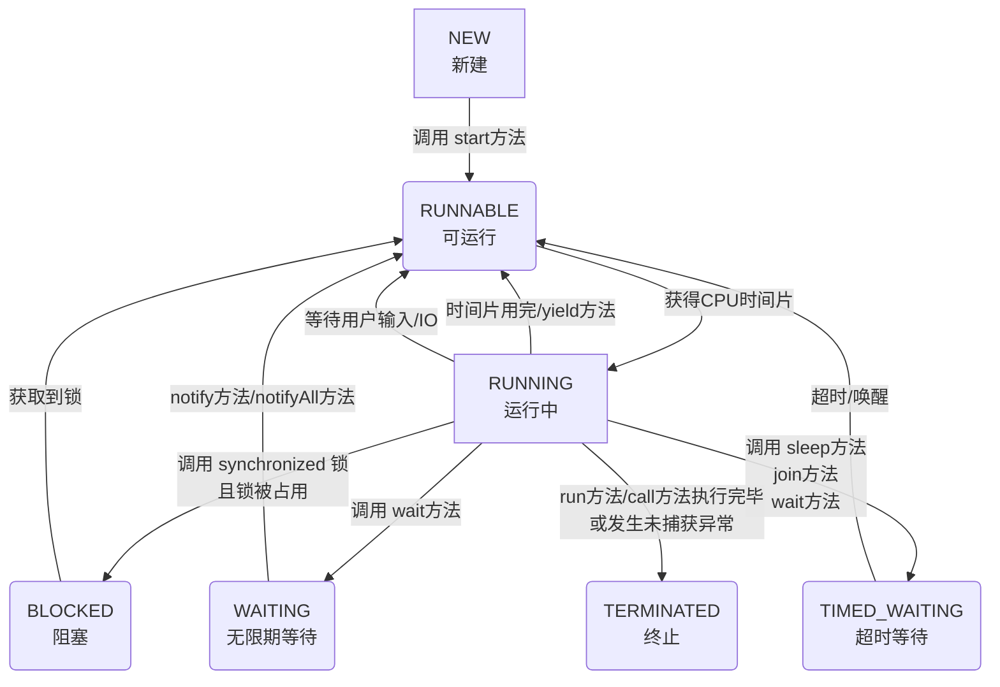

###### 1. 说说进程和线程的区别？
|特性维度|进程 (Process)|线程 (Thread)|
|---|---|---|
|**根本区别**​|**资源分配的基本单位**，拥有独立的虚拟地址空间、代码、数据及其他系统资源。|**CPU调度的基本单位**，是进程中的一个执行流，共享进程的资源。|
|**从属关系**​|独立存在，一个进程崩溃通常不会影响其他进程（在保护模式下）。|依赖于进程，一个线程崩溃会导致整个进程崩溃，从而影响同进程下的其他线程。|
|**资源开销**​|创建、销毁、切换开销大，因为需要分配和回收独立的内存空间等资源。|创建、销毁、切换开销小，因为它们共享进程的地址空间和资源。|
|**数据共享**​|进程间通信（IPC）相对复杂，需要借助管道、消息队列、共享内存等机制。|线程间共享数据简单直接，因为它们天然共享进程的全局变量和堆空间，但需注意同步。|
|**健壮性**​|多进程程序更健壮，一个进程失效不会直接影响另一个。|多线程程序健壮性较低，一个线程异常可能导致整个进程终止。|

简单来说，**进程是“资源分配的容器”，而线程是“在这个容器里真正干活的工人”**。一个程序至少有一个进程，一个进程至少有一个线程。
###### 2. 如何创建线程？有几种方式？
在Java中，主要有三种方式来创建线程：
1. **继承 `Thread`类**
    通过继承 `Thread`类并重写其 `run()`方法。这种方式简单，但由于Java是单继承，限制了类的扩展性。
 ```java
    class MyThread extends Thread {
        @Override
        public void run() {
            System.out.println("线程运行中: " + Thread.currentThread().getName());
        }
    }
    public class Main {
        public static void main(String[] args) {
            MyThread thread = new MyThread();
            thread.start(); // 启动新线程
        }
    }
    ```
2. **实现 `Runnable`接口（推荐）**
    通过实现 `Runnable`接口，将线程任务和线程对象解耦，灵活性更高，也更符合面向接口编程的思想，是**最常用**的方式。
 ```java
    class MyRunnable implements Runnable {
        @Override
        public void run() {
            System.out.println("线程运行中: " + Thread.currentThread().getName());
        }
    }
    public class Main {
        public static void main(String[] args) {
            Thread thread = new Thread(new MyRunnable());
            thread.start();
    
            // 或使用Lambda表达式，更简洁
            new Thread(() -> {
                System.out.println("Lambda线程: " + Thread.currentThread().getName());
            }).start();
        }
    }
    ```
1. **实现 `Callable`接口**
	`Callable`接口的 `call()`方法可以返回结果并能抛出异常。需要配合 `FutureTask`来获取返回值。
```java
    import java.util.concurrent.Callable;
    import java.util.concurrent.FutureTask;
    
    class MyCallable implements Callable<Integer> {
        @Override
        public Integer call() throws Exception {
            int sum = 0;
            for (int i = 1; i <= 100; i++) {
                sum += i;
            }
            return sum; // 返回计算结果
        }
    }
    public class Main {
        public static void main(String[] args) throws Exception {
            FutureTask<Integer> futureTask = new FutureTask<>(new MyCallable());
            Thread thread = new Thread(futureTask);
            thread.start();
            Integer result = futureTask.get(); // 获取线程执行的结果，会阻塞直到计算完成
            System.out.println("计算结果: " + result);
        }
    }
    ```
**最佳实践**：对于需要管理大量线程的场景，强烈建议使用 `ExecutorService`线程池，它可以有效减少线程创建和销毁的开销，并提供更强大的线程管理功能。
###### 3. 什么是线程安全？如何保证线程安全？
**线程安全**指的是当多个线程同时访问同一个共享资源时，无论运行时环境如何调度或交替执行，且无需调用方进行额外的同步操作，程序都能表现出正确的行为。
线程不安全最典型的例子就是多个线程同时修改一个变量导致数据错乱。
保证线程安全的核心思路是**对共享资源的访问进行同步**，确保同一时刻只有一个（或有限个）线程可以操作该资源。主要方案有：

|方案类别|核心思想|典型实现|适用场景|
|---|---|---|---|
|**互斥同步（阻塞同步）**​|悲观策略，通过加锁保证同一时间只有一个线程进入临界区。|`synchronized`关键字、`ReentrantLock`|写入竞争激烈，需要保证强一致性|
|**非阻塞同步**​|乐观策略，先操作，冲突时重试。|`AtomicInteger`等原子变量（基于CAS）|读多写少，竞争不激烈，追求高吞吐|
|**无需同步**​|从根本上避免共享。|使用局部变量、不可变对象（如`String`）、`ThreadLocal`|无状态对象、只读操作、线程隔离数据|

**示例：使用 `synchronized`解决线程不安全问题**
```java
public class Counter {
    private int count = 0;
    
    // 使用synchronized保证方法同步
    public synchronized void increment() {
        count++; // 这个操作现在原子了
    }
    
    public int getCount() {
        return count;
    }
}
```
###### 4. 什么是线程的生命周期？线程有哪些状态？
Java线程在其生命周期中会处于以下几种状态之一（定义在 `Thread.State`枚举中）。


1. **NEW (新建)**：线程对象被创建，但尚未调用 `start()`方法。
2. **RUNNABLE (可运行)**：调用 `start()`后，线程等待CPU时间片或正在运行。注意，Java将**就绪（Ready）​和**运行（Running）**​ 都归入此状态。
3. **BLOCKED (阻塞)**：线程等待获取一个**由`synchronized`保护的排他锁**，若锁被其他线程占用，则进入此状态。
4. **WAITING (无限期等待)**：线程进入等待状态，需要被其他线程显式唤醒。例如调用 `Object.wait()`（不带超时）或 `Thread.join()`（不带超时）。
5. **TIMED_WAITING (超时等待)**：线程在指定的时间范围内等待，超时后自动唤醒。例如调用 `Thread.sleep(millis)`, `Object.wait(timeout)`, `Thread.join(timeout)`。
6. **TERMINATED (终止)**：线程执行完毕（`run`方法正常结束）或因异常退出，不可再次启动。
###### 5. start() 和 run() 方法有什么区别？
- `start()`：**启动新线程**的真正方法。它会使JVM创建一个新的线程，并在新线程中异步执行 `run()`方法。
- `run()`：**普通的方法调用**。如果直接调用 `run()`，它会在当前线程（如main线程）中同步执行，而不会启动新线程。
###### 6. sleep() 和 wait() 方法有什么区别？

|特性|`Thread.sleep(long millis)`|`Object.wait(long timeout)`|
|---|---|---|
|**所属类**​|`Thread`类的静态方法|`Object`类的方法|
|**作用**​|**让当前正在执行的线程暂停执行指定的时间**，不释放已持有的锁。|**让当前线程等待**，并**释放已经持有的对象锁**，以便其他线程可以进入同步块。|
|**唤醒条件**​|时间到期。|1. 超时时间到。 2. 其他线程调用该对象的 `notify()`/`notifyAll()`。|
|**用途**​|用于暂停线程执行，与同步无关。|用于线程间的协同工作，必须在同步代码块（synchronized）内使用。|
###### 7. yield() 和 join() 方法的作用是什么？
- `yield()`：静态方法。提示调度器**当前线程愿意让出当前使用的CPU**，但调度器可以忽略这个提示。它会让线程从运行状态回到就绪状态，而不是阻塞状态。主要用于测试和调试，实践中很少用。
- `join()`：实例方法。用于**线程顺序执行**。比如在A线程中调用 `B.join()`，那么A线程会一直阻塞，直到B线程执行完毕。可以设置超时时间 `B.join(1000)`。
###### 8. 什么是守护线程？如何创建守护线程？
- **概念**：一种低优先级的线程，**在后台为其他线程提供服务**，例如垃圾回收线程。当一个JVM中**所有的非守护线程**都结束时，JVM会自动退出，无论是否还有守护线程在运行，它们都会被直接终止。
- **创建**：在线程启动 (`start()`) **之前**，调用 `thread.setDaemon(true)`即可将线程设置为守护线程。
- **注意**：守护线程中产生的子线程默认也是守护线程。守护线程通常不适合用于执行I/O操作或重要的事务逻辑，因为可能无法正常清理资源。