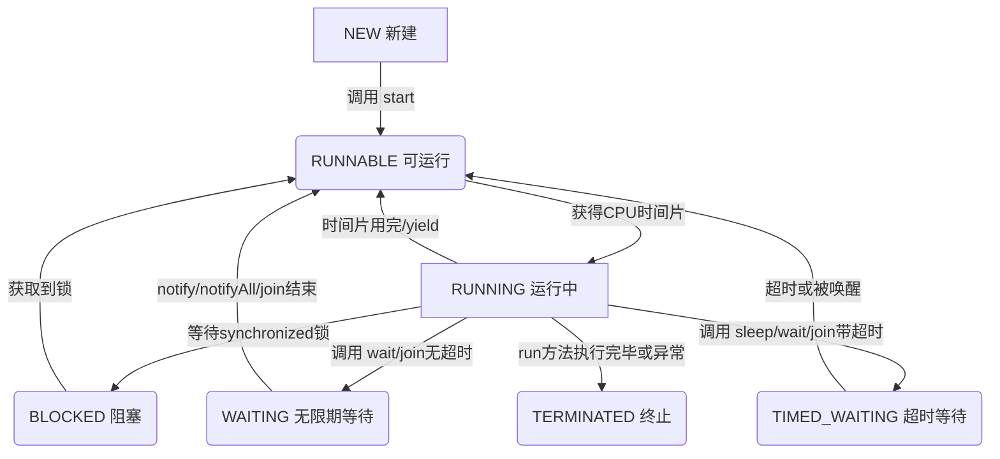

###### 1. 说说进程和线程的区别？

[[../../../20_JavaKnowledge/03_并发编程/01、线程基础与生命周期#一、Java 线程的创建方式|📖]]
进程和线程是操作系统中两个非常核心的概念，简单来说，**进程是"资源分配的容器"，线程是"容器里真正干活的工人"**。

从本质上区分，进程是**资源分配的基本单位**，它拥有独立的虚拟地址空间、代码段、数据段等系统资源；而线程是**CPU调度的基本单位**，是进程内部的一个执行流，多个线程共享所在进程的内存空间。

从开销来看，进程的创建、销毁和切换开销都很大，因为每次都需要分配和回收独立的内存资源；线程的开销则小得多，因为它们天然共享进程的地址空间。

从数据共享来看，不同进程之间通信比较麻烦，需要借助管道、消息队列、共享内存这些IPC机制；而同一进程内的线程共享堆内存和全局变量，通信更直接，但也因此需要注意同步问题。

从健壮性来看，多进程更稳定，一个进程崩溃不会直接影响其他进程；但一个线程抛出未捕获异常，可能会拖垮整个进程。

一个程序至少有一个进程，一个进程至少有一个线程（主线程）。

###### 2. 如何创建线程？有几种方式？

[[../../../20_JavaKnowledge/03_并发编程/01、线程基础与生命周期#一、Java 线程的创建方式|📖]]
在Java中，主要有三种方式来创建线程：

1. **继承 `Thread` 类**：重写 `run()` 方法，然后 `new MyThread().start()`。这种方式简单直接，但由于Java是单继承，用掉继承位置，灵活性差。

```java
class MyThread extends Thread {
    @Override
    public void run() {
        System.out.println("线程运行中: " + Thread.currentThread().getName());
    }
}
new MyThread().start();
```

2. **实现 `Runnable` 接口（推荐）**：将任务逻辑和线程对象解耦，灵活性更高，也更符合面向接口的编程思想。配合Lambda表达式写起来非常简洁。

```java
new Thread(() -> System.out.println("Lambda线程运行中")).start();
```

3. **实现 `Callable` 接口**：和Runnable的区别是，`call()` 方法可以**有返回值**，还能**抛出受检异常**。需要配合 `FutureTask` 来包装和获取结果。

```java
FutureTask<Integer> futureTask = new FutureTask<>(() -> {
    // 执行计算，返回结果
    return 1 + 1;
});
new Thread(futureTask).start();
Integer result = futureTask.get(); // 阻塞等待结果
```

**最佳实践**：生产环境中强烈建议使用 `ExecutorService` 线程池来管理线程，避免频繁创建销毁线程的开销。

###### 3. 什么是线程安全？如何保证线程安全？

[[../../../20_JavaKnowledge/03_并发编程/02、Java内存模型（JMM）#三、三大特性|📖]]
**线程安全**指的是：多个线程同时访问同一个共享资源时，不需要调用方做额外的同步操作，程序依然能表现出正确的行为。最典型的反例就是多个线程同时执行 `count++`，因为这不是一个原子操作，会导致数据错乱。

保证线程安全主要有三种思路：

**第一种是互斥同步（悲观锁）**：通过加锁保证同一时刻只有一个线程进入临界区。典型实现是 `synchronized` 关键字和 `ReentrantLock`。适合写操作竞争激烈、需要强一致性的场景。

**第二种是非阻塞同步（乐观锁）**：先不加锁，操作时再判断有没有冲突，有冲突就重试。典型实现是 `AtomicInteger` 等原子类，底层基于CAS指令。适合读多写少、竞争不激烈的场景，吞吐量更高。

**第三种是无需同步**：从根本上避免共享状态。比如使用方法内的局部变量（天然线程安全）、不可变对象（`String`、`final` 字段）、`ThreadLocal` 做线程隔离。这是最优的方案，没有同步开销。

```java
public class Counter {
    private int count = 0;
    // synchronized保证原子性
    public synchronized void increment() {
        count++;
    }
    public int getCount() { return count; }
}
```

###### 4. 什么是线程的生命周期？线程有哪些状态？

[[../../../20_JavaKnowledge/03_并发编程/01、线程基础与生命周期#二、线程的六种状态（状态机）|📖]]
Java线程有六种状态，定义在 `Thread.State` 枚举中：


```mermaid
flowchart TD
    A[NEW 新建] -->|调用 start| B(RUNNABLE 可运行)
    B -->|获得CPU时间片| C[RUNNING 运行中]
    C -->|时间片用完/yield| B
    C -->|等待synchronized锁| D(BLOCKED 阻塞)
    D -->|获取到锁| B
    C -->|调用 wait/join无超时| E(WAITING 无限期等待)
    E -->|notify/notifyAll/join结束| B
    C -->|调用 sleep/wait/join带超时| F(TIMED_WAITING 超时等待)
    F -->|超时或被唤醒| B
    C -->|run方法执行完毕或异常| G(TERMINATED 终止)
```

1. **NEW（新建）**：线程对象创建了，但还没调用 `start()`。
2. **RUNNABLE（可运行）**：调用 `start()` 后，线程等待CPU调度或正在运行。Java把就绪和运行都归为这一个状态。
3. **BLOCKED（阻塞）**：等待获取 `synchronized` 保护的排他锁，锁被别人占着，只能在这干等。
4. **WAITING（无限期等待）**：调用 `wait()`、`join()` 等无超时版本，需要其他线程主动唤醒才能继续。
5. **TIMED_WAITING（超时等待）**：调用 `sleep(millis)`、`wait(timeout)` 等有超时版本，时间到了自动醒来。
6. **TERMINATED（终止）**：`run()` 方法执行完毕，或者抛出未捕获异常后结束，不可再次启动。

###### 5. start() 和 run() 方法有什么区别？

[[../../../20_JavaKnowledge/03_并发编程/01、线程基础与生命周期#一、Java 线程的创建方式|📖]]
这是个高频基础题，核心区别是：

`start()` 才是**真正启动新线程**的方法。调用它会让JVM创建一个新的操作系统线程，然后在这个新线程里异步执行 `run()` 方法。

`run()` 只是一个**普通的方法调用**。如果你直接调 `thread.run()`，它就在当前线程里同步执行，跟新线程没有任何关系，和调普通方法没什么区别。

面试答错的人通常混淆了"启动线程"和"执行任务逻辑"这两件事。记住：`start()` 负责创建新线程，`run()` 是新线程要执行的任务。

###### 6. sleep() 和 wait() 方法有什么区别？

[[../../../20_JavaKnowledge/03_并发编程/01、线程基础与生命周期#八、Thread 重要方法速查|📖]]
这两个方法都能让线程"停一会儿"，但有几个关键区别，面试必考：

**所属类不同**：`sleep()` 是 `Thread` 的静态方法；`wait()` 是 `Object` 的实例方法。

**是否释放锁**：这是最核心的区别。`sleep()` 睡觉时**不释放锁**，它只是让当前线程暂停指定时间，锁还握在手里；`wait()` 则会**立即释放锁**，让其他线程有机会进入同步块。

**唤醒方式**：`sleep()` 只能靠时间到了自动醒来；`wait()` 除了超时自动唤醒，还可以被其他线程调 `notify()` / `notifyAll()` 主动唤醒。

**使用场景不同**：`sleep()` 跟同步没关系，就是单纯让线程休眠；`wait()` 专门用于线程间协调，必须在 `synchronized` 代码块内使用，否则会抛 `IllegalMonitorStateException`。

一句话总结：**sleep是定闹钟睡觉不放东西，wait是放下手里的锁等人叫醒你。**

###### 7. yield() 和 join() 方法的作用是什么？

[[../../../20_JavaKnowledge/03_并发编程/01、线程基础与生命周期#八、Thread 重要方法速查|📖]]
**yield()** 是个"谦让"方法。它提示调度器"我愿意让出当前CPU时间片"，让线程从运行状态回到就绪状态，但调度器可以直接无视这个提示。它不会让线程进入阻塞，其他同等或更高优先级的线程有机会先跑。实际业务中几乎不用，主要出现在测试和调试场景。

**join()** 是个"等你跑完我再跑"的方法。在A线程里调用 `b.join()`，A会阻塞，直到B线程执行结束。可以设超时：`b.join(1000)` 表示最多等1秒。常用于主线程等待子线程全部结束后再汇总结果。

###### 8. 什么是守护线程？如何创建守护线程？

[[../../../20_JavaKnowledge/03_并发编程/01、线程基础与生命周期#五、守护线程（Daemon Thread）|📖]]
**守护线程**是一种在后台默默服务其他线程的特殊线程，最典型的例子就是JVM的垃圾回收线程。

它有个重要特性：当JVM中**所有非守护线程都结束时**，JVM会自动退出，此时所有守护线程也会被强制终止，不管它们有没有执行完。

**创建方式**：在调用 `start()` **之前**，执行 `thread.setDaemon(true)` 即可。

```java
Thread daemonThread = new Thread(() -> {
    while (true) {
        // 后台服务逻辑
    }
});
daemonThread.setDaemon(true); // 必须在start前设置
daemonThread.start();
```

**注意事项**：守护线程产生的子线程默认也是守护线程。守护线程不适合执行重要的I/O操作或事务逻辑，因为随时可能被强制终止，没有机会做清理工作。

###### 9. 线程中断机制是怎么工作的？

[[../../../20_JavaKnowledge/03_并发编程/01、线程基础与生命周期#四、线程中断机制（Interrupt）|📖]]
Java的线程中断不是"强制停止"，而是一种**协作式的中断信号机制**。

每个线程都有一个中断标志位。调用 `thread.interrupt()` 只是把这个标志位置为 `true`，并不会真的中断线程。线程需要主动检查这个标志位来决定是否停止：

```java
// 在run方法中定期检查中断标志
while (!Thread.currentThread().isInterrupted()) {
    // 执行任务
}
```

**特殊情况**：如果线程正处于 `sleep()`、`wait()`、`join()` 等阻塞状态，此时调用 `interrupt()` 会抛出 `InterruptedException`，并且会**清除中断标志位**。所以在 `catch (InterruptedException e)` 中，通常需要重新设置中断标志：

```java
try {
    Thread.sleep(1000);
} catch (InterruptedException e) {
    Thread.currentThread().interrupt(); // 恢复中断标志
}
```

这种设计让线程自己决定如何响应中断，比强制 `stop()` 更安全，`stop()` 方法已经被废弃就是这个原因。

###### 10. 什么情况下会发生线程安全问题？根本原因是什么？

[[../../../20_JavaKnowledge/03_并发编程/02、Java内存模型（JMM）#三、三大特性|📖]]
线程安全问题发生需要同时满足三个条件：**多个线程**、**共享可变数据**、**非原子操作**。缺少任何一个条件都不会出问题。

根本原因可以从三个维度来理解：

**原子性问题**：看似一条语句的操作实际上是多步的，比如 `i++` 实际上是读取-修改-写回三步，线程切换发生在中间就出问题了。

**可见性问题**：一个线程修改了变量，另一个线程可能因为CPU缓存或编译器优化，读到的还是旧值。`volatile` 关键字就是为了解决这个问题。

**有序性问题**：编译器和CPU为了性能会对指令进行重排序，单线程下不影响结果，但多线程下可能出现意外。DCL单例中 `new` 操作的重排序就是经典案例。

解决线程安全问题，就是针对这三个维度分别采取措施：`synchronized` 三个都能保证，`volatile` 保证可见性和有序性，原子类保证原子性。
