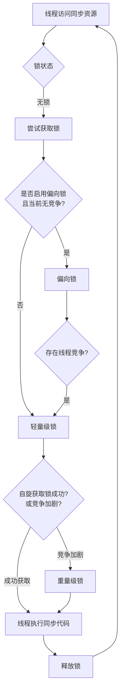

###### 1. 说说 synchronized 关键字的理解？
`synchronized`是 Java 内置的同步锁机制，用于解决多线程访问共享资源时的线程安全问题。它的核心作用是确保**同一时刻最多只有一个线程**可以执行被保护的代码段或方法，从而避免数据不一致等问题。
它主要提供以下三大保证：
- **原子性**：确保被锁定的操作作为一个不可分割的整体执行。
- **可见性**：当一个线程释放锁时，它对共享变量的修改会强制刷新到主内存。当另一个线程获取锁时，它会清空本地缓存，从主内存重新加载变量值，从而保证能看到最新结果。
- **有序性**：有效防止指令重排序对并发操作的影响，确保代码执行顺序符合预期。
###### 2. synchronized 的底层原理是什么？
`synchronized`的底层实现依赖于 **Java 对象头**​ 和 **监视器锁**​ 机制。
- **对象头与 Monitor**：在 JVM 中，每个对象在内存中均包含一个对象头。对象头中的 **Mark Word**​ 区域存储了与锁相关的信息（如锁状态、持有锁的线程ID等）。每个对象也与一个 **监视器锁（Monitor）​关联。
- **字节码指令**：当使用 `synchronized`修饰代码块时，JVM 会在编译后的字节码中插入 `monitorenter`和 `monitorexit`指令来标识同步代码块的开始和结束。当线程进入同步块时执行 `monitorenter`尝试获取 Monitor 的所有权，退出时执行 `monitorexit`释放锁。
- **方法级同步**：对于 `synchronized`修饰的实例方法或静态方法，JVM 通过方法常量池中的 `ACC_SYNCHRONIZED`访问标志来标识。线程执行方法前会先尝试获取锁（实例方法锁 `this`，静态方法锁当前类的 `Class`对象）。
###### 3. synchronized 可以修饰哪些地方？有什么区别？
`synchronized`主要有三种应用方式，其作用和锁对象有所不同：

|用法|示例|作用对象（锁是什么）|说明|
|---|---|---|---|
|**修饰实例方法**​|`public synchronized void method() {...}`|**当前对象实例**​ (`this`)|不同线程访问**同一个对象实例**的此方法会互斥  。|
|**修饰静态方法**​|`public static synchronized void staticMethod() {...}`|**当前类的 Class 对象**​|对不同对象实例也互斥，因为静态方法属于类  。|
|**修饰代码块**​|`synchronized(obj) {...}`或 `synchronized(MyClass.class) {...}`|**指定对象**（如实例obj、类Class对象）|提供最细粒度的锁控制，灵活性最高  。|

**重要注意点**：修饰实例方法时，锁是当前对象实例；修饰静态方法时，锁是当前类的Class对象。因此，一个线程访问实例同步方法，另一个线程访问静态同步方法，**它们获取的是不同的锁，不会发生互斥**​。
###### 4. synchronized 的锁升级过程是怎样的？
为了减少获得锁和释放锁带来的性能开销，JVM 会对 `synchronized`锁进行优化，其升级过程是单向的（不可降级）。下面的流程图清晰地展示了这一过程：

###### 5. 什么是偏向锁、轻量级锁、重量级锁？
| 锁类型       | 核心思想                                        | 适用场景                                  | 特点                                                      |
| --------- | ------------------------------------------- | ------------------------------------- | ------------------------------------------------------- |
| **偏向锁**​  | 消除无竞争情况下的同步开销。锁会偏向第一个获取它的线程，该线程再次请求时无需同步操作。 | 适用于**只有一个线程**多次访问同步块的场景。              | 加锁解锁无需CAS操作，性能开销极小。但发生竞争时需要撤销偏向锁。                       |
| **轻量级锁**​ | 在没有多线程竞争的前提下，减少传统重量级锁的性能消耗。                 | 适用于**交替执行**、**锁持有时间短**、且**竞争不激烈**的场景。 | 线程通过CAS操作在栈帧中创建锁记录（Lock Record）来尝试获取锁。若失败，会先进行**自旋**尝试。 |
| **重量级锁**​ | 通过操作系统的互斥量实现，线程阻塞和唤醒需要从用户态切换到内核态，开销大。       | 适用于**高并发**、**锁持有时间长**、**竞争激烈**的场景。    | 未获取到锁的线程会**被阻塞**，等待被唤醒。能够减少CPU空转，但上下文切换开销大。             |
###### 6. synchronized 和 Lock 的区别是什么？
尽管 `synchronized`和 `Lock`接口（如 `ReentrantLock`）都用于同步，但存在显著差异：

| 特性           | synchronized        | Lock (如 ReentrantLock)                    |
| ------------ | ------------------- | ----------------------------------------- |
| **实现层次**​    | JVM 级别，内置关键字。       | JDK 级别，接口 API 实现。                         |
| **锁的获取与释放**​ | 自动管理，代码块结束或异常时自动释放。 | 需手动 `lock()`和 `unlock()`，通常放在 `finally`块。 |
| **灵活性**​     | 相对不灵活。              | 支持尝试非阻塞获取锁、可中断获取锁、超时获取锁、公平锁等。             |
| **等待机制**​    | 线程若未获锁，会一直等待。       | 可通过 `Condition`进行精确的线程等待/唤醒，一个锁可关联多个条件。   |
###### 7. synchronized 和 volatile 的区别是什么？
`synchronized`和 `volatile`是解决内存可见性的两种手段，但侧重点不同：

| 特性        | synchronized               | volatile                                |
| --------- | -------------------------- | --------------------------------------- |
| **功能**​   | 保证**原子性**、**可见性**和**有序性**。 | 保证**可见性**和**有序性**（禁止指令重排序），**不保证原子性**​。 |
| **性能**​   | 重量级，可能涉及线程阻塞和上下文切换。        | 轻量级，不会引起线程阻塞。                           |
| **使用场景**​ | 控制多个线程对**多个**共享变量的复杂同步访问。  | 修饰单个变量，确保所有线程看到最新值，适用于状态标志位等简单场景。       |
###### 8. synchronized 的可见性和有序性如何保证？
- **可见性**：得益于 `synchronized`的监视器锁规则：对一个锁的解锁操作 happens-before 于后续对这个锁的加锁操作。这意味着，前一个线程在解锁前对共享变量的所有修改，对下一个加锁的线程一定是可见的。
- **有序性**：`synchronized`通过“一个变量在同一时刻只允许一个线程对其进行锁操作”的规则，间接保证了有序性。这使得被同步的代码段在单线程执行视角下依然有序，从而避免了由于重排序导致的数据不一致问题。
###### 9. synchronized 的锁优化有哪些？
JVM 和编译器还会对 `synchronized`进行其他优化：
- **锁消除**：JIT 编译器在运行时检测到某些共享数据不可能存在竞争时，会自动消除这些不必要的锁。
- **锁粗化**：如果虚拟机检测到有一串零碎的操作都对同一个对象反复加锁和解锁，会将锁同步的范围扩展（粗化）到整个操作序列的外部，减少不必要的锁请求和释放。
- **自适应自旋**：线程在请求锁时，如果锁被占用，不会立即挂起，而是执行一个忙循环（自旋）若干次，尝试获取锁。如果经常成功，则增加自旋次数；如果很少成功，则减少或直接挂起线程。
###### 10. synchronized 能防止指令重排序吗？
**可以防止**。`synchronized`通过其内存语义（as-if-serial 和 happens-before 规则）确保了在同步代码块内部，编译器和处理器不会为了优化性能而进行会破坏程序正确性的指令重排序。这使得在同步块内，代码的执行顺序看起来就像是严格按照顺序执行的。