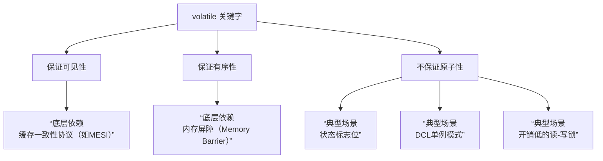

###### 1. 说说 volatile 关键字的理解？
`volatile`是 Java 提供的一种**轻量级的同步机制**，主要用于确保**变量修改的可见性**和**防止指令重排序**。
当一个变量被声明为 `volatile`时，意味着所有线程在访问这个变量时，都会直接从主内存中读取它的值，并且对它的修改都会立即写回主内存。这解决了因线程将变量副本保存在各自的工作内存（如CPU缓存）中而可能导致的**数据不一致**问题。


###### 2. volatile 如何保证可见性？
可见性问题产生的根源在于现代计算机的多级缓存架构。每个CPU核心都可能在自己的缓存中保留共享变量的副本，当一个线程修改了其缓存中的副本值，这个修改可能不会立即同步给其他线程，导致其他线程读取到的是过期的旧数据。
`volatile`通过以下机制保证可见性：
1. **强制主内存读写**：对 `volatile`变量进行**写操作**时，JVM会向处理器发送一条指令（如`lock`前缀的指令），强制将新值立即刷新到主内存。对 `volatile`变量进行**读操作**时，JVM会使该线程的工作内存中对应变量的缓存行**失效**，从而强制它必须从主内存中重新加载最新值。
2. **缓存一致性协议**：在硬件层面，这通常通过缓存一致性协议（如Intel的MESI协议）实现。当某个CPU核心修改了`volatile`变量，其他CPU核心会通过该协议嗅探到这一变化，并将自己缓存中对应的数据标记为**无效状态**。当它们下次需要读取这个变量时，发现缓存失效，就会从主内存重新获取最新数据。
###### 3. volatile 如何禁止指令重排序？
为了提高性能，编译器和处理器常常会对指令进行**重排序**。在单线程下，这不会影响最终结果，但在多线程环境下，可能导致程序出现意想不到的错误。
`volatile`通过**内存屏障**​ 来禁止指令重排序。内存屏障是一组CPU指令，用于控制特定操作间的顺序。JMM为`volatile`的读写操作插入了以下类型的内存屏障：
- **在每个 volatile 写操作之前插入 StoreStore 屏障**：确保该屏障之前的普通写操作结果，对于随后的`volatile`写操作是可见的。
- **在每个 volatile 写操作之后插入 StoreLoad 屏障**：确保该`volatile`写操作的结果能立即对其他线程可见。
- **在每个 volatile 读操作之后插入 LoadLoad 屏障**：确保该`volatile`读操作先于其后所有的读操作。
- **在每个 volatile 读操作之后插入 LoadStore 屏障**：确保该`volatile`读操作先于其后所有的写操作。
这些屏障规则共同作用，就像在代码中划定了“界线”，阻止了重排序跨越`volatile`操作，从而保证了有序性。
###### 4. volatile 能保证原子性吗？为什么？
**不能**。
原子性意味着一个操作是不可中断的，要么全部执行成功，要么完全不执行。而 `volatile`无法保证复合操作的原子性。最经典的例子就是自增操作 `count++`。这个操作并非原子操作，它实际上包含三个步骤：
1. 读取变量 `count`的当前值。
2. 将值加1。
3. 将新值写回 `count`。
如果两个线程同时读取了 `count`的初始值（比如都是5），然后各自加1并写回，最终结果会是6，而不是正确的7。这是因为后一个线程的写操作覆盖了前一个线程的结果。
如果需要保证原子性，应该使用 `synchronized`关键字或 `java.util.concurrent.atomic`包下的原子类（如 `AtomicInteger`）。
###### 5. volatile 的应用场景有哪些？
基于 `volatile`的特性，它适用于以下场景：
1. **状态标志位**：用一个 `volatile boolean`变量作为线程运行或中断的标志。由于可见性有保证，其他线程修改标志后，当前线程能立即感知并安全退出。
  ```java
    public class WorkerThread extends Thread {
        private volatile boolean running = true;
    
        public void run() {
            while (running) {
                // 执行任务...
            }
        }
    
        public void stopWorker() {
            running = false; // 其他线程调用此方法，WorkerThread能立即看到false
        }
    }
    ```
1. **双重检查锁定**：在单例模式的DCL中，`volatile`可以防止指令重排序带来的问题，确保其他线程获取到的是完全初始化后的实例，而不是一个半成品的对象
 ```java
    public class Singleton {
        private static volatile Singleton instance;
    
        public static Singleton getInstance() {
            if (instance == null) { // 第一次检查
                synchronized (Singleton.class) {
                    if (instance == null) { // 第二次检查
                        instance = new Singleton(); // volatile 防止这行代码重排序
                    }
                }
            }
            return instance;
        }
    }
    ```
1. **“读多写少”的简单共享变量**：当某个变量读操作远多于写操作，且写操作不依赖于变量的当前值时（即直接赋值，而非先读后写），可以使用 `volatile`来保证可见性，这比使用锁的性能开销要小。
###### 6. volatile 和 synchronized 的区别是什么？
| 特性         | volatile                  | synchronized                          |
| ---------- | ------------------------- | ------------------------------------- |
| **功能范围**​  | 仅保证**可见性**和**有序性**。       | 保证**原子性**、可见性和有序性。                    |
| **阻塞性**​   | **不会**引起线程阻塞。             | 在获取锁失败时，线程会**阻塞**，直到锁被释放。             |
| **适用级别**​  | 只能修饰**变量**。               | 可以修饰**方法**、**代码块**。                   |
| **性能开销**​  | 开销更小，是**轻量级**的同步。         | 开销相对较大，是**重量级**的同步。但在现代JVM中，其性能已大幅优化。 |
| **原子性保证**​ | **不能**保证复合操作（如`i++`）的原子性。 | **能**保证整个同步块内操作的原子性。                  |