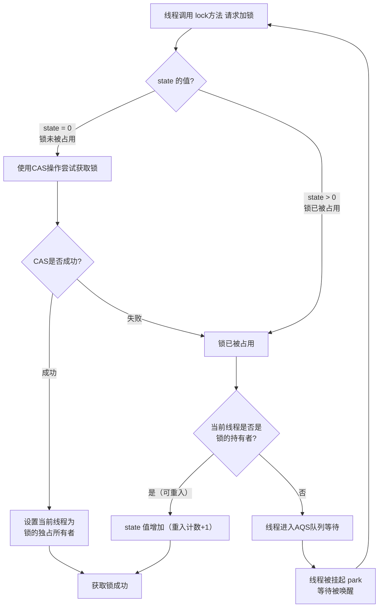

###### 1. Lock 接口有哪些实现类？
`java.util.concurrent.locks.Lock`接口是 Java 5 引入的替代 `synchronized`关键字的一种更灵活的同步机制。它的主要实现类包括：

| 实现类                         | 核心特性                                                                        | 适用场景                                 |
| --------------------------- | --------------------------------------------------------------------------- | ------------------------------------ |
| **ReentrantLock**​          | **可重入的互斥锁**，支持公平与非公平策略，是 `synchronized`的增强版。                                | 大多数需要互斥访问的场景，尤其是需要可中断、超时或公平性控制的复杂同步。 |
| **ReentrantReadWriteLock**​ | 维护一对关联的锁：**读锁（共享）**​ 和 **写锁（独占）**，适用于读多写少的场景。                               | 读操作远多于写操作，且对数据一致性有要求的场景，如缓存、配置管理。    |
| **StampedLock**​            | JDK 8 引入，提供三种模式的访问控制：写锁、悲观读锁和**乐观读**。性能通常优于 `ReentrantReadWriteLock`，但不可重入。 | 读多写少，对性能要求极高，且能够处理乐观读失败情况的场景。        |
###### 2. ReentrantLock 的实现原理是什么？
`ReentrantLock`的核心实现依赖于 **AQS（AbstractQueuedSynchronizer）**，这是一个用于构建锁和同步器的框架。其核心原理可以通过下图展示的加锁流程来理解：


AQS 内部维护一个 volatile 的整型变量 `state`和一个 FIFO 线程等待队列。
- **获取锁**：当 `state`为 0 时，表示锁空闲，线程通过 CAS（Compare-And-Swap） 操作尝试将 `state`设为 1 来获取锁。若成功，则记录当前线程为锁的持有者。若 `state`不为 0 且当前线程已是持有者，则 `state`加 1（重入）。
- **释放锁**：线程调用 `unlock()`时，将 `state`减 1。只有当 `state`减为 0 时，才彻底释放锁，并唤醒等待队列中的下一个线程。
###### 3. ReentrantLock 的公平锁和非公平锁有什么区别？
`ReentrantLock`在构造时可选择公平性，两者的区别在于获取锁的策略不同，对性能有直接影响。

| 特性        | 非公平锁（默认）                                    | 公平锁                                                                |
| --------- | ------------------------------------------- | ------------------------------------------------------------------ |
| **获取策略**​ | 线程获取锁时可直接尝试 **CAS 抢锁**，无论等待队列中是否有其他线程在等待。   | 严格按照线程在等待队列中的 **FIFO（先来后到）**​ 顺序获取锁。                               |
| **性能**​   | **吞吐量通常更高**。因为减少了线程挂起和唤醒的开销，但可能导致线程**饥饿**​。 | 吞吐量相对较低，因为需要维护严格的顺序，避免了饥饿问题。                                       |
| **实现差异**​ | 在 `tryAcquire`方法中**不检查**等待队列是否为空。           | 在 `tryAcquire`方法中会先调用 `hasQueuedPredecessors()`方法**检查**是否有前驱节点在等待。 |

**选择建议**：除非有明确的公平性需求，否则**优先使用非公平锁**，以获得更好的整体性能。
###### 4. ReentrantLock 如何实现可重入？
可重入性是指**同一个线程可以多次获取同一把锁而不会自我死锁**​。`ReentrantLock`通过 AQS 的 `state`字段和 `exclusiveOwnerThread`变量来实现：
- `state`不仅表示锁的状态（0/1），还记录锁的**重入次数**。
- 当线程首次获取锁时，`state`设为 1，并记录持有线程。
- 该线程再次获取锁时，会检查当前线程是否为锁的持有者。如果是，则简单地将 `state`加 1。
- 释放锁时，每次 `unlock()`只将 `state`减 1。只有当 `state`减至 0 时，才真正释放锁，其他线程才能获取。
###### 5. ReentrantLock 和 synchronized 的区别是什么？
尽管功能相似，但 `ReentrantLock`在功能上提供了更多灵活性，是 `synchronized`的增强。

| 特性           | ReentrantLock                                              | synchronized                                        |
| ------------ | ---------------------------------------------------------- | --------------------------------------------------- |
| **实现级别**​    | JDK 级别，是 API 层面的接口实现。                                      | JVM 级别，是 Java 语言的内置关键字。                             |
| **锁的获取与释放**​ | **显式**操作，必须手动调用 `lock()`和 `unlock()`，通常放在 `try-finally`块中。 | **隐式**管理，进入同步块自动加锁，退出（正常或异常）自动释放。                   |
| **灵活性**​     | 支持**可中断的锁获取**、**超时获取锁**、**尝试非阻塞获取锁**，以及**公平锁**选择。          | 不支持上述高级功能，锁的获取是非中断的。                                |
| **等待条件**​    | 通过 `Condition`接口，一个锁可以关联**多个等待条件**，实现更精细的线程通信。             | 通过 `Object`的 `wait()`, `notify()`实现，一个锁只能有一个等待条件。   |
| **性能**​      | 在竞争激烈时性能表现更好。                                              | 随着 JDK 版本升级，两者的性能差距已缩小，在低竞争环境下 `synchronized`优化得很好。 |
###### 6. 什么是读写锁？ReadWriteLock 的使用场景是什么？
`ReadWriteLock`接口，通常由 `ReentrantReadWriteLock`实现，定义了一对锁：
- **读锁（ReadLock）**：**共享锁**。允许多个线程同时持有读锁，只要没有线程持有写锁。
- **写锁（WriteLock）**：**排他锁**。同一时间只能有一个线程持有写锁，且持有写锁时，其他线程无法获取读锁或写锁。
这种设计极大地提升了**读多写少**场景下的并发性能。
###### 7. ReentrantReadWriteLock 的实现原理是什么？
其内部也是基于 AQS 的 `state`变量。它巧妙地将一个 32 位的 `int`类型的 `state`拆分使用：
- **高 16 位**：表示读锁的持有数量（包括重入）。
- **低 16 位**：表示写锁的重入次数。
通过位运算，可以高效地判断读、写锁的状态。
###### 8. 什么是锁降级？为什么不支持锁升级？
**锁降级**是指**当前线程在持有写锁的情况下，再获取读锁，随后释放写锁的过程**。这样，写操作完成后，线程仍然持有读锁，可以安全地读取数据，防止其他写线程的干扰，保证了数据可见性。
**为什么不支持锁升级？**（即持有读锁时，直接获取写锁）
因为这样**极易导致死锁**。假设多个线程都持有读锁，其中一个线程尝试升级为写锁，它必须等待所有其他读锁释放。而如果这个升级请求本身又阻塞了其他读锁的释放，就会形成循环等待，导致死锁。因此，`ReentrantReadWriteLock`不允许锁升级。
###### 9. StampedLock 是什么？与 ReentrantReadWriteLock 有什么区别？
`StampedLock`是 JDK 8 引入的高性能锁，它不是 `ReadWriteLock`的实现类，但提供了类似的三种模式：
- **写锁**：独占锁，类似于写锁。
- **悲观读锁**：共享锁，类似于读锁。
- **乐观读**：这是其核心优势。线程在进行读操作时，**不直接加锁**，而是先获取一个 **“邮戳”**。读完数据后，验证这个邮戳是否有效（即在此期间没有写锁被获取过）。如果有效，则读操作成功，避免了加锁开销；如果无效，则可以退化成悲观读锁再试一次。
**与 `ReentrantReadWriteLock`的区别**：
- **性能**：`StampedLock`的乐观读大幅提升了读性能。
- **可重入性**：`StampedLock`**不可重入**。
- **条件变量**：`StampedLock`不支持条件变量 `Condition`。
###### 10. Lock 的 tryLock() 方法有什么用？
`tryLock()`方法是 `Lock`接口提供的一种**非阻塞**或**带超时**的获取锁方式。
- **无参 `tryLock()`**：尝试获取锁，成功返回 `true`，失败立即返回 `false`，线程**不会阻塞**。
- **带超时 `tryLock(long time, TimeUnit unit)`**：在指定时间内尝试获取锁，超时后返回 `false`。
**应用场景**：用于避免线程无限期等待，可用于死锁检测和恢复，或执行非关键任务时快速失败。
###### 11. Condition 接口的作用是什么？如何使用？
`Condition`接口提供了类似 `Object.wait()`和 `Object.notify()`的线程协调机制，但与 `Lock`绑定，功能更强大。
- **一个 `Lock`可以创建多个 `Condition`对象**，允许对不同条件下的线程进行分组管理。
- 核心方法：`await()`（等待）、`signal()`（唤醒一个）、`signalAll()`（唤醒所有）。
**使用示例**（生产者-消费者模型）：
```java
Lock lock = new ReentrantLock();
Condition notFull = lock.newCondition(); // 条件：队列未满
Condition notEmpty = lock.newCondition(); // 条件：队列非空

// 生产者
lock.lock();
try {
    while (queue.isFull()) {
        notFull.await(); // 等待"队列未满"条件
    }
    // 生产数据...
    notEmpty.signal(); // 唤醒等待"队列非空"的消费者
} finally {
    lock.unlock();
}

// 消费者
lock.lock();
try {
    while (queue.isEmpty()) {
        notEmpty.await(); // 等待"队列非空"条件
    }
    // 消费数据...
    notFull.signal(); // 唤醒等待"队列未满"的生产者
} finally {
    lock.unlock();
}
```
###### 12. LockSupport 的 park() 和 unpark() 方法是什么？
`LockSupport`是更底层的线程阻塞工具。
- `park()`：阻塞当前线程。
- `unpark(Thread thread)`：唤醒指定的被阻塞的线程。
与 `Object.wait()`相比，它的优势在于：
- 不需要先获得锁。
- 以线程为操作对象，更精准。
- 不会出现因 `unpark`发生在 `park`之前而导致线程无法被唤醒的问题（"许可"机制）。
AQS 底层正是使用 `LockSupport`来挂起和唤醒线程的。