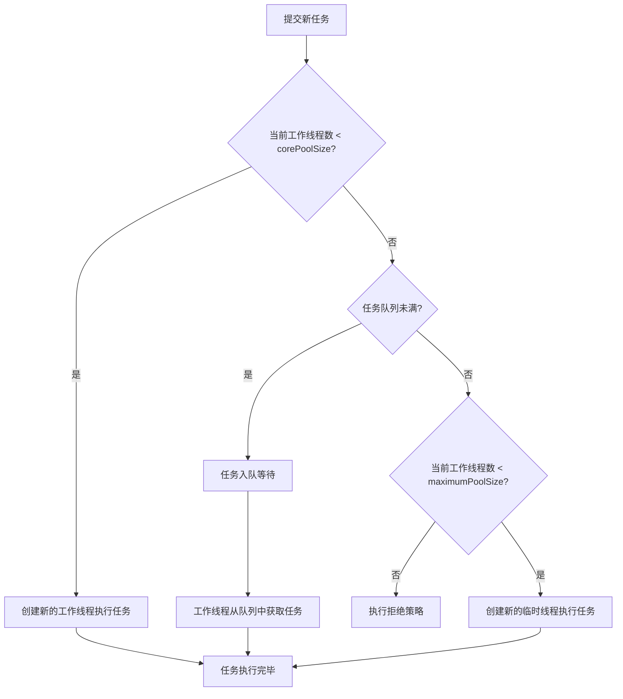

###### 1. 什么是线程池？为什么要使用线程池？
**线程池**是一种多线程处理形式，它预先创建一组线程，并对任务进行统一管理和调度。其核心思想是**线程复用**，通过维护一个线程集合来执行多个任务，避免为每个任务都创建和销毁线程的开销。
使用线程池主要基于以下优势：
- **降低资源消耗**：通过复用已创建的线程，减少频繁创建和销毁线程的性能开销。
- **提高响应速度**：当任务到达时，可以立即由空闲线程执行，无需等待线程创建。
- **提高线程的可管理性**：线程是稀缺资源，使用线程池可以进行统一分配、监控和调优，避免无限制创建线程导致系统资源耗尽。
- **控制并发数量，防止服务器过载**：线程池可以控制最大并发线程数，避免过多线程争夺CPU资源，减少上下文切换，并防止因线程数量爆炸导致的内存溢出（OOM）。
###### 2. 线程池的核心参数有哪些？各有什么作用？
要理解线程池，首先要掌握其七大核心参数。正是这些参数的组合决定了线程池的行为。

| 参数名                  | 作用说明                                                                      |
| -------------------- | ------------------------------------------------------------------------- |
| **corePoolSize**​    | 核心线程数。线程池中长期存活、即使空闲也不会被回收的线程数量（除非设置`allowCoreThreadTimeout`为true）。        |
| **maximumPoolSize**​ | 线程池允许创建的最大线程数。当工作队列满了之后，可以创建新线程，直到总数达到此值。                                 |
| **keepAliveTime**​   | 空闲线程存活时间。当线程数超过`corePoolSize`时，多余的空闲线程等待新任务的最长时间，超过此时间将被回收。               |
| **unit**​            | `keepAliveTime`参数的时间单位（如秒、毫秒）。                                            |
| **workQueue**​       | 任务队列/工作队列。用于保存等待执行的任务的阻塞队列（如`ArrayBlockingQueue`, `LinkedBlockingQueue`）。 |
| **threadFactory**​   | 线程工厂。用于创建新线程，可以定制线程名、优先级、守护状态等，有助于问题排查和监控。                                |
| **handler**​         | 拒绝策略处理器。当线程池已关闭，或线程数达到最大值且队列已满，无法接受新任务时采取的补救措施（如丢弃、抛出异常等）。                |
###### 3. 线程池的工作流程是怎样的？
线程池处理任务的核心流程遵循一套清晰的规则，下图直观展示了从任务提交到执行的完整路径，以及各核心参数在其中发挥的作用：



###### 4. 线程池有哪些拒绝策略？
当线程池和队列都无法容纳更多任务时，拒绝策略开始起作用。JDK默认提供了四种策略：

| 策略                       | 行为                                                      |
| ------------------------ | ------------------------------------------------------- |
| **AbortPolicy**​         | **默认策略**。直接抛出`RejectedExecutionException`异常，使提交任务的过程失败。 |
| **CallerRunsPolicy**​    | 由调用者所在线程（如主线程）直接执行该任务，从而降低新任务提交速度。                      |
| **DiscardPolicy**​       | 直接静默地丢弃无法处理的任务，不抛异常。                                    |
| **DiscardOldestPolicy**​ | 丢弃队列中最老（下一个即将被执行）的任务，然后重新尝试提交当前任务。                      |
###### 5. 线程池有哪些常见的类型？为什么不建议使用 Executors 创建线程池？
通过`Executors`工具类，可以快速创建几种常见类型的线程池，但它们各有适用场景：

| 线程池类型                     | 创建方法                                  | 特点与适用场景                                               |
| ------------------------- | ------------------------------------- | ----------------------------------------------------- |
| **FixedThreadPool**​      | `Executors.newFixedThreadPool(n)`     | 固定线程数，无界队列（`LinkedBlockingQueue`）。适用于负载较重、需要稳定线程数的场景。 |
| **CachedThreadPool**​     | `Executors.newCachedThreadPool()`     | 线程数可灵活回收，几乎无界。适用于执行大量短生命周期异步任务的场景。                    |
| **SingleThreadExecutor**​ | `Executors.newSingleThreadExecutor()` | 只有一个线程，保证任务顺序执行。适用于需要顺序执行任务的场景。                       |
| **ScheduledThreadPool**​  | `Executors.newScheduledThreadPool(n)` | 支持定时或周期性任务执行。适用于需要任务调度（如延时、周期执行）的场景。                  |
| **WorkStealingPool**​     | `Executors.newWorkStealingPool()`     | 基于ForkJoin框架，使用工作窃取算法。适用于计算密集型任务，能有效利用多核CPU。          |

**特别注意**：`FixedThreadPool`和`SingleThreadExecutor`使用的无界队列（默认容量为`Integer.MAX_VALUE`），以及`CachedThreadPool`和`ScheduledThreadPool`允许创建的最大线程数（`Integer.MAX_VALUE`），都可能因任务堆积或线程暴增导致OOM风险。因此，**生产环境建议直接使用`ThreadPoolExecutor`构造函数创建线程池**，以便明确设定合理的队列容量和最大线程数。
###### 6. 如何合理配置线程池的大小？
线程池大小配置没有固定公式，需根据任务类型调整：
- **CPU密集型任务**：任务主要消耗CPU资源。建议线程数设置为 **CPU核数 + 1**，以防止线程因页缺失等暂停时，CPU能保持忙碌。
- **I/O密集型任务**：任务经常等待I/O操作（如网络、数据库读写）。此时CPU常有空闲，可设置更多线程。建议线程数可设置为 **CPU核数 * (1 + 平均等待时间/平均CPU计算时间)**。也可粗略设置为 **CPU核数 * 2**。
- **混合型任务**：可拆分为CPU密集和I/O密集部分，分别估算后加和。实际配置后需在真实环境中压测调整。
###### 7. ThreadPoolExecutor 的构造函数参数有哪些？
`ThreadPoolExecutor`最完整的构造函数包含前述的七大核心参数：
```java
public ThreadPoolExecutor(
    int corePoolSize,
    int maximumPoolSize,
    long keepAliveTime,
    TimeUnit unit,
    BlockingQueue<Runnable> workQueue,
    ThreadFactory threadFactory,
    RejectedExecutionHandler handler
)
```
生产环境推荐直接使用此构造函数创建线程池，例如一个针对I/O密集型服务的配置：
```java
// 一个更符合生产环境的示例
ThreadPoolExecutor executor = new ThreadPoolExecutor(
    5, // 核心线程数，根据系统负载调整
    20, // 最大线程数，考虑系统资源
    60L, TimeUnit.SECONDS, // 空闲线程存活时间
    new LinkedBlockingQueue<>(100), // 有界队列，防止无限制堆积
    new CustomThreadFactory("business-pool"), // 自定义线程工厂，便于日志追踪
    new ThreadPoolExecutor.CallerRunsPolicy() // 饱和时由调用线程执行，提供一种简单的反馈机制
);
```
###### 8. execute() 和 submit() 方法有什么区别？
这两个方法都用于提交任务，但存在区别：
- **execute()**：用于提交不需要返回值的任务（`Runnable`），无法获取任务执行结果。
- **submit()**：用于提交需要返回值的任务（可提交`Runnable`或`Callable`任务）。它返回一个`Future`对象，可以通过`Future.get()`获取任务执行结果或异常。
###### 9. 线程池如何优雅关闭？shutdown() 和 shutdownNow() 的区别？
关闭线程池应调用`shutdown`或`shutdownNow`方法，它们都会拒绝新任务，但处理已有任务的方式不同：
- **shutdown()**：将线程池状态置为SHUTDOWN，**不再接受新任务**，但会**执行完已提交的任务**（包括队列中的任务）。
- **shutdownNow()**：将线程池状态置为STOP，**不再接受新任务**，并**尝试中断所有正在执行的任务**，并**返回队列中尚未执行的任务列表**。它不保证能停止正在执行的任务。
通常建议使用`shutdown()`，如需强制关闭可结合`shutdownNow()`和`awaitTermination`使用。
###### 10. 什么是 ForkJoinPool？它的工作窃取算法是什么？
`ForkJoinPool`是JDK7引入的、用于并行执行"分治"任务的线程池。其核心是**工作窃取算法**：每个工作线程都有一个双端队列。线程生成子任务时，将其放入自己的队列。当自己的队列为空时，线程会从其他繁忙线程的队列**尾部**"窃取"任务来执行。这种方式减少了线程间的竞争，提高了CPU利用率。
###### 11. ScheduledThreadPoolExecutor 的实现原理是什么？
它用于执行定时或周期性任务。其底层使用了一个特定的**延迟队列**（`DelayedWorkQueue`）。队列中的任务会按照下次执行时间排序。工作线程会从队列中获取已到期的任务来执行，对于周期性任务，执行完毕后会重新计算下次执行时间并放回队列。