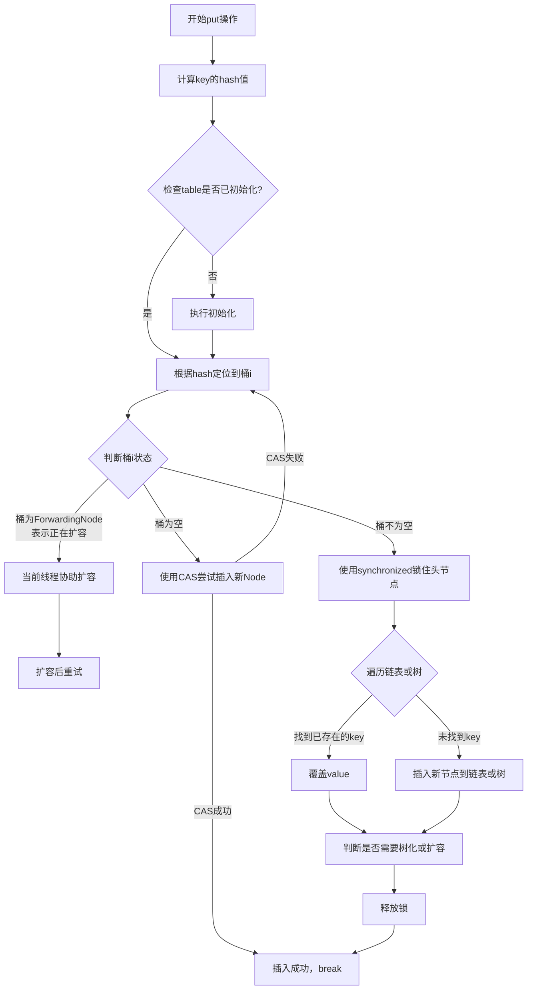

###### 1. ConcurrentHashMap 的实现原理是什么？ConcurrentHashMap 在 JDK 1.7 和 1.8 中的区别是什么？
ConcurrentHashMap 是 Java 并发包中高性能的线程安全哈希表实现。它的设计在 JDK 1.7 和 JDK 1.8 中有重大差异，其核心演进历程如下：

| 特性        | **JDK 1.7**​                                                                     | **JDK 1.8**​                                             |
| --------- | -------------------------------------------------------------------------------- | -------------------------------------------------------- |
| **核心思想**​ | **分段锁**，是一种"分而治之"的策略。                                                            | **细粒度锁 + CAS**，追求更低的锁粒度和更高的并发度。                          |
| **数据结构**​ | **Segment 数组 + HashEntry 链表**。整个 Map 被分成多个 Segment（默认为16个），每个 Segment 是一个独立的哈希表。 | **Node 数组 + 链表/红黑树**。结构类似 HashMap，取消了 Segment 层。         |
| **锁机制**​  | 每个 **Segment 继承自 ReentrantLock**。写操作时锁住一个 Segment，不影响其他 Segment 的访问。             | 使用 **synchronized 锁单个桶的头节点**，同时大量采用 **CAS 操作**​ 进行无锁化尝试。 |
| **锁粒度**​  | 较大（Segment 级别）。默认支持16个线程并发写。                                                     | 极小（桶级别）。理论上并发度与数组大小相关，更高。                                |
| **扩容机制**​ | 每个 Segment 独立扩容，单线程操作。                                                           | **多线程协同扩容**。线程在操作时发现正在扩容，会协助进行数据迁移。                      |

**JDK 1.8 的改进优势**：
- **性能提升**：锁粒度更细，synchronized 在 JDK 1.6 后性能大幅优化，CAS 减少了线程阻塞。
- **数据结构简化**：与 HashMap 结构统一，降低了维护和理解的复杂度。
- **查询效率**：引入红黑树，当链表过长时，查询时间复杂度从 O(n) 优化为 O(log n)。
###### 3. ConcurrentHashMap 如何保证线程安全？
- **CAS + synchronized**：这是 JDK 1.8 的核心机制。在执行写操作时，首先会尝试使用 CAS 无锁化方式插入数据，若失败（说明有竞争），则再使用 synchronized 对链表的头节点或树的根节点加锁。
- **volatile 变量**：用于存放键值对数据的 `Node`节点中的 `value`和 `next`指针均用 `volatile`修饰，这保证了一个线程修改了某个节点的值后，其他线程能立即看到最新结果，提供了**可见性**​。
- **线程安全的内部操作**：像 `sizeCtl`这样的控制变量也使用 `volatile`并结合 CAS 操作，确保扩容等控制逻辑的线程安全。
###### 4. ConcurrentHashMap 的 put 操作流程是怎样的？
JDK 1.8 中的 `put`方法流程精巧地融合了多种并发技术，其核心步骤可参考下图：



###### 5. ConcurrentHashMap 能保证复合操作的原子性吗？
**ConcurrentHashMap 只能保证单个方法调用（如 `put`, `get`）的线程安全，但不能保证多个连续操作组成的"复合操作"的原子性**​。
**错误示例**：
```java
// 非原子操作，线程不安全
if (!map.containsKey(key)) {
    map.put(key, value); // 在containsKey和put之间，可能有其他线程插入了key
}
```
**解决方案**：使用 ConcurrentHashMap 提供的**原子复合操作方法**​。
- `putIfAbsent(key, value)`: 如果 key 不存在，则放入 value，并返回 null；如果存在，则不操作，返回已存在的 value。
- `computeIfAbsent(key, function)`: 如果 key 不存在，则使用 function 计算出的 value 放入 map，并返回该 value。非常适合"如果不存在则计算并添加"的场景，如懒加载缓存。
- `computeIfPresent(key, function)`: 如果 key 存在，则根据 function 重新计算 value 并更新。
- `replace(key, oldValue, newValue)`: 只有当前 key 对应的值等于 oldValue 时，才替换为 newValue。
###### 6. CopyOnWriteArrayList 的实现原理是什么？
`CopyOnWriteArrayList`的核心思想是 **"写时复制"**​。
- **读操作**：所有读操作（`get`, `iterator`）都在一个**不变的底层数组快照**上进行，因此无需加锁，速度极快。
- **写操作**：任何会修改集合的操作（`add`, `set`, `remove`）都会先**获取锁**，然后**复制**当前的底层数组，在**新数组**上执行修改，最后将底层数组的引用指向**新数组**。由于这个过程是操作新数组，因此不影响并发的读操作。
###### 7. CopyOnWriteArrayList 的应用场景是什么？
- **核心应用场景**：**读多写少**的极致场景。
	例如，**事件监听器列表**、系统的**黑白名单**或**配置信息**等，这些数据很少修改，但需要被高频读取。
- **优点**：
    - **读性能极高**：读操作无锁，且不会与写操作冲突。
    - **迭代器弱一致性**：迭代器遍历的是创建瞬间的数组快照，在遍历过程中不会抛出 `ConcurrentModificationException`。
- **缺点**：
    - **内存开销大**：每次写操作都会复制整个数组，如果数组很大，频繁修改会带来巨大的内存压力和 GC 开销。
    - **数据弱一致性**：读操作可能无法立即读到最新写入的数据，因为读的是旧的数组快照。
###### 8. BlockingQueue 有哪些实现类？它们的区别是什么？
`BlockingQueue`是一个接口，定义了线程安全的阻塞队列。其主要实现类有：

|队列实现|核心特性|适用场景|
|---|---|---|
|**ArrayBlockingQueue**​|**有界队列**，基于数组实现。。内部使用**单锁**或**分离锁**（生产/消费），性能相对保守。|需要明确边界防止资源耗尽，对吞吐量要求不是极致的场景。|
|**LinkedBlockingQueue**​|默认是**无界**的（可指定容量），基于链表实现。通常采用**两把锁**（putLock 和 takeLock），生产者和消费者操作分离，在高并发下吞吐量较好。|大多数生产者-消费者场景，特别是任务量波动大或通信数据量大的情况。|
|**SynchronousQueue**​|**不存储元素**的阻塞队列。每个插入操作必须等待另一个线程的对应移除操作，反之亦然。直接传递，**吞吐量很高**。|任务交接场景，如 `Executors.newCachedThreadPool()`中的工作队列。|
|**PriorityBlockingQueue**​|**无界**的优先级阻塞队列。支持按优先级出队。|需要按优先级处理任务的场景。|
|**DelayQueue**​|**无界**队列，元素必须实现 `Delayed`接口。只有在元素指定的**延迟时间到达后**，才能从队列中取出。|定时任务调度、缓存过期失效、超时处理等。|
###### 9. ArrayBlockingQueue 和 LinkedBlockingQueue 的区别是什么？
|特性|ArrayBlockingQueue|LinkedBlockingQueue|
|---|---|---|
|**底层数据结构**​|**定长数组**​|**链表**（默认无界，可设为有界）|
|**锁机制**​|**单锁**（或可选的分离锁），生产者和消费者共用一把锁。|**两把锁**（`putLock`和 `takeLock`），生产者和消费者可并发操作。|
|**吞吐量**​|在低到中等并发下表现良好。|由于锁分离，**高并发下吞吐量通常更高**。|
|**内存预分配**​|初始化时分配固定大小的数组，内存连续。|动态创建节点，每次插入都有额外内存开销。|

**选择指南**：需要**明确边界**或**公平性**（防止饿死）时选 `ArrayBlockingQueue`；追求**更高吞吐量**且任务量不可预测时，可选 `LinkedBlockingQueue`。
###### 10. ConcurrentLinkedQueue 的实现原理是什么？
`ConcurrentLinkedQueue`是一个**非阻塞**的线程安全队列。它采用了 **CAS 无锁算法**​ 实现。
- **原理**：基于链表的 **FIFO**​ 队列。通过 **CAS 操作**​ 来保证入队（`offer`）和出队（`poll`）的原子性。它不会使线程阻塞，如果操作失败（由于竞争），它会立即重试，直到成功。
- **特点**：**高性能**、**无等待**。适用于**高并发**且**生产消费速度大致匹配**的场景，避免了锁带来的开销和上下文切换。
- **注意**：由于它的无界性和弱一致性，`size()`方法需要遍历整个链表，开销大，且结果可能不精确。通常使用 `isEmpty()`代替。