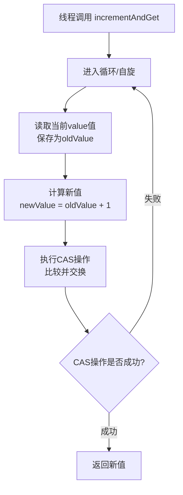

###### 1. 什么是原子类？Java 中有哪些原子类？
原子类通过**硬件级别的CAS（Compare-And-Swap）操作**和 **`volatile`变量**来保证单个共享变量操作的原子性、可见性和有序性。即使在多线程环境下，对原子类实例的每一次操作（如自增、比较并交换）都是不可分割的，从而避免了数据不一致的问题。
Java中的原子类主要位于 `java.util.concurrent.atomic`包下，可以根据其作用对象分为以下几大类：

|类别|核心类|说明|
|---|---|---|
|**基本类型**​|`AtomicInteger`, `AtomicLong`, `AtomicBoolean`|用于原子性操作对应的基本数据类型。|
|**数组类型**​|`AtomicIntegerArray`, `AtomicLongArray`, `AtomicReferenceArray`|原子性地更新数组中的单个元素。|
|**引用类型**​|`AtomicReference`, `AtomicStampedReference`, `AtomicMarkableReference`|用于原子性更新对象引用。后两者可解决ABA问题。|
|**字段更新器**​|`AtomicIntegerFieldUpdater`, `AtomicLongFieldUpdater`, `AtomicReferenceFieldUpdater`|以线程安全的方式更新已有类中的volatile字段。|
|**累加器**​|`LongAdder`, `DoubleAdder`, `LongAccumulator`, `DoubleAccumulator`|高并发场景下专为求和、求最大值等操作设计，性能通常优于AtomicLong。|
###### 2. AtomicInteger 的实现原理是什么？
`AtomicInteger`的核心实现依赖于三个关键部分：
1. **`volatile int value`**：用于存储实际整数值的变量，用 `volatile`修饰，保证了多线程之间的**可见性**。一个线程修改后，新值能立即被其他线程看到。
2. **`Unsafe`类**：这是一个JDK内部使用的类（`sun.misc.Unsafe`），提供了执行低级、不安全操作的能力，包括直接内存访问和CAS操作。原子类通过它来调用底层的CAS指令。
3. **`valueOffset`**：这是一个静态常量，在类加载时通过Unsafe类获取到 `value`字段在内存中的偏移量。有了这个偏移量，Unsafe类就能精准地定位到需要更新的变量。
其最典型的操作 `incrementAndGet()`（自增）的流程，清晰地展示了CAS的核心思想。下图描绘了这一“乐观锁”的工作机制：

###### 3. CAS 算法是什么？它的优缺点是什么？
CAS（Compare-And-Swap）是一种**乐观锁**策略。
它包含三个操作数：内存位置（V）、期望的原值（A）和新值（B）。当且仅当V的值等于A时，处理器才会原子性地将V更新为B，否则不执行任何操作。无论哪种情况，都会返回V的当前值。
- **优点**：
    - **高性能**：避免了线程阻塞和唤醒的开销，在低到中度竞争条件下，性能远高于锁。
    - **无死锁**：由于不存在锁的获取和释放，从根本上避免了死锁问题。
- **缺点**：
    - **ABA问题**：一个值可能从A变成B，又变回A。CAS检查时会误以为没有变化。下文会详述解决方案。
    - **循环时间长开销大**：如果竞争激烈，CAS长时间不成功，会导致CPU空转，消耗资源。
    - **只能保证一个共享变量的原子操作**：对于多个共享变量的操作，CAS无法保证其原子性，可能需要使用锁或者将变量合并到一个对象中再用 `AtomicReference`包装。
###### 4. CAS 的 ABA 问题是什么？如何解决？AtomicStampedReference 和 AtomicMarkableReference 的区别是什么？
ABA问题是CAS操作中一个经典的陷阱。假设一个变量的初始值是A。线程1准备将其改为C，但执行CAS前需要一段时间。在此期间，线程2将值从A改为B，然后另一个线程（或同一线程）又将其从B改回A。当线程1最终执行CAS时，它会发现当前值仍是A，于是误认为没有被修改过，从而操作成功。虽然结果看起来没问题，但中间可能已经发生了其他依赖此变量的逻辑错误。
解决方案是**使用版本号**。每次变量更新时，版本号都递增。这样，从A->B->A，虽然值一样，但版本号已经变了两次。
Java提供了两个类来解决引用类型的ABA问题：
- **`AtomicStampedReference`**：通过一个 `int`类型的版本号（ Stamp ）来跟踪引用变化。每次更新引用时，版本号都必须递增。
- **`AtomicMarkableReference`**：它是 `AtomicStampedReference`的一个简化版。它不关心引用被修改了多少次，只关心**是否被修改过**。它使用一个 `boolean`标记位来表示引用是否被改动过。
**区别**：如果你关心引用被修改的**次数**或需要记录完整的状态变化历史，请使用 `AtomicStampedReference`。如果你只关心引用**是否曾被修改**（例如，检查某个对象是否已被处理过），那么 `AtomicMarkableReference`更轻量且足够。
###### 6. LongAdder 和 AtomicLong 的区别是什么？LongAdder 的实现原理是什么？
在高并发写多读少的场景下（如统计计数器），`AtomicLong`可能会成为瓶颈，因为所有线程都竞争更新同一个 `value`变量，CAS失败率很高。
`LongAdder`采用了 **"分段CAS"​ 的思想。它的内部有一个 `base`变量和一个 `Cell[]`数组（`Cell`是一个填充了的原子类，用于减少缓存行伪共享）。
1. **低竞争时**：直接通过CAS操作更新 `base`值，与 `AtomicLong`类似。
2. **高竞争时**：当线程发现CAS更新 `base`失败，会根据线程的哈希值映射到 `Cell[]`数组中的某个槽位，然后在该槽位对应的 `Cell`上进行累加。这样，就将对单一变量的竞争分散到了多个单元上。
3. **获取最终值**：需要获取结果（调用 `sum()`方法）时，将 `base`和所有 `Cell`数组中的值累加起来。正因为如此，`LongAdder`在更新时有**最终一致性**，它返回的值可能是某一时刻的近似值，而不是一个精确的实时快照。而 `AtomicLong`通过锁和volatile读能保证在任何时刻的读取都是精确的。
**如何选择？**

| 场景                               | 推荐类               | 理由                                      |
| -------------------------------- | ----------------- | --------------------------------------- |
| **高并发写、读少、可接受最终一致性**（如统计点击数、QPS） | **`LongAdder`**​  | 吞吐量极高。                                  |
| **读多写少、或需要精确的实时值**（如序列号生成、状态标志）  | **`AtomicLong`**​ | 保证每次读操作的准确性，还提供 `compareAndSet`等复杂原子操作。 |

`LongAccumulator`是 `LongAdder`的功能增强版，允许你自定义累加规则（如求最大值、最小值），而不仅仅是加法。
###### 8. 原子类的应用场景有哪些？
原子类因其高效性，在以下场景中非常适用：
- **计数器**：如网站的访问量、API调用次数等。`AtomicLong`和 `LongAdder`是理想选择。
- **状态标志位**：控制某个流程的开关状态。使用 `AtomicBoolean`替代 `volatile boolean`可以轻松实现复杂的条件判断和设置。
- **序列号生成器**：为数据生成唯一的递增ID。`AtomicInteger`或 `AtomicLong`的 `getAndIncrement`方法能保证序列号的唯一和递增。
- **对象属性的原子更新**：当你无法修改一个类的源码，但又需要以线程安全的方式更新其某个 `volatile`字段时，可以使用字段更新器（如 `AtomicIntegerFieldUpdater`）。
- **实现非阻塞数据结构**：如无锁队列、栈等，其实现严重依赖 `AtomicReference`和CAS操作。