### 一、JVM 基础概念

###### 1. 什么是 JVM ?
###### 2. JVM 的主要组成部分有哪些？
1. **类加载器 (Class Loader)**：负责将 `.class`文件从磁盘**加载**到 JVM 的内存中，并进行**链接**（验证、准备、解析）和**初始化**。
2. **运行时数据区 (Runtime Data Areas)**：这是 JVM 的内存管理系统，用于存储程序运行时的数据。主要包括：
    - **方法区 (Method Area)**：存储已被加载的**类信息、常量、静态变量**等。
    - **堆 (Heap)**：**所有对象实例和数组**都在这里分配内存。这是垃圾回收器主要工作的区域，也是内存调优的重点。
    - **虚拟机栈 (JVM Stack)**：每个线程私有，存储**局部变量表、操作数栈、方法出口**等信息。每个方法调用对应一个栈帧的入栈和出栈。
    - **程序计数器 (Program Counter Register)**：每个线程私有，指向**当前线程正在执行的字节码指令的地址**。
    - **本地方法栈 (Native Method Stack)**：为 JVM 调用本地（如 C/C++ 编写）方法服务。
3. **执行引擎 (Execution Engine)**：这是真正执行代码的部件。它包含：
    - **解释器**：逐行解释执行字节码。
    - **JIT 编译器**：将热点代码编译成本地机器码以提高效率。
    - **垃圾回收器**：自动回收堆内存中不再使用的对象，释放资源。
###### 4. 解释型语言和编译型语言的区别
计算机语言主要分为编译型和解释型，理解它们的区别是理解 Java 工作方式的基础。

|特性|编译型语言 (如 C、C++)|解释型语言 (如 Python、JavaScript)|
|---|---|---|
|**执行过程**​|源代码在**执行前**一次性被编译器翻译成**机器码**。|源代码在**运行时**由解释器**逐行**翻译并执行。|
|**执行速度**​|通常**更快**，因为直接执行优化后的机器码。|通常**较慢**，因为每次运行都需要翻译过程。|
|**跨平台性**​|**差**，编译后的机器码依赖于特定操作系统和硬件。|**好**，只要有对应平台的解释器，源码即可运行。|
|**错误发现**​|多数错误在**编译期间**被发现。|许多错误要等到**运行到该行代码**时才发现。|

###### 5. Java 是编译型语言还是解释型语言？
Java 被称作“**编译与解释并存**”的语言。它采取了一种独特的两步走策略：
1. **编译期**：Java 编译器（`javac`）将 `.java`源代码文件编译成一种中间格式——**字节码**（`.class`文件）。这时的字节码不是任何特定平台的机器码。
2. **运行期**：JVM 中的**解释器**负责逐条读取字节码并翻译成本地机器指令来执行。同时，为了提升效率，JVM 内置了 **JIT（即时编译）编译器**。JIT 会监控代码运行情况，将频繁执行的“热点代码”（如循环）一次性编译成本地机器码并缓存起来，下次再执行到这段代码时，就可以直接运行机器码，大幅提升效率。
这种设计使 Java 在“一次编译，到处运行”的跨平台能力和执行效率之间取得了很好的平衡。
###### 6. JVM、JRE 和 JDK 的关系是什么？
这三者的关系是层层包含的，可以参考下面的图示来理解：

- **JVM (Java Virtual Machine)**：是 Java 能够实现跨平台的核心。它负责读取并执行字节码文件。但 JVM 本身并不知道 `String`、`ArrayList`这些常用类是如何实现的，它需要标准类库的支持。
- **JRE (Java Runtime Environment)**：**等于 JVM + 核心类库**。如果你只想运行一个已经开发好的 Java 程序，那么安装 JRE 就足够了。
- **JDK (Java Development Kit)**：**等于 JRE + 开发工具**。它除了包含 JRE 的所有内容，还提供了用于开发 Java 程序的关键工具，如编译器 (`javac`)、调试器 (`jdb`) 等。因此，作为开发者，我们需要安装的是 JDK。
简单来说，**JDK 用于开发 Java 程序，JRE 用于运行 Java 程序，而 JVM 是运行程序的引擎和跨平台基石。**
###### 7. 什么是字节码？
字节码是 Java 源代码编译后生成的中间代码。它不面向任何特定的处理器，而是面向 JVM 的指令集。这种设计是实现跨平台的关键。
###### 8. Java 的跨平台性是如何实现的？
Java 的跨平台性源于 “一次编译，到处运行” 。开发者只需将代码编译成标准的字节码，然后在任何安装了对应版本 JVM 的操作系统上都可以直接运行。JVM 充当了中间层，屏蔽了底层操作系统的差异。
###### 9. 什么是类加载器？
类加载器不仅仅是简单地将类文件加载进内存。它还遵循**双亲委派模型**：当一个类加载器收到加载请求时，它首先会委托给其父类加载器去尝试加载，只有当父类加载器无法完成时，自己才尝试加载。这种模型**保证了 Java 核心库的安全性和稳定性**，防止用户自定义的类动态替换掉 Java 自有的核心类。
###### 10. JVM 的生命周期是怎样的？
一个 JVM 实例的生命周期从启动一个 Java 程序开始，到程序中所有**非守护线程**都终止时结束。JVM 的启动会伴随一个引导类加载器创建 main 线程，程序的结束则意味着 JVM 进程的退出。
### 二、内存区域与管理

###### 1. JVM 运行时数据区有哪些？
JVM 运行时数据区是 Java 虚拟机在执行 Java 程序时所管理的内存区域，可根据线程共享与否进行划分。其核心组件与关系如下：

###### 2. 什么是程序计数器？
这是一块很小的内存空间，可以看作是**当前线程所执行的字节码的行号指示器**。字节码解释器通过改变它的值来选取下一条需要执行的指令。它是**线程私有**的，且是**唯一一个在Java虚拟机规范中没有规定任何`OutOfMemoryError`情况的区域**。
###### 3. 什么是 Java 虚拟机栈？
每个线程在创建时都会拥有一个虚拟机栈，其生命周期与线程相同。它是**方法执行的内存模型**，每个方法从调用到执行完毕，都对应着一个**栈帧**在虚拟机栈中从入栈到出栈的过程。
- **栈帧结构**：每个栈帧包含了**局部变量表**（存储方法参数和局部变量）、**操作数栈**（用于计算）、**动态链接**（指向运行时常量池的方法引用）和**方法返回地址**等信息。
- **异常**：如果线程请求的栈深度大于虚拟机允许的最大深度，会抛出`StackOverflowError`；如果虚拟机栈可以动态扩展，但在扩展时无法申请到足够内存，会抛出`OutOfMemoryError`。
###### 4. 什么是本地方法栈？
其作用与虚拟机栈非常相似，区别在于**虚拟机栈为虚拟机执行Java方法服务，而本地方法栈则为虚拟机使用到的Native方法服务**。在HotSpot等JVM实现中，本地方法栈与虚拟机栈是合二为一的。
###### 5. 什么是堆内存？
这是JVM所管理的内存中**最大的一块**，是**所有线程共享**的区域，在虚拟机启动时创建。此内存区域的**唯一目的就是存放对象实例**和数组。它也是**垃圾收集器管理的主要区域**，因此很多时候也被称作"GC堆"。堆内存不足时会抛出`OutOfMemoryError`。
###### 6. 什么是方法区？
方法区也是**各个线程共享的内存区域**，用于存储已被虚拟机加载的**类型信息、常量、静态变量、即时编译器编译后的代码缓存**等数据。它有一个非常重要的部分——**运行时常量池**，用于存放编译期生成的各种字面量和符号引用。
###### 7. 堆和栈的区别是什么？
|特性|堆|栈|
|---|---|---|
|**功能**​|存储对象实例和数组，是**运行时数据区**​|存储栈帧，是**运行时单位**，解决程序如何执行的问题|
|**共享性**​|**线程共享**​|**线程私有**​|
|**异常**​|`OutOfMemoryError`|`StackOverflowError`和`OutOfMemoryError`|
|**生命周期**​|与JVM生命周期相同|与线程生命周期相同|
|**性能**​|速度较慢，需要动态分配内存|速度较快，访问速度仅次于程序计数器|
###### 8. 什么是直接内存？
直接内存并不是JVM运行时数据区的一部分，但被频繁使用。它通过NIO的`ByteBuffer.allocateDirect()`在Java堆外分配，然后通过一个存储在Java堆里的`DirectByteBuffer`对象作为这块内存的引用进行操作。其大小不受Java堆大小限制，但受本机总内存大小限制。
###### 9. 对象在内存中的布局是怎样的？什么是对象头？
在HotSpot虚拟机中，对象在堆内存中的存储布局可以分为三个部分：
- **对象头**：包含两类信息。一是**运行时元数据**，如哈希码、GC分代年龄、锁状态标志等。二是**类型指针**，指向它的类元数据，JVM通过这个指针来确定对象是哪个类的实例。
- **实例数据**：对象真正存储的有效信息，即我们在程序代码里所定义的各种类型的字段内容。
- **对齐填充**：起占位符作用，HotSpot要求对象起始地址必须是8字节的整数倍。
###### 11. 什么是 TLAB？
为每个线程在Eden区预先分配的一小块私有内存。由于堆是线程共享的，创建对象时可能存在竞争。TLAB使得每个线程可以使用自己的分配指针在私有空间分配对象，只有TLAB用完需要新的时才需要同步锁定，**提升了内存分配的效率**。
###### 12. 新生代和老年代是如何划分的？Eden 区、Survivor 区的作用是什么？
Java堆从垃圾回收的角度常分为**新生代**和**老年代**。
- **新生代**：又分为**Eden区**和两个**Survivor区**（通常称为From和To）。**绝大多数新创建的对象首先在Eden区分配**。当Eden区满时，会触发一次**Minor GC**，将存活的对象复制到其中一个Survivor区。对象在Survivor区之间每熬过一次Minor GC，年龄就增加1岁。当它的年龄增加到一定程度（默认15），就会被晋升到老年代。
- **老年代**：用于存放长期存活的對象。老年代空间不足时会触发**Full GC**，速度较慢。
###### 14. 什么是永久代？
是JDK 8之前HotSpot虚拟机对JVM规范中方法区的一种实现。它使用JVM的堆内存来存储类元数据、运行时常量池等信息。
###### 15. 什么是元空间（Metaspace）？
从JDK 8开始，HotSpot虚拟机将方法区的实现从永久代移到了**元空间**。元空间不再使用JVM的堆内存，而是使用**本地内存**。这有效避免了永久代常见的`java.lang.OutOfMemoryError: PermGen space`错误，因为理论上可用空间取决于系统内存。
###### 16. 永久代和元空间的区别？
|特性|永久代|元空间|
|---|---|---|
|**物理位置**​|JVM堆内存|本地内存|
|**大小限制**​|受`-XX:MaxPermSize`参数限制，易溢出|默认受系统可用内存限制，不易溢出|
|**垃圾回收**​|回收效率低，是Full GC的触发条件之一|提高回收效率，降低Full GC频率|
|**调优**​|需设置`-XX:PermSize`和`-XX:MaxPermSize`|可设置`-XX:MetaspaceSize`和`-XX:MaxMetaspaceSize`|
###### 17. 什么是对象的分配策略？
对象优先在Eden区分配。如果Eden区没有足够空间，则发生Minor GC。大对象（需要大量连续内存的對象）直接进入老年代。长期存活的对象将进入老年代。
###### 18. 什么是大对象？如何处理？
需要大量连续内存的對象（如长数组或大字符串），JVM会尝试直接在老年代分配，以避免在Eden区及两个Survivor区之间发生大量的内存复制。
###### 19. 什么是逃逸分析？
一种编译器优化技术，用于分析对象的动态作用域。如果一个对象在方法内被定义，但其引用可能被外部方法访问（方法逃逸），或被外部线程访问（线程逃逸），则称其逃逸。否则，该对象未逃逸。对于未逃逸的对象，JIT编译器可能进行栈上分配或标量替换等优化。
###### 20. 什么是标量替换？
是逃逸分析的一种优化。如果确定一个对象不会逃逸出方法，那么JIT编译器在编译时，会把这个对象“拆解”成它的若干个成员变量来代替。这样，这个对象本身就不会在堆上创建了，减少了内存占用和GC压力。
### 三、类加载机制

###### 1. 类加载的过程是什么？

```mermaid
flowchart TD
    A[“.class 字节码文件”] --> B[“加载（Loading）”]
    B --> C[“链接（Linking）”]
    C --> C1[验证]
    C1 --> C2[准备]
    C2 --> C3[解析]
    C3 --> D[“初始化（Initialization）”]
    D --> E[“类完全可用”]
    
    B --> B1[“1. 通过类名获取二进制流”]
    B1 --> B2[“2. 转换为方法区运行时数据结构”]
    B2 --> B3[“3. 在堆中生成Class对象”]
    
    C1 --> C1a[“文件格式/元数据<br>字节码/符号引用验证”]
    C2 --> C2a[“为静态变量分配内存<br>并设置默认初始值”]
    C3 --> C3a[“将符号引用<br>替换为直接引用”]
    
    D --> D1[“执行&lt;clinit&gt;方法<br>为静态变量赋真实值”]
```

上图展示了类加载的宏观过程。下面我们来详细解读图中的关键阶段：
- **加载**：这是第一步。JVM 需要完成三件事：
    1. 通过类的全限定名获取其定义的二进制字节流。
    2. 将这个字节流所代表的静态存储结构转换为**方法区**的运行时数据结构。
    3. 在内存中（通常是堆区）生成一个代表这个类的 `java.lang.Class`对象，作为方法区中这些数据的访问入口。这个阶段是可控性最强的，开发者可以自定义类加载器来控制字节流的获取方式。
- **验证**：这是链接的第一步，确保被加载的类的正确性，不会危害 JVM 安全。主要包括四个阶段的检验：
    - **文件格式验证**：验证字节流是否符合 Class 文件格式规范（如魔数、版本号）。
    - **元数据验证**：对字节码描述的信息进行语义分析，保证符合 Java 语言规范（如是否有父类，是否继承了 final 类）。
    - **字节码验证**：通过数据流和控制流分析，确定程序语义是合法的、符合逻辑的。这是最复杂的阶段。
    - **符号引用验证**：发生在解析阶段，确保符号引用可以转化为直接引用。
- **准备**：此阶段正式为**类变量**分配内存并设置**初始值**。注意两点：
    - 内存分配在方法区。
    - “初始值”通常是数据类型的**零值**，如 `int`是 0，`boolean`是 false。例如 `public static int value = 123;`在准备阶段后是 0，赋值为 123 的动作发生在初始化阶段。但被 `final static`修饰的常量除外，它可能在准备阶段后就直接赋值为真实值。
- **解析**：JVM 将常量池内的**符号引用**替换为**直接引用**的过程。符号引用是一组无歧义的描述符号；直接引用是直接指向目标的指针、相对偏移量或能间接定位到目标的句柄。
- **初始化**：这是类加载过程的最后一步。此阶段才真正开始执行类中定义的 Java 代码，主要是执行类构造器 `<clinit>()`方法的过程。`<clinit>()`方法是由编译器自动收集类中的所有**类变量的赋值动作**和**静态语句块**中的语句合并产生的。JVM 保证在初始化一个类之前，其父类的初始化已经完成。
###### 2. 什么是类加载器？有哪些类型？
类加载器是实际完成加载动作的模块。JVM 提供了几种不同类型的加载器，形成了一个层次结构：

| 类加载器          | 职责描述                                                     | 实现                                          | 备注             |
| ------------- | -------------------------------------------------------- | ------------------------------------------- | -------------- |
| **启动类加载器**​   | 加载 Java 核心库（如 `%JAVA_HOME%/jre/lib/rt.jar`中的 `java.*`包）。 | C++ 实现，是 JVM 自身一部分。                         | 获取其引用为 `null`。 |
| **扩展类加载器**​   | 加载 `%JAVA_HOME%/jre/lib/ext`目录或 `java.ext.dirs`指定路径的类库。  | Java 实现，`sun.misc.Launcher$ExtClassLoader`。 | 父加载器是启动类加载器。   |
| **应用程序类加载器**​ | 加载用户类路径上的类库，是程序中**默认**的类加载器。                             | Java 实现，`sun.misc.Launcher$AppClassLoader`。 | 父加载器是扩展类加载器。   |
| **自定义类加载器**​  | 用户自定义的类加载器，继承 `ClassLoader`类，实现 `findClass`方法。           | 用户 Java 代码实现。                               |                |
###### 3. 什么是双亲委派模型？
**双亲委派模型**是 JVM 类加载器组织其工作的一种原则。其工作流程是：当一个类加载器收到加载请求时，它首先**不会**自己尝试加载，而是将这个请求**委托给父类加载器**去完成。每一层加载器都是如此，因此所有的请求最终都应传送到顶层的启动类加载器。只有当**父加载器无法完成**加载请求（在其搜索范围内没有找到所需的类）时，子加载器才会尝试自己去加载。
###### 4. 为什么要使用双亲委派模型？
- **安全性**：防止核心 API 被篡改。例如，用户自定义一个 `java.lang.Object`类，由于双亲委派机制，这个请求会最终委派给启动类加载器，而启动类加载器加载的是核心库中的 `Object`类，从而保证了核心库的安全。
- **避免重复加载**：确保了同一个类在 JVM 中只会被加载一次，因为父加载器加载过后，子加载器就不会再加载。
###### 5. 如何打破双亲委派模型？
在某些特定场景下需要打破此模型，例如 **SPI 服务发现机制**（如 JDBC）。SPI 的接口在核心库中由启动类加载器加载，但其实现类是由应用加载的。此时，启动类加载器无法“看到”这些实现类，就需要**线程上下文类加载器**来反向委托子加载器去加载实现类，从而打破了双亲委派。**Tomcat**​ 也为每个 Web 应用提供了独立的类加载器，优先加载自己路径下的类，这也打破了双亲委派，以实现应用隔离。
###### 6. 什么是类的初始化？
类的初始化是一个严格的时机规定。JVM 规范明确规定，有且仅有以下**六种情况**属于对类的“主动使用”，会立即触发初始化
###### 7. 类初始化的时机有哪些？
1. 创建类的实例（`new`）、读取或设置一个类的静态字段（被 final 修饰、已在编译期把结果放入常量池的静态字段除外）、调用一个类的静态方法。
2. 使用 `java.lang.reflect`包的方法对类型进行反射调用时。
3. 当初始化一个类时，如果其父类还没有进行过初始化，则需要先触发其父类的初始化。
4. 当虚拟机启动时，用户需要指定一个要执行的主类（包含 `main()`方法的类），虚拟机会先初始化这个主类。
5. 当使用 JDK 7 新加入的动态语言支持时，如果一个 `java.lang.invoke.MethodHandle`实例最后的解析结果为 REF_getStatic, REF_putStatic, REF_invokeStatic, REF_newInvokeSpecial 四种类型的方法句柄，并且这个方法句柄对应的类没有进行过初始化，则需要先触发其初始化。
6. 当一个接口中定义了 JDK 8 新加入的默认方法（被 default 关键字修饰的默认方法）时，如果有这个接口的实现类发生了初始化，那该接口要在其之前被初始化。
###### 8. 什么是类的被动引用？
与主动使用相对，**被动引用不会触发初始化**。例如：
- 通过子类引用父类的静态字段，不会导致子类初始化。
- 通过数组定义来引用类，不会触发此类的初始化。
- 引用一个类的常量（static final）且在编译期就能确定值的常量，不会触发初始化，因为在编译阶段通过常量传播优化，已经将常量值存储到了调用类的常量池中。
###### 9. Class.forName() 和 ClassLoader.loadClass() 的区别？
这两个方法都用于加载类，但有一个关键区别：
- `Class.forName(String name)`：默认会执行类的**初始化**阶段。
- `ClassLoader.loadClass(String name)`：默认只执行**加载**过程，不会进行链接阶段的**解析**和**初始化**，是一个“懒加载”行为。
###### 10. 什么是自定义类加载器？如何实现？
实现自定义类加载器通常需要继承 `ClassLoader`类，并重写其 `findClass(String name)`方法
。在该方法中，你需要：
1. 根据指定的类名 `name`，从自定义的来源（如网络、加密文件、数据库）读取类的字节码。
2. 调用父类的 `defineClass`方法，将字节数组转换为 `Class`对象。
自定义类加载器常用于模块化、代码加密、热部署等场景。
###### 11. 什么是类的卸载？
一个类被加载后，会伴随其对应的类加载器一直存在于内存中。因此，**类的卸载条件与其类加载器实例的生命周期紧密相关**。一个类需要满足以下苛刻条件才会被卸载：
1. 该类所有的实例都已被 GC。
2. 加载该类的 `ClassLoader`实例已被 GC。
3. 该类对应的 `java.lang.Class`对象在任何地方都没有被引用（无法通过反射访问）。
由于这些条件很难同时满足，特别是像应用类加载器加载的类，其生命周期通常与 JVM 一样长，因此简单类的卸载并不常见。但对于由独立类加载器（如 OSGi 模块、热部署容器中的类加载器）加载的类，当模块卸载或应用重新部署时，如果该类加载器实例可以被回收，那么其加载的类也就有可能被卸载，从而实现**热部署**​。
###### 12. 在什么情况下类会被卸载？
###### 13. 什么是热部署？
###### 14. Tomcat 的类加载机制是怎样的？
Tomcat 没有严格遵循双亲委派。为了实现 Web 应用隔离和资源共享，它设计了独立的类加载器层次：
1. **Bootstrap**​ -> **System**：加载 JVM 和 Tomcat 自身的类。
2. **Common**：加载 Tomcat 和所有 Web 应用可共享的类。
3. **WebApp**：**每个 Web 应用独有**，优先加载 `/WEB-INF/classes`和 `/WEB-INF/lib`下的类，然后再委托给父加载器。这打破了双亲委派，实现了应用隔离。
4. **JSP**：用于支持 JSP 页面的热重载。
###### 15. 什么是 SPI 机制？与类加载的关系？

### 四、垃圾回收机制

###### 1. 什么是垃圾回收？
**垃圾回收**是一种自动内存管理机制，其核心目标是识别并释放程序中不再使用的对象所占用的内存，从而防止内存泄漏和内存溢出等问题，确保应用的稳定运行。
###### 2. 如何判断对象是否可以被回收？什么是引用计数法？什么是可达性分析算法？
- **引用计数法**：给对象添加一个引用计数器，每当有一个地方引用它时，计数器就加1；当引用失效时，计数器就减1。任何时刻计数器为0的对象就是不可能再被使用的。但其**无法解决对象之间循环引用**的问题。
- **可达性分析算法**：这是Java主要采用的方法。它通过一系列称为 “GC Roots”​ 的根对象作为起始节点集，从这些节点开始，根据引用关系向下搜索，所走过的路径称为“引用链”。如果某个对象到GC Roots之间没有任何引用链相连，则证明此对象是不可能再被使用的，可以被回收
###### 5. 什么是 GC Roots？哪些对象可以作为 GC Roots？
根对象。
**GC Roots**包括以下几种类型的对象：
- 虚拟机栈（栈帧中的本地变量表）中引用的对象。
- 方法区中类静态属性引用的对象。
- 方法区中常量引用的对象。
- 本地方法栈中JNI（即通常所说的Native方法）引用的对象。
- 所有被同步锁（synchronized关键字）持有的对象。
###### 7. 什么是强引用、软引用、弱引用、虚引用？
|引用类型|被GC回收的时机|生存强度|应用场景|
|---|---|---|---|
|**强引用**​ (Strong Reference)|**永不回收**（只要强引用存在，即使抛出OOM）|最强|普通对象赋值，如 `Object obj = new Object();`|
|**软引用**​ (SoftReference)|在**内存不足，即将发生OOM之前**会被回收|次强|适用于对内存敏感的高速缓存|
|**弱引用**​ (WeakReference)|在**下一次GC发生时**，无论内存是否充足都会被回收|较弱|生命周期较短的对象，如 `WeakHashMap`的键|
|**虚引用**​ (PhantomReference)|无法通过它获取对象实例，其存在意义在于能在对象被回收时收到**系统通知**​|最弱|用于在对象被销毁后执行一些清理工作，通常与 `ReferenceQueue`联合使用|
###### 8. finalize() 方法的作用是什么？
`finalize()`方法是对象逃脱死亡命运的最后一次机会。当垃圾回收器发现没有引用链指向一个对象（即不可达）时，会先进行第一次标记，并判断是否有必要执行 `finalize()`方法（只有当对象未覆盖此方法或已被调用过，才会被视为“无需执行”）。如果被判定为有必要执行，该对象会被放入一个低优先级的队列，由JVM自动建立的Finalizer线程去执行其 `finalize()`方法。在这个方法中，对象可以通过重新与引用链上的任一对象建立关联（例如将自身赋值给某个类变量）来“自救”。成功自救后，在第二次标记时它会被移出“即将回收”的集合。需要注意的是，`finalize()`方法**只会被系统自动调用一次**，且运行代价高昂，不确定性大，**通常不推荐使用**。
###### 9. 什么是垃圾回收算法？
| 算法                        | 原理                                                                     | 优点                            | 缺点                              | 适用场景                         |
| ------------------------- | ---------------------------------------------------------------------- | ----------------------------- | ------------------------------- | ---------------------------- |
| **标记-清除**​ (Mark-Sweep)   | 1. **标记**：从GC Roots开始，标记所有存活对象。   2. **清除**：遍历整个内存，回收未被标记的对象所占用的空间。 | 实现简单                          | 1. **产生内存碎片**   2. **效率不高**​ | 老年代（如CMS收集器的并发回收阶段）          |
| **标记-复制**​ (Copying)      | 将可用内存分为大小相等的两块，每次只使用一块。当一块用完了，就将存活的对象**复制**到另一块上，然后清理已用的那块。            | 1. **无内存碎片**   2. **效率高**​ | **浪费一半内存空间**​                   | 对象存活率低的新生代（如Eden区和Survivor区） |
| **标记-整理**​ (Mark-Compact) | 1. **标记**：同标记-清除。   2. **整理**：让所有存活的对象都向内存的一端移动，然后直接清理掉边界以外的内存。     | **无内存碎片**​                    | 移动对象成本高，需要更新引用地址，**效率较低**​      | 对象存活率高的老年代                   |
| **分代收集**​ (Generational)  | 根据对象存活周期的不同，将Java堆划分为**新生代**和**老年代**，然后根据各自的特点采用不同的收集算法。               | 结合各算法优点，是**现代商用虚拟机的主流算法**​    | 实现相对复杂                          | Java堆内存管理                    |

###### 13. 分代收集理论是什么？
**分代收集理论**是当前主流垃圾收集器的基础。它建立在两个假说之上：1）绝大多数对象都是朝生夕死的（弱分代假说）；2）熬过越多次垃圾收集的对象就越难以消亡（强分代假说）。因此，Java堆被划分为新生代和老年代。
- **新生代 (Young Generation)**：存放新创建的对象。又分为一个**Eden**区和两个**Survivor**区（通常称为From和To）。新生代发生的GC称为 **Minor GC**，非常频繁，速度较快。
- **老年代 (Old Generation)**：存放经过多次Minor GC后仍然存活的对象。老年代发生的GC称为 **Major GC**，通常伴随着至少一次Minor GC。**Full GC**​ 则指清理整个堆空间（包括新生代和老年代以及方法区/元空间），速度慢，应尽量避免。
在垃圾回收过程中，为了确保对象引用关系不再变化，JVM需要暂停所有用户线程，这种现象称为 **Stop-The-World (STW)**。所有的垃圾收集器都无法完全避免STW，但优化的目标是尽可能缩短暂停时间。
###### 16. 有哪些垃圾收集器？
| 收集器                    | 目标区域 | 核心特点                               | 优点                         | 缺点                   | 适用场景                       |
| ---------------------- | ---- | ---------------------------------- | -------------------------- | -------------------- | -------------------------- |
| **Serial**​            | 新生代  | 单线程、复制算法、STW                       | 简单高效（单核CPU）、内存开销小          | 停顿时间长、多核CPU利用率低      | Client模式、单核CPU、小内存应用       |
| **ParNew**​            | 新生代  | Serial的多线程版、复制算法、STW               | 多核下停顿时间短、可与CMS配合           | 单核性能可能不如Serial、仍有STW | 多核Server端、与CMS搭配           |
| **Parallel Scavenge**​ | 新生代  | 多线程、吞吐量优先、支持自适应策略                  | 高吞吐量、自适应调节                 | 停顿时间目标不保证、交互体验一般     | 后台运算、批处理任务                 |
| **Serial Old**​        | 老年代  | Serial的老年代版、标记-整理算法、STW            | 实现简单、内存开销小                 | 停顿时间长、单线程效率低         | Client模式、CMS后备方案           |
| **Parallel Old**​      | 老年代  | Parallel Scavenge的老年代版、标记-整理算法、多线程 | 与Parallel Scavenge组成高吞吐量组合 | 停顿时间较长               | 与Parallel Scavenge搭配、注重吞吐量 |
| **CMS**​               | 老年代  | 并发收集、低停顿目标、标记-清除算法                 | 低停顿时间、用户体验好                | 产生内存碎片、对CPU敏感、有浮动垃圾  | B/S系统、重视响应速度               |
| **G1**​                | 整个堆  | 分区模型、可预测停顿、整体标记-整理、局部复制            | 停顿时间可控、高吞吐量、无内存碎片          | 内存占用稍高、小内存应用表现一般     | 大内存服务端、兼顾吞吐量和低延迟           |
- **Serial / ParNew / Parallel Scavenge (新生代，复制算法)**
    1. **暂停应用线程**​ (STW)。
    2. **标记**出Eden区和Survivor区（From Space）中存活的对象。
    3. 将存活对象**复制**到另一个Survivor区（To Space）。
    4. **清理**Eden区和已用的Survivor区。
    5. **恢复应用线程**。
- **Serial Old / Parallel Old (老年代，标记-整理算法)**
    1. **暂停应用线程**​ (STW)。
    2. **标记**出所有存活的对象。
    3. 将存活对象**整理**（向内存一端移动）。
    4. **清理**边界以外的内存。
    5. **恢复应用线程**。
- **CMS (老年代，标记-清除算法)**
    1. **初始标记**​ (STW)：标记GC Roots直接关联的对象，速度很快。
    2. **并发标记**：从GC Roots开始遍历对象图，与用户线程并发执行，耗时较长。
    3. **重新标记**​ (STW)：修正并发标记期间因用户程序运行而产生变动的标记记录。
    4. **并发清除**：清理垃圾对象，与用户线程并发执行。
###### 25. G1 的工作原理是什么？
**G1收集器**的工作流程可概括为：
1. **初始标记**：标记GC Roots能直接关联到的对象，需STW，但耗时短。
2. **并发标记**：从GC Roots开始进行可达性分析，找出存活对象，耗时较长，但可与用户线程并发执行。
3. **最终标记**：修正并发标记期间因用户程序运行而导致标记产生变动的记录，需STW。
4. **筛选回收**：首先对各个Region的回收价值和成本进行排序，根据用户期望的停顿时间来制定回收计划。然后将决定回收的Region中存活的对象**复制**到空的Region中，再清理整个旧的Region。这个过程需要STW。
### 五、新一代垃圾收集器

###### 1. 什么是 ZGC？
ZGC（Z Garbage Collector）是一款自**JDK 15**起正式生产可用的**低延迟垃圾收集器**，其设计目标是实现**亚毫秒级（<1ms）的最大停顿时间**，并且停顿时间不会随着堆内存的增大而增加。它能够管理从几百MB到数TB大小的堆内存。
ZGC实现低延迟的核心依赖于几项关键技术，其工作流程也围绕这些技术展开。下面的流程图直观展示了ZGC的工作阶段、核心技术及应用，以及关键的“指针自愈”特性：

###### 2. ZGC 的特点和优势？
- **染色指针**：这是ZGC的标志性技术。它**将额外的元数据信息（如标记状态、重映射状态）直接存储在64位对象指针的高几位中**。这意味着ZGC的标记过程是在指针上而非对象本身上进行的，从而无需为了查看或更新标记位而访问对象，减少了内存访问开销。
- **指针自愈**：得益于染色指针，当应用程序线程试图访问一个已被移动到新位置的对象时，ZGC的**读屏障**会被触发。读屏障能通过转发表将访问**自动转发到新地址**，并**同时将指针中的值更新为新的直接引用**。这个过程就是“自愈”，此后对该指针的访问将直接定位到新对象，无需再次转发。
此外，ZGC还采用**内存多重映射**将不同的虚拟内存地址范围映射到相同的物理内存区域，以支持染色指针在特定硬件平台上的工作。ZGC的收集过程大多阶段是**并发**的，只有初始标记和再标记阶段会有极短的STW停顿。
###### 3. 什么是 Shenandoah GC？
Shenandoah GC 也是一款以低延迟为目标的设计
###### 4. Shenandoah 和 ZGC 的区别？
| 特性        | ZGC                              | Shenandoah GC                             |
| --------- | -------------------------------- | ----------------------------------------- |
| **核心技术**​ | **染色指针**，标记信息存储在指针自身。            | **Brooks指针**，在对象前增加一个间接引用层。               |
| **屏障类型**​ | **读屏障**。用于在读取引用时检查指针状态并可能触发“自愈”。 | **写屏障**。用于在更新对象引用时跟踪引用变化。                 |
| **内存开销**​ | 相对较低，元数据内嵌在指针中。                  | 稍高，因为每个对象需要额外的Brooks指针开销。                 |
| **指针自愈**​ | **支持**。一旦自愈，后续访问无额外开销。           | **不支持**。每次对象访问都可能需要经过Brooks指针，理论上会有持续的开销。 |
| **主要目标**​ | 极致的低停顿时间，适用于对延迟极其敏感的场景。          | 在保持低延迟的同时，更注重吞吐量的平衡。                      |

**核心区别总结**：ZGC和Shenandoah GC的关键区别在于**实现低延迟并发整理的机制不同**。ZGC通过**染色指针和读屏障**实现，而Shenandoah GC通过**Brooks指针和写屏障**实现。ZGC的“指针自愈”特性可能使其在访问频率高的场景中具有性能优势。
###### 5. 什么是 Epsilon GC？
Epsilon GC 是一个特殊的“无操作”垃圾收集器。它**只负责内存分配，完全不进行垃圾回收**。当堆内存耗尽时，JVM会因`OutOfMemoryError`而终止。
它的应用场景非常特定：
- **超短生命周期应用**：如某些命令行工具，运行时间极短，在内存耗尽前就会退出，垃圾回收没有意义。
- **性能测试与控制实验**：用于排除GC本身对性能测试结果的影响，或者用于测试应用的内存分配上限。
- **已知内存分配精确且有限的应用**：在某些极端情况下，开发者能精确知道内存使用不会超过某个阈值。
使用Epsilon GC需要在启动参数中指定 `-XX:+UnlockExperimentalVMOptions -XX:+UseEpsilonGC`。
###### 6. 如何选择合适的垃圾收集器？
选择合适的垃圾收集器需要综合考虑应用的需求和特点。下面的决策流程图可以为您提供一个清晰的选型思路：

以上流程图提供了初步方向。在实际决策时，还需要结合一些具体考量：
- **ZGC**：如果你的应用对**延迟有极其苛刻的要求**（如金融交易系统、实时游戏服务器），并且堆内存可能非常大，ZGC通常是首选。它提供了最一致的响应时间。
- **Shenandoah GC**：同样适用于对延迟敏感的应用，尤其在**堆内存不是特别巨大**时，它提供了与ZGC类似的低停顿特性，可能更容易在较早的JDK版本中使用。
- **G1 GC**：从JDK 9开始是服务端模式的默认收集器。它在**延迟和吞吐量之间提供了一个良好的平衡**，适用于大多数不需要极致低延迟的应用。如果你的应用停顿时间要求可能在几十到几百毫秒之间，G1是一个稳健的选择。
- **Parallel GC**（吞吐量收集器）：如果你的应用是**后台计算、批处理任务**，对吞吐量有极高要求，而对停顿时间不敏感（几分钟的停顿都可以接受），那么Parallel GC可能提供最高的吞吐量。
- **Epsilon GC**：仅用于**非常特殊的场景**，如性能测试、已知内存分配确切且生命周期极短的应用。
**最佳实践**：理论是基础，但**最终一定要在模拟生产环境的压力测试下进行验证**，通过GC日志分析实际表现。
###### 7. 什么是并发标记和并发清除？
- **并发标记与并发清除**：
    - **并发标记**：垃圾收集器在**应用程序线程运行的同时**，遍历对象图来标记哪些对象是存活的。这大大减少了为了标记所需的总停顿时间。
    - **并发清除**：在标记完成后，**并发地**回收垃圾对象占用的内存空间。对于ZGC和Shenandoah，更关键的是“并发整理”，即在回收的同时移动存活对象以压缩堆空间。
###### 8. 什么是三色标记法？
- **三色标记法**：这是一种用于在并发标记期间抽象和跟踪对象状态的理论模型。
    - **白色**：表示对象尚未被垃圾收集器访问到（初始状态）。
    - **灰色**：表示对象本身已被垃圾收集器访问到，但它引用的其他对象还没有被完全扫描。
    - **黑色**：表示对象本身及其直接引用的对象都已被扫描完毕。
        并发标记的目标就是将所有的存活对象从白色标记为黑色。这个过程需要解决“对象消失”问题，写屏障就是解决方案的一部分。
###### 9. 什么是写屏障和读屏障？
**写屏障与读屏障**：
- **写屏障**：可以看作是JVM在**更新对象引用字段操作（如`objA.fieldB = objC`）前后插入的一小段代码**。它用于记录引用关系的变化，是G1和Shenandoah等收集器实现并发标记的关键。
- **读屏障**：可以看作是JVM在**读取对象引用操作（如`Object o = objA.fieldB`）前后插入的一小段代码**。ZGC主要依赖读屏障来实现其并发重映射和指针自愈特性。
###### 10. 什么是 SATB 和增量更新？
**SATB 与增量更新**：这是两种解决并发标记期间“对象消失”问题的技术。
- **SATB**：G1收集器采用此策略。其核心思想是**保留在并发标记开始时那一刻的对象图快照**。任何在并发标记期间新产生的引用关系变化，写屏障会记录下来，确保标记过程中新插入的引用不会被遗漏。
- **增量更新**：CMS收集器主要采用此策略。它关注的是**引用的更新操作**。如果一个黑色对象被修改，从而指向了一个白色对象（即建立了新的引用），写屏障会记录下来，将这个黑色对象“推回”为灰色，以便垃圾收集器重新扫描它。这确保了新建立的引用关系不会被遗漏。
### 六、JVM 调优与参数

###### 1. 常用的 JVM 参数有哪些？
这些参数用于控制 JVM 如何分配和管理内存，是调优的基石。

| 参数                           | 作用                          | 示例与说明                                                 |
| ---------------------------- | --------------------------- | ----------------------------------------------------- |
| **-Xms**​                    | 设置 **堆内存的初始大小**​。           | `-Xms2g`(设置为 2GB)。建议与 `-Xmx`设置相同，避免运行时动态调整带来性能波动。     |
| **-Xmx**​                    | 设置 **堆内存的最大大小**​。           | `-Xmx4g`(设置为 4GB)。不应超过可用物理内存，否则会触发系统交换，严重影响性能。        |
| **-Xmn**​                    | 设置 **新生代的大小**​。             | `-Xmn1g`。官方推荐约为整个堆大小的 1/4 到 1/3。                      |
| **-Xss**​                    | 设置 **每个线程的栈大小**​。           | `-Xss1m`。设置过小可能导致 `StackOverflowError`，过大则会限制可创建的线程数。 |
| **-XX:MetaspaceSize**​       | 设置 **元空间**​ 的初始容量 (JDK 8+)。 | `-XX:MetaspaceSize=256m`。触发 Full GC 的阈值。              |
| **-XX:MaxMetaspaceSize**​    | 设置 **元空间**​ 的最大容量 (JDK 8+)。 | `-XX:MaxMetaspaceSize=512m`。默认无限制，但受系统内存约束。           |
| **-XX:MaxDirectMemorySize**​ | 设置 **直接内存**（堆外内存）的最大容量。     | `-XX:MaxDirectMemorySize=1g`。默认与 `-Xmx`相等。            |

###### 3. 如何设置新生代和老年代的比例？
- **-XX:NewRatio**：控制新生代与老年代的比例。例如 `-XX:NewRatio=3`表示老年代:新生代 = 3:1，即新生代占堆的 1/4。
- **-XX:SurvivorRatio**：控制 Eden 区与一个 Survivor 区的比例。例如 `-XX:SurvivorRatio=8`表示 Eden:S0:S1 = 8:1:1。
###### 4. 什么是 -XX:+UseCompressedOops？什么是 -XX:+UseCompressedClassPointers？
指针压缩技术这是 64 位 JVM 上减少内存占用的重要技术。
- **-XX:+UseCompressedOops**：启用**普通对象指针压缩**。在 64 位系统中，一个引用指针原本占 8 字节，开启后压缩为 4 字节，显著节省堆内存。该参数在 JDK 6 之后默认开启。
- **-XX:+UseCompressedClassPointers**：启用**类指针压缩**。压缩对象头中指向类元数据的指针。**注意**：此参数依赖于 `UseCompressedOops`，必须在 `UseCompressedOops`开启时才能生效。
###### 6. 如何开启 GC 日志？
日志是分析 GC 行为和进行调优的根本依据。

| 参数                                   | 作用                                     |
| ------------------------------------ | -------------------------------------- |
| **-Xloggc:<file>**​                  | 指定 GC 日志文件的输出路径。                       |
| **-XX:+PrintGC**​                    | 输出简单的 GC 日志。                           |
| **-XX:+PrintGCDetails**​             | 输出**详细的 GC 日志**（包括各区内存变化、耗时等），这是分析的关键。 |
| **-XX:+PrintGCDateStamps**​          | 在 GC 日志中输出**日期时间戳**，便于定位。              |
| **-XX:+PrintGCTimeStamps**​          | 在 GC 日志中输出**相对于 JVM 启动的时间戳**​。         |
| **-XX:+HeapDumpOnOutOfMemoryError**​ | 在发生 **OOM 时自动生成堆转储文件**，用于事后分析内存泄漏。     |
| **-XX:HeapDumpPath=<path>**​         | 指定堆转储文件的生成路径。                          |

| 收集器              | 启用参数                      | 关键调优参数                                                                |
| ---------------- | ------------------------- | --------------------------------------------------------------------- |
| **Serial GC**​   | `-XX:+UseSerialGC`        | 适用于客户端或微服务场景。                                                         |
| **Parallel GC**​ | `-XX:+UseParallelGC`      | `-XX:ParallelGCThreads`（GC线程数）`,`-XX:MaxGCPauseMillis`（最大暂停时间目标）。     |
| **CMS GC**​      | `-XX:+UseConcMarkSweepGC` | `-XX:CMSInitiatingOccupancyFraction`（触发回收的老年代占用率）。                    |
| **G1 GC**​       | `-XX:+UseG1GC`            | `-XX:MaxGCPauseMillis`, `-XX:InitiatingHeapOccupancyPercent`（IHOP阈值）。 |
| **Z GC**​        | `-XX:+UseZGC`             | `-XX:MaxGCPauseMillis`。                                               |
###### 7. 如何分析 GC 日志？
开启详细 GC 日志后，可以使用专业的日志分析工具（如 **GCViewer**, **gceasy.io**）来可视化分析以下关键指标：
- **GC 频率与暂停时间**：Young GC 和 Full GC 发生的次数和平均/最大暂停时间。
- **内存回收效果**：每次 GC 后，各内存区域（Eden, Survivor, Old）的空间变化。
- **分配/提升速率**：应用分配内存的速率，以及对象从年轻代提升到老年代的速率。通过分析这些指标，可以判断当前内存设置是否合理，以及是否存在内存泄漏等问题。
###### 8. 什么是安全点（Safepoint）？
**安全点**：指在代码执行过程中，**线程的状态是确定的**，并且所有对象引用关系已知的点。JVM 在进行某些操作（如 GC 的根枚举）时，需要暂停所有用户线程（STW），这个暂停必须发生在安全点。循环末尾、方法调用后、异常抛出点等通常会设置安全点。
###### 9. 什么是安全区域（Safe Region）？
指**在一段代码片段中，引用关系不会发生变化**。在这个区域内的任意地方开始 GC 都是安全的。对于处于休眠或阻塞状态的线程，它们无法主动响应 JVM 的中断请求走到安全点，这些线程就位于安全区域内，GC 时可以忽略它们。
###### 10. 如何优化JVM的内存分配？
1. **合理设置堆大小**：`-Xms`和 `-Xmx`设置为相同值，避免堆震荡。初始堆大小建议为物理内存的 1/2 到 2/3，但需为系统和其他程序留出空间。
2. **优化新生代**：根据对象存活率调整新生代占比。**短期对象多**的应用可适当增大新生代（`-Xmn`）；**长期对象多**的应用可适当减小新生代，增大老年代。
3. **调整 Survivor 区**：通过 `-XX:SurvivorRatio`调整。观察 GC 日志中对象年龄分布，避免对象过早晋升到老年代。
4. **避免大对象**：可使用 `-XX:PretenureSizeThreshold`设置对象阈值，大于此值的对象直接在老年代分配，避免在新生代来回拷贝。
###### 11. 如何优化JVM的垃圾回收性能？
1. **选择合适的 GC**：根据应用特性（低延迟或高吞吐）和硬件资源选择垃圾收集器。
2. **目标暂停时间**：对 G1 或 ZGC，使用 `-XX:MaxGCPauseMillis`设置合理的停顿时间目标。设置过小会导致 GC 频率增高，反而降低吞吐量。
3. **GC 线程数**：通过 `-XX:ParallelGCThreads`设置并行 GC 的线程数，通常不应超过 CPU 核心数。
4. **降低 Full GC**：优化代码避免内存泄漏、合理设置堆大小和老年代 GC 触发阈值，是减少耗时严重的 Full GC 的关键。
###### 12. 如何监控JVM的运行状态？
- **命令行工具**：使用 `jps`查看 Java 进程，`jstat`查看内存和 GC 实时统计信息，`jstack`查看线程栈，`jmap`查看堆内存详情或生成堆转储。
- **图形化工具**：**JConsole**​ 和 **VisualVM**​ 是 JDK 自带的图形化监控工具，可以直观查看堆内存使用、线程、类加载等信息。
- **APM 工具**：生产环境可考虑使用 **Prometheus**​ + **Grafana**​ 等专业应用性能监控系统进行全方位监控和告警。
###### 13. 如何解决JVM内存泄漏问题？如何处理JVM的OOM问题？
1. **定位问题**：在启动参数中添加 `-XX:+HeapDumpOnOutOfMemoryError`和 `-XX:HeapDumpPath`，以便在 OOM 时自动生成堆转储文件。
2. **分析堆转储**：使用 **Eclipse Memory Analyzer Tool**​ 等工具分析转储文件，查找占用内存最大的对象和其 GC Roots 引用链，从而定位泄漏点。
3. **代码修复**：检查集合类使用、监听器或回调函数注册、单例模式等常见泄漏场景，确保无用对象能被正常回收。
###### 15. 如何处理JVM的Full GC问题？
频繁的 Full GC 通常由以下原因导致，需结合 GC 日志和堆转储分析：
- **老年代空间不足**：对象提升过快，可能是年轻代过小或 `-XX:MaxTenuringThreshold`设置过小。
- **内存泄漏**：对象无法被回收，老年代逐渐被填满。
- **显式调用 System.gc()**：可通过 `-XX:+DisableExplicitGC`禁用，但需确保第三方库不会依赖此调用。
- **元空间不足**：适当调大 `-XX:MaxMetaspaceSize`。
### 七、性能监控与故障排查

###### 1. 什么是 jps 命令？如何使用？
###### 2. 什么是 jstat 命令？常用参数有哪些？
###### 3. 什么是 jmap 命令？如何生成堆转储文件？
###### 4. 什么是 jstack 命令？如何分析线程堆栈？
###### 5. 什么是 jinfo 命令？
###### 6. 如何使用 VisualVM 进行性能分析？
###### 7. 如何使用 JConsole 监控 JVM？
###### 8. 什么是 MAT（Memory Analyzer Tool）？如何使用？
###### 9. 什么是 GCViewer？如何分析 GC 日志？
###### 10. 如何诊断 CPU 100% 的问题？
###### 11. 如何诊断内存溢出问题？
###### 12. 如何诊断死锁问题？
###### 13. 什么是 Arthas？常用命令有哪些？
###### 14. 如何使用 JFR（Java Flight Recorder）？
###### 15. 如何进行 JVM 性能基准测试？

### 八、高级特性与原理

###### 1. 什么是 JMM（Java 内存模型）？
###### 2. happens-before 原则是什么？
###### 3. volatile 关键字的底层实现原理？
###### 4. synchronized 的底层实现原理？
###### 5. 什么是偏向锁、轻量级锁、重量级锁？
###### 6. 锁升级的过程是怎样的？
###### 7. 什么是锁消除和锁粗化？
###### 8. 什么是内存屏障？
###### 9. 什么是伪共享？如何避免？
###### 10. 什么是对象的内存布局（对象头、实例数据、对齐填充）？
###### 11. 什么是指针压缩？
###### 12. 什么是即时编译（JIT）？C1 和 C2 编译器的区别？
###### 13. 什么是分层编译？
###### 14. 什么是内联优化？
###### 15. 什么是方法内联的条件？

### 九、JVM 与容器化

###### 1. JVM 在 Docker 容器中的内存问题？
###### 2. 如何在容器中正确设置 JVM 参数？
###### 3. 什么是 -XX:+UseContainerSupport？
###### 4. 容器环境下的 CPU 限制问题？
###### 5. 如何优化容器中的 JVM 启动时间？
###### 6. 什么是 CDS（Class Data Sharing）？
###### 7. 什么是 AppCDS？如何使用？
###### 8. 什么是 AOT（Ahead-Of-Time）编译？
###### 9. GraalVM 是什么？与传统 JVM 的区别？
###### 10. Native Image 的优势和局限性？

### 十、面试实战与案例分析

###### 1. 线上应用频繁 Full GC，如何排查？
###### 2. 应用启动后立即 OOM，可能的原因？
###### 3. 如何优化应用的启动时间？
###### 4. 如何减少 GC 停顿时间？
###### 5. 大对象如何优化？
###### 6. 如何处理元空间溢出问题？
###### 7. 如何处理直接内存溢出问题？
###### 8. 线程池参数与 JVM 堆大小的关系？
###### 9. 如何进行 JVM 调优的一般步骤？
###### 10. 什么是 GC 调优的黄金法则？
###### 11. 如何评估 GC 的健康状态？
###### 12. 生产环境中推荐的 JVM 参数配置？
###### 13. 如何处理内存泄漏与内存溢出的区别？
###### 14. JVM 调优的常见误区有哪些？
###### 15. 描述一次你实际进行 JVM 调优的经历