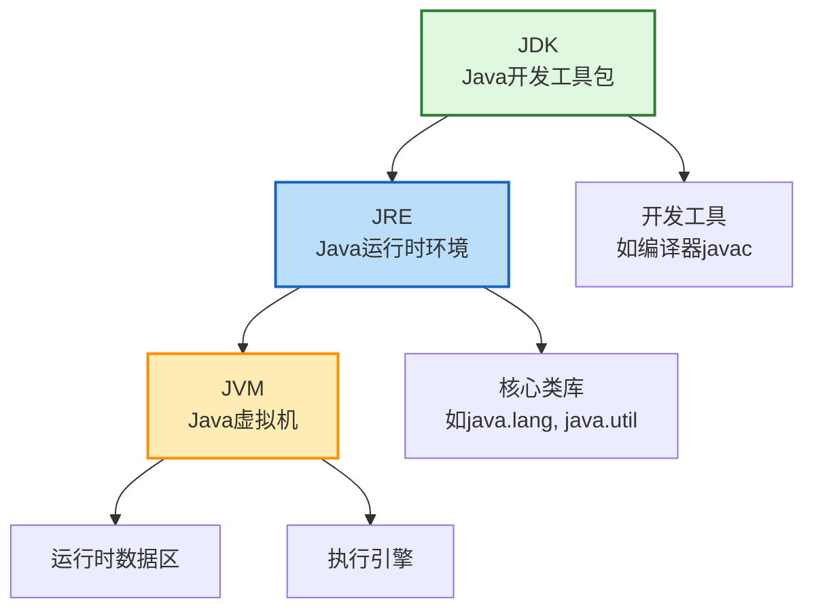

###### 1. 什么是 JVM ?
###### 2. JVM 的主要组成部分有哪些？
1. **类加载器 (Class Loader)**：负责将 `.class`文件从磁盘**加载**到 JVM 的内存中，并进行**链接**（验证、准备、解析）和**初始化**。
2. **运行时数据区 (Runtime Data Areas)**：这是 JVM 的内存管理系统，用于存储程序运行时的数据。主要包括：
    - **方法区 (Method Area)**：存储已被加载的**类信息、常量、静态变量**等。
    - **堆 (Heap)**：**所有对象实例和数组**都在这里分配内存。这是垃圾回收器主要工作的区域，也是内存调优的重点。
    - **虚拟机栈 (JVM Stack)**：每个线程私有，存储**局部变量表、操作数栈、方法出口**等信息。每个方法调用对应一个栈帧的入栈和出栈。
    - **程序计数器 (Program Counter Register)**：每个线程私有，指向**当前线程正在执行的字节码指令的地址**。
    - **本地方法栈 (Native Method Stack)**：为 JVM 调用本地（如 C/C++ 编写）方法服务。
3. **执行引擎 (Execution Engine)**：这是真正执行代码的部件。它包含：
    - **解释器**：逐行解释执行字节码。
    - **JIT 编译器**：将热点代码编译成本地机器码以提高效率。
    - **垃圾回收器**：自动回收堆内存中不再使用的对象，释放资源。
###### 4. 解释型语言和编译型语言的区别
计算机语言主要分为编译型和解释型，理解它们的区别是理解 Java 工作方式的基础。

|特性|编译型语言 (如 C、C++)|解释型语言 (如 Python、JavaScript)|
|---|---|---|
|**执行过程**​|源代码在**执行前**一次性被编译器翻译成**机器码**。|源代码在**运行时**由解释器**逐行**翻译并执行。|
|**执行速度**​|通常**更快**，因为直接执行优化后的机器码。|通常**较慢**，因为每次运行都需要翻译过程。|
|**跨平台性**​|**差**，编译后的机器码依赖于特定操作系统和硬件。|**好**，只要有对应平台的解释器，源码即可运行。|
|**错误发现**​|多数错误在**编译期间**被发现。|许多错误要等到**运行到该行代码**时才发现。|

###### 5. Java 是编译型语言还是解释型语言？
Java 被称作“**编译与解释并存**”的语言。它采取了一种独特的两步走策略：
1. **编译期**：Java 编译器（`javac`）将 `.java`源代码文件编译成一种中间格式——**字节码**（`.class`文件）。这时的字节码不是任何特定平台的机器码。
2. **运行期**：JVM 中的**解释器**负责逐条读取字节码并翻译成本地机器指令来执行。同时，为了提升效率，JVM 内置了 **JIT（即时编译）编译器**。JIT 会监控代码运行情况，将频繁执行的“热点代码”（如循环）一次性编译成本地机器码并缓存起来，下次再执行到这段代码时，就可以直接运行机器码，大幅提升效率。
这种设计使 Java 在“一次编译，到处运行”的跨平台能力和执行效率之间取得了很好的平衡。
###### 6. JVM、JRE 和 JDK 的关系是什么？
这三者的关系是层层包含的，可以参考下面的图示来理解：

- **JVM (Java Virtual Machine)**：是 Java 能够实现跨平台的核心。它负责读取并执行字节码文件。但 JVM 本身并不知道 `String`、`ArrayList`这些常用类是如何实现的，它需要标准类库的支持。
- **JRE (Java Runtime Environment)**：**等于 JVM + 核心类库**。如果你只想运行一个已经开发好的 Java 程序，那么安装 JRE 就足够了。
- **JDK (Java Development Kit)**：**等于 JRE + 开发工具**。它除了包含 JRE 的所有内容，还提供了用于开发 Java 程序的关键工具，如编译器 (`javac`)、调试器 (`jdb`) 等。因此，作为开发者，我们需要安装的是 JDK。
简单来说，**JDK 用于开发 Java 程序，JRE 用于运行 Java 程序，而 JVM 是运行程序的引擎和跨平台基石。**
###### 7. 什么是字节码？
字节码是 Java 源代码编译后生成的中间代码。它不面向任何特定的处理器，而是面向 JVM 的指令集。这种设计是实现跨平台的关键。
###### 8. Java 的跨平台性是如何实现的？
Java 的跨平台性源于 “一次编译，到处运行” 。开发者只需将代码编译成标准的字节码，然后在任何安装了对应版本 JVM 的操作系统上都可以直接运行。JVM 充当了中间层，屏蔽了底层操作系统的差异。
###### 9. 什么是类加载器？
类加载器不仅仅是简单地将类文件加载进内存。它还遵循**双亲委派模型**：当一个类加载器收到加载请求时，它首先会委托给其父类加载器去尝试加载，只有当父类加载器无法完成时，自己才尝试加载。这种模型**保证了 Java 核心库的安全性和稳定性**，防止用户自定义的类动态替换掉 Java 自有的核心类。
###### 10. JVM 的生命周期是怎样的？
一个 JVM 实例的生命周期从启动一个 Java 程序开始，到程序中所有**非守护线程**都终止时结束。JVM 的启动会伴随一个引导类加载器创建 main 线程，程序的结束则意味着 JVM 进程的退出。