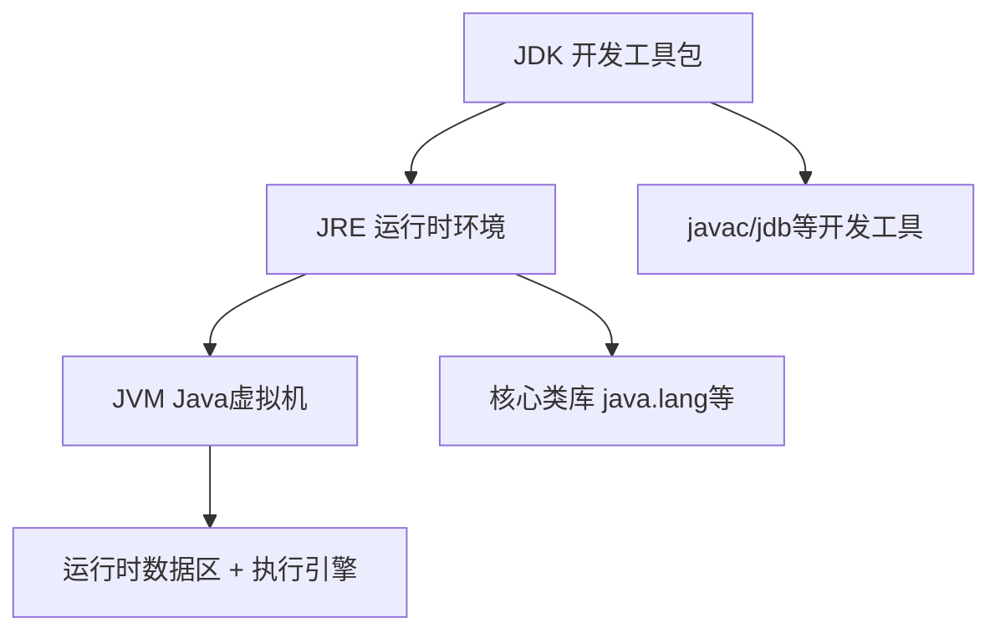

###### 1. 什么是 JVM？

[[../../../20_JavaKnowledge/04_JVM/01、JVM整体架构#一、JVM 整体架构图|📖]]
JVM（Java Virtual Machine，Java虚拟机）是 Java 平台的核心组件，是一个**可以执行 Java 字节码的虚拟计算机**。它屏蔽了底层操作系统和硬件的差异，使得同一份 Java 代码在任何安装了 JVM 的平台上都能运行，这就是"一次编译，到处运行"的根基。

###### 2. JVM 的主要组成部分有哪些？

[[../../../20_JavaKnowledge/04_JVM/01、JVM整体架构#二、运行时数据区详解|📖]]
JVM 有三个核心部分：

**类加载器（Class Loader）**：负责把 `.class` 字节码文件从磁盘加载到内存，还要完成验证、准备、解析、初始化这几个步骤。遵循双亲委派模型，保证核心类库的安全。

**运行时数据区（Runtime Data Areas）**：JVM 的内存管理系统，用来存放程序运行时的数据：
- 方法区：存类信息、常量、静态变量、JIT编译后的代码缓存
- 堆：所有对象实例和数组的"家"，GC 主战场
- 虚拟机栈：每个线程私有，方法执行的内存模型
- 程序计数器：每个线程私有，记录当前执行到哪条指令
- 本地方法栈：为 Native 方法（C/C++ 实现）服务

**执行引擎（Execution Engine）**：真正干活儿的部件：
- 解释器：把字节码逐条翻译成机器指令执行，启动快
- JIT 编译器：把热点代码编译成本地机器码缓存起来，执行快
- 垃圾回收器：自动管理堆内存，回收不再使用的对象

###### 4. 解释型语言和编译型语言的区别？

[[../../../20_JavaKnowledge/04_JVM/10、字节码与执行引擎#五、执行引擎|📖]]
**编译型语言**（如 C、C++）：源代码在执行前被编译器一次性翻译成机器码，之后直接运行机器码，速度快，但编译产物依赖特定平台，跨平台性差。错误大多在编译期发现。

**解释型语言**（如 Python、JavaScript）：源代码在运行时由解释器逐行翻译执行，跨平台性好（只要有对应平台的解释器），但每次运行都要翻译，速度相对慢，很多错误运行到那行才暴露。

###### 5. Java 是编译型语言还是解释型语言？

[[../../../20_JavaKnowledge/04_JVM/10、字节码与执行引擎#五、执行引擎|📖]]
Java 是**编译与解释并存**的语言，两步走：

**第一步：编译期**，`javac` 把 `.java` 源文件编译成字节码（`.class`文件）。字节码不是任何特定平台的机器码，是面向 JVM 的中间格式。

**第二步：运行期**，JVM 里的解释器逐条读取字节码执行。同时 JIT 编译器监控代码运行，发现"热点代码"（频繁执行的方法、循环体等）就把它一次性编译成本地机器码缓存起来，下次再执行直接跑机器码，效率大幅提升。

这个设计让 Java 在跨平台性和执行效率之间找到了很好的平衡。

###### 6. JVM、JRE 和 JDK 的关系是什么？

[[../../../20_JavaKnowledge/04_JVM/01、JVM整体架构#一、JVM 整体架构图|📖]]
三者是层层包含的关系：

**JVM**：最核心，是执行字节码的引擎。但 JVM 自身不知道 String、ArrayList 怎么实现，需要标准类库支持。

**JRE（Java Runtime Environment）**：JVM + 核心类库（java.lang、java.util 等）。**只想运行**已有的 Java 程序，装 JRE 就够了。

**JDK（Java Development Kit）**：JRE + 开发工具（javac 编译器、jdb 调试器、jmap 等）。**开发** Java 程序，必须装 JDK。

```mermaid
flowchart TD
    A[JDK 开发工具包] --> B[JRE 运行时环境]
    B --> C[JVM Java虚拟机]
    A --> D[javac/jdb等开发工具]
    B --> E[核心类库 java.lang等]
    C --> F[运行时数据区 + 执行引擎]
```

###### 7. 什么是字节码？

[[../../../20_JavaKnowledge/04_JVM/10、字节码与执行引擎#一、Java 字节码概述|📖]]
字节码（Bytecode）是 Java 源代码编译后生成的**中间代码**，不针对任何特定的处理器，而是面向 JVM 的指令集（以 `.class` 文件形式存在）。

字节码是实现跨平台的关键：同一份字节码可以在任何安装了对应 JVM 的操作系统上运行。字节码也带来了安全性（JVM 在加载时做验证）、性能优化空间（JIT 可以根据运行情况动态优化）等好处。

###### 8. Java 的跨平台性是如何实现的？

[[../../../20_JavaKnowledge/04_JVM/01、JVM整体架构#一、JVM 整体架构图|📖]]
核心就是 **"一次编译，到处运行"**。开发者把源码编译成平台无关的字节码，字节码可以在任何安装了对应 JVM 的系统上运行。JVM 负责把字节码翻译成当前操作系统能理解的本地机器指令，充当了 Java 程序和底层操作系统之间的"翻译官"，屏蔽了平台差异。

不同平台（Windows、Linux、macOS）有不同的 JVM 实现，但它们都能解释执行同样的字节码，这就是跨平台的本质。

###### 9. 什么是类加载器？

[[../../../20_JavaKnowledge/04_JVM/02、类加载机制#三、类加载器|📖]]
类加载器负责把 `.class` 文件加载到 JVM 内存中，不仅仅是简单地读取文件，还要经过验证、准备、解析才能投入使用。

类加载器遵循**双亲委派模型**：收到加载请求时，先委托父加载器去加载，父加载器搞不定了，自己才出手。这个机制保证了 Java 核心类库的安全性，比如自定义一个 `java.lang.Object` 类，不会替换掉 JVM 内置的核心 Object，因为请求会被委派到启动类加载器去加载真正的 Object。

###### 10. JVM 的生命周期是怎样的？

[[../../../20_JavaKnowledge/04_JVM/01、JVM整体架构#一、JVM 整体架构图|📖]]
一个 JVM 实例从**启动一个 Java 程序**时开始，到**所有非守护线程都终止**时结束。

启动时，JVM 创建主线程，初始化类加载器和运行时数据区，加载并初始化主类，然后执行 `main()` 方法。

结束时，JVM 会执行关闭钩子（通过 `Runtime.getRuntime().addShutdownHook()` 注册的线程），然后退出进程。如果应用调用了 `System.exit()`，JVM 也会立即终止（在执行完关闭钩子之后）。守护线程（daemon 线程）不会阻止 JVM 退出，当最后一个非守护线程结束时，JVM 就关门走人了，守护线程也随之终止。
