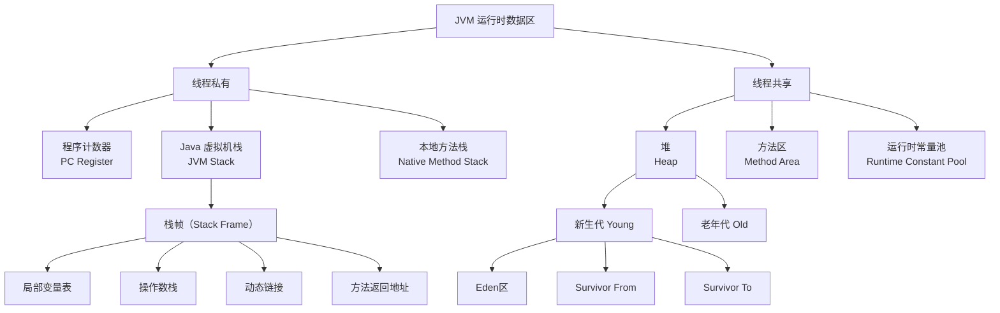

###### 1. JVM 运行时数据区有哪些？
JVM 运行时数据区是 Java 虚拟机在执行 Java 程序时所管理的内存区域，可根据线程共享与否进行划分。其核心组件与关系如下：

###### 2. 什么是程序计数器？
这是一块很小的内存空间，可以看作是**当前线程所执行的字节码的行号指示器**。字节码解释器通过改变它的值来选取下一条需要执行的指令。它是**线程私有**的，且是**唯一一个在Java虚拟机规范中没有规定任何`OutOfMemoryError`情况的区域**。
###### 3. 什么是 Java 虚拟机栈？
每个线程在创建时都会拥有一个虚拟机栈，其生命周期与线程相同。它是**方法执行的内存模型**，每个方法从调用到执行完毕，都对应着一个**栈帧**在虚拟机栈中从入栈到出栈的过程。
- **栈帧结构**：每个栈帧包含了**局部变量表**（存储方法参数和局部变量）、**操作数栈**（用于计算）、**动态链接**（指向运行时常量池的方法引用）和**方法返回地址**等信息。
- **异常**：如果线程请求的栈深度大于虚拟机允许的最大深度，会抛出`StackOverflowError`；如果虚拟机栈可以动态扩展，但在扩展时无法申请到足够内存，会抛出`OutOfMemoryError`。
###### 4. 什么是本地方法栈？
其作用与虚拟机栈非常相似，区别在于**虚拟机栈为虚拟机执行Java方法服务，而本地方法栈则为虚拟机使用到的Native方法服务**。在HotSpot等JVM实现中，本地方法栈与虚拟机栈是合二为一的。
###### 5. 什么是堆内存？
这是JVM所管理的内存中**最大的一块**，是**所有线程共享**的区域，在虚拟机启动时创建。此内存区域的**唯一目的就是存放对象实例**和数组。它也是**垃圾收集器管理的主要区域**，因此很多时候也被称作"GC堆"。堆内存不足时会抛出`OutOfMemoryError`。
###### 6. 什么是方法区？
方法区也是**各个线程共享的内存区域**，用于存储已被虚拟机加载的**类型信息、常量、静态变量、即时编译器编译后的代码缓存**等数据。它有一个非常重要的部分——**运行时常量池**，用于存放编译期生成的各种字面量和符号引用。
###### 7. 堆和栈的区别是什么？
|特性|堆|栈|
|---|---|---|
|**功能**​|存储对象实例和数组，是**运行时数据区**​|存储栈帧，是**运行时单位**，解决程序如何执行的问题|
|**共享性**​|**线程共享**​|**线程私有**​|
|**异常**​|`OutOfMemoryError`|`StackOverflowError`和`OutOfMemoryError`|
|**生命周期**​|与JVM生命周期相同|与线程生命周期相同|
|**性能**​|速度较慢，需要动态分配内存|速度较快，访问速度仅次于程序计数器|
###### 8. 什么是直接内存？
直接内存并不是JVM运行时数据区的一部分，但被频繁使用。它通过NIO的`ByteBuffer.allocateDirect()`在Java堆外分配，然后通过一个存储在Java堆里的`DirectByteBuffer`对象作为这块内存的引用进行操作。其大小不受Java堆大小限制，但受本机总内存大小限制。
###### 9. 对象在内存中的布局是怎样的？什么是对象头？
在HotSpot虚拟机中，对象在堆内存中的存储布局可以分为三个部分：
- **对象头**：包含两类信息。一是**运行时元数据**，如哈希码、GC分代年龄、锁状态标志等。二是**类型指针**，指向它的类元数据，JVM通过这个指针来确定对象是哪个类的实例。
- **实例数据**：对象真正存储的有效信息，即我们在程序代码里所定义的各种类型的字段内容。
- **对齐填充**：起占位符作用，HotSpot要求对象起始地址必须是8字节的整数倍。
###### 11. 什么是 TLAB？
为每个线程在Eden区预先分配的一小块私有内存。由于堆是线程共享的，创建对象时可能存在竞争。TLAB使得每个线程可以使用自己的分配指针在私有空间分配对象，只有TLAB用完需要新的时才需要同步锁定，**提升了内存分配的效率**。
###### 12. 新生代和老年代是如何划分的？Eden 区、Survivor 区的作用是什么？
Java堆从垃圾回收的角度常分为**新生代**和**老年代**。
- **新生代**：又分为**Eden区**和两个**Survivor区**（通常称为From和To）。**绝大多数新创建的对象首先在Eden区分配**。当Eden区满时，会触发一次**Minor GC**，将存活的对象复制到其中一个Survivor区。对象在Survivor区之间每熬过一次Minor GC，年龄就增加1岁。当它的年龄增加到一定程度（默认15），就会被晋升到老年代。
- **老年代**：用于存放长期存活的對象。老年代空间不足时会触发**Full GC**，速度较慢。
###### 14. 什么是永久代？
是JDK 8之前HotSpot虚拟机对JVM规范中方法区的一种实现。它使用JVM的堆内存来存储类元数据、运行时常量池等信息。
###### 15. 什么是元空间（Metaspace）？
从JDK 8开始，HotSpot虚拟机将方法区的实现从永久代移到了**元空间**。元空间不再使用JVM的堆内存，而是使用**本地内存**。这有效避免了永久代常见的`java.lang.OutOfMemoryError: PermGen space`错误，因为理论上可用空间取决于系统内存。
###### 16. 永久代和元空间的区别？
|特性|永久代|元空间|
|---|---|---|
|**物理位置**​|JVM堆内存|本地内存|
|**大小限制**​|受`-XX:MaxPermSize`参数限制，易溢出|默认受系统可用内存限制，不易溢出|
|**垃圾回收**​|回收效率低，是Full GC的触发条件之一|提高回收效率，降低Full GC频率|
|**调优**​|需设置`-XX:PermSize`和`-XX:MaxPermSize`|可设置`-XX:MetaspaceSize`和`-XX:MaxMetaspaceSize`|
###### 17. 什么是对象的分配策略？
对象优先在Eden区分配。如果Eden区没有足够空间，则发生Minor GC。大对象（需要大量连续内存的對象）直接进入老年代。长期存活的对象将进入老年代。
###### 18. 什么是大对象？如何处理？
需要大量连续内存的對象（如长数组或大字符串），JVM会尝试直接在老年代分配，以避免在Eden区及两个Survivor区之间发生大量的内存复制。
###### 19. 什么是逃逸分析？
一种编译器优化技术，用于分析对象的动态作用域。如果一个对象在方法内被定义，但其引用可能被外部方法访问（方法逃逸），或被外部线程访问（线程逃逸），则称其逃逸。否则，该对象未逃逸。对于未逃逸的对象，JIT编译器可能进行栈上分配或标量替换等优化。
###### 20. 什么是标量替换？
是逃逸分析的一种优化。如果确定一个对象不会逃逸出方法，那么JIT编译器在编译时，会把这个对象“拆解”成它的若干个成员变量来代替。这样，这个对象本身就不会在堆上创建了，减少了内存占用和GC压力。