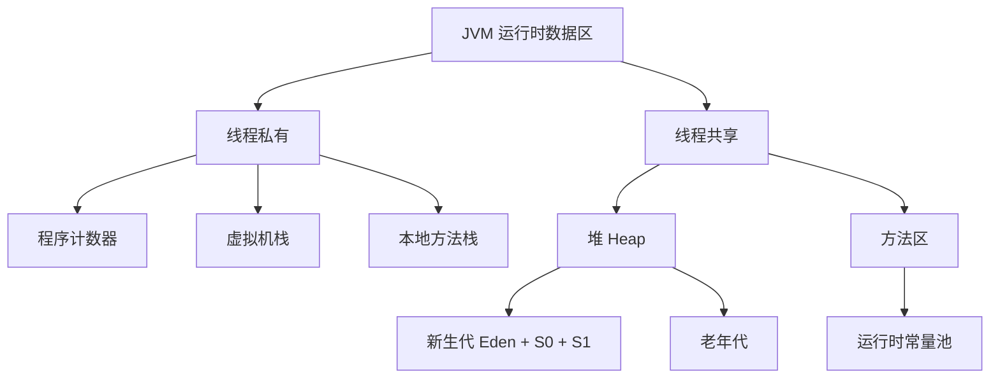

###### 1. JVM 运行时数据区有哪些？

[[../../../20_JavaKnowledge/04_JVM/03、运行时数据区详解#一、JVM 内存区域总览|📖]]
JVM 运行时数据区按**线程私有/线程共享**分两类：

**线程私有**（每个线程独有一份）：
- 程序计数器
- Java 虚拟机栈
- 本地方法栈

**线程共享**（所有线程共用）：
- 堆
- 方法区（运行时常量池是其中的一部分）

```mermaid
flowchart TD
    A[JVM 运行时数据区] --> B[线程私有]
    A --> C[线程共享]
    B --> B1[程序计数器]
    B --> B2[虚拟机栈]
    B --> B3[本地方法栈]
    C --> C1[堆 Heap]
    C --> C2[方法区]
    C2 --> C3[运行时常量池]
    C1 --> C1a[新生代 Eden + S0 + S1]
    C1 --> C1b[老年代]
```

###### 2. 什么是程序计数器？

[[../../../20_JavaKnowledge/04_JVM/03、运行时数据区详解#四、堆（Heap）|📖]]
程序计数器是一块非常小的内存，可以理解为**当前线程正在执行的字节码指令的"行号指示器"**。字节码解释器通过改变它的值来选取下一条要执行的指令，实现分支、循环、跳转、异常处理等控制流。

它是线程私有的，每个线程有自己独立的计数器，线程切换后能恢复到正确的执行位置。执行 Native 方法时，计数器值为空（undefined）。它是 JVM 规范里**唯一不会发生 OOM 的内存区域**。

###### 3. 什么是 Java 虚拟机栈？

[[../../../20_JavaKnowledge/04_JVM/03、运行时数据区详解#三、虚拟机栈（JVM Stack）|📖]]
虚拟机栈是**方法执行的内存模型**，线程私有，生命周期和线程相同。每个方法从调用开始到执行完毕，对应一个**栈帧**的入栈到出栈过程。

每个栈帧包含：
- **局部变量表**：存方法参数和局部变量（包括基本类型和对象引用）
- **操作数栈**：用于执行字节码指令的计算
- **动态链接**：指向运行时常量池里当前方法的符号引用
- **方法返回地址**：方法执行完后回到哪里继续执行

**可能的异常**：
- 递归太深或者方法调用层级太多 → `StackOverflowError`
- 如果虚拟机栈可以动态扩展，但申请不到足够内存 → `OutOfMemoryError`

###### 4. 什么是本地方法栈？

[[../../../20_JavaKnowledge/04_JVM/03、运行时数据区详解#五、方法区 / 元空间（Metaspace）|📖]]
本地方法栈和虚拟机栈功能类似，区别在于：**虚拟机栈服务于 Java 方法，本地方法栈服务于 Native 方法**（用 C/C++ 等编写的方法）。

HotSpot JVM 直接把虚拟机栈和本地方法栈合二为一了，所以对我们来说感知不到明显区别。

###### 5. 什么是堆内存？

[[../../../20_JavaKnowledge/04_JVM/03、运行时数据区详解#二、程序计数器（PC Register）|📖]]
堆是 JVM 管理的**最大一块内存**，所有线程共享，JVM 启动时创建。**所有对象实例和数组都在这里分配内存**，是 GC 的主要工作区域（所以也叫"GC堆"）。

堆内存不足时抛 `OutOfMemoryError: Java heap space`。

从 GC 角度，堆通常分为新生代（Eden + Survivor × 2）和老年代，分代管理使 GC 更高效。

###### 6. 什么是方法区？

[[../../../20_JavaKnowledge/04_JVM/03、运行时数据区详解#七、直接内存（Direct Memory）|📖]]
方法区也是所有线程共享的内存区域，用于存储：
- **类信息**：类名、访问修饰符、字段、方法描述等
- **常量**：字面量（如字符串常量）和符号引用
- **静态变量**：类的 static 字段
- **JIT 编译后的代码缓存**：热点代码编译结果

方法区里有个重要组成部分：**运行时常量池**，存放编译期生成的字面量和符号引用，运行时也可以动态放入新常量（如 `String.intern()`）。

###### 7. 堆和栈的区别是什么？

[[../../../20_JavaKnowledge/04_JVM/03、运行时数据区详解#八、各区域 OOM 场景总结|📖]]
**存储内容不同**：堆存放对象实例和数组，是对象的"仓库"；栈存放栈帧（局部变量、操作数等），是方法执行的"工作台"。

**共享性不同**：堆是所有线程共享的；栈是每个线程私有的，线程之间完全隔离。

**生命周期不同**：堆和 JVM 生命周期一样长；栈和线程生命周期一样长，方法执行完栈帧就弹出了。

**异常类型不同**：堆不够了抛 `OutOfMemoryError`；栈递归太深抛 `StackOverflowError`。

**速度不同**：栈内存访问速度比堆快（连续内存，进出有序），但空间有限；堆空间大但分配管理更复杂，速度相对慢。

###### 8. 什么是直接内存？

[[../../../20_JavaKnowledge/04_JVM/04、对象的创建与内存布局#二、对象的内存布局|📖]]
直接内存（Direct Memory）不属于 JVM 运行时数据区，但被 Java 程序频繁使用。

通过 NIO 的 `ByteBuffer.allocateDirect()` 可以在 **Java 堆外**（操作系统原生内存）申请一块内存，然后用一个存在 Java 堆里的 `DirectByteBuffer` 对象来引用它。

**优点**：减少了 Java 堆和本地内存之间的数据复制，NIO 读写文件时性能显著提升（零拷贝的基础）。

**注意**：直接内存大小不受 `-Xmx` 限制，但受机器总内存限制。如果申请过多，加上 Java 堆自身的占用，可能导致动态扩展时 OOM。可用 `-XX:MaxDirectMemorySize` 设上限。

###### 9. 对象在内存中的布局是怎样的？什么是对象头？

[[../../../20_JavaKnowledge/04_JVM/04、对象的创建与内存布局#四、逃逸分析（Escape Analysis）|📖]]
HotSpot JVM 里，一个对象在堆中的存储分三部分：

**对象头**：
- **Mark Word（运行时元数据）**：存哈希码、GC 分代年龄、锁状态标志（无锁/偏向锁/轻量级锁/重量级锁）。Mark Word 是动态的，在不同锁状态下存不同信息。
- **类型指针（Klass Pointer）**：指向方法区里的类元数据，JVM 通过它知道这个对象是哪个类的实例。启用指针压缩后是4字节，否则8字节。

**实例数据**：对象真正存的有效信息，即代码里定义的各种字段，按一定顺序排列（父类字段在前）。

**对齐填充**：HotSpot 要求对象的起始地址必须是8字节的整数倍，不足的部分用对齐填充补齐，纯占位用，没有特别含义。

###### 11. 什么是 TLAB？

[[../../../20_JavaKnowledge/04_JVM/03、运行时数据区详解#一、JVM 内存区域总览|📖]]
TLAB（Thread Local Allocation Buffer，线程本地分配缓冲区）是在 **Eden 区**里为每个线程预先分配的一小块**私有内存**。

**为什么需要 TLAB**：堆是所有线程共享的，多线程同时 new 对象时需要同步，竞争激烈会影响性能。有了 TLAB，每个线程在自己的私有区域分配对象，不需要竞争，只有 TLAB 用完了需要申请新的时候才加锁同步。

**TLAB 的大小**：默认占 Eden 区的 1%，JVM 会根据运行情况自动调整。大对象（超过 TLAB 剩余空间的对象）会直接在 Eden 区的公共区域分配，需要加锁。

###### 12. 新生代和老年代是如何划分的？Eden 区、Survivor 区的作用是什么？

[[../../../20_JavaKnowledge/04_JVM/03、运行时数据区详解#一、JVM 内存区域总览|📖]]
**新生代（Young Generation）**：分为一个 Eden 区和两个 Survivor 区（From 和 To，也叫 S0 和 S1）。**绝大多数新创建的对象首先在 Eden 区分配**。当 Eden 区满时触发 Minor GC，存活的对象被复制到 Survivor From 区。

Survivor 区的作用是"缓冲"，让对象有机会经历多次 Minor GC，每熬过一次 GC 年龄加1。年龄到达阈值（默认15）的对象晋升到老年代。两个 Survivor 区交替使用（复制算法），保证其中一个始终为空。

**老年代（Old Generation）**：存放长期存活的对象，以及直接分配的大对象。老年代满了触发 Major GC（Full GC），比 Minor GC 耗时长得多，应尽量减少。

###### 14. 什么是永久代（PermGen）？

[[../../../20_JavaKnowledge/04_JVM/03、运行时数据区详解#一、JVM 内存区域总览|📖]]
永久代是 **JDK 8 之前** HotSpot 对方法区的具体实现，使用 JVM 堆内存来存储类元数据、运行时常量池、静态变量等。

永久代的问题：大小固定（受 `-XX:MaxPermSize` 限制），装载类太多时容易报 `java.lang.OutOfMemoryError: PermGen space`，尤其在频繁使用动态代理或框架反射的应用里很头疼。

###### 15. 什么是元空间（Metaspace）？

[[../../../20_JavaKnowledge/04_JVM/03、运行时数据区详解#一、JVM 内存区域总览|📖]]
JDK 8 开始，HotSpot 把方法区的实现从永久代改为**元空间**，关键变化是元空间**不再用 JVM 堆内存，而是用本地内存**。

**元空间的好处**：
- 默认不设上限，理论上受系统可用内存限制，不容易 OOM
- 类元数据自动被 GC，不需要手动调整 MaxPermSize

**注意**：虽然默认不设上限，但最好还是配置 `-XX:MaxMetaspaceSize`，否则某些内存泄漏场景（大量动态生成类）会把系统内存耗光。

###### 16. 永久代和元空间的区别？

[[../../../20_JavaKnowledge/04_JVM/03、运行时数据区详解#一、JVM 内存区域总览|📖]]
最核心的区别就一条：**永久代用 JVM 堆内存，元空间用本地内存**。

永久代受 `-XX:MaxPermSize` 参数限制，空间不够直接 OOM；元空间的默认大小受系统内存限制，不容易溢出。元空间还有更好的 GC 配合，回收效率更高，减少了 Full GC 的触发频率。

调优参数上，原来是 `-XX:PermSize/-XX:MaxPermSize`，现在换成了 `-XX:MetaspaceSize/-XX:MaxMetaspaceSize`。

###### 17. 什么是对象的分配策略？

[[../../../20_JavaKnowledge/04_JVM/03、运行时数据区详解#一、JVM 内存区域总览|📖]]
对象的内存分配遵循以下优先级：

1. **优先在 Eden 区分配**：绝大多数新对象在 Eden 区分配，Eden 满了触发 Minor GC
2. **大对象直接进老年代**：超过 `-XX:PretenureSizeThreshold` 阈值的大对象（如长数组）直接在老年代分配，避免在新生代来回复制的开销
3. **长期存活的对象晋升老年代**：年龄超过 `-XX:MaxTenuringThreshold`（默认15）的对象晋升
4. **动态年龄判断**：如果 Survivor 区中相同年龄的对象总大小超过 Survivor 空间的一半，这个年龄及以上的对象直接晋升老年代

###### 18. 什么是大对象？如何处理？

[[../../../20_JavaKnowledge/04_JVM/03、运行时数据区详解#一、JVM 内存区域总览|📖]]
大对象通常指**需要大量连续内存空间的对象**，典型的是长数组和大字符串。

JVM 会尽量让大对象直接在老年代分配，原因是：如果在 Eden 区分配，Minor GC 时需要把它从 Eden 复制到 Survivor 区，再从 Survivor 复制到老年代，大对象复制代价很高，不如直接进老年代。

可以通过 `-XX:PretenureSizeThreshold` 设置"多大的对象算大对象"的阈值（注意这个参数只对 Serial 和 ParNew 收集器有效，G1 等收集器有自己的判断逻辑）。

在代码层面，尽量避免创建大量短生命周期的大对象，可以用对象池复用，或者用流式处理代替一次性加载大数据。

###### 19. 什么是逃逸分析？

[[../../../20_JavaKnowledge/04_JVM/03、运行时数据区详解#一、JVM 内存区域总览|📖]]
逃逸分析是 JIT 编译器的一种优化技术，用于**分析对象的使用范围是否超出了它被定义的方法**。

如果一个对象的引用在方法内部创建，没有被传递给外部方法，也没有被外部线程访问，就说这个对象"没有逃逸"。

对于没有逃逸的对象，JIT 可以做三种优化：
- **栈上分配**：把对象分配在栈上而不是堆上，方法结束对象随栈帧消失，不需要 GC
- **标量替换**：把对象的字段拆散成独立的局部变量来使用，对象本身不需要创建
- **锁消除**：如果对象不会被多线程访问，直接去掉对它的 synchronized 锁

###### 20. 什么是标量替换？

[[../../../20_JavaKnowledge/04_JVM/03、运行时数据区详解#一、JVM 内存区域总览|📖]]
标量替换是逃逸分析的优化手段之一。如果 JIT 确定一个对象不会逃逸出方法，就会把这个对象"拆解"成它的各个成员变量（标量，不可再分的基本类型），用这些标量替代原来的对象。这样对象本身就不会在堆上分配了，减少了堆内存占用和 GC 压力，成员变量还可能进入 CPU 寄存器，运行速度更快。
